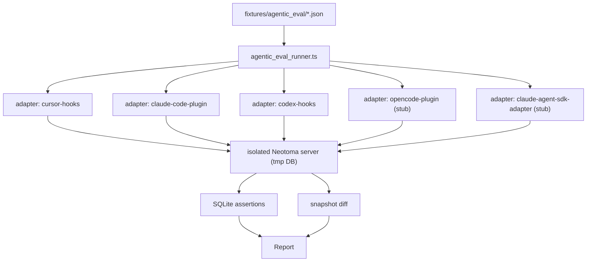

## Context

[`tests/integration/cursor_hook_stop_backfill.test.ts`](tests/integration/cursor_hook_stop_backfill.test.ts) and [`tests/integration/hook_failure_hint.test.ts`](tests/integration/hook_failure_hint.test.ts) already prove that the Cursor stop hook's compliance backfill works as designed. They are also the only tests of their kind: hand-rolled, Cursor-only, and not extensible to the other four harness packages without copy-paste.

The [weak-model Neotoma compliance work](.cursor/plans/weak_model_neotoma_compliance_366fdfaf.plan.md) shipped a uniform compliance signal (`turn_compliance` observations + `instruction_profile` counters) across all harnesses. That makes it cheap to write **one** runner that drives **any** harness through **the same** scenarios and asserts on **the same** Neotoma DB state.

Tier 1 is deliberately LLM-free. Its only goal is "given hook events X, the harness records DB state Y." Real-LLM behavior (does Composer 2 actually skip the store?) is Tier 2's job.

## Architecture

## Confirmed invariants

1. **No real LLM calls.** Every hook payload is synthesized from the fixture; `model` is just a string for branching logic.
2. **Per-scenario tmp data dir.** The runner sets `NEOTOMA_DATA_DIR=$(mktemp -d)` and starts an in-process Neotoma server bound to a random port; nothing leaks across scenarios.
3. **Ground truth is the DB, not stdout.** Assertions are SQL/graph queries via the local Neotoma client; we do not regex on hook stdout. (Hook stdout is JSON-validated only.)
4. **Snapshot files are reviewed.** Snapshots live in-tree and are diff-reviewed; treating them as throwaway defeats the regression-test purpose.
5. **Same fixture file drives all harnesses.** Per-harness branches in the assertion set are allowed but must be explicit (`assertions: { default: [...], "claude-code-plugin": [...] }`), not silent.

## Implementation plan

### Phase 1 — Format + runner skeleton
Implement the fixture spec (`tier1-fixture-format-spec`) and the runner shell (`tier1-shared-runner-harness-adapters`) with one cursor-hooks adapter wired end-to-end. Validate by porting `cursor_hook_stop_backfill.test.ts` to a single fixture file; the new runner should reproduce its pass/fail behavior exactly.

### Phase 2 — Seed matrix + multi-harness adapters
Add the five canonical scenarios (`tier1-seed-scenarios`) and the four remaining harness adapters. opencode-plugin and claude-agent-sdk-adapter are TypeScript modules; for those, the adapter imports the hook handlers and invokes them directly (no child process). claude-code-plugin and codex-hooks are Python; their adapters spawn `python3 hooks/<name>.py` with stdin/stdout JSON.

### Phase 3 — Model matrix + snapshots
Layer the model axis (`tier1-model-matrix`) and snapshot mode (`tier1-snapshot-mode`). Snapshots are bucketed `<scenario>__<harness>__<model>.snap.json` so a single scenario change does not blow up unrelated cells.

### Phase 4 — Vitest wiring + reporting
Plug the matrix into vitest (`tier1-vitest-integration`) and the failure renderer (`tier1-failure-report`). Goal: a developer who breaks a hook sees one focused failure with "did not store conversation_message in turn X" rather than a SQLite dump.

### Phase 5 — Docs + entry points
Document the format and add the `npm run eval:tier1` shortcut (`tier1-docs-and-cli-shortcut`). Once this lands, every new hook PR should add or update a fixture rather than a hand-rolled `*_test.ts`.

## Tests

- The runner itself is tested via a synthetic adapter that records calls in-memory.
- Snapshot golden files are committed; CI fails on drift.
- Existing hook tests stay until their fixtures are migrated, then are deleted in the same PR.

## Risks and non-goals

- **Not testing real LLM behavior.** Tier 1 cannot tell us whether Composer 2 actually calls `store_structured`. That's Tier 2's job.
- **Not a benchmark.** No timing assertions, no performance regression guards. Latency lives in a separate suite.
- **Snapshot drift.** Cosmetic schema changes (e.g. adding a new auto-derived field) will require a snapshot regen pass; we accept that maintenance cost for the regression coverage.
- **Python ↔ TypeScript adapters add friction.** The runner shells out to Python for two harnesses; on CI we depend on `python3` being available. Documented in the format spec.
- **Out of scope:** any UI / Inspector eval; any cross-process MCP transport eval (covered by separate MCP transport tests).
