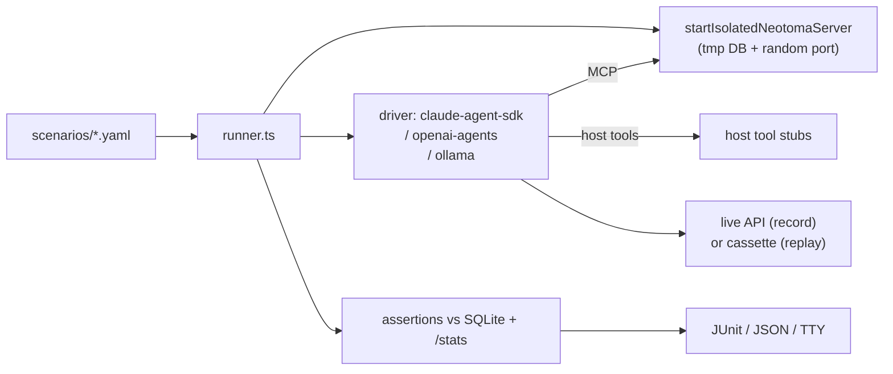

## Context

[Tier 1](.cursor/plans/agentic_eval_tier1_hook_fixture_replay_4f1c9a3b.plan.md) tests "given hook events X, Neotoma records Y" — but it never asks the LLM anything. The actual claim of the [weak-model compliance plan](.cursor/plans/weak_model_neotoma_compliance_366fdfaf.plan.md) is **behavioral**: small models on the compact instruction profile + per-turn reminders should backfill less often than small models on full-mode-only. We cannot verify that without driving real LLMs.

Existing assets we can lean on:

- [`packages/claude-agent-sdk-adapter`](packages/claude-agent-sdk-adapter) already wraps `@anthropic-ai/claude-agent-sdk` for hook integration; the same SDK is the natural test driver.
- [`src/server.ts`](src/server.ts) exposes a server factory we already use in tests; spinning up an isolated instance per scenario is cheap.
- The compliance counters (`globalProfileCounters`, `turn_compliance` observations) make grading deterministic — no LLM-as-judge.

## Architecture

## Confirmed invariants

1. **One Neotoma per scenario.** Tmp DB, tmp port, full teardown after assertions. Never share state across scenarios — assertions must be deterministic.
2. **Drivers are interchangeable.** A `LLMDriver` interface lets new providers slot in without touching scenarios. Provider differences (e.g. tool-call schemas) live entirely in the driver.
3. **Replay is the default in CI.** Live API calls are billable + flaky. CI runs in replay mode against committed cassettes; nightly scheduled jobs refresh cassettes.
4. **Assertions are graph queries, not regex on output.** Use `@neotoma/client` against the tmp DB; never grep stdout.
5. **Budget guard is mandatory in live mode.** A scenario that explodes token usage cannot silently bill us out.
6. **Matrix is opt-in.** Default per-scenario matrix is one cell (whatever the scenario file declares). Operators expand the matrix with `--models claude-opus-4,claude-haiku-4`.
7. **Scenarios are reviewable diffs.** YAML, hand-readable, kept in-tree. Cassettes are in-tree but treated as binary blobs — diffs are summary-only.

## Implementation plan

### Phase 1 — Scaffold + isolated server
Land `packages/eval-harness/` skeleton (`tier2-package-scaffold`) and `startIsolatedNeotomaServer` (`tier2-isolated-server-fixture`). Validate by writing a hello-world scenario that just `await fetch(baseUrl + '/healthcheck')` and asserts the response — no LLM yet.

### Phase 2 — Claude Agent SDK driver + first scenario
Wire the Anthropic driver (`tier2-claude-agent-sdk-driver`) and the scenario YAML format (`tier2-scenario-format`). Ship one end-to-end scenario (`simple_user_message_with_extracted_contact`) running live, recording its first cassette by hand. This proves the round-trip.

### Phase 3 — Assertion engine + host tool stubs
Implement composable assertions (`tier2-assertion-engine`) and host tool stubs (`tier2-host-tool-stubs`). Goal: assertion failures point at the specific predicate that broke, not "scenario failed."

### Phase 4 — Cassette mode + matrix
Add record/replay (`tier2-cassette-mode`) and the matrix axes (`tier2-matrix-axes`). At this point the harness can run any cell offline; nightly live runs refresh cassettes.

### Phase 5 — Drivers, scenarios, CLI
Add the OpenAI Agents driver (`tier2-openai-agents-driver`), seed the remaining four scenarios (`tier2-seed-scenarios`), wire the CLI + reporters (`tier2-cli-and-output`).

### Phase 6 — Safety + CI + docs
Budget guard (`tier2-budget-and-safety-rails`), GitHub Actions wiring (`tier2-ci-wiring`), and docs (`tier2-docs`). After this phase, every weak-model compliance change must include a Tier-2 scenario or expanded matrix.

## Tests

- Unit-test the assertion engine with synthetic SQLite fixtures (no LLM, no server).
- Unit-test the cassette layer: `record` writes the expected JSON; `replay` reproduces tool-call deltas in-order.
- Integration test the full pipeline with the Anthropic driver pinned to replay mode against a committed cassette — guarantees CI never goes live by accident.
- Smoke-test the OpenAI driver under the same replay invariant.

## Risks and non-goals

- **API cost.** Live runs cost money. The budget guard is mandatory; CI must default to replay.
- **Cassette rot.** Provider response shapes evolve; cassettes can drift. The nightly refresh + auto-PR mitigates but does not eliminate maintenance.
- **Determinism.** Even with cassettes, model temperature > 0 produces tool-call ordering variance. Drivers force `temperature: 0` and a fixed seed where supported.
- **Tool stubs ≠ real tools.** The agent's behavior on a fake `Read` may diverge from real disk I/O. Acceptable: the eval is a regression suite, not an end-to-end product test.
- **Out of scope:** load testing, multi-turn long-horizon scenarios (≥ 10 turns), human-in-the-loop scoring. Those go in a separate suite.
- **Not a replacement for Tier 3.** Live production data has variance Tier 2 cannot synthesize. The two are complementary.
