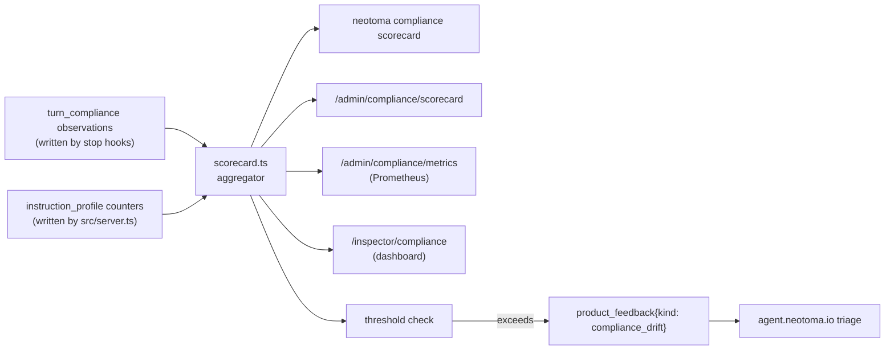

## Context

The [weak-model compliance work](.cursor/plans/weak_model_neotoma_compliance_366fdfaf.plan.md) shipped two telemetry primitives:

1. **`turn_compliance` observations** — emitted by stop hooks (cursor / claude-code / opencode / codex / claude-agent-sdk) when they had to backfill missed Neotoma writes. Each observation carries `{ status: "backfilled_by_hook", missed_steps: [...], model, harness, turn_id }`.
2. **`instruction_profile` counters** — incremented by `src/server.ts` on every `getMcpInteractionInstructions()` call, tracking how often we served `full` vs `compact` instructions to which `clientInfo.name`.

Together those two signals turn every production turn into a free eval datapoint. The question this plan answers: **how do we surface that data to operators in a useful, decision-driving form?**

This tier complements the others:

- [Tier 1](.cursor/plans/agentic_eval_tier1_hook_fixture_replay_4f1c9a3b.plan.md) verifies the hook code paths exist and behave correctly given canned events.
- [Tier 2](.cursor/plans/agentic_eval_tier2_real_llm_replay_8d2e7f15.plan.md) verifies real LLMs do (or don't) trigger those code paths under controlled scenarios.
- **Tier 3 (this plan)** measures how often real users' real LLMs trigger those code paths in the wild — the only signal that captures the long tail of real prompts, real attachments, real model routing decisions.

## Architecture



## Confirmed invariants

1. **Read-only telemetry.** This plan never mutates the underlying observations. All paths are aggregations + projections.
2. **AAuth tier gating on every write-adjacent surface.** The HTTP endpoint requires hardware/software tier; the CLI runs locally against the operator's DB; the Prometheus surface is opt-in via env var.
3. **Local-first.** Default invocation reads `${NEOTOMA_DATA_DIR}/neotoma.db`. `--base-url` flag lets operators point at a remote instance.
4. **No PII in scorecards.** We aggregate by `model`, `harness`, `profile`, and `missed_steps`. We never include raw user message content. The aggregator strips entity-level fields before grouping.
5. **Backfill rate is the headline metric.** `backfilled_turns / total_turns` per cell. Lower is better. Other metrics (e.g. `compact_profile_serve_rate`) are secondary breakdowns.
6. **Estimates are clearly labelled.** When historical-backfill heuristics are used (no explicit `turn_compliance` row), the scorecard marks those rows `estimated: true` and the table renderer dims them.
7. **Compatible with Tier 2 outputs.** Tier 2's JSON report is in the same shape as one row of the Tier 3 scorecard, so historical Tier 2 results can be merged into the same table for trend analysis.

## Implementation plan

### Phase 1 — Aggregator
Implement `getComplianceScorecard()` (`tier3-compliance-aggregator-service`). Stream-read the observations + counters; group server-side; return structured JSON. This is the single source of truth all surfaces consume.

### Phase 2 — CLI subcommand
Wire `neotoma compliance scorecard` (`tier3-cli-subcommand`). Default output is the table renderer; JSON/CSV/Markdown for piping. The TTY renderer should use the existing `boxen`/`chalk` style of other Neotoma CLI surfaces.

### Phase 3 — HTTP + admin gate
Expose `/admin/compliance/scorecard` (`tier3-http-admin-endpoint`) so the Inspector and external dashboards can consume the same data. AAuth tier guard + OpenAPI doc.

### Phase 4 — Backfill helper for old data
Ship the historical-data heuristic (`tier3-historical-backfill-import`) so existing Neotoma installs see meaningful numbers on day one without re-running months of turns.

### Phase 5 — Optional surfaces
Prometheus metrics (`tier3-prometheus-metrics`) and the Inspector dashboard (`tier3-inspector-dashboard`). These are opt-in but high-leverage for operators who already run observability stacks.

### Phase 6 — Alerting
Wire the threshold-based `product_feedback` emission (`tier3-alerting-thresholds`). When (model × harness) backfill rate exceeds the configured threshold for a sustained window, an entity lands in the existing feedback queue, where it's triaged like any other product alarm. This closes the loop: real-world compliance regression becomes a tracked work item, not just a chart.

### Phase 7 — Export + tests + docs
Dump format (`tier3-historical-stats-export`), test coverage (`tier3-tests`), and operator docs (`tier3-docs`).

## Example output

```
$ neotoma compliance scorecard --since 7d --group-by model+harness --min-turns 50
                              Compliance Scorecard — last 7 days
+-----------------+--------------------+--------+-------------+--------------+----------+
| Model           | Harness            | Turns  | Backfilled  | Backfill %   | Profile  |
+-----------------+--------------------+--------+-------------+--------------+----------+
| composer-2      | cursor-hooks       |  3,142 |       1,221 |    38.86 % ▲ | compact  |
| claude-haiku-4  | claude-code-plugin |  1,887 |         402 |    21.30 %   | compact  |
| claude-sonnet-4 | cursor-hooks       |  2,455 |          18 |     0.73 %   | full     |
| gpt-5.5-medium  | claude-agent-sdk   |    612 |           4 |     0.65 %   | full     |
+-----------------+--------------------+--------+-------------+--------------+----------+
Alert: composer-2/cursor-hooks exceeded 30 % threshold (sustained 24h, n=3142). Filed feedback id fb_8a7c.
```

## Tests

- Unit: aggregator with handcrafted observations covering empty / all-backfilled / mixed-profile / multi-harness inputs.
- Integration: CLI subcommand end-to-end against a tmp DB seeded by the Tier-1 runner; verify table render, JSON shape, and `--min-turns` filter.
- Snapshot: table render and Markdown render against a deterministic input.
- Threshold-emission test: feed 200 synthetic turns above threshold and assert one `product_feedback{kind: compliance_drift}` is emitted with the expected metadata.

## Risks and non-goals

- **Survivorship bias.** Only deployments with hooks installed report turn_compliance signals; users without hooks invisibly fail. Documented in the operator docs.
- **Sample-size noise on small fleets.** `--min-turns` mitigates; alert threshold defaults assume ≥ 100 turns per cell.
- **Cassette/Tier-2 contamination.** Tier 2 runs would otherwise inject "synthetic" turns into the scorecard. Tag Tier-2 turns (`source: "eval-harness"`) and exclude by default.
- **Privacy.** Per-cell aggregations are safe; raw turn-level dumps are not. The export feature returns aggregated rows only by default; raw exports require an explicit `--include-turn-ids` flag with a written warning.
- **Out of scope:** automated remediation (e.g. forcing compact profile when a cell crosses a threshold). The scorecard surfaces; operators decide. Auto-remediation is a separate plan.
- **Not a replacement for Tier 1 or Tier 2.** Production data has variance and bias the scorecard cannot control for; controlled scenarios remain the only way to attribute change to a specific code commit.
