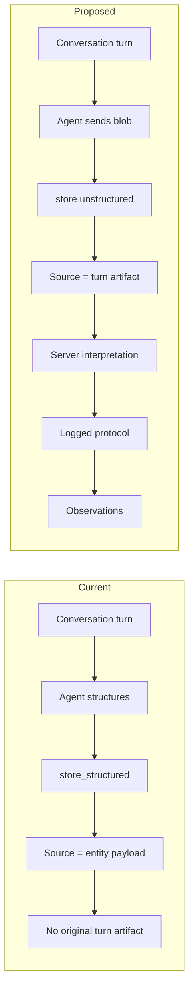

# All-storage-unstructured for full provenance

## Goal

Enable a mode where **conversation-sourced** data is stored the same way as file-sourced data: the agent submits the **raw turn (and optional attachment refs)** as unstructured content; Neotoma stores it as an artifact, runs interpretation with a logged protocol, and produces observations. No agent-side structuring, so no lost provenance context.

## Current vs proposed flow

**Today:** Unstructured path already supports `file_content` + `mime_type` (and `file_path`). [extractTextFromBuffer](src/server.ts) (lines 93–135) returns UTF-8 for `text/*`, JSON, XML, and common extensions (`.txt`, `.csv`, `.json`, `.md`). So sending a turn as `text/plain` (base64) would be stored and interpreted with the **document** extraction prompt. Gaps: (1) document prompt is not tuned for conversation turns; (2) content-hash dedup would collapse two turns with identical text; (3) no standard envelope for turn + metadata + attachment refs.

## Recommended design

### 1. Conversation-turn envelope (contract)

Define a single, explicit format for “conversation turn as unstructured source” so that:

- Each turn is a **distinct artifact** (different bytes → different `content_hash` → no unwanted dedup).
- Optional metadata (timestamp, conversation_id, attachment refs) is preserved and can be used by interpretation or UI.

**Proposed envelope (JSON):**

- `content` (string): The turn text (user message, or user + assistant, per product choice).
- `timestamp` (string, optional): ISO 8601; helps ordering and uniqueness.
- `conversation_id` (string, optional): Thread identifier.
- `turn_id` (string, optional): Unique per turn; if omitted, client can use `idempotency_key` as the unique handle.
- `attachment_source_ids` (string[], optional): Source IDs of attachments already stored via unstructured store; interpretation can use these for context if needed later.

**Storage:** Agent sends this JSON as the unstructured payload:

- `file_content`: base64(JSON.stringify(envelope))
- `mime_type`: e.g. `application/x-neotoma-conversation-turn` (new) or `application/json` with a convention (e.g. `original_filename` or a query param indicating “conversation turn” so the server can choose the right interpretation path).

**Uniqueness:** Including `turn_id` or `timestamp` (or both) in the envelope ensures the stored bytes differ per turn, so content-hash dedup does not merge two different turns that happen to have the same text.

### 2. Interpretation path for conversation turns

- **Text extraction:** For `application/x-neotoma-conversation-turn` (or the chosen mime type), treat the blob as UTF-8 JSON; parse the envelope and use `content` as the text passed to the LLM. No PDF/OCR path.
- **Prompt:** Add a **conversation-turn variant** of the extraction prompt (e.g. in [docs/prompts/llm_extraction_system_prompt.md](docs/prompts/llm_extraction_system_prompt.md) or a new file). Instructions: extract entities and facts from this conversation turn; support multiple entity types (person, task, event, note, etc.) in one turn; do not invent data. Same output shape as today (entity_type + fields) so [runInterpretation](src/services/interpretation.ts) and the rest of the pipeline stay unchanged.
- **Prompt selection:** In [src/server.ts](src/server.ts), after `extractTextFromBuffer`, branch on mime type (or on a flag derived from envelope): if conversation-turn, call the LLM with the conversation prompt; otherwise keep current document prompt. Reuse [extractWithLLM](src/services/llm_extraction.ts) with a prompt parameter or a small wrapper that loads the correct system prompt.

### 3. Attachments

- **MVP:** Agent stores each attachment via the existing unstructured path (`store` with `file_content`/`file_path` + `mime_type`). Agent then stores the turn with an envelope that includes `attachment_source_ids` (the returned source IDs). The turn source is one artifact; each attachment is its own source. Interpretation for the turn uses only the turn `content` today; attachment content can be passed to the LLM in a later phase (e.g. “context: these sources are attached” and fetch their extracted text or summaries).
- **Optional later:** Interpretation service accepts optional “context sources” (e.g. attachment source_ids), fetches their stored content or prior extraction, and passes them to the LLM as context for the turn. No schema change required for MVP if we only interpret the turn text.

### 4. MCP contract

- **Use existing `store` (and `store_unstructured`).** No new action required for MVP. Agent passes:
  - `file_content`: base64-encoded JSON envelope (or plain text if no metadata needed).
  - `mime_type`: `application/x-neotoma-conversation-turn` (recommended) or `text/plain` (simpler; then uniqueness relies on idempotency_key + always including something unique in the text, e.g. a timestamp line).
  - `idempotency_key`: e.g. `conversation-{conversation_id}-{turn_id}` for replay safety.
  - `original_filename`: optional, e.g. `turn-2025-01-15T12-00-00Z.json`.
- **Spec and instructions:** Document that for **maximum provenance**, agents may store conversation turns as unstructured (envelope format above) so the artifact is preserved and interpretation is server-side with a logged protocol. Keep `store_structured` for backward compatibility and for clients that prefer not to pay interpretation cost per turn.

### 5. Dedup semantics

- **Today:** [raw_storage](src/services/raw_storage.ts) deduplicates by `content_hash` (and optionally by `idempotency_key`). Same bytes → same source.
- **Conversation turns:** Envelope must include a unique field (`turn_id` or `timestamp`) so that two different turns never produce the same bytes. No change to raw_storage logic; the contract (envelope format) guarantees distinct content per turn when the client follows it.

### 6. Implementation tasks (concise)

| Area             | Task                                                                                                                                                                                                                                                                         |
| ---------------- | ---------------------------------------------------------------------------------------------------------------------------------------------------------------------------------------------------------------------------------------------------------------------------- |
| Contract         | Define envelope schema and mime type in [docs/specs/MCP_SPEC.md](docs/specs/MCP_SPEC.md) (and optionally [docs/vocabulary/canonical_terms.md](docs/vocabulary/canonical_terms.md)).                                                                                          |
| Server           | In [src/server.ts](src/server.ts): for the chosen mime type, parse JSON envelope, use `content` as text; branch to conversation-turn extraction.                                                                                                                             |
| Prompt           | Add conversation-turn extraction prompt (new file or section in [docs/prompts/llm_extraction_system_prompt.md](docs/prompts/llm_extraction_system_prompt.md)); load it in [src/services/llm_extraction.ts](src/services/llm_extraction.ts) when source is conversation-turn. |
| Extraction       | In [llm_extraction.ts](src/services/llm_extraction.ts): add a function or parameter to extract using the conversation prompt; same output shape (entity_type + fields) for [interpretation.ts](src/services/interpretation.ts).                                              |
| Text extraction  | In [src/server.ts](src/server.ts) `extractTextFromBuffer`: for `application/x-neotoma-conversation-turn`, return the envelope’s `content` (or full JSON if interpretation needs metadata); no PDF/OCR.                                                                       |
| MCP instructions | Update [docs/developer/mcp/instructions.md](docs/developer/mcp/instructions.md) and tool descriptions: for full provenance, agents can store turns as unstructured using the envelope; document the format and mime type.                                                    |
| Tests            | Add tests: store conversation-turn envelope → source created, interpretation run with conversation prompt, observations created; idempotency_key replay returns same source; two turns with same text but different turn_id produce two sources.                             |

### 7. Out of scope for this plan

- Changing or removing `store_structured`; it remains the fast path for clients that accept less provenance.
- Pushing attachment content into the same interpretation call (optional future work).
- Schema or migration changes; existing sources, interpretations, and observations tables are reused.

### 8. Validation

- Store a conversation-turn envelope (with `turn_id`), run interpretation, then verify: one source, one interpretation run (with config logged), observations trace to that source.
- Store a second turn with same `content` but different `turn_id`; verify two distinct sources and two interpretation runs.
- Reinterpret the first source; verify new interpretation run and new observations, original artifact unchanged.

