# Chrome Extension Auto-Capture Plan

## Goal

Ship a Chrome extension MVP that captures useful page data from tabs you view and sends it to Neotoma automatically, with strong privacy controls and low maintenance overhead.

## Implementation Approach

- Start with a **generic extractor tier** for all allowed sites (URL/title/meta/JSON-LD/visible text summary).
- Use Neotoma's unified `store` ingestion path for structured entities first, and optionally unstructured snapshots for higher-recall extraction.
- Add a **site-specific extractor tier** behind feature flags for fragile/dynamic apps like WhatsApp Web.
- Prioritize buffering, deduplication, and throttling to avoid API spam and noisy data.

## Proposed Project Structure

- Add `extension/manifest.json` (MV3 permissions, host permissions, service worker, content scripts).
- Add `extension/src/background.ts` (navigation listeners, queue, dedup, batching, retries, Neotoma client).
- Add `extension/src/content/generic_extractor.ts` (metadata + JSON-LD + lightweight text extraction).
- Add `extension/src/content/whatsapp_extractor.ts` (experimental thread/message extraction heuristics).
- Add `extension/src/shared/types.ts` (capture payloads, site config, ingestion contracts).
- Add `extension/src/options/` UI (allowlist/blocklist, sensitive-domain defaults, capture mode toggles).
- Add `docs/developer/chrome_extension_capture.md` (security model, permissions rationale, testing and rollout).

## Data Flow

```mermaid
flowchart LR
  tabNav[TabNavigationEvent] --> bgWorker[BackgroundWorker]
  bgWorker --> inject[InjectContentScript]
  inject --> genericExtract[GenericExtractor]
  genericExtract --> normalize[NormalizeAndFingerprint]
  normalize --> queue[LocalQueueAndDebounce]
  queue --> ingest[NeotomaStoreClient]
  ingest --> neotoma[NeotomaApiStore]
  genericExtract -->|"dynamic_site"| siteSpecific[SiteSpecificExtractor]
  siteSpecific --> normalize
```

## Capture Policy and Privacy Defaults

- Default denylist for highly sensitive domains (banking, password managers, webmail unless explicitly enabled).
- User-managed allowlist for auto-capture domains.
- Per-site capture mode:
  - `metadata_only`
  - `metadata_plus_summary`
  - `full_snapshot_unstructured`
- Explicit on/off toggle for WhatsApp extraction (off by default).
- Local redaction pass for obvious secrets before send (tokens/keys/password fields).

## Reliability and Quality Controls

- Fingerprint records by normalized URL + title hash + content hash window to prevent duplicates.
- Debounce repeated captures from SPA route churn and mutation storms.
- Batch ingestion with retry/backoff and dead-letter local storage for failed sends.
- Add bounded capture frequency per tab/domain to control volume.

## WhatsApp-Specific Phase (Advanced)

- Initial scope: thread-level metadata + visible message window only.
- Use structural heuristics, not brittle class names, where possible.
- Observe DOM changes via `MutationObserver` with strict rate limits.
- Maintain per-thread cursor state in extension local storage for incremental capture.
- Keep extractor isolated so failures never break generic capture.

## Validation and Test Plan

- Unit tests for fingerprinting, dedup, batching, retry, and payload validation.
- Integration tests (mock Neotoma endpoint) for ingestion success/failure paths.
- Manual QA matrix:
  - static content site
  - SPA site
  - infinite-scroll site
  - WhatsApp Web (if enabled)
  - offline/online transitions
- Acceptance criteria:
  - no duplicate flood under SPA navigation
  - no capture on blocked domains
  - successful replay of queued payloads after reconnect

## Rollout Plan

- Phase 1: generic capture on allowlisted domains only.
- Phase 2: optional unstructured snapshot mode.
- Phase 3: experimental WhatsApp module behind feature flag.
- Phase 4: evaluate precision/recall and maintenance cost; keep/iterate/deprecate site-specific extractor accordingly.

