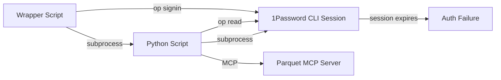
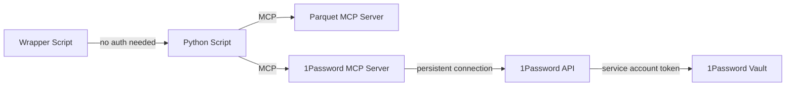

# Convert 1Password Sync to MCP

## Overview

Convert the environment variable sync script from using 1Password CLI (`op read`) to using the 1Password MCP server. This eliminates fragile session management, provides persistent authentication, and improves reliability.

## Current Architecture



**Issues:**

- Session tokens can expire mid-script
- Each `op read` is a separate subprocess call
- No connection pooling or reuse
- Fragile session management in wrapper script

## Target Architecture



**Benefits:**

- Persistent MCP connection (auth once, reuse)
- No session expiration during execution
- Better error handling (structured MCP errors)
- Consistent with existing MCP architecture

## Implementation Plan

### Phase 1: Add 1Password MCP Client

**File:** `foundation/scripts/op_sync_env_from_1password.py`

1. **Create `OnePasswordMCPClient` class** (similar to `ParquetMCPClient`):

   - Location: After `ParquetMCPClient` class (around line 444)
   - Methods:
     - `__init__(repo_root: Path)` - Initialize client
     - `_detect_onepassword_server() -> tuple[str, str]` - Auto-detect server location
     - `_call_tool(tool_name: str, arguments: dict) -> dict` - Call MCP tool
     - `call_tool_sync(tool_name: str, arguments: dict) -> dict` - Synchronous wrapper
     - `read_secret(reference: str) -> str` - Read secret by op:// reference

2. **Server detection logic** (similar to parquet server):

   - Check `ONEPASSWORD_MCP_SERVER_PATH` environment variable
   - Check `~/.cursor/mcp.json` for 1Password server config
   - Check repo location: `mcp/onepassword/` or similar
   - Support both Python scripts and shell scripts

3. **Tool name assumption**: Based on 1Password MCP server patterns, assume tool name is `read_secret` or `get_secret` with `reference` parameter (verify during implementation)

### Phase 2: Replace CLI Calls

**File:** `foundation/scripts/op_sync_env_from_1password.py`

1. **Replace `op_read()` function** (line 624):

   - Old: Uses `subprocess.run(["op", "read", ref])`
   - New: Uses `OnePasswordMCPClient.read_secret(ref)`
   - Keep same function signature and error handling patterns
   - Maintain security: never print secret values

2. **Update `sync_env()` function** (line 744):

   - Replace `op_read(op_ref)` calls with MCP client
   - No other changes needed (function signature stays same)

3. **Remove `check_op_session()` function** (line 572):

   - No longer needed with MCP (authentication handled by MCP server)
   - Or keep as optional validation step

### Phase 3: Update Wrapper Script

**File:** `scripts/sync-env-from-1password.sh`

1. **Remove CLI authentication logic** (lines 40-78):

   - Remove `op signin` checks
   - Remove session token management
   - Remove `op whoami` validation
   - Keep only: foundation check, Python check, script execution

2. **Add MCP server path configuration** (optional):

   - Add `ONEPASSWORD_MCP_SERVER_PATH` environment variable support
   - Similar to existing `PARQUET_MCP_SERVER_PATH` pattern

3. **Update error messages**:

   - Remove references to `op signin`
   - Update to mention MCP server configuration instead

### Phase 4: Configuration and Documentation

**Files to update:**

1. **`foundation-config.yaml`** (if needed):

   - Add optional 1Password MCP server path configuration
   - Document MCP server setup requirements

2. **`.cursor/mcp.json`** (user configuration):

   - Add 1Password MCP server entry (if not already present)
   - Example:
     ```json
     {
       "mcpServers": {
         "onepassword": {
           "command": "python3",
           "args": ["path/to/onepassword-mcp-server.py"],
           "env": {
             "OP_SERVICE_ACCOUNT_TOKEN": "op://..."
           }
         }
       }
     }
     ```


3. **Documentation updates**:

   - `foundation/scripts/README.md` - Update requirements section
   - `.cursor/commands/sync_env_from_1password.md` - Update prerequisites
   - `docs/developer/environment/README_1PASSWORD_SYNC.md` - Update setup instructions

### Phase 5: Fallback Strategy

**File:** `foundation/scripts/op_sync_env_from_1password.py`

1. **Add CLI fallback** (optional, for backward compatibility):

   - If MCP server unavailable, fall back to CLI
   - Log warning when using fallback
   - Prefer MCP, but don't break existing workflows

2. **Error handling**:

   - Clear error messages if MCP server not configured
   - Instructions for setting up 1Password MCP server
   - Link to setup documentation

## Key Implementation Details

### OnePasswordMCPClient Class Structure

```python
class OnePasswordMCPClient:
    def __init__(self, repo_root: Path):
        self.repo_root = repo_root
        self.server_path, self.server_command = self._detect_onepassword_server()
    
    def _detect_onepassword_server(self) -> tuple[str, str]:
        # Similar to ParquetMCPClient._detect_parquet_server()
        # Check env var, ~/.cursor/mcp.json, repo location
    
    async def _call_tool(self, tool_name: str, arguments: dict) -> dict:
        # Use stdio_client with StdioServerParameters
        # Similar to ParquetMCPClient._call_tool()
    
    def read_secret(self, reference: str) -> str:
        """Read secret from 1Password via MCP."""
        result = self.call_tool_sync("read_secret", {"reference": reference})
        return result.get("value", "")
```

### Updated op_read Function

```python
def op_read(ref: str) -> str:
    """
    Read a secret value from 1Password using MCP server.
    
    Security: Error messages never include CLI output that might contain secrets.
    """
    if not MCP_AVAILABLE:
        raise RuntimeError(
            "MCP client dependencies not available. Install with: pip install mcp"
        )
    
    try:
        client = OnePasswordMCPClient(find_repo_root())
        value = client.read_secret(ref)
        if not value:
            raise RuntimeError(f"Empty value returned for 1Password ref: {ref}")
        return value
    except Exception as e:
        raise RuntimeError(
            f"1Password MCP error for {ref}. "
            f"Ensure 1Password MCP server is configured (check ~/.cursor/mcp.json)"
        ) from e
```

## Testing Strategy

1. **Unit tests** (if test infrastructure exists):

   - Test `OnePasswordMCPClient` initialization
   - Test server detection logic
   - Test error handling

2. **Integration testing**:

   - Test with actual 1Password MCP server
   - Verify secrets are read correctly
   - Test fallback to CLI (if implemented)

3. **Manual validation**:

   - Run sync script with MCP server
   - Verify .env file is updated correctly
   - Verify no authentication prompts appear

## Migration Notes

- **Backward compatibility**: Consider keeping CLI as fallback initially
- **Configuration**: Users need to set up 1Password MCP server in `~/.cursor/mcp.json`
- **Service account**: 1Password MCP requires service account token (more secure than CLI sessions)
- **No breaking changes**: Script interface stays the same, only internal implementation changes

## Files to Modify

1. `foundation/scripts/op_sync_env_from_1password.py` - Add MCP client, replace CLI calls
2. `scripts/sync-env-from-1password.sh` - Remove CLI auth logic
3. `.cursor/commands/sync_env_from_1password.md` - Update documentation
4. `docs/developer/environment/README_1PASSWORD_SYNC.md` - Update setup instructions
5. `foundation/scripts/README.md` - Update requirements

## Dependencies

- Existing: `mcp` package (already required)
- New: 1Password MCP server installation and configuration
- Optional: Service account token setup for 1Password

## Success Criteria

- [ ] Script uses MCP server instead of CLI for secret reads
- [ ] No `op signin` required in wrapper script
- [ ] Persistent connection (no session expiration)
- [ ] All existing functionality preserved
- [ ] Clear error messages if MCP server not configured
- [ ] Documentation updated with MCP setup instructions