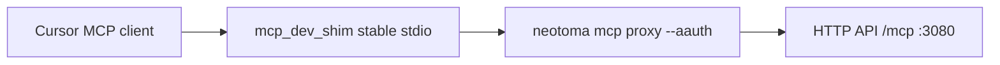
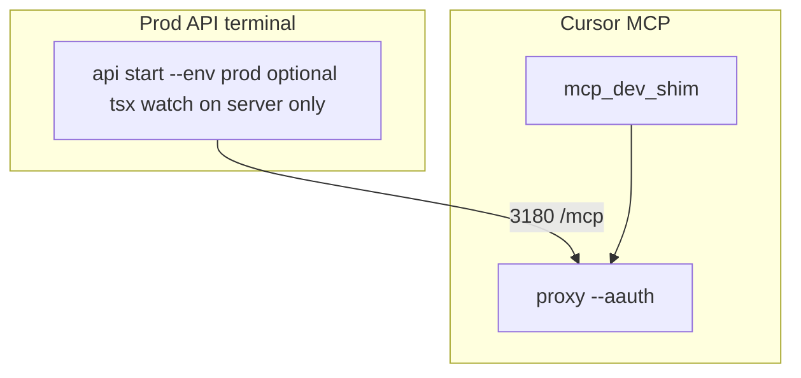

# What to do instead of `run_neotoma_mcp_stdio_dev_watch.sh`

## Why not `tsx watch` on the MCP command

[`scripts/run_neotoma_mcp_stdio_dev_watch.sh`](scripts/run_neotoma_mcp_stdio_dev_watch.sh) runs `npx tsx watch src/index.ts` as the process Cursor attaches to. `tsx watch` emits reload output on **stdout**, which shares the JSON-RPC MCP stream and can corrupt or interleave messages. Docs already warn against this for installed MCP ([`docs/developer/mcp_cursor_setup.md`](docs/developer/mcp_cursor_setup.md)).

## Option A: stdio + reload + AAuth-signed HTTP (default for ordinary dev)

Use two processes and the repo launcher [`scripts/run_neotoma_mcp_signed_stdio_dev_shim.sh`](scripts/run_neotoma_mcp_signed_stdio_dev_shim.sh).

1. **One terminal — dev API**  
   Start Neotoma HTTP so `/mcp` exists (default dev port **3080**), e.g. `neotoma api start --env dev` (or your usual `npm run dev:*` that serves the API). Keep this running while you use MCP.

2. **Keys (once)**  
   `neotoma auth keygen` with `--sub` / `--iss` you care about. Keys land under `~/.neotoma/aauth/`. Ensure `.env` has any overrides the proxy needs (`NEOTOMA_AAUTH_*` if not using defaults from [`src/proxy/aauth_client_signer.ts`](src/proxy/aauth_client_signer.ts) + CLI config).

3. **Cursor MCP config**  
   Set `neotoma-dev` (or your server name) `command` to the **absolute** path of `run_neotoma_mcp_signed_stdio_dev_shim.sh` from your Neotoma checkout. Optional `env` in `.cursor/mcp.json`: `MCP_PROXY_DOWNSTREAM_URL` if not on 3080, `MCP_PROXY_SESSION_PREFLIGHT`, `MCP_PROXY_FAIL_CLOSED` per [`docs/developer/mcp/proxy.md`](docs/developer/mcp/proxy.md).

4. **Reload behavior**  
   The shim watches `src/`, `openapi.yaml`, and MCP tool YAML ([`src/mcp_dev_shim.ts`](src/mcp_dev_shim.ts)) and **restarts the worker** (the proxy) without polluting the client-facing stdio stream. After **tool surface** changes, reconnect or reinitialize MCP if the client does not react to `notifications/tools/list_changed`.

5. **API-side hot reload**  
   Whatever watches **server** code (`server.ts`, actions, etc.) is whatever your `api start --env dev` uses; that is independent of the MCP shim.

## Option B: stdio + reload, no AAuth

If you do not need signed HTTP:

- Use [`scripts/run_neotoma_mcp_stdio_dev_shim.sh`](scripts/run_neotoma_mcp_stdio_dev_shim.sh) with the **default worker** (`npx tsx src/index.ts` — in-process MCP, no proxy). Same reload model, no second API process, attribution stays at `clientInfo` / local tiers unless you add signing elsewhere.

## Option C: direct stdio, no reload in MCP process

- Use [`scripts/run_neotoma_mcp_stdio.sh`](scripts/run_neotoma_mcp_stdio.sh) (dev) or [`scripts/run_neotoma_mcp_stdio_prod.sh`](scripts/run_neotoma_mcp_stdio_prod.sh) (prod). Restart the MCP connection manually after code changes.

## Option D (recommended when you need prod env while coding): production env (`NEOTOMA_ENV=production`) while still iterating on source

**Will it work?** Yes: same stdio stability model as A/B (shim + optional `mcp proxy --aauth`; **plain `tsx`** on the MCP-attached worker; reload via shim `fs.watch` and/or `tsx watch` **only** on the HTTP API process). Point `MCP_PROXY_DOWNSTREAM_URL` at `:3180/mcp` (prod default) or set `NEOTOMA_ENV=production` on the in-process worker per steps 2–3.

**Caveats:** MCP traffic and any mistakes hit the **production** DB (or whatever `NEOTOMA_ENV=production` resolves to on your machine). Prefer Option A for day-to-day feature work unless you explicitly need prod parity (repro bugs, schema against real data, etc.). Remote prod URLs add TLS, auth, and blast-radius concerns—still the same transport pattern, not a different MCP protocol.

"Prod env" normally means prod **data plane** (e.g. prod SQLite) and HTTP **`/mcp` on :3180** by convention—not the same as "run `tsx watch` on the MCP stdio process" (still unsafe for JSON-RPC; see Option A intro).

1. **Run the HTTP API as prod** in a dedicated terminal: `neotoma api start --env prod` (default **3180**). If you want **watch on server code**, attach `tsx watch` (or `npm run dev:prod` with watch) to **this API process only**—reload logs go to that terminal, not the MCP stdio pipe.
2. **Signed MCP path against prod `/mcp`:** Reuse the signed-shim pattern ([`scripts/run_neotoma_mcp_signed_stdio_dev_shim.sh`](scripts/run_neotoma_mcp_signed_stdio_dev_shim.sh)) but override **`MCP_PROXY_DOWNSTREAM_URL=http://127.0.0.1:3180/mcp`** (via `mcp.json` `env` or a tiny wrapper script). The repo does not ship `run_neotoma_mcp_signed_stdio_prod_shim.sh` yet; env-only override is enough.
3. **In-process MCP with prod env + shim reload:** Point [`scripts/run_neotoma_mcp_stdio_dev_shim.sh`](scripts/run_neotoma_mcp_stdio_dev_shim.sh) at a worker that runs `npx tsx src/index.ts` with **`NEOTOMA_ENV=production`** set in the MCP server `env` block. The shim’s `fs.watch` still restarts the worker on `src/` changes; use **plain `tsx`**, not `tsx watch`, on the worker so worker stdout stays JSON-RPC-clean.
4. **Do not expect real `tsx watch` on the MCP-attached process:** [`scripts/run_neotoma_mcp_stdio_prod_watch.sh`](scripts/run_neotoma_mcp_stdio_prod_watch.sh) exports `NEOTOMA_ENV=production` but runs **plain** `npx tsx src/index.ts` (see file comment: watch breaks stdio). For reload-on-save without stdio pollution, use **steps 2–3 above**—the same [`run_neotoma_mcp_signed_stdio_dev_shim.sh`](scripts/run_neotoma_mcp_signed_stdio_dev_shim.sh) / [`run_neotoma_mcp_stdio_dev_shim.sh`](scripts/run_neotoma_mcp_stdio_dev_shim.sh) entrypoints as Option A/B, with **prod** overrides here (`MCP_PROXY_DOWNSTREAM_URL` → :3180 or `NEOTOMA_ENV=production` on the worker)—not the misnamed `*_prod_watch` script as a substitute for watch.

## CLI wizard (execution outcome)

**Goal:** When the user runs the relevant MCP CLI flow (`neotoma mcp config` and/or the install path inside `neotoma mcp check` / `offerInstall` in [`src/cli/mcp_config_scan.ts`](src/cli/mcp_config_scan.ts)), **prompt once for transport mode A–D** (TTY), then emit or merge the matching `mcpServers` entry.

- **A:** `command` = absolute [`scripts/run_neotoma_mcp_signed_stdio_dev_shim.sh`](scripts/run_neotoma_mcp_signed_stdio_dev_shim.sh); `neotoma-dev` omits `MCP_PROXY_DOWNSTREAM_URL` when it matches the dev default (:3080); `neotoma` sets prod :3180 unless user overrides.
- **B:** `command` = absolute [`scripts/run_neotoma_mcp_stdio_dev_shim.sh`](scripts/run_neotoma_mcp_stdio_dev_shim.sh); optional worker-only `env`.
- **C:** `command` = absolute [`run_neotoma_mcp_stdio.sh`](scripts/run_neotoma_mcp_stdio.sh) or [`run_neotoma_mcp_stdio_prod.sh`](scripts/run_neotoma_mcp_stdio_prod.sh) per separate dev/prod pick; prod script implies prod transport.
- **D:** same `command` as A or B; `env` includes **`MCP_PROXY_DOWNSTREAM_URL=http://127.0.0.1:3180/mcp`** for signed HTTP to prod API on both slots, **or** `NEOTOMA_ENV=production` on the in-process shim worker path.

**Non-TTY / CI:** mirror existing `offerInstall` flags with e.g. `--mcp-transport a|b|c|d` (exact name TBD) so JSON output mode stays deterministic.

**Will it work?** Yes, if `NEOTOMA_REPO_ROOT` / repo root resolution matches today’s `mcp check` behavior (scripts must be addressable). Re-use existing merge helpers that write `neotoma-dev` / `neotoma` entries; extend payloads with `command` + `args` + `env` instead of URL-only blocks where needed.

## Verification

- `neotoma auth session` (or Inspector) shows non-anonymous tier when using Option A or D with `--aauth` (D: ensure keys and downstream URL match the intended environment).
- Cursor MCP logs: no stray non-JSON lines on stdout from the MCP child.
- `GET` or MCP call against `http://127.0.0.1:3080/mcp` (dev) or `http://127.0.0.1:3180/mcp` (prod) succeeds when the matching API terminal is up.
- **Option D:** Confirm you intend prod data before first MCP write; smoke-test with a read-only tool if the plane is shared or remote.

## Docs to keep open while doing this

- [`docs/developer/mcp/proxy.md`](docs/developer/mcp/proxy.md) — Dev: stdio + live reload + AAuth  
- [`docs/developer/mcp_cursor_setup.md`](docs/developer/mcp_cursor_setup.md) — Dev shim vs signed dev shim
