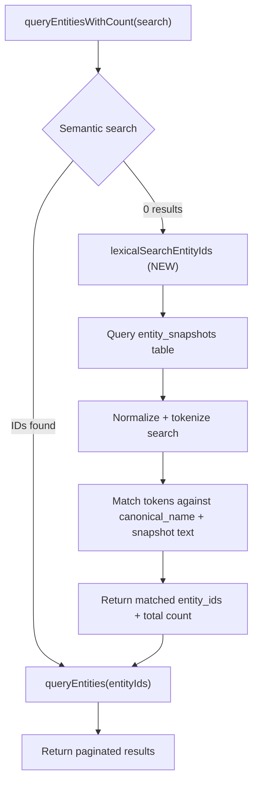

# Fix lexical retrieval fallback for entity search

## Problem diagnosis

Three independent bugs combine to make common queries return zero results when semantic search is unavailable or returns empty:

**Bug 1 — Lexical fallback only searches `canonical_name`.**
`filterEntitiesBySearch` in [entity_handlers.ts](src/shared/action_handlers/entity_handlers.ts) (lines 153-160) does `entity.canonical_name.toLowerCase().includes(search)`. It ignores `title`, `source_path`, `aliases`, and all other snapshot fields. Meanwhile, semantic search uses `getEntitySearchableText` in [embeddings.ts](src/embeddings.ts) (line 74) which concatenates `entity_type + canonical_name + JSON.stringify(snapshot)` — so semantic search can match on any snapshot field, but the lexical fallback cannot.

**Bug 2 — Pagination before filtering.**
In the lexical fallback path of `queryEntitiesWithCount` ([entity_handlers.ts](src/shared/action_handlers/entity_handlers.ts) lines 122-133), `queryEntities` is called with `limit`/`offset` first, and `filterEntitiesBySearch` only filters that page. Inside `queryEntities` ([entity_queries.ts](src/services/entity_queries.ts) line 140), the slice `entities.slice(offset, offset + limit)` runs before any text matching. If the matching entity is entity #200 and `limit=100`, it is never seen.

**Bug 3 — Substring matching requires exact phrase order.**
`"mcp integrations".includes()` requires that exact substring. A query like `"agent memory"` will not match a `canonical_name` of `"Agent Memory Architecture Review"` (it would, actually — but it won't match if the canonical_name is `"Memory Architecture for Agents"` because the words aren't adjacent in that order). More critically, it won't match if the relevant text is only in `snapshot.title` and `canonical_name` is something like `"doc_123"`.

## Architecture of the fix

The key insight: `entity_snapshots` table already stores `canonical_name`, `entity_type`, `snapshot` (TEXT/JSONB), and `user_id`. We can search it directly for lexical matches and return `entity_id`s, then pass those IDs into the existing `queryEntities(entityIds=...)` codepath (which already handles pagination, snapshot loading, and provenance correctly).



This design:

- Reuses the existing `entityIds` parameter on `queryEntities` (no changes to that function)
- Fixes pagination: all matches are identified before pagination
- Fixes field coverage: searches the full snapshot text
- Fixes token order: all-tokens-present matching instead of substring

## Concrete changes

### 1. New utility: `normalizeSearchText` + `matchesSearchTokens`

Add to [entity_handlers.ts](src/shared/action_handlers/entity_handlers.ts) (or a new `src/services/text_search.ts` if preferred for testability):

```typescript
function normalizeSearchText(text: string): string {
  return text
    .toLowerCase()
    .replace(/[-_]/g, " ")
    .replace(/[^\w\s]/g, "")
    .replace(/\s+/g, " ")
    .trim();
}

function matchesSearchTokens(searchableText: string, searchTokens: string[]): boolean {
  const normalized = normalizeSearchText(searchableText);
  return searchTokens.every((token) => normalized.includes(token));
}
```

### 2. New function: `lexicalSearchEntityIds`

Add to [entity_handlers.ts](src/shared/action_handlers/entity_handlers.ts):

- Query `entity_snapshots` for `entity_id, canonical_name, snapshot` filtered by `user_id` and optionally `entity_type`
- For each row, build searchable text: `canonical_name + " " + JSON.stringify(snapshot)`
- Tokenize the search query with `normalizeSearchText` then split on spaces
- Filter rows where `matchesSearchTokens` returns true
- Return matched `entity_id`s and count
- Cap the candidate fetch to a reasonable limit (e.g., 5000 rows) to avoid unbounded memory use

### 3. Update `queryEntitiesWithCount` lexical fallback path

Replace lines 122-133 of [entity_handlers.ts](src/shared/action_handlers/entity_handlers.ts):

**Before:**

```typescript
entities = await queryEntities({ userId, entityType, includeMerged, limit, offset });
const filtered = filterEntitiesBySearch(entities, search);
entities = filtered;
total = filtered.length;
```

**After:**

```typescript
const { entityIds: lexicalIds, total: lexicalTotal } = await lexicalSearchEntityIds({
  userId,
  entityType,
  search: search.trim(),
  includeMerged,
});
if (lexicalIds.length > 0) {
  const paginatedIds = lexicalIds.slice(offset, offset + limit);
  entities = await queryEntities({
    userId,
    entityType,
    includeMerged,
    limit,
    offset: 0,
    entityIds: paginatedIds,
  });
  total = lexicalTotal;
} else {
  entities = [];
  total = 0;
}
```

### 4. Keep `filterEntitiesBySearch` as-is (or deprecate)

The existing function becomes unused in the main retrieval path. It can stay for backward compatibility or be removed if nothing else calls it.

### 5. Regression tests

Add test cases to [tests/integration/entity_queries.test.ts](tests/integration/entity_queries.test.ts) (or a new `tests/integration/lexical_search.test.ts`):

- Store entities with `canonical_name` different from `title` (e.g., canonical_name `"doc_123"`, snapshot title `"MCP Integrations Assessment"`)
- Query `"mcp integrations"` and verify non-zero results
- Query `"integrations mcp"` (reversed word order) and verify match
- Query with hyphens/punctuation variants and verify match
- Store 200+ entities, place the match at position 150, query with `limit=100, offset=0` and verify the match is found (pagination fix)

## What the original plan got right vs. what to skip

**Keep from original plan:**

- Multi-field lexical matching (Bug 1 fix)
- Pre-pagination candidate handling (Bug 2 fix)
- Regression tests for known failing queries

**Skip from original plan:**

- `retrieve_entity_by_identifier` hardening — it already has semantic fallback (lines 2608-2639 of server.ts) and `ilike` on canonical_name. The lexical improvements here will also benefit any shared matching logic if we extract a common utility.
- Schema/descriptor alignment for search tuning parameters — this is optimization, not a correctness fix. The `similarityThreshold` parameter is already passed through. No schema changes needed.
- Changes to `entity_queries.ts` internals — the `entityIds` parameter already supports the pattern we need. No changes to `queryEntities` required.

## Files changed

| File                                             | Change                                                                                                                          |
| ------------------------------------------------ | ------------------------------------------------------------------------------------------------------------------------------- |
| `src/shared/action_handlers/entity_handlers.ts`  | Add `lexicalSearchEntityIds`, `normalizeSearchText`, `matchesSearchTokens`; update lexical fallback in `queryEntitiesWithCount` |
| `tests/integration/lexical_search.test.ts` (new) | Regression tests for multi-field token matching and pagination-safe search                                                      |

Optionally (for cleaner separation):

| File                                   | Change                                                                             |
| -------------------------------------- | ---------------------------------------------------------------------------------- |
| `src/services/text_search.ts` (new)    | Extract `normalizeSearchText` and `matchesSearchTokens` for reuse and unit testing |
| `tests/unit/text_search.test.ts` (new) | Unit tests for normalization and token matching                                    |
