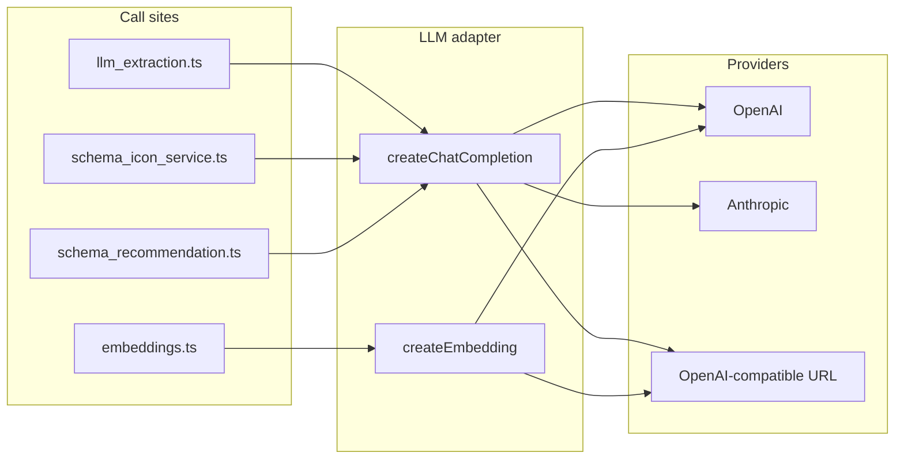

# Multi-LLM Provider Support Plan

## Current state

- **Chat completions**: Used in [src/services/llm_extraction.ts](src/services/llm_extraction.ts), [src/services/schema_icon_service.ts](src/services/schema_icon_service.ts), and [src/services/schema_recommendation.ts](src/services/schema_recommendation.ts). All instantiate `new OpenAI({ apiKey: config.openaiApiKey })` and call `openai.chat.completions.create()` with models like `gpt-4o` / `gpt-4o-mini`.
- **Embeddings**: [src/embeddings.ts](src/embeddings.ts) uses OpenAI `text-embedding-3-small` (1536 dimensions). [src/services/local_entity_embedding.ts](src/services/local_entity_embedding.ts) hardcodes `EMBEDDING_DIM = 1536` for sqlite-vec; entity semantic search and schema registry depend on `generateEmbedding()`.
- **Config**: [src/config.ts](src/config.ts) exposes only `openaiApiKey` from `OPENAI_API_KEY`.
- **CLI**: [src/cli/index.ts](src/cli/index.ts) init flow prompts for `OPENAI_API_KEY` and writes it to `.env`; secret list includes `OPENAI_API_KEY`.
- **API**: Interpretation config and errors reference `provider: "openai"` and `openai_not_configured` / "Set OPENAI_API_KEY" in [src/actions.ts](src/actions.ts), [src/server.ts](src/server.ts), and [src/cli/index.ts](src/cli/index.ts).

## Architecture

- **Single abstraction**: One module exposes `createChatCompletion(messages, options)` and `createEmbedding(text)` (or keep `generateEmbedding` in embeddings.ts but have it call the adapter). Provider selection is driven by config.
- **Backward compatibility**: If only `OPENAI_API_KEY` is set (no new provider env), behavior stays as today (OpenAI).

## 1. Config and environment

- **New env vars** (suggested; names can follow existing [ENV_VAR_NAMING_STRATEGY](docs/developer/environment/ENV_VAR_NAMING_STRATEGY.md)):
  - `NEOTOMA_LLM_PROVIDER`: `openai` (default) | `anthropic` | `azure` | `openai_compatible`
  - Provider-specific: `OPENAI_API_KEY` (existing), `ANTHROPIC_API_KEY`, `AZURE_OPENAI_ENDPOINT` + `AZURE_OPENAI_API_KEY`, or `OPENAI_COMPATIBLE_BASE_URL` + `OPENAI_COMPATIBLE_API_KEY`
- **Config shape** in [src/config.ts](src/config.ts): Add `llm: { provider, openaiApiKey?, anthropicApiKey?, azureEndpoint?, azureApiKey?, openaiCompatibleBaseUrl?, openaiCompatibleApiKey? }` and a derived `isLlmConfigured(): boolean` (true if the selected provider has its key/endpoint set). Keep `openaiApiKey` on the root for backward compat during migration, then optionally deprecate or alias from `config.llm.openaiApiKey`.
- **.env.example**: Document `NEOTOMA_LLM_PROVIDER` and the optional provider-specific variables; keep `OPENAI_API_KEY` as the default example.

## 2. LLM adapter module

- **New module** e.g. `src/llm/client.ts` (or `src/services/llm_client.ts`):
  - **Chat**: `createChatCompletion({ messages, model, temperature?, max_tokens?, response_format? })` returning `{ content: string, usage? }`. Internally:
    - `openai`: use existing `openai` package (unchanged).
    - `anthropic`: use `@anthropic-ai/sdk` with message conversion (Anthropic has different message shape and no `response_format.type: "json_object"`; use tool use / structured output if required).
    - `azure`: use `openai` with `baseURL` and `apiKey` from config.
    - `openai_compatible`: use `openai` with `baseURL: OPENAI_COMPATIBLE_BASE_URL` and `apiKey: OPENAI_COMPATIBLE_API_KEY` (covers Groq, Together, local servers, etc.).
  - **Embeddings**: Either add `createEmbedding(text)` in the same module and have [src/embeddings.ts](src/embeddings.ts) call it, or keep embedding logic in embeddings.ts and add a small provider dispatch there. For non-OpenAI providers, only support options that yield **1536-dimensional** vectors (or document that changing embedding provider may require a migration/re-embed). Azure OpenAI and many OpenAI-compatible endpoints support the same embedding model/dims.
- **Message format**: Normalize to a small internal type (e.g. `{ role, content }[]`). Reuse or align with [src/utils/chat.ts](src/utils/chat.ts) `ChatMessage` / `serializeChatMessagesForOpenAI`; adapter converts to provider-specific format (OpenAI vs Anthropic differ).
- **Model IDs**: Keep current defaults (e.g. `gpt-4o`) for `provider === "openai"`. For other providers, accept model in options and document mapping (e.g. `claude-3-5-sonnet`, `azure-deployment-name`). Config could expose optional `NEOTOMA_LLM_CHAT_MODEL` / `NEOTOMA_LLM_EMBEDDING_MODEL` with provider-specific defaults.

## 3. Migrate call sites

- **llm_extraction.ts**: Remove direct `OpenAI` import and `openai` instance. Use adapter `createChatCompletion` for all three call paths (text, image/vision, retry). Replace `if (!openai)` with `if (!isLlmConfigured())` (or adapter returns a clear error). Vision: only OpenAI and Azure support image inputs today; document that vision extraction may require `openai` or `azure` or skip with a clear error for other providers.
- **schema_icon_service.ts**: Same: use adapter for `matchLucideIcon` and `generateCustomSVGIcon`; replace `openai` checks with config/adapter availability.
- **schema_recommendation.ts**: Replace dynamic `import("openai")` and `openai.chat.completions.create` with adapter `createChatCompletion`.
- **embeddings.ts**: Replace direct OpenAI usage with adapter (or adapter’s `createEmbedding`). Ensure 1536-dim contract is preserved; log or error if provider returns wrong dims.
- **Availability checks**: Replace `config.openaiApiKey` / `openai !== null` with a single `isLlmConfigured()` (or adapter method) everywhere: [src/services/llm_extraction.ts](src/services/llm_extraction.ts) (`isLLMExtractionAvailable`), [src/services/schema_icon_service.ts](src/services/schema_icon_service.ts), [src/embeddings.ts](src/embeddings.ts), [src/actions.ts](src/actions.ts), [src/server.ts](src/server.ts), [src/cli/index.ts](src/cli/index.ts).

## 4. API and CLI behavior

- **Interpretation config**: Keep returning `provider` and `model_id`; set `provider` from config (e.g. `config.llm.provider`) so clients see the actual backend. Keep `openai_not_configured` or generalize to `llm_not_configured` and message "Set NEOTOMA_LLM_PROVIDER and the corresponding API key in .env to enable AI interpretation."
- **CLI init**: In [src/cli/index.ts](src/cli/index.ts), when prompting for LLM setup, ask for provider (openai / anthropic / etc.) then the relevant key(s). Write `NEOTOMA_LLM_PROVIDER` and the chosen key var(s) to `.env`. Optionally keep prompting for `OPENAI_API_KEY` if provider is openai for minimal change. Update the secret list used for masking to include the new provider keys (e.g. `ANTHROPIC_API_KEY`).

## 5. Dependencies and tests

- **Dependencies**: Add `@anthropic-ai/sdk` only if supporting Anthropic; Azure uses existing `openai` with different base URL. For OpenAI-compatible, no new dependency.
- **Unit tests**: Mock the adapter in [tests/integration/llm_extraction.test.ts](tests/integration/llm_extraction.test.ts), [src/services/**tests**/schema_icon_service.test.ts](src/services/__tests__/schema_icon_service.test.ts), and any schema_recommendation tests so they no longer depend on `new OpenAI()`. Add unit tests for the adapter (e.g. message conversion, provider selection from config).
- **Integration**: Optionally add one integration test that runs with an alternative provider (e.g. `openai_compatible` with a mock server or a real key in CI secret) to validate the path end-to-end.

## 6. Documentation and foundation

- **.env.example**: Add commented `NEOTOMA_LLM_PROVIDER` and provider-specific vars; note that `OPENAI_API_KEY` alone keeps current behavior.
- **Developer docs**: Short section in [docs/developer/getting_started.md](docs/developer/getting_started.md) or a new `docs/developer/llm_providers.md` describing supported providers, env vars, and limitations (e.g. vision only for OpenAI/Azure; embeddings 1536).
- **vector_ops.md**: Update [docs/subsystems/vector_ops.md](docs/subsystems/vector_ops.md) to say embeddings can use the configured LLM provider when it supports embeddings (and 1536 dims).
- **1Password / foundation**: If [foundation scripts](foundation/scripts/README.md) or env mappings reference `OPENAI_API_KEY`, add optional mappings for the new provider keys so teams can sync them the same way.

## 7. Embedding dimension constraint

- **Fixed 1536**: Local entity embeddings and sqlite-vec use 1536. The adapter (or embeddings.ts) must only return 1536-dim vectors for entity/schema search. Document that:
  - OpenAI and Azure (same model) are 1536.
  - If another provider is used for embeddings, either use a model that outputs 1536 or keep embeddings on OpenAI-only and allow chat to use another provider (split config: chat provider vs embedding provider) for a first version.

## Implementation order

1. Config: add `NEOTOMA_LLM_PROVIDER` and provider-specific env, `config.llm`, `isLlmConfigured()`.
2. Adapter: implement `createChatCompletion` for `openai` and `openai_compatible` (no new deps); then add `anthropic` and `azure` if desired.
3. Embeddings: route through adapter or keep in embeddings.ts with provider dispatch; enforce 1536.
4. Migrate llm_extraction, schema_icon_service, schema_recommendation to adapter; replace all `openai` / `config.openaiApiKey` checks with `isLlmConfigured()` and adapter.
5. Update actions, server, CLI (errors, init prompts, interpretation config).
6. Tests: switch to mocking adapter; add adapter unit tests.
7. Docs and .env.example.

## Out of scope (for this plan)

- Changing embedding dimension or supporting multiple dimensions.
- Per-request provider selection (only env-driven default).
- Streaming chat responses (unless already used somewhere).

