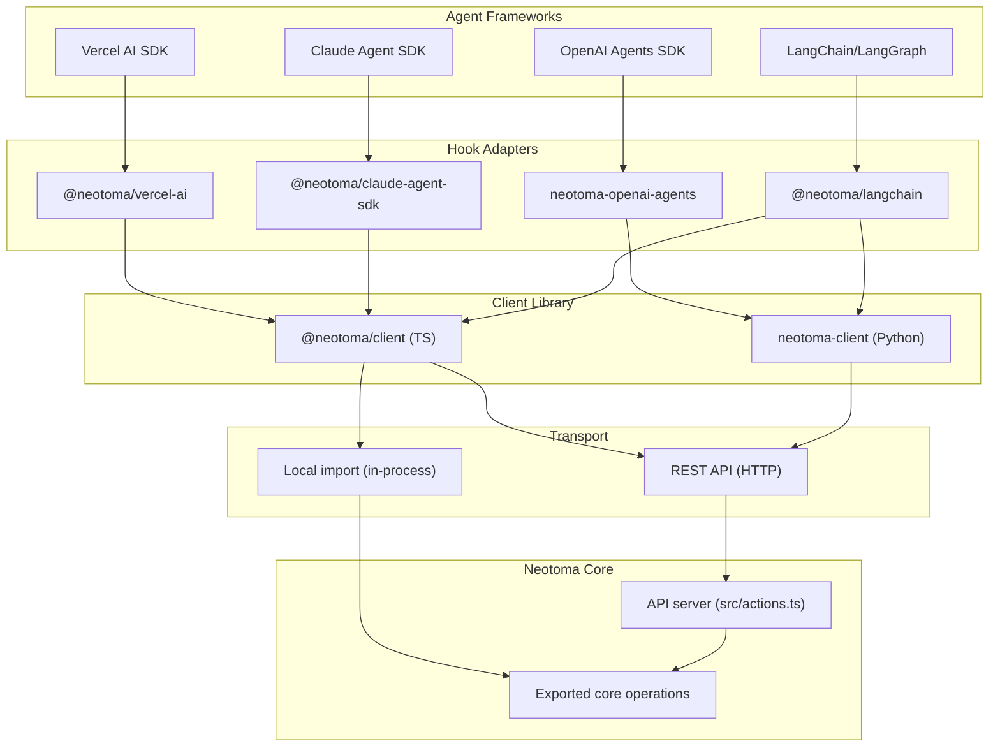

# Neotoma Harness Hooks Integration

## Problem

Neotoma currently integrates with all harnesses exclusively via MCP (Model Context Protocol). For programmatic agent SDKs -- where developers write code and control the agent loop -- MCP adds unnecessary protocol overhead and configuration friction. These frameworks have native hook/middleware/callback systems designed for exactly this kind of integration.

## Target Frameworks and Their Hook Surfaces

- **Vercel AI SDK (TypeScript):** `wrapLanguageModel` middleware with `transformParams`, `wrapGenerate`, `wrapStream`; plus `onStepFinish`/`onFinish` callbacks
- **Claude Agent SDK (TypeScript + Python):** `PreToolUse`, `PostToolUse`, `SessionStart`, `SessionEnd`, `Stop`, `UserPromptSubmit` hooks via `ClaudeAgentOptions.hooks`
- **OpenAI Agents SDK (Python):** `RunHooks` / `AgentHooks` with `on_agent_start/end`, `on_llm_start/end`, `on_tool_start/end`, `on_handoff`
- **LangChain/LangGraph (TypeScript + Python):** `BaseCallbackHandler` with `on_llm_start/end`, `on_tool_start/end`; plus `Store` interface for long-term memory

## Language Recommendation

**TypeScript first** (matches Neotoma codebase, covers Vercel AI SDK + Claude Agent SDK TS + LangChain.js). **Python second** (covers OpenAI Agents SDK + Claude Agent SDK Python + LangGraph Python). The client library needs both from the start since OpenAI Agents SDK is Python-primary.

## Architecture



## Key Files to Change / Create

### Phase 1: Core Client Library

**Problem:** Neotoma's domain logic is only accessible via MCP (`src/server.ts` `executeTool`) or CLI. No importable API exists.

- **Extract core operations** from [`src/server.ts`](src/server.ts) `executeTool` (line ~1714) into a standalone module (e.g. `src/core/operations.ts`) that can be imported directly without MCP protocol
- **Create `@neotoma/client` package** in `packages/client/` -- a TypeScript client that can use either:
  - **Local transport:** Direct import of core operations (in-process, no HTTP)
  - **HTTP transport:** REST calls to the API server via `openapi.yaml` contract
- **Create `neotoma-client` Python package** in `packages/client-python/` -- HTTP-only client generated from or aligned with `openapi.yaml`
- **Update `package.json` exports** to expose the core operations module

### Phase 2: Framework Hook Adapters (TypeScript first)

Each adapter is a thin package that depends on `@neotoma/client` and implements the framework's native hook interface.

**`@neotoma/vercel-ai`** (in `packages/vercel-ai/`):
- Implements `LanguageModelV3Middleware` with:
  - `transformParams`: retrieves relevant entities from Neotoma and injects as system prompt context
  - `wrapGenerate` / `wrapStream`: stores conversation turns and extracts entities after each generation
- Exports `createNeotomaMiddleware(config)` and `onStepFinish` / `onFinish` callback helpers

**`@neotoma/claude-agent-sdk`** (in `packages/claude-agent-sdk/`):
- Provides hook functions for `ClaudeAgentOptions.hooks`:
  - `SessionStart`: initializes Neotoma session, retrieves prior context
  - `PostToolUse`: stores tool results as observations with provenance
  - `Stop`: persists final conversation state
- Exports `createNeotomaHooks(config)` returning a hooks object

**`@neotoma/langchain`** (in `packages/langchain/`):
- Implements `BaseCallbackHandler` with `on_llm_end` / `on_tool_end` for persistence
- Optionally implements LangGraph `Store` interface so Neotoma serves as the long-term memory backend

### Phase 3: Python Adapters

**`neotoma-openai-agents`** (in `packages/openai-agents-python/`):
- Subclasses `RunHooks` with:
  - `on_agent_start`: retrieves context from Neotoma
  - `on_agent_end`: stores final output
  - `on_tool_end`: stores tool results
  - `on_handoff`: records agent handoff provenance
- Exports `NeotomaRunHooks(client, session_id)` and `NeotomaAgentHooks(client)`

**`neotoma-claude-agent-sdk-python`** (in `packages/claude-agent-sdk-python/`):
- Same hook pattern as TypeScript but for `claude_agent_sdk` Python package

### Phase 4: Documentation and Site

- Add integration guide docs in `docs/developer/hooks/` for each framework
- Update existing subpages (e.g. `NeotomaWithClaudeAgentSdkPage.tsx`) to show hooks as the primary integration path (MCP as alternative)
- Add new subpages for Vercel AI SDK, OpenAI Agents SDK, LangChain if they don't exist
- Update `docs/developer/mcp_overview.md` to position MCP for IDE tools, hooks for programmatic SDKs

## What Each Hook Does (Across All Frameworks)

Regardless of framework, every Neotoma hook adapter provides these capabilities:

- **Context retrieval:** Before LLM calls, retrieve relevant entities from Neotoma and inject into the prompt/context (replaces the "bounded retrieval" step from MCP instructions)
- **Turn persistence:** After each agent step/turn, store the conversation as `agent_message` entities with `PART_OF` relationships to a `conversation` entity (replaces the mandatory store-first rule from MCP instructions)
- **Entity extraction:** Parse agent outputs for mentions of people, tasks, events, etc. and store as structured entities with `REFERS_TO` relationships
- **Provenance tagging:** Every observation stored includes `data_source` metadata identifying the framework, agent, session, and timestamp
- **Idempotency:** Use turn-based idempotency keys (`conversation-{id}-{turn}-{ts}`) consistent with existing MCP conventions

## Relationship to MCP

This does NOT replace MCP. The integration matrix becomes:

- **IDE/chat tools (Cursor, Claude Code, ChatGPT, Codex, OpenClaw):** MCP remains the only path -- these are closed applications
- **Programmatic SDKs (Vercel AI, Claude Agent SDK, OpenAI Agents, LangChain):** Native hooks become the primary recommended path; MCP remains available as fallback

## Monorepo Structure

```
packages/
  client/                    # @neotoma/client (TypeScript)
    src/
      index.ts
      transports/
        http.ts              # REST API transport
        local.ts             # In-process import transport
      operations.ts          # Typed operation wrappers
    package.json
  client-python/             # neotoma-client (Python)
    neotoma_client/
      __init__.py
      client.py
      transport.py
    pyproject.toml
  vercel-ai/                 # @neotoma/vercel-ai
    src/
      middleware.ts
      callbacks.ts
    package.json
  claude-agent-sdk/          # @neotoma/claude-agent-sdk (TS)
    src/
      hooks.ts
    package.json
  openai-agents-python/      # neotoma-openai-agents (Python)
    neotoma_openai_agents/
      hooks.py
    pyproject.toml
  langchain/                 # @neotoma/langchain (TS + Python)
    src/
      callback_handler.ts
      store.ts
    package.json
```

## Risks and Mitigations

- **API stability:** Framework hook APIs may change. Pin to specific SDK versions and document compatibility.
- **Scope creep:** Start with store/retrieve in hooks; do NOT implement strategy/execution logic in adapters (State Layer boundary).
- **Duplicate persistence:** If a developer uses both hooks AND MCP, idempotency keys prevent duplicate storage.
