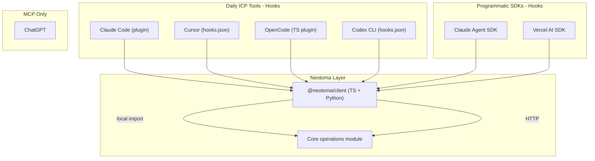

# Revised Neotoma Hooks Integration Plan

## What Changed

The original plan incorrectly categorized CLI/IDE tools (Cursor, Claude Code, Codex) as "closed applications where MCP is the only path." All four primary ICP tools support lifecycle hooks:

- **Claude Code:** 12+ events, plugin marketplace, 4 handler types
- **Cursor:** 14+ events (beta), `.cursor/hooks.json`
- **OpenCode:** 20+ events via TypeScript plugin system, including system prompt injection and compaction control
- **Codex CLI:** `SessionStart`/`Stop` (experimental), `PreToolUse`/`PostToolUse` in active development

Hindsight (8.8K stars) already validates this pattern for Claude Code with a hook-based memory plugin. This shifts hooks from serving ~1/3 of the primary ICP's workflow (building mode) to serving all three operational modes.

## Revised Architecture

## Phase 1: Client Library (foundation for all hooks)

Extract core operations from [`src/server.ts`](src/server.ts) `executeTool` (~line 1714) into an importable module. Build `@neotoma/client` (TypeScript) with HTTP and local transports.

- **`src/core/operations.ts`** — standalone module wrapping store, retrieve, create_relationship, etc.
- **`packages/client/`** — `@neotoma/client` npm package with typed wrappers
- **`packages/client-python/`** — `neotoma-client` pip package (HTTP only)
- Update [`package.json`](package.json) exports to expose core operations

## Phase 2: Claude Code Hook Plugin (highest priority)

Build a Claude Code plugin distributed via `claude plugin marketplace add`. Follows the same pattern Hindsight uses (validated at 8.8K stars).

**Hook mapping:**

| Hook | Neotoma behavior |
|---|---|
| `SessionStart` | Initialize session, retrieve recent entities for context |
| `UserPromptSubmit` | Retrieve relevant entities, inject as `additionalContext` |
| `PostToolUse` | Store tool results as observations with provenance (session_id, tool_name, timestamp) |
| `Stop` | Persist full conversation turn (agent_message entities, PART_OF conversation) |
| `PreCompact` | Observe what will be compacted; ensure critical entities are already persisted |

**Distribution:** `.claude-plugin/` directory structure per Claude Code plugin spec. Shell command handlers calling `@neotoma/client`. Config in `~/.hindsight/claude-code.json` pattern (adapted: `~/.neotoma/claude-code.json`).

**Key file:** `packages/claude-code-plugin/` with `hooks/` directory containing `session_start.py`, `recall.py` (UserPromptSubmit), `retain.py` (Stop), `post_tool_use.py`.

## Phase 3: Cursor Hook Integration

Build a `.cursor/hooks.json` configuration and companion scripts.

**Hook mapping:**

| Hook | Neotoma behavior |
|---|---|
| `sessionStart` | Retrieve recent entities |
| `beforeSubmitPrompt` | Inject Neotoma context into prompt |
| `afterFileEdit` | Store file edit observations with provenance |
| `afterShellExecution` | Store command results as observations |
| `stop` | Persist conversation turn |
| `preCompact` | Observe compaction |

**Distribution:** Installable via npm script or manual `.cursor/hooks.json` + scripts directory. Could also be a Cursor skill.

**Key file:** `packages/cursor-hooks/` with `hooks.json` template and `scripts/` directory.

## Phase 4: OpenCode Plugin

Build a TypeScript plugin for OpenCode's plugin system. OpenCode is the richest hook surface — `experimental.chat.system.transform` for system prompt injection and `experimental.session.compacting` for compaction control.

**Key file:** `packages/opencode-plugin/` with TypeScript plugin exporting hook handlers.

## Phase 5: Codex CLI Hooks (when PreToolUse/PostToolUse land)

Monitor Codex hook engine development. Build `SessionStart`/`Stop` hooks now; add `PreToolUse`/`PostToolUse` when available.

**Key file:** `packages/codex-hooks/` with `hooks.json` template.

## Phase 6: Update Wooders Analysis Report

Update [`docs/private/competitive/wooders_memory_harness_argument_analysis.md`](docs/private/competitive/wooders_memory_harness_argument_analysis.md) with:

- Corrected finding: CLI/IDE tools DO support hooks, contradicting the "closed applications" assumption
- OpenCode's `experimental.session.compacting` and `experimental.chat.system.transform` directly address two of Wooders' "invisible decisions" (compaction and system prompt)
- Claude Code's `PreCompact` hook observes compaction
- Hindsight (8.8K stars) as competitive validation that hook-based memory integration works
- Revised force assessment: Wooders' argument is weaker than initially assessed because hooks ARE giving external tools access to harness-level decisions
- Hindsight as a direct competitor to add to competitive tracking (Neotoma differentiators: deterministic state, cross-tool, field-level provenance vs Hindsight's biomimetic learning-focused memory)

## Phase 7: Programmatic SDK Adapters (lower priority)

Build reference integrations for Claude Agent SDK and optionally Vercel AI SDK. These serve the building mode and secondary ICP (toolchain integrators). Lower priority than the CLI/IDE hooks that serve daily usage.

## What Each Hook Does (Across All Tools)

Consistent behavior regardless of which tool:

- **Context retrieval:** Before each prompt/LLM call, retrieve relevant entities and inject as context
- **Turn persistence:** After each agent step, store the conversation as agent_message entities
- **Observation capture:** After tool use, store results as observations with full provenance (tool_name, session_id, timestamp, source harness)
- **Compaction awareness:** Before compaction, ensure critical state is persisted to Neotoma (survives what the harness destroys)
- **Cross-tool consistency:** Same entities accessible from any tool — the defining value prop over Hindsight and harness-native memory

## Competitive Positioning vs Hindsight

Hindsight validates the hook-based integration pattern but has different architectural properties:

| Property | Hindsight | Neotoma |
|---|---|---|
| Memory model | Biomimetic (world facts, experiences, mental models) | Deterministic (schema-bound entities, append-only observations) |
| Learning | LLM-driven reflection and mental model formation | No inference — stores what is provided, deterministically |
| Cross-tool | Claude Code, OpenClaw, LangGraph (separate integrations, separate banks) | Unified state across all tools via shared entity store |
| Provenance | Not a primary concern | Field-level provenance on every observation |
| Versioning | Not mentioned | Append-only observations, temporal queries |
| State guarantees | Probabilistic (LLM-extracted) | Deterministic (schema-validated, hash-based IDs) |
