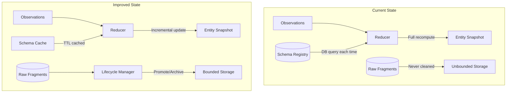
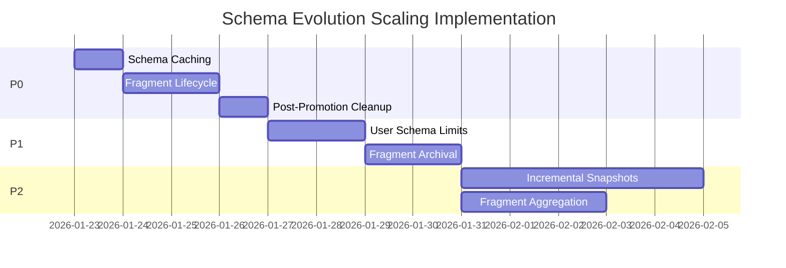

# Schema Evolution Scaling Improvements

## Context

The schema evolution architecture is well-designed but needs operational mechanisms before scaling to thousands of users. This plan addresses three critical areas identified in the assessment:

1. **Reducer Performance** - Snapshot computation costs grow with observation counts
2. **Schema Governance** - User-specific schemas can fragment without limits
3. **Fragment Lifecycle** - `raw_fragments` table grows unbounded

## Architecture Overview



---

## P0: Immediate Improvements (Low Effort, High Impact)

### 1. Schema Registry Caching

**Problem:** Every `computeSnapshot` call queries the database for schema.

**File:** [`src/services/schema_registry.ts`](src/services/schema_registry.ts)

**Implementation:**

- Add in-memory TTL cache (5 minute default)
- Cache key: `{entityType}:{userId || 'global'}`
- Invalidate on `register()`, `activate()`, `deactivate()`, `updateSchemaIncremental()`

**Key code location:**

```typescript
// src/services/schema_registry.ts:loadActiveSchema (around line 200)
// Add cache check before database query
```

### 2. Fragment Lifecycle States

**Problem:** No mechanism to track or clean up fragments after promotion.

**Files:**

- New migration: `supabase/migrations/YYYYMMDD_add_fragment_lifecycle.sql`
- Update: [`src/services/schema_registry.ts`](src/services/schema_registry.ts) - `migrateRawFragmentsToObservations()`

**Schema changes:**

- Add `lifecycle_state` column: `'active' | 'promoted' | 'archived' | 'pending_deletion'`
- Add `promoted_at`, `archived_at`, `expires_at` timestamps
- Add index on `lifecycle_state` for cleanup queries

### 3. Post-Promotion Fragment Cleanup

**Problem:** Promoted fragments stay in table indefinitely.

**File:** [`src/services/schema_registry.ts`](src/services/schema_registry.ts)

**Implementation:**

- After `migrateRawFragmentsToObservations()` succeeds, mark fragments as `promoted`
- Set `expires_at` to 30 days (configurable) for audit trail retention
- Add cleanup function `cleanupExpiredFragments()` to auto-enhancement processor

---

## P1: Near-Term Improvements (Medium Effort)

### 4. User Schema Limits

**Problem:** No governance on user schema creation.

**Files:**

- New migration: `supabase/migrations/YYYYMMDD_add_user_schema_quotas.sql`
- Update: [`src/services/schema_registry.ts`](src/services/schema_registry.ts) - `register()` and `updateSchemaIncremental()`

**Schema changes:**

- New table `user_schema_quotas`: `user_id`, `schema_count`, `max_schemas` (default 10), `total_fields`, `max_fields` (default 200)
- Add check constraint or trigger to enforce limits

**Behavior:**

- Warn when approaching quota (80%)
- Reject new user schemas when at quota
- Provide upgrade path (increase limits) for power users

### 5. Fragment Archival Policy

**Problem:** Stale fragments with low frequency accumulate.

**File:** New service: `src/services/fragment_lifecycle.ts`

**Implementation:**

- Archive fragments with no activity for 90 days and frequency < 3
- Move to `archived` state (don't delete for audit)
- Run as scheduled job alongside auto-enhancement processor

---

## P2: Scaling Improvements (Higher Effort)

### 6. Incremental Snapshot Computation

**Problem:** Full recomputation from all observations on every update.

**Files:**

- Update: [`src/reducers/observation_reducer.ts`](src/reducers/observation_reducer.ts)
- Update: [`src/services/observation_ingestion.ts`](src/services/observation_ingestion.ts)

**Design:**

- Store `last_computed_observation_id` in entity_snapshots
- On new observation: merge into existing snapshot instead of full recompute
- Full recompute only on schema change or explicit refresh

**Tradeoffs:**

- Faster updates but more complex merge logic
- Need fallback to full recompute for conflict resolution

### 7. Fragment Aggregation Table

**Problem:** Schema recommendations query all fragments, expensive at scale.

**Files:**

- New migration: `supabase/migrations/YYYYMMDD_add_fragment_aggregates.sql`
- Update: [`src/services/schema_recommendation.ts`](src/services/schema_recommendation.ts)

**Schema:**

- New table `raw_fragment_aggregates`: `entity_type`, `fragment_key`, `user_id`, `sample_count`, `frequency_total`, `dominant_type`, `type_consistency`, `unique_sources`, `last_seen_at`, `sample_values` (JSONB, 10 samples)
- Trigger on `raw_fragments` insert/update to maintain aggregates
- Update `calculateFieldConfidence()` to use aggregates

### 8. Schema Extension Model

**Problem:** User schemas can completely diverge from global.

**Files:**

- New migration: `supabase/migrations/YYYYMMDD_add_schema_extensions.sql`
- Major update: [`src/services/schema_registry.ts`](src/services/schema_registry.ts)

**Design:**

- New table `user_schema_extensions`: `user_id`, `entity_type`, `base_schema_version`, `additional_fields`, `field_overrides`
- Users extend global schema, cannot remove global fields
- Global migrations automatically cascade to all users

**This is a significant refactor and should be planned separately.**

---

## P3: Future Improvements

### 9. Batch Recomputation Workers

**Problem:** Schema migrations trigger inline snapshot recomputation.

**Design:**

- Background job queue for snapshot recomputation
- Prioritized processing (recent entities first)
- Progress tracking and resumability

### 10. Pattern Promotion Pipeline

**Problem:** Common user patterns not promoted to global.

**Design:**

- Analyze user schemas for common fields (10+ users)
- Create proposals for global schema updates
- Admin approval workflow

---

## Implementation Order



## Testing Strategy

- **Unit tests:** Schema cache invalidation, lifecycle state transitions
- **Integration tests:** Quota enforcement, cleanup job execution
- **Performance tests:** Snapshot computation with 100+ observations
- **Migration tests:** Fragment state transitions, aggregate accuracy

## Rollback Strategy

All changes are additive:

- New columns have defaults
- New tables don't affect existing queries
- Cache is opt-in (graceful degradation if disabled)
- Lifecycle states default to `'active'` (no behavior change until cleanup runs)