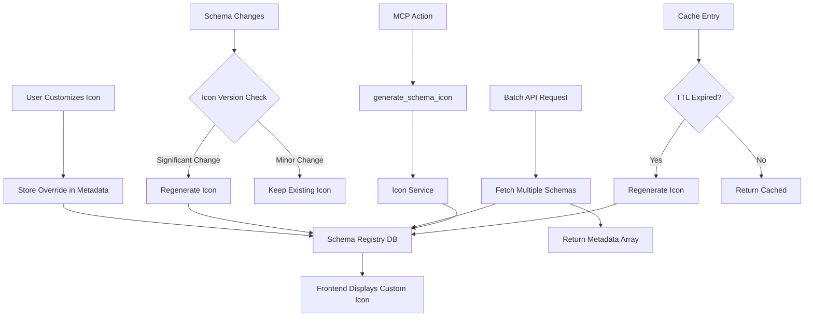

# Schema Icon System Enhancements

## Overview

Enhance the AI-powered schema icon system with optional features for better user control, performance, and maintainability:

1. Icon customization UI (user overrides)
2. Icon versioning (auto-regenerate on schema changes)
3. Batch API endpoint (fetch multiple schema metadata)
4. MCP action for manual icon generation
5. TTL cache expiration (respect configured cache duration)

## Architecture



## Implementation Steps

### 1. Icon Customization UI

**Purpose:** Allow users to override auto-generated icons with custom selections

**Files:**

- `frontend/src/components/SchemaIconPicker.tsx` (new)
- `frontend/src/components/SchemaDetail.tsx` (modify)
- `src/services/schema_registry.ts` (add updateIconMetadata method)
- `src/actions.ts` (add API endpoint)

**Features:**

- Icon picker component with Lucide icon browser
- Upload custom SVG option
- Preview before saving
- User-specific icon overrides stored in schema metadata
- Override indicator in UI

**Database Changes:**

- Store user overrides in `schema_registry.metadata.icon.override`:
  ```json
  {
    "icon": {
      "icon_type": "lucide",
      "icon_name": "FileText",
      "override": {
        "user_id": "uuid",
        "icon_type": "lucide",
        "icon_name": "Receipt",
        "overridden_at": "2026-01-28T..."
      }
    }
  }
  ```

**UI Flow:**

1. User clicks icon in schema detail view
2. Icon picker modal opens
3. Browse Lucide icons or upload SVG
4. Preview selected icon
5. Save override (stores in metadata)
6. Icon updates immediately in UI

**API Endpoint:**

```
PATCH /api/schemas/:entity_type/icon
{
  "icon_type": "lucide" | "svg",
  "icon_name": "IconName" | "custom",
  "icon_svg": "..." (if custom)
}
```

### 2. Icon Versioning

**Purpose:** Automatically regenerate icons when schemas change significantly

**Files:**

- `src/services/schema_icon_service.ts` (add versioning logic)
- `src/services/schema_registry.ts` (hook into schema updates)

**Versioning Strategy:**

- Track schema "fingerprint" (hash of schema definition)
- Compare fingerprint on schema updates
- Regenerate icon if:
  - Schema fields changed significantly (>30% fields added/removed)
  - Entity type description changed
  - Category changed
- Skip regeneration if:
  - Only field descriptions changed
  - Only reducer config changed
  - User has custom override

**Implementation:**

```typescript
interface IconVersion {
  schema_fingerprint: string; // Hash of schema definition
  icon_generated_at: string;
  schema_version: string;
}

// In metadata:
{
  "icon": {
    "icon_type": "lucide",
    "icon_name": "FileText",
    "version": {
      "schema_fingerprint": "abc123...",
      "icon_generated_at": "2026-01-28T...",
      "schema_version": "1.0"
    }
  }
}
```

**Auto-Regeneration Hook:**

- In `schema_registry.updateSchemaIncremental()`:
  - Calculate new schema fingerprint
  - Compare with stored fingerprint
  - If different and no user override → regenerate icon

### 3. Batch API Endpoint

**Purpose:** Fetch metadata for multiple schemas in a single request

**Files:**

- `src/actions.ts` (add batch endpoint)
- `frontend/src/utils/schemaIcons.ts` (update fetchSchemaMetadataBatch)

**API Endpoint:**

```
POST /api/schemas/metadata/batch
{
  "entity_types": ["invoice", "receipt", "task"],
  "include_icons": true
}

Response:
{
  "metadata": {
    "invoice": {
      "label": "Invoice",
      "description": "...",
      "icon": { ... }
    },
    "receipt": { ... },
    "task": { ... }
  }
}
```

**Optimization:**

- Single database query with `IN` clause
- Return only requested fields
- Cache results on frontend

**Frontend Integration:**

- Update `fetchSchemaMetadataBatch()` to use new endpoint
- Reduce API calls when loading sidebar

### 4. MCP Action for Icon Generation

**Purpose:** Allow manual icon regeneration via MCP

**Files:**

- `src/server.ts` (add MCP action handler)
- `docs/specs/MCP_SPEC.md` (document action)

**MCP Action:**

```typescript
{
  name: "generate_schema_icon",
  description: "Generate or regenerate icon for an entity schema",
  inputSchema: {
    type: "object",
    properties: {
      entity_type: { type: "string" },
      force: { type: "boolean", default: false }, // Regenerate even if exists
      user_specific: { type: "boolean", default: false }
    },
    required: ["entity_type"]
  }
}
```

**Response:**

```typescript
{
  success: true,
  entity_type: "invoice",
  icon: {
    icon_type: "lucide",
    icon_name: "FileText",
    confidence: 0.95,
    generated_at: "2026-01-28T..."
  }
}
```

**Use Cases:**

- Manual icon regeneration for testing
- Override auto-generated icons
- Regenerate after schema changes
- Debug icon generation issues

### 5. TTL Cache Expiration

**Purpose:** Implement time-based cache expiration

**Files:**

- `src/services/schema_icon_service.ts` (implement TTL)

**Implementation:**

```typescript
interface CachedIcon {
  metadata: IconMetadata;
  cached_at: number; // Timestamp
}

const iconCache = new Map<string, CachedIcon>();

// Check expiration before returning:
function getCachedIcon(key: string): IconMetadata | null {
  const cached = iconCache.get(key);
  if (!cached) return null;

  const age = Date.now() - cached.cached_at;
  const ttl = config.iconGeneration.cacheTTL * 1000; // Convert to ms

  if (age > ttl) {
    iconCache.delete(key); // Expired
    return null;
  }

  return cached.metadata;
}
```

**Cache Cleanup:**

- Periodic cleanup task (every hour)
- Remove expired entries
- Optional: Background worker for cleanup

## File Structure

```
src/
├── services/
│   ├── schema_icon_service.ts (modify - add TTL, versioning)
│   └── schema_registry.ts (modify - add override support)
├── server.ts (modify - add MCP action)
└── actions.ts (modify - add batch endpoint, icon update endpoint)

frontend/src/
├── components/
│   ├── SchemaIconPicker.tsx (new)
│   └── SchemaDetail.tsx (modify)
└── utils/
    └── schemaIcons.ts (modify - use batch endpoint)
```

## Implementation Priority

### Phase 1: High Value, Low Effort

1. **TTL Cache Expiration** - Simple implementation, improves correctness
2. **Batch API Endpoint** - Performance improvement, straightforward

### Phase 2: User-Facing Features

3. **MCP Action** - Enables manual control, useful for debugging
4. **Icon Customization UI** - High user value, moderate complexity

### Phase 3: Advanced Features

5. **Icon Versioning** - Requires schema fingerprinting, more complex

## Testing Strategy

1. **TTL Cache:**
   - Test cache expiration after TTL
   - Test cache refresh on expiration
   - Verify no memory leaks

2. **Batch API:**
   - Test with multiple entity types
   - Test with missing types
   - Verify performance vs individual calls

3. **MCP Action:**
   - Test icon generation
   - Test force regeneration
   - Test error handling

4. **Icon Customization:**
   - Test Lucide icon selection
   - Test custom SVG upload
   - Test override persistence
   - Test override display priority

5. **Icon Versioning:**
   - Test regeneration on schema changes
   - Test skip when minor changes
   - Test respect user overrides

## Configuration

Add to `src/config.ts`:

```typescript
iconGeneration: {
  // ... existing config
  enableVersioning: process.env.ICON_VERSIONING_ENABLED !== "false",
  versioningThreshold: parseFloat(process.env.ICON_VERSIONING_THRESHOLD || "0.3"), // 30% change
  enableCustomization: process.env.ICON_CUSTOMIZATION_ENABLED !== "false",
}
```

## Database Schema Updates

**Icon Override Structure:**

```sql
-- Already in metadata JSONB, no migration needed
-- Structure:
{
  "icon": {
    "icon_type": "lucide",
    "icon_name": "FileText",
    "override": {
      "user_id": "uuid",
      "icon_type": "lucide",
      "icon_name": "Receipt",
      "overridden_at": "timestamp"
    },
    "version": {
      "schema_fingerprint": "hash",
      "icon_generated_at": "timestamp",
      "schema_version": "1.0"
    }
  }
}
```

## API Endpoints

### 1. Update Icon (Customization)

```
PATCH /api/schemas/:entity_type/icon
Authorization: Bearer <token>
Content-Type: application/json

{
  "icon_type": "lucide",
  "icon_name": "Receipt"
}
```

### 2. Batch Metadata

```
POST /api/schemas/metadata/batch
Authorization: Bearer <token>
Content-Type: application/json

{
  "entity_types": ["invoice", "receipt", "task"],
  "include_icons": true
}
```

## MCP Action Specification

**Action:** `generate_schema_icon`

**Input:**

```json
{
  "entity_type": "invoice",
  "force": false,
  "user_specific": false
}
```

**Output:**

```json
{
  "success": true,
  "entity_type": "invoice",
  "icon": {
    "icon_type": "lucide",
    "icon_name": "FileText",
    "confidence": 0.95,
    "generated_at": "2026-01-28T06:00:00Z"
  }
}
```

**Errors:**

- `SCHEMA_NOT_FOUND` - Entity type doesn't exist
- `ICON_GENERATION_FAILED` - AI generation failed
- `INVALID_ICON_TYPE` - Invalid icon_type provided

## UI Components

### SchemaIconPicker Component

**Props:**

```typescript
interface SchemaIconPickerProps {
  entityType: string;
  currentIcon?: IconMetadata;
  onSelect: (icon: IconMetadata) => void;
  onCancel: () => void;
}
```

**Features:**

- Lucide icon browser (searchable, categorized)
- Custom SVG upload
- Preview pane
- Save/Cancel buttons

**Layout:**

```
┌─────────────────────────────────┐
│  Select Icon for Invoice        │
├─────────────────────────────────┤
│  [Search icons...]              │
│                                 │
│  Categories:                     │
│  [Finance] [Productivity] ...   │
│                                 │
│  Icon Grid:                     │
│  [FileText] [Receipt] [Dollar]  │
│  [CreditCard] [Wallet] ...      │
│                                 │
│  Preview: [Icon Preview]        │
│                                 │
│  [Cancel]  [Save]               │
└─────────────────────────────────┘
```

## Considerations

1. **User Override Priority:**
   - User overrides always take precedence
   - Versioning skips if override exists
   - Override can be cleared to revert to auto-generated

2. **Performance:**
   - Batch endpoint reduces API calls
   - Cache TTL prevents stale icons
   - Versioning only regenerates when needed

3. **Storage:**
   - Overrides stored in metadata JSONB (no new table)
   - User-specific overrides scoped to user_id
   - Global schemas can have user-specific icon overrides

4. **Backward Compatibility:**
   - Existing icons continue to work
   - New fields are optional
   - Graceful fallback if versioning disabled

## Future Enhancements

1. **Icon Library Management:**
   - User-uploaded icon library
   - Shared icon collections
   - Icon marketplace

2. **Icon Analytics:**
   - Track icon usage
   - Most popular icons
   - Icon effectiveness metrics

3. **AI Icon Suggestions:**
   - Suggest alternative icons
   - Icon similarity search
   - Icon style consistency

4. **Bulk Operations:**
   - Regenerate all icons
   - Apply icon to multiple schemas
   - Export/import icon configurations
