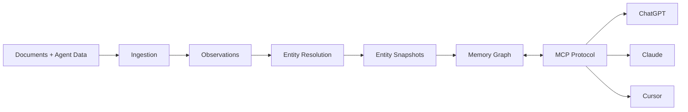

# Neotoma: Truth Layer for Persistent Agent Memory


Neotoma is a **truth layer**: an explicit, inspectable, replayable substrate for personal data that AI agents read and write. When agents act, personal data becomes state. Neotoma treats that state the way production systems do: contract-first, deterministic, immutable, and queryable.

**Why it exists:** The thing that keeps breaking in agentic systems is not intelligence but trust. Memory changes implicitly, context drifts, and you cannot see what changed or replay it. Neotoma provides the missing primitive: user-controlled, inspectable memory with full provenance, so you can trust agents with real, ongoing state.

For the full rationale, see [Building a truth layer for persistent agent memory](https://markmhendrickson.com/posts/truth-layer-agent-memory).

---

## What Neotoma Is

Neotoma is a **Truth Layer**, not an app, agent, or workflow engine. It is the lowest-level canonical source of truth for personal data (documents and agent-created data), exposed to AI tools via Model Context Protocol (MCP).

**In practice:** You upload documents (PDFs, images, receipts, contracts) or share information during agent conversations. You don't have to structure it yourself: agents structure and store it via Neotoma when you provide unstructured or semi-structured content. Neotoma resolves entities across all sources, builds timelines from date fields, and keeps every fact traceable to its source. ChatGPT, Claude, and Cursor can read this memory, write new structured data, correct mistakes, and trigger reinterpretation. One graph connects people, companies, events, and relationships across all your data.

**What it is not:** Not a note-taking app or "second brain." Not provider-controlled ChatGPT Memory or Claude Projects (those are conversation-only and platform-locked; Neotoma is structured personal data memory with entity resolution and timelines, cross-platform via MCP). Not a vector store or RAG layer. Not an autonomous agent. It is the memory layer agents read and write; you control what goes in and what stays.

---

## Three Foundations

Neotoma is built on three architectural choices that provider memory cannot offer:

| Foundation         | What it means                                                                                                                                         |
| ------------------ | ----------------------------------------------------------------------------------------------------------------------------------------------------- |
| **Privacy-first**  | User-controlled memory, end-to-end encryption and row-level security, never used for training. Your data remains yours.                               |
| **Deterministic**  | Same input always produces same output. Schema-first extraction, hash-based entity IDs, full provenance. No hallucinations or probabilistic behavior. |
| **Cross-platform** | Works with ChatGPT, Claude, Cursor, and Claude Code via MCP. One memory system across tools; no platform lock-in. Localhost-agent friendly.           |

**These enable:** Immutable audit trail and time-travel queries, cryptographic integrity, event-sourced history, entity resolution across documents and agent data, timeline generation, dual-path storing (files + agent interactions), and persistent memory without context-window limits.

**System architecture:**



---

## Problems Solved

| Problem                              | How Neotoma addresses it                                                                                      |
| ------------------------------------ | ------------------------------------------------------------------------------------------------------------- |
| Personal data is fragmented          | Dual-path storing from file uploads and agent interactions into one source of truth.                          |
| Provider memory is conversation-only | Structured personal data memory with entity resolution and timelines across documents and agent-created data. |
| No trust when agents act             | Explicit, named operations; visible inputs; reconstructable history. Replay and audit trail.                  |
| No cross-data reasoning              | One graph: sources, entities, events, typed relationships.                                                    |
| Entity fragmentation                 | Hash-based canonical IDs unify "Acme Corp" across all personal data.                                          |
| No temporal reasoning                | Automatic timeline generation from date fields.                                                               |
| Platform lock-in                     | MCP-based access; works with any compatible AI tool.                                                          |

---

## Who It's For

- **AI-native operators** who rely on ChatGPT, Claude, or Cursor and need persistent memory across sessions.
- **Knowledge workers** (researchers, analysts, consultants, legal) who need cross-data reasoning and entity unification across contracts, invoices, and agent-created data.
- **Small teams (2–20)** who want a shared truth layer with row-level security.

**Why Neotoma:** One memory graph across documents and agent-created data; agents remember context without re-explanation; full provenance and audit trail; works with any MCP-compatible tool; privacy-first and user-controlled.

---

## Security Defaults

Neotoma stores personal data and requires secure configuration.

**Authentication:** OAuth 2.0 with PKCE (recommended) for secure, long-lived MCP connections with automatic token refresh. Session tokens are deprecated. See [OAuth implementation](docs/developer/mcp_oauth_implementation.md).

**Authorization:** Row-level security (RLS) enabled on all tables; multi-user support with user isolation. Service role for admin operations only.

**Data protection:** User-controlled data with full export and deletion control; never used for training or provider access. End-to-end encryption planned (v2.0.0). Storage buckets private when using Supabase.

**Verify your setup:** Run `npm run doctor` for environment, database, RLS, and security checks. See [Health check](docs/operations/health_check.md) and [Auth](docs/subsystems/auth.md), [Privacy](docs/subsystems/privacy.md).

---

## Current Status

**Version:** v0.3.0  
**Status:** Completed (reconciliation release establishing current baseline)

**Developer preview:** Planned during dogfooding once core invariants are stable.

**What's implemented:** Sources-first architecture with content-addressed storage, dual-path storing (file uploads + agent interactions), observations architecture, entity resolution with hash-based IDs, schema registry system, auto-enhancement, timeline generation, MCP integration (ChatGPT, Claude, Cursor), full provenance and audit trail, row-level security, React frontend, CLI. See [Release roadmap](#release-roadmap) and [docs/releases/](docs/releases/) for details.

**Next steps:** Review uncommitted changes (262 files), apply pending migrations, audit test suite, plan v0.4.0 realistically based on current baseline.

---

## Release Roadmap

### Completed Releases

- **v0.2.0** – Minimal storing + correction loop (`completed`). [docs/releases/v0.2.0/](docs/releases/v0.2.0/)
- **v0.2.1** – Entity resolution enhancement (`completed`). [docs/releases/v0.2.1/](docs/releases/v0.2.1/)
- **v0.2.2** – Development foundations (`completed`). [docs/releases/v0.2.2/](docs/releases/v0.2.2/)
- **v0.2.15** – Vocabulary alignment + API simplification (`completed`). [docs/releases/v0.2.15/](docs/releases/v0.2.15/)
- **v0.3.0** – Reconciliation release (`completed`). [docs/releases/v0.3.0/](docs/releases/v0.3.0/)

### Future Planning

Future releases will be planned realistically based on the v0.3.0 baseline. Previous aspirational releases (v0.4.0 through v2.1.0) have been archived to [docs/releases/archived/aspirational/](docs/releases/archived/aspirational/) and can be revisited for future planning.

Full release index: [docs/releases/](docs/releases/).

---

## Documentation Index

The **primary entrypoint** for all documentation is the index and navigation guide:

- **[Documentation index and navigation](docs/context/index_rules.mdc)** – Map of the docs system, reading order by change type, dependency graph, and quick-reference answers. Start here when contributing or navigating the repo.

**Foundational (load first):**

- [Core identity](docs/foundation/core_identity.md) – What Neotoma is and is not
- [Philosophy](docs/foundation/philosophy.md) – Principles and invariants
- [Problem statement](docs/foundation/problem_statement.md) – Why Neotoma exists
- [Layered architecture](docs/foundation/layered_architecture.md) – Truth / Strategy / Execution layers

**Specifications and architecture:**

- [MVP overview](docs/specs/MVP_OVERVIEW.md) – Product summary
- [Architecture](docs/architecture/architecture.md) – System design
- [MCP spec](docs/specs/MCP_SPEC.md) – MCP action catalog
- [Schema](docs/subsystems/schema.md) – Database schema and JSONB structures

**Developer:**

- [Getting started](docs/developer/getting_started.md) – Setup, storage backends, first run
- [CLI overview](docs/developer/cli_overview.md) – CLI workflows
- [CLI reference](docs/developer/cli_reference.md) – Commands and scripts
- [MCP overview](docs/developer/mcp_overview.md) – MCP entry points and setup links
- [Development workflow](docs/developer/development_workflow.md) – Git, branches, PRs
- [MCP developer docs](docs/developer/mcp/) – Instructions, tool descriptions, unauthenticated use

**Other categories (see index for full tables):**

- [Specs](docs/specs/) – Requirements, ICP profiles, data models, test plan
- [Subsystems](docs/subsystems/) – Ingestion, observation architecture, reducer, relationships, auth, events, errors, privacy
- [Feature units](docs/feature_units/) – Standards, manifests, execution instructions
- [Testing](docs/testing/) – [Automated test catalog](docs/testing/automated_test_catalog.md), [testing standard](docs/testing/testing_standard.md)
- [Operations](docs/operations/) – [Runbook](docs/operations/runbook.md) (startup, health, shutdown), [Health check](docs/operations/health_check.md) (`npm run doctor`), [Troubleshooting](docs/operations/troubleshooting.md)
- [API](docs/api/rest_api.md), [Error codes](docs/reference/error_codes.md), [Vocabulary](docs/vocabulary/canonical_terms.md)

---

## Development

**Prerequisites:** Node.js v18.x or v20.x (LTS), npm v9+. Supabase only if using the remote storage backend.

```bash
npm install
# Configure .env (see docs/developer/getting_started.md)
# Local storage is default; set NEOTOMA_STORAGE_BACKEND=supabase for remote
npm run migrate   # when using Supabase
npm test
```

**Servers:**

```bash
npm run dev          # MCP server (stdio)
npm run dev:ui       # Frontend
npm run dev:server   # API only (MCP at /mcp)
npm run dev:full     # API + UI + build watch
npm run dev:ws       # WebSocket MCP bridge
```

**CLI:**

```bash
npm run cli        # Run via npm (no global install)
npm run cli:dev    # Dev mode (tsx; picks up source changes)
npm run setup:cli  # Build and link so `neotoma` is available globally
# Or manually: npm run build && npm install -g .  (or npm link)
```

If `neotoma` is not found after global install or link, add npm's global bin to your PATH (e.g. `export PATH="$(npm config get prefix)/bin:$PATH"`). See [Getting started](docs/developer/getting_started.md#cli-setup) for details.

**Testing:** `npm test` | `npm run test:integration` | `npm run test:e2e` | `npm run test:agent-mcp` | `npm run type-check` | `npm run lint`

See [Getting started](docs/developer/getting_started.md) for full setup and storage options.

---

## Using with AI Tools (MCP)

Neotoma exposes memory via MCP. **Auth:** OAuth 2.0 with PKCE (recommended); local mode uses built-in local auth without Supabase. Dev stub: `neotoma auth login --dev-stub`.

**Setup:**

- [Cursor MCP setup](docs/developer/mcp_cursor_setup.md)
- [Claude Code MCP setup](docs/developer/mcp_claude_code_setup.md)
- [ChatGPT Custom GPT setup](docs/developer/mcp_chatgpt_setup.md)
- [OAuth implementation](docs/developer/mcp_oauth_implementation.md)

**Representative actions:** `store`, `reinterpret`, `correct`, `retrieve_entities`, `retrieve_entity_snapshot`, `merge_entities`, `list_observations`, `create_relationship`, `list_relationships`, `list_timeline_events`, `retrieve_graph_neighborhood`, `retrieve_file_url`, schema tools (`analyze_schema_candidates`, `get_schema_recommendations`, `update_schema_incremental`, `register_schema`). Full list: [MCP spec](docs/specs/MCP_SPEC.md).

To use the Neotoma MCP server from another workspace, see [Cursor MCP setup](docs/developer/mcp_cursor_setup.md).

---

## Core Principles

1. **Deterministic** – Same input → same output. Hash-based IDs, no randomness in core components.
2. **Schema-first** – Type-driven extraction and storage, not freeform blobs.
3. **Explainable** – Every field traces to source (document or agent interaction).
4. **Entity-unified** – Canonical IDs across all personal data.
5. **Timeline-aware** – Chronological ordering from date fields.
6. **Cross-platform** – MCP for any compatible AI tool.
7. **Privacy-first** – User-controlled memory, encryption, RLS.
8. **Immutable** – Truth does not change after storage; corrections create new observations.
9. **Provenance** – Full audit trail; event-sourced, replayable history.
10. **Explicit control** – Ingestion only of what you explicitly provide; no background scanning.
11. **Four-layer model** – Source → Observation → Entity → Entity Snapshot.

---

## Contributing

Neotoma is in active development. For questions or collaboration, open an issue or discussion. The work is in the open: [github.com/markmhendrickson/neotoma](https://github.com/markmhendrickson/neotoma). See [CONTRIBUTING.md](CONTRIBUTING.md) and [SECURITY.md](SECURITY.md).

## License

MIT
