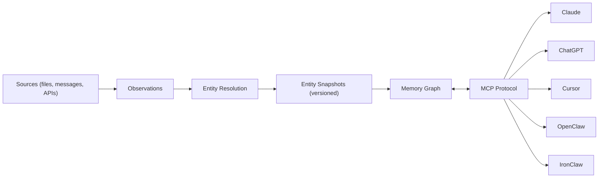

# Neotoma

Your agents forget. Neotoma makes them remember.

Versioned records — contacts, tasks, decisions, finances — that persist across Claude, Cursor, ChatGPT, Windsurf, VS Code, Continue, Letta, OpenClaw, IronClaw, and every agent you run. Open-source. Local-first. Deterministic. MIT licensed.

**[neotoma.io](https://neotoma.io)** · **[Evaluate](https://neotoma.io/evaluate)** · **[Install](https://neotoma.io/install)** · **[Documentation](https://neotoma.io/docs)**

## Why this exists

You run AI agents across tools and sessions. Without a state layer, you become the human sync layer:

- Every session starts from zero — nothing your agent learns carries over
- Facts conflict across tools — two agents store different versions of the same person
- Decisions execute without a reproducible trail — you can't trace why your agent acted
- Corrections don't stick — you fix something in Claude and it's wrong again in Cursor

These are not hypothetical. They happen every day in production agent systems. You compensate by re-prompting context, patching state gaps, and maintaining manual workarounds. Neotoma removes that tax.

## What Neotoma does

Neotoma is a deterministic state layer for AI agents. It stores structured records — contacts, tasks, transactions, decisions, events, contracts — with versioned history and full provenance. Every change creates a new version. Nothing is overwritten. Every state can be replayed from the observation log.

Not retrieval memory (RAG, vector search, semantic lookup). Neotoma enforces deterministic state evolution: same observations always produce the same entity state, regardless of when or in what order they are processed.

The **Inspector** — Neotoma's visual control plane for browsing the entity graph, timeline, schema editor, and agent attribution — is bundled and served at `/inspector` by default when the server starts. No separate build or configuration required. Override with `NEOTOMA_INSPECTOR_DISABLE`, `NEOTOMA_PUBLIC_INSPECTOR_URL`, `NEOTOMA_INSPECTOR_STATIC_DIR`, or `NEOTOMA_INSPECTOR_BASE_PATH` (see `.env.example`).

## Architecture


```mermaid
graph LR
  Sources["Sources (files, messages, APIs)"] --> Obs[Observations]
  Obs --> Entities[Entity Resolution]
  Entities --> Snapshots["Entity Snapshots (versioned)"]
  Snapshots --> Graph[Memory Graph]
  Graph <--> MCP[MCP Protocol]
  MCP --> Claude
  MCP --> ChatGPT
  MCP --> Cursor
  MCP --> OpenClaw
  MCP --> IronClaw
```

- **Deterministic.** Same observations always produce the same versioned entity snapshots. No ordering sensitivity.
- **Immutable.** Append-only observations. Corrections add new data, never erase.
- **Replayable.** Inspect any entity at any point in time. Diff versions. Reconstruct history from the observation log.
- **Structure-first.** Schema-first extraction with deterministic retrieval. Optional similarity search when embeddings are configured.

### Four foundations

| Foundation                  | What it means                                                                                                                                              |
| --------------------------- | ---------------------------------------------------------------------------------------------------------------------------------------------------------- |
| **Privacy-first**           | Your data stays local. Never used for training. Nothing is stored unless you approve it; no background scanning or implicit captures. Full export and deletion control. |
| **Deterministic**           | Same input always produces same output. Schema-first extraction, hash-based entity IDs, full provenance. No silent mutation.                                |
| **Immutable and verifiable** | Append-only observations; history cannot be rewritten. Hash-based entity IDs are tamper-evident. Full provenance chain from any state to its source.       |
| **Cross-platform**          | One memory graph across Claude, ChatGPT, Cursor, Windsurf, VS Code, Continue, Letta, OpenClaw, IronClaw, Codex, and CLI. MCP-based access. No platform lock-in. Works alongside native memory. |

Full compatibility matrix: [Integrations](docs/integrations/matrix.md).

## State guarantees

Most AI memory systems optimize storage or retrieval. Neotoma enforces state integrity. [Full comparison with explanations →](https://neotoma.io/memory-guarantees)

| Property                             | Platform  | Retrieval / RAG | Files      | Database      | Neotoma       |
| ------------------------------------ | --------- | --------------- | ---------- | ------------- | ------------- |
| Deterministic state evolution        | ✗         | ✗               | ✗          | ✗             | ✓             |
| Versioned history                    | ✗         | ✗               | ⚠ manual   | ✗             | ✓             |
| Replayable timeline                  | ✗         | ✗               | ✗          | ✗             | ✓             |
| Auditable change log                 | ✗         | ✗               | ⚠ partial  | ✗             | ✓             |
| Schema constraints                   | ✗         | ✗               | ✗          | ⚠ partial     | ✓             |
| Silent mutation risk                 | ⚠ common  | ⚠ common        | ⚠ common   | ⚠ common      | prevented     |
| Conflicting facts risk               | ⚠ common  | ⚠ common        | ⚠ possible | ⚠ common      | prevented     |
| Reproducible state reconstruction    | ✗         | ✗               | ✗          | ✗             | ✓             |
| Human inspectability (diffs/lineage) | ⚠ partial | ⚠ partial       | ⚠ partial  | ⚠ partial     | ✓             |
| Zero-setup onboarding                | ✓         | ✗               | ✗          | ✗             | ✗             |
| Semantic similarity search           | ✗         | ✓               | ✗          | ✗             | ✓             |
| Direct human editability             | ✗         | ✗               | ✓          | ✗             | ✗             |
| Strong consistency                   | ✗         | ✗               | ✗          | ✓             | ✓             |
| Transactional writes                 | ✗         | ✗               | ✗          | ✓             | ✓             |

**Platform:** Claude, ChatGPT, Gemini, Copilot. **Retrieval:** Mem0, Zep, LangChain Memory. **Files:** Markdown files, JSON stores, CRDT docs. **Database:** SQLite, Postgres, MySQL. **Neotoma:** Deterministic state layer (reference implementation).

## Quick start

### Evaluate first (recommended)

Ask your AI agent whether Neotoma fits your workflow. Paste this into Claude, Cursor, ChatGPT, or any MCP-capable tool:

```
Read https://neotoma.io/evaluate. Use any tool, workspace, and chat context already available in this session to assess my real workflow. Avoid ad-hoc shell introspection just to profile me; if Neotoma is already installed, use `neotoma doctor --json` for status instead. Then tell me whether Neotoma is a real fit for my workflow, what data would be highest value to persist first, and what I should do next.
```

The agent reads the evaluation page, checks your context, and gives you an honest assessment. If it's a fit, the agent carries you through install and activation.

### Agent-driven install

Agents install Neotoma themselves. Paste this prompt into Claude, Cursor, ChatGPT, or Codex:

```
Read https://neotoma.io/install and carry me through the install-first Neotoma flow. Use `neotoma` commands for status and setup. If Neotoma is already installed, start with `neotoma doctor --json`; otherwise install it and run `neotoma setup --tool <my_tool> --yes`. Avoid ad-hoc shell introspection or arbitrary repo scripts. Then activate Neotoma with my data and configure my current tool for robust ongoing use.
```

The agent handles npm install, initialization, and MCP configuration. **Manual install:**

```bash
npm install -g neotoma
neotoma init
neotoma setup --tool <cursor|claude-code|codex> --yes
neotoma mcp config
```

More options: [Docker](docs/developer/docker.md) | [CLI reference](docs/developer/cli_reference.md) | [Getting started](docs/developer/getting_started.md)

## Example

```bash
neotoma store --json='[{"entity_type":"task","title":"Submit expense report","status":"open"}]'
neotoma entities list --type task
neotoma upload ./invoice.pdf
```

Results reflect versioned entity state with full provenance. Agents perform the same operations through MCP tool calls (`store`, `retrieve_entities`, `retrieve_entity_by_identifier`).

## Available skills

Skills are guided workflows that teach your AI agent to import, extract, and persist data into Neotoma memory. They ship with the npm package and are installed by `neotoma setup`.

| Skill | Description |
|-------|-------------|
| **ensure-neotoma** | Install Neotoma, configure MCP, verify connectivity. Prerequisite for all other skills. |
| **remember-email** | Configure email MCP, import emails, extract contacts, tasks, events, transactions. |
| **remember-conversations** | Import ChatGPT/Claude/Slack exports, reconstruct decision timeline. |
| **remember-meetings** | Ingest meeting transcripts, extract decisions and action items. |
| **remember-finances** | Import bank statements, receipts, invoices. Extract structured transactions. |
| **remember-contacts** | Consolidate contacts from email, calendar, chat, vCards, LinkedIn. |
| **remember-calendar** | Configure calendar MCP, import events and commitments. |
| **remember-codebase** | Developer repo integration — inventory, architecture decisions, MCP wiring. |
| **store-data** | Generic: persist any structured data or file with provenance. |
| **query-memory** | Generic: retrieve what your agent knows about anything. |
| **recover-sqlite-database** | Troubleshooting: check integrity and recover corrupted Neotoma database. |

[Full skill documentation →](https://neotoma.io/skills) | [Skill strategy →](docs/skills/skill_strategy.md)

## Interfaces

Three interfaces. One state invariant. Every interface provides the same deterministic behavior regardless of how you access the state layer.

| Interface      | Description                                                                                                                    |
| -------------- | ------------------------------------------------------------------------------------------------------------------------------ |
| **REST API**   | Full HTTP interface for application integration. Entities, relationships, observations, schema, timeline, and version history. |
| **MCP Server** | Model Context Protocol for Claude, ChatGPT, Cursor, Windsurf, VS Code, Continue, Letta, OpenClaw, IronClaw, Codex, and more. Agents store and retrieve state through structured tool calls. |
| **CLI**        | Command-line for scripting and direct access. Inspect entities, replay timelines, and manage state from the terminal.          |

All three map to the same OpenAPI-backed operations. MCP tool calls log the equivalent CLI invocation.

## Who this is for

People building a personal operating system with AI agents across their life — wiring together tools like Claude, Cursor, ChatGPT, Windsurf, VS Code, Letta, OpenClaw, IronClaw, and custom scripts to manage contacts, tasks, finances, code, content, and other domains. The same person operates their agents, builds new pipelines, and debugs state drift. These are three operational modes, not separate personas:

| Mode | What you're doing | The tax you pay without Neotoma | What you get back |
| ---- | ----------------- | ------------------------------- | ----------------- |
| **Operating** | Running AI tools across sessions and contexts | Re-prompting, context re-establishment, manual cross-tool sync | Attention, continuity, trust in your tools |
| **Building** | Shipping agents and pipelines | Prompt workarounds, dedup hacks, memory regression fixes | Product velocity, shipping confidence |
| **Debugging** | Tracing state drift and reproducing failures | Writing glue (checkpoint logic, custom diffing, state serialization) | Debugging speed, platform design time |

**Not for:** Casual note-taking. PKM/Obsidian-style users. Thought-partner usage where the human drives every turn. Platform builders who build state management as their core product. Users who need zero-install onboarding (Neotoma requires npm and CLI today).

## Record types

Neotoma stores typed entities with versioned history and provenance. Each type has a dedicated guide on [neotoma.io](https://neotoma.io):

| Type | What it stores | Examples |
| ---- | -------------- | -------- |
| **[Contacts](https://neotoma.io/types/contacts)** | People, companies, roles, relationships | `contact`, `company`, `account` |
| **[Tasks](https://neotoma.io/types/tasks)** | Obligations, deadlines, habits, goals | `task`, `habit`, `goal` |
| **[Transactions](https://neotoma.io/types/transactions)** | Payments, receipts, invoices, ledger entries | `transaction`, `invoice`, `receipt` |
| **[Contracts](https://neotoma.io/types/contracts)** | Agreements, clauses, amendments | `contract`, `clause`, `amendment` |
| **[Decisions](https://neotoma.io/types/decisions)** | Choices, rationale, audit trails | `decision`, `assessment`, `review` |
| **[Events](https://neotoma.io/types/events)** | Meetings, milestones, outcomes | `event`, `meeting`, `milestone` |

Schema is flexible — store any entity type with whatever fields the message implies. The system infers and evolves schemas automatically.

## Current status

**Version:** v0.9.1 · **Releases:** 26 · **License:** MIT

### What is guaranteed (even in preview)

- **No silent data loss.** Operations either succeed and are recorded or fail with explicit errors.
- **Explicit, inspectable state mutations.** Every change is a named operation with visible inputs. State is reconstructable from the audit trail.
- **Auditable operations.** Full provenance. CLI and MCP map to the same underlying contract.
- **Same contract for CLI and MCP.** Both use the same OpenAPI-backed operations.

### What is not guaranteed yet

- Stable schemas
- Deterministic extraction across versions
- Long-term replay compatibility
- Backward compatibility

Breaking changes should be expected. **Storage:** Local-only (SQLite + local file storage). See [Developer preview storage](docs/developer/developer_preview_storage.md).

## Security defaults

Neotoma stores user data and requires secure configuration.

- **Authentication:** Local auth (dev stub or key-based when encryption is enabled).
- **Authorization:** Local data isolation and explicit operation-level access controls.
- **Data protection:** User-controlled data with full export and deletion control. Never used for training. Optional encryption at rest.
- **Verify your setup:** Run `npm run doctor` for environment, database, and security checks. See [Auth](docs/subsystems/auth.md), [Privacy](docs/subsystems/privacy.md), [Compliance](docs/legal/compliance.md).

## Development

**Servers:**

```bash
npm run dev          # MCP server (stdio)
npm run dev:mcp:dev-shim  # stable stdio shim for MCP source iteration
npm run dev:ui       # Frontend
npm run dev:server   # API only (MCP at /mcp)
npm run dev:full     # API + UI + build watch
```

**CLI:**

```bash
npm run cli        # Run via npm (no global install)
npm run cli:dev    # Dev mode (tsx; picks up source changes)
npm run setup:cli  # Build and link so `neotoma` is available globally
```

**Testing:** `npm test` | `npm run test:integration` | `npm run test:e2e` | `npm run test:agent-mcp` | `npm run type-check` | `npm run lint` · **Source checkout:**

```bash
git clone https://github.com/markmhendrickson/neotoma.git
cd neotoma
npm install
npm test
```

**Prerequisites:** Node.js v18.x or v20.x (LTS), npm v9+. No `.env` required for local storage. See [Getting started](docs/developer/getting_started.md).

## Using with AI tools (MCP)

Neotoma exposes state via MCP. Local storage only in preview. Local built-in auth.

**Full compatibility matrix:** [Integrations](docs/integrations/matrix.md) · [neotoma.io/integrations](https://neotoma.io/integrations)

| Host | Modes | Install | Setup guide |
| --- | --- | --- | --- |
| Cursor | MCP + hooks | `neotoma setup --tool cursor --yes` | [neotoma-with-cursor](https://neotoma.io/neotoma-with-cursor) |
| Claude Code | MCP + hooks | `neotoma setup --tool claude-code --yes` | [neotoma-with-claude-code](https://neotoma.io/neotoma-with-claude-code) |
| Claude Desktop | MCP (local + remote) | `neotoma setup --tool claude-desktop --yes` | [neotoma-with-claude](https://neotoma.io/neotoma-with-claude) |
| Claude Agent SDK | hooks | adapter install | [hooks/claude_agent_sdk.md](docs/integrations/hooks/claude_agent_sdk.md) |
| ChatGPT | MCP App + Custom GPT Actions | Manual HTTPS + OAuth | [neotoma-with-chatgpt](https://neotoma.io/neotoma-with-chatgpt) |
| Codex CLI | MCP + hooks | `neotoma setup --tool codex --yes` | [neotoma-with-codex](https://neotoma.io/neotoma-with-codex) |
| OpenClaw | Native plugin + MCP | `neotoma setup --tool openclaw --yes` | [neotoma-with-openclaw](https://neotoma.io/neotoma-with-openclaw) |
| IronClaw | MCP | `neotoma setup --tool ironclaw --yes` | [neotoma-with-ironclaw](https://neotoma.io/neotoma-with-ironclaw) |
| OpenCode | hooks | plugin install | [hooks/opencode.md](docs/integrations/hooks/opencode.md) |
| Windsurf | MCP | `neotoma setup --tool windsurf --yes` | [neotoma-with-windsurf](https://neotoma.io/neotoma-with-windsurf) |
| Continue | MCP | `neotoma setup --tool continue --yes` | [neotoma-with-continue](https://neotoma.io/neotoma-with-continue) |
| VS Code (Copilot Chat) | MCP | `neotoma setup --tool vscode --yes` | [neotoma-with-vscode](https://neotoma.io/neotoma-with-vscode) |
| Letta | MCP (streamable HTTP, SSE, stdio) | Manual SDK setup | [neotoma-with-letta](https://neotoma.io/neotoma-with-letta) |

Shared client libraries: [`@neotoma/client`](packages/client) (TypeScript), [`neotoma-client`](packages/client-python) (Python). Not yet supported: LangGraph, CrewAI — see [Integrations roadmap](docs/integrations/matrix.md#not-yet-supported-roadmap).

For local source iteration, use the stable dev shim (`scripts/run_neotoma_mcp_stdio_dev_shim.sh`) or signed shim (`scripts/run_neotoma_mcp_signed_stdio_dev_shim.sh`) instead of pointing installed MCP clients at a `tsx watch` stdio process. `neotoma mcp config` defaults to **`b`** for low-friction local stdio setup; use **`a`** for signed + AAuth HTTP `/mcp` proxy entries when the Neotoma API is running, **`c`** for direct stdio, or **`d`** when both MCP entries should target prod.

**Agent behavior contract:** Store first, retrieve before storing, extract entities from user input, create tasks for commitments, and attach bounded host context such as repository name/root scope when available. Full instructions: [MCP instructions](docs/developer/mcp/instructions.md) and [CLI agent instructions](docs/developer/cli_agent_instructions.md).

**Representative actions:** `store`, `retrieve_entities`, `retrieve_entity_snapshot`, `merge_entities`, `list_observations`, `create_relationship`, `list_relationships`, `list_timeline_events`, `retrieve_graph_neighborhood`. Full list: [MCP spec](docs/specs/MCP_SPEC.md).

### Hooks composition

Hooks integrate with harnesses that expose lifecycle events. Hooks and MCP compose: hooks are the reliability floor (guaranteed capture, retrieval injection, compaction awareness, persistence safety net), and MCP remains the quality ceiling (agent-driven structured writes). Per-harness hooks packages: [`claude-code-plugin`](packages/claude-code-plugin), [`cursor-hooks`](packages/cursor-hooks), [`opencode-plugin`](packages/opencode-plugin), [`codex-hooks`](packages/codex-hooks), [`claude-agent-sdk-adapter`](packages/claude-agent-sdk-adapter). Per-harness setup guides in [`docs/integrations/hooks/`](docs/integrations/hooks/).

### OpenClaw native plugin

Neotoma ships as a native OpenClaw plugin with `kind: "memory"`, so it can fill the dedicated memory slot. All 30+ MCP tools are registered as agent tools.

```bash
openclaw plugins install clawhub:neotoma
```

Then assign it to the memory slot in your OpenClaw config:

```json5
{
  plugins: {
    slots: { memory: "neotoma" },
    entries: {
      neotoma: {
        enabled: true,
        config: {
          dataDir: "~/.local/share/neotoma",
          environment: "production"
        }
      }
    }
  }
}
```

Verify installation: `openclaw plugins inspect neotoma` shows `Format: native`, `Kind: memory`, and all registered tool contracts.

## Common questions

**Platform memory (Claude, ChatGPT) is good enough — why add another tool?**
Platform memory stores what one vendor decides to remember, in a format you can't inspect or export. It doesn't version, doesn't detect conflicts, and vanishes if you switch tools. Neotoma gives you structured, cross-tool state you control.

**Can't I just build this with SQLite or a JSON file?**
You can start there — many teams do. But you'll eventually need versioning, conflict detection, schema evolution, and cross-tool sync. That's months of infrastructure work. Neotoma ships those guarantees on day one.

**What's the difference between RAG memory and deterministic memory?**
RAG stores text chunks and retrieves them by similarity. Neotoma stores structured observations and composes entity state with reducers; the same observations always yield the same snapshot. RAG optimizes relevance; deterministic memory optimizes integrity, versioning, and auditability.

**Is this production-ready?**
Neotoma is in developer preview — used daily by real agent workflows. The core guarantees (deterministic state, versioned history, append-only log) are stable. Install in 5 minutes and let your agent evaluate the fit.

More questions: [FAQ](https://neotoma.io/faq)

## Related posts

- [Neotoma developer release](https://markmhendrickson.com/posts/neotoma-developer-release)
- [Your AI remembers your vibe but not your work](https://markmhendrickson.com/posts/your-ai-remembers-your-vibe-but-not-your-work)
- [Building a truth layer for persistent agent memory](https://markmhendrickson.com/posts/truth-layer-agent-memory)
- [Agent memory has a truth problem](https://markmhendrickson.com/posts/agent-memory-truth-problem)
- [Six agentic trends I'm betting on (and how I might be wrong)](https://markmhendrickson.com/posts/six-agentic-trends-betting-on)
- [Why agent memory needs more than RAG](https://markmhendrickson.com/posts/why-agent-memory-needs-more-than-rag)
- [Agent command centers need one source of truth](https://markmhendrickson.com/posts/agent-command-centers-source-of-truth)

## Documentation

Full documentation is organized at [neotoma.io/docs](https://neotoma.io/docs) and in the `docs/` directory.

**Getting started:** [Evaluate](https://neotoma.io/evaluate), [Install](https://neotoma.io/install), [Walkthrough](https://neotoma.io/developer-walkthrough)

**Reference:** [REST API](https://neotoma.io/api), [MCP server](https://neotoma.io/mcp), [CLI](https://neotoma.io/cli), [Memory guarantees](https://neotoma.io/memory-guarantees), [Architecture](https://neotoma.io/architecture), [Terminology](https://neotoma.io/terminology)

**Foundational:** [Core identity](docs/foundation/core_identity.md), [Philosophy](docs/foundation/philosophy.md), [Problem statement](docs/foundation/problem_statement.md)

**Operations:** [Runbook](docs/operations/runbook.md), [Health check](docs/operations/health_check.md) (`npm run doctor`), SQLite salvage (`neotoma storage recover-db`, `npm run recover:db`, `npm run recover:db:prod`), [Troubleshooting](https://neotoma.io/troubleshooting)

## Contributing

Neotoma is in active development. For questions or collaboration, open an issue or discussion. See [CONTRIBUTING.md](CONTRIBUTING.md) and [SECURITY.md](SECURITY.md). **License:** MIT
