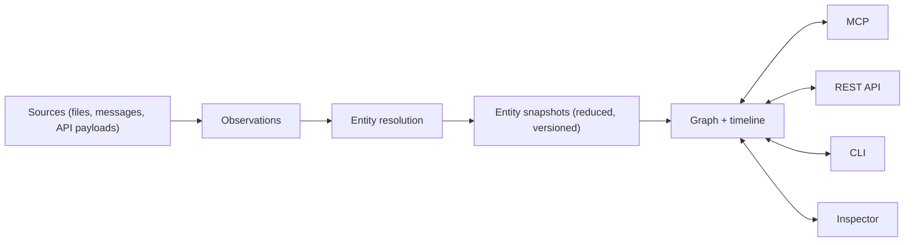

# Neotoma

Neotoma is a deterministic, versioned state layer for AI agents. It ingests sources into immutable observations and computes reproducible entity snapshots with full provenance, exposed over an MCP server, a REST API, a CLI, and a bundled web Inspector.

It is built for developers building and operating AI agents who need a persistent, deterministic, auditable memory layer shared across tools. The same engine serves two further groups: individuals running a personal cross-assistant memory on a single-user install, and operators running a shared, multi-user instance with agent access control. Agents store structured records (contacts, tasks, transactions, decisions, events, and any other type) once and read them back across every tool and session, and the same observations always reduce to the same state.

**[neotoma.io](https://neotoma.io)** · **[Install](https://neotoma.io/install)** · **[Documentation](https://neotoma.io/docs)** (also served in-app at `/docs`)

## What Neotoma is

Neotoma is a state layer, not a chat memory or a vector cache. It records immutable observations from your sources, resolves them into entities, and computes a current snapshot for each entity by reducing its observations in a deterministic order. Nothing is overwritten. Corrections and reinterpretations add new observations; the prior history stays intact and replayable.

Three properties hold across every interface:

- **Deterministic.** Entity IDs, observation IDs, event IDs, and reducer output are all derived from the inputs by hashing. The same observations produce the same snapshot regardless of order or timing. No `Math.random()` or wall-clock values enter the data path.
- **Immutable and auditable.** Sources and observations are append-only. Every field in a snapshot traces back to the observation that set it, and through that observation to its source, interpretation, agent, and timestamp.
- **Self-hosted and portable.** The engine is embedded SQLite plus content-addressed file storage under a directory you control, with optional AES-256-GCM at-rest encryption. Nothing is used for training, and you can export everything. In single-user mode the data stays entirely local; multi-user, peer-sync, and hosted modes are opt-in (see Deployment modes).

## How it works


```mermaid
graph LR
  Sources["Sources (files, messages, API payloads)"] --> Obs[Observations]
  Obs --> Res[Entity resolution]
  Res --> Snap["Entity snapshots (reduced, versioned)"]
  Snap --> Graph["Graph + timeline"]
  Graph <--> MCP[MCP]
  Graph <--> REST[REST API]
  Graph <--> CLI[CLI]
  Graph <--> Inspector[Inspector]
```

1. **Source.** Raw input is stored once, deduplicated by SHA-256 content hash, with a deterministic source ID.
2. **Interpretation.** Structured fields are extracted from the source (directly for structured input, or via an LLM interpretation run whose model, temperature, and prompt are recorded).
3. **Observation.** Each extracted fact becomes an immutable observation with a hash-based ID, linked to its source and interpretation.
4. **Entity resolution.** A deterministic canonical name (driven by the type's schema) maps the observation to an entity, creating it if needed.
5. **Snapshot.** All observations for an entity are reduced into a current snapshot using per-field merge policies, with a stable order (`observed_at DESC, id ASC`) and a field-to-observation provenance map.
6. **Timeline and relationships.** Date fields emit deterministic timeline events; typed relationships connect entities into a graph.

## What you can do with it

Neotoma exposes roughly 60 MCP tools and about 100 REST endpoints, all backed by the same operations. The capability surface includes:

**Ingest and store.** Store structured records or raw files in one call. File ingestion extracts text from PDF (with a first-page image fallback), CSV (with adaptive chunking for large files), Parquet, JSON, and plain text; images and audio are stored as raw sources. Writes are idempotent through an `idempotency_key`.

**Resolve, retrieve, and search.** Look up entities by identifier (name, email, and similar), resolve identity from multiple signals with confidence scoring, list observations, retrieve a field's provenance chain, traverse the relationship graph N hops, and pull a full graph neighborhood. When an embedding key is configured, semantic vector search runs over entity snapshots (stored locally in sqlite-vec); keyword filtering works without it.

**Correct and evolve.** Submit corrections that always win in the snapshot (they are high-priority observations, never edits). Schemas are inferred from your data, recommended from recurring unknown fields, and can be auto-enhanced or updated incrementally with versioning. New entity types work without any code change.

**Relate and sequence.** Create typed relationships (for example `PART_OF`, `DEPENDS_ON`, `REFERS_TO`, `DUPLICATE_OF`), query timeline events across types and date ranges, and view a deterministic, replayable history.

**Manage the entity lifecycle.** Merge duplicates, split an entity by predicate, soft-delete and restore, list potential duplicates, and run GDPR-oriented deletion. Merge and split are transactional and audited.

**Control multi-agent access.** Every write is attributed to an agent identity (verified key thumbprint, JWT subject, or client name). Agent grants express least-privilege capabilities (which operations on which entity types). Optional hardware-attested authentication (Apple Secure Enclave, TPM 2.0, WebAuthn/FIDO2, YubiKey, Windows TBS) raises an agent's trust tier. Guest access tokens grant scoped read-back without full credentials.

**Federate, sync, and intake.** Register peer instances and sync entities between them with configurable scope and conflict resolution (last-write-wins, source priority, or manual). Subscribe to entity or event changes over webhooks (HMAC-signed) or Server-Sent Events. Accept guest entity submissions, mirror GitHub issues into conversation threads, and mirror your data to deterministic, git-trackable canonical Markdown.

**Export and own your data.** Produce a bounded `MEMORY.md` summary, a JSON snapshot export with full provenance and attribution metadata, or a complete Markdown mirror of every entity, relationship, source, and timeline day.

## Interfaces

The same state and the same guarantees are reachable four ways. All map to one OpenAPI-backed contract.

| Interface | What it is | Transports |
| --- | --- | --- |
| **MCP server** | Model Context Protocol tools for agents to store and retrieve state | stdio, WebSocket, streamable HTTP |
| **REST API** | Full HTTP interface for application integration | HTTP/HTTPS, OAuth or key-based auth |
| **CLI** | The `neotoma` command, around 170 commands for setup, scripting, and direct access | local process |
| **Inspector** | Bundled web app for browsing and managing the store | served by the API server |

### The Inspector

The Inspector is a single-page web app bundled into the build and served by the API server (at `/` for browsers, no separate deployment). It is an operator console for the data store, with screens for:

- Entities (browse, detail, correct fields, view history and provenance, per-entity timeline)
- Observations, sources, interpretations, and recent activity
- An interactive knowledge-graph explorer
- Relationships and the global timeline
- Schemas and entity types (browse, register, inspect merge policies)
- Agents, agent grants (create, suspend, revoke, restore), peers, and subscriptions
- Issues, conversations and turns (the agent audit trail), access policies, and compliance
- Search, analytics and usage, settings (including dark mode), a sandbox surface, and an in-app documentation browser at `/docs`

## Install

```bash
npm install -g neotoma
neotoma init
neotoma setup --tool <cursor|claude-code|codex|...> --yes
neotoma mcp config
```

Prerequisites: Node.js 20.x (see `.nvmrc`) and npm 9+. No `.env` is required for local storage. The `neotoma doctor` command checks your environment, database, and security configuration.

The CLI also handles MCP config scanning and sync, harness configuration, lifecycle hook installation, peers and access management, plans, transcript and onboarding import, server and database management, memory export, and the canonical mirror. See the [CLI reference](docs/developer/cli_reference.md).

### Example

```bash
neotoma store --json='[{"entity_type":"task","title":"Submit expense report","status":"open"}]'
neotoma entities list --type task
neotoma upload ./invoice.pdf
```

Agents perform the same operations through MCP tool calls such as `store`, `retrieve_entities`, and `retrieve_entity_by_identifier`. Each MCP call logs its equivalent CLI invocation.

## Connect your tools

Neotoma works across MCP-capable hosts. Most are a single setup command; some compose MCP with lifecycle hooks for guaranteed capture.

| Host | Modes | Install |
| --- | --- | --- |
| Cursor | MCP + hooks | `neotoma setup --tool cursor --yes` |
| Claude Code | MCP + hooks | `neotoma setup --tool claude-code --yes` |
| Claude Desktop | MCP (local + remote) | `neotoma setup --tool claude-desktop --yes` |
| Codex CLI | MCP + hooks | `neotoma setup --tool codex --yes` |
| OpenClaw | Native plugin + MCP | `neotoma setup --tool openclaw --yes` |
| ChatGPT | MCP App + Custom GPT Actions | Manual HTTPS + OAuth |
| Windsurf, Continue, VS Code (Copilot) | MCP | `neotoma setup --tool <host> --yes` |
| OpenCode | hooks | plugin install |

Full matrix: [Integrations](docs/integrations/matrix.md).

**Hooks** are the reliability floor (guaranteed capture, retrieval injection, compaction awareness) and MCP is the quality ceiling (agent-driven structured writes). Per-harness packages live under `packages/`: [`claude-code-plugin`](packages/claude-code-plugin), [`cursor-hooks`](packages/cursor-hooks), [`opencode-plugin`](packages/opencode-plugin), [`codex-hooks`](packages/codex-hooks), [`claude-agent-sdk-adapter`](packages/claude-agent-sdk-adapter).

**Client SDKs:** [`@neotoma/client`](packages/client) (TypeScript) and [`neotoma-client`](packages/client-python) (Python).

**OpenClaw native plugin:** Neotoma ships as a native OpenClaw plugin with `kind: "memory"`, so it can fill the dedicated memory slot with all MCP tools registered as agent tools.

## Skills

Skills are guided workflows that teach an agent to import, extract, and persist data. They ship with the npm package and are installed by `neotoma setup`.

| Skill | Description |
| --- | --- |
| **ensure-neotoma** | Install Neotoma, configure MCP, verify connectivity. Prerequisite for the rest. |
| **remember-email** | Import email, extract contacts, tasks, events, and transactions. |
| **remember-conversations** | Import ChatGPT/Claude/Slack exports, reconstruct a decision timeline. |
| **remember-meetings** | Ingest transcripts, extract decisions and action items. |
| **remember-finances** | Import statements, receipts, and invoices as structured transactions. |
| **remember-contacts** | Consolidate contacts from email, calendar, chat, vCards. |
| **remember-calendar** | Import events and commitments. |
| **remember-codebase** | Repository integration: inventory, decisions, MCP wiring. |
| **store-data** / **query-memory** | Generic persist and retrieve workflows. |
| **recover-sqlite-database** | Check integrity and recover a corrupted database. |

## Record types

Neotoma stores typed entities with versioned history and provenance. The schema is flexible: store any entity type with whatever fields the data implies, and the system infers and evolves the schema.

| Type | Stores | Examples |
| --- | --- | --- |
| **Contacts** | People, companies, roles | `contact`, `company`, `account` |
| **Tasks** | Obligations, deadlines, goals | `task`, `habit`, `goal` |
| **Transactions** | Payments, receipts, invoices | `transaction`, `invoice`, `receipt` |
| **Contracts** | Agreements, clauses, amendments | `contract`, `clause`, `amendment` |
| **Decisions** | Choices, rationale, reviews | `decision`, `assessment`, `review` |
| **Events** | Meetings, milestones, outcomes | `event`, `meeting`, `milestone` |

## Storage, privacy, and security

- **Storage:** Local SQLite (`better-sqlite3`, WAL mode) plus content-addressed file storage, under `NEOTOMA_DATA_DIR`. Separate dev and prod profiles. Semantic search uses sqlite-vec locally.
- **Privacy:** Your data is never used for training, and logs and event payloads carry IDs, not PII. In single-user mode the data stays entirely local; once you enable MCP OAuth, peer sync, or a hosted multi-user instance, data is shared per those configurations rather than staying purely local (see Deployment modes).
- **Encryption:** Optional AES-256-GCM column encryption of sensitive content and metadata, keyed by a key file or BIP-39 mnemonic. Some tables (for example the event log) are not yet column-encrypted; pair with an encrypted volume for full coverage. See [architecture](docs/architecture/architecture.md).
- **Auth:** Local auth for single-user installs, MCP OAuth for hosted use, optional hardware attestation for agents, and explicit per-operation access controls. Run `neotoma doctor` to verify your setup. See [Auth](docs/subsystems/auth.md) and [Privacy](docs/subsystems/privacy.md).

## Deployment modes

The same SQLite-backed engine runs in two modes:

- **Local single-user.** Run it on your machine for your own cross-assistant memory. Local auth (or key-based auth when encryption is enabled), data stays local, no network exposure required.
- **Hosted multi-user.** Run a shared instance with MCP OAuth, per-agent hardware-attested identity (AAuth) and capability grants, guest submission tokens, peer federation, and a sandbox demo user. Deploy targets include Docker and Fly. Tenancy is enforced by `user_id` scoping over the same local SQLite engine.

The "stays local" and privacy claims above apply to the local single-user mode. Hosted, OAuth, and peer-sync modes share data per their configuration.

## Who this is for

Neotoma is primarily for developers building and operating AI agents who need a persistent, deterministic, auditable memory layer shared across tools. The product ships as an MCP server and REST API with drop-in hook packages (Claude Code, Cursor, Codex, OpenCode), a Claude Agent SDK adapter, and TypeScript and Python clients. Its core value (versioned observations, deterministic snapshots, field-level provenance, idempotency, corrections-win) is memory-engine infrastructure for agent loops, not an end-user app.

Two further audiences follow from the same code: individuals running a personal cross-assistant memory (the built-in types are personal-information shaped, and the single-user SQLite plus Inspector path serves one person across assistants), and operators of a shared or hosted instance (OAuth, hardware-attested agent identity, per-agent grants, guest submission, peer federation, and Docker or Fly deploy targets).

It is not aimed at casual note-taking, PKM/Obsidian-style human-driven knowledge bases, or users who need a zero-install hosted product (Neotoma requires npm and the CLI today).

Full profile: [ICP from functionality](docs/icp/icp_from_functionality.md).

## Status

**Version:** v0.17.0 · **License:** MIT · **Storage:** local-only (SQLite + local files).

Neotoma is in developer preview and used daily in real agent workflows. The core guarantees (deterministic state, versioned history, append-only log, full provenance, same contract across CLI and MCP) are stable. Schemas, extraction across versions, long-term replay compatibility, and backward compatibility are not yet guaranteed. Expect breaking changes.

## Development

```bash
git clone https://github.com/markmhendrickson/neotoma.git
cd neotoma
npm install
npm test
```

Common commands:

```bash
npm run dev          # MCP server (stdio)
npm run dev:full     # API + UI + build watch
npm run cli:dev      # CLI in dev mode (tsx)
npm run type-check   # TypeScript
npm run lint         # ESLint
npm test             # unit/contract/security tests
npm run test:integration
npm run test:e2e     # Playwright (Inspector)
```

## Documentation

Documentation is served in-app at `/docs` (browsable in the Inspector), published at [neotoma.io/docs](https://neotoma.io/docs), and stored under `docs/`.

- **Foundations:** [Core identity](docs/foundation/core_identity.md), [Philosophy](docs/foundation/philosophy.md), [Manifest](docs/NEOTOMA_MANIFEST.md)
- **Architecture:** [Architecture](docs/architecture/architecture.md), [Determinism](docs/architecture/determinism.md)
- **Interfaces:** [CLI reference](docs/developer/cli_reference.md), [MCP instructions](docs/developer/mcp/instructions.md), [REST API](docs/api/rest_api.md)
- **Operations:** [Runbook](docs/operations/runbook.md), health check (`neotoma doctor`)

## Contributing

Neotoma is in active development. Open an issue or discussion for questions or collaboration. See [CONTRIBUTING.md](CONTRIBUTING.md) and [SECURITY.md](SECURITY.md). License: MIT.
