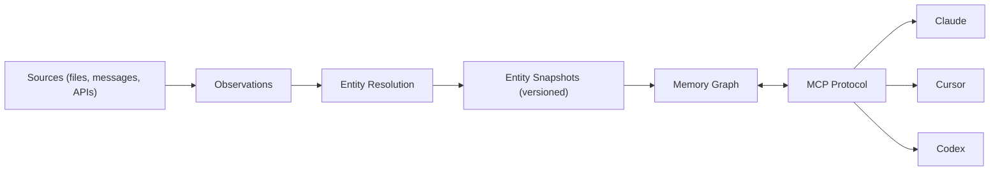

# Neotoma

Deterministic state layer for AI agents. Open-source. Local-first. MIT licensed. For a guided overview, see [neotoma.io](https://neotoma.io).

## Why this exists

Production agents fail because their state has no invariant. Without a state invariant:

- Context drifts across sessions
- Facts conflict across tools
- Decisions execute without a reproducible trail

These are not hypothetical. They happen every day in production agent systems:

- An agent references an outdated contract clause retrieved from a stale embedding.
- Two tools record different versions of the same entity.
- An automated decision cannot be reproduced during debugging.
- Context drifts across sessions and the agent silently changes behavior.

Agent state must obey invariants. Without them, every downstream action inherits the uncertainty of the state it reads.

## The state invariant

Neotoma enforces a deterministic state invariant. State is **versioned**, **schema-bound**, **replayable**, and **auditable**. Every mutation is recorded. Every state change can be inspected or replayed. No silent mutation. No implicit overwrite.

Agents need a deterministic state layer. RAG retrieves documents. Neotoma enforces state evolution. Neotoma treats memory as state evolution, not retrieval. State evolves through a four-stage pipeline. Every stage is versioned with full provenance.

## Architecture


```mermaid
graph LR
  Sources["Sources (files, messages, APIs)"] --> Obs[Observations]
  Obs --> Entities[Entity Resolution]
  Entities --> Snapshots["Entity Snapshots (versioned)"]
  Snapshots --> Graph[Memory Graph]
  Graph <--> MCP[MCP Protocol]
  MCP --> Claude
  MCP --> Cursor
  MCP --> Codex
```

- **Deterministic.** Same observations always produce the same versioned entity snapshots. No ordering sensitivity.
- **Immutable.** Append-only observations. Corrections add new data, never erase.
- **Replayable.** Inspect any entity at any point in time. Diff versions. Reconstruct history from the observation log.
- **Structure-first.** Schema-first extraction with deterministic retrieval. Optional similarity search when embeddings are configured.

### Three foundations

| Foundation         | What it means                                                                                                                           |
| ------------------ | --------------------------------------------------------------------------------------------------------------------------------------- |
| **Privacy-first**  | Your data stays local. Never used for training. User-controlled storage, optional encryption at rest. Full export and deletion control. |
| **Deterministic**  | Same input always produces same output. Schema-first extraction, hash-based entity IDs, full provenance. No silent mutation.            |
| **Cross-platform** | One memory graph across Claude, Cursor, Codex, and CLI. MCP-based access. No platform lock-in. Works alongside native memory.           |

## State guarantees

Most AI memory systems optimize storage or retrieval. Neotoma enforces state integrity.

| Property                             | Platform  | Retrieval / RAG | Files      | Deterministic |
| ------------------------------------ | --------- | --------------- | ---------- | ------------- |
| Deterministic state evolution        | ✗         | ✗               | ✗          | ✓             |
| Versioned history                    | ✗         | ✗               | ⚠ manual   | ✓             |
| Replayable timeline                  | ✗         | ✗               | ✗          | ✓             |
| Auditable change log                 | ✗         | ✗               | ⚠ partial  | ✓             |
| Schema constraints                   | ✗         | ✗               | ✗          | ✓             |
| Silent mutation risk                 | ⚠ common  | ⚠ common        | ⚠ common   | prevented     |
| Conflicting facts risk               | ⚠ common  | ⚠ common        | ⚠ possible | prevented     |
| Reproducible state reconstruction    | ✗         | ✗               | ✗          | ✓             |
| Human inspectability (diffs/lineage) | ⚠ partial | ⚠ partial       | ⚠ partial  | ✓             |
| Zero-setup onboarding                | ✓         | ✗               | ✗          | ✗             |
| Semantic similarity search           | ✗         | ✓               | ✗          | ✓             |
| Direct human editability             | ✗         | ✗               | ✓          | ✗             |

**Platform:** Claude, ChatGPT, Gemini, Copilot. **Retrieval:** Mem0, Zep, LangChain Memory. **Files:** Markdown files, JSON stores, CRDT docs. **Deterministic:** Neotoma (reference implementation).

## Quick start

### Agent-driven install (recommended)

Agents install Neotoma themselves. Paste this prompt into Claude, Codex, or Cursor:

```
Install Neotoma by following these instructions: https://github.com/markmhendrickson/neotoma/blob/main/install.md

Discover candidate data from available context — including any facts this tool already remembers about me — preview it for approval, and save only what I confirm.
```

The agent handles npm install, initialization, and MCP configuration. **Manual install:**

```bash
npm install -g neotoma
neotoma init
neotoma mcp config
```

More options: [Docker](docs/developer/docker.md) | [CLI reference](docs/developer/cli_reference.md) | [Getting started](docs/developer/getting_started.md)

## Example

```bash
neotoma store --json='[{"entity_type":"task","title":"Submit expense report","status":"open"}]'
neotoma entities list --type task
neotoma upload ./invoice.pdf
```

Results reflect versioned entity state with full provenance. Agents perform the same operations through MCP tool calls (`store`, `retrieve_entities`, `retrieve_entity_by_identifier`).

## Interfaces

Three interfaces. One state invariant. Every interface provides the same deterministic behavior regardless of how you access the state layer.

| Interface      | Description                                                                                                                    |
| -------------- | ------------------------------------------------------------------------------------------------------------------------------ |
| **REST API**   | Full HTTP interface for application integration. Entities, relationships, observations, schema, timeline, and version history. |
| **MCP Server** | Model Context Protocol for Claude, Cursor, and Codex. Agents store and retrieve state through structured tool calls.           |
| **CLI**        | Command-line for scripting and direct access. Inspect entities, replay timelines, and manage state from the terminal.          |

All three map to the same OpenAPI-backed operations. MCP tool calls log the equivalent CLI invocation.

## Who this is for

| Who                             | What they need                                                     |
| ------------------------------- | ------------------------------------------------------------------ |
| **AI infrastructure engineers** | State integrity guarantees for agent runtimes and orchestration    |
| **Agent system builders**       | Deterministic state and provenance layer for agents and toolchains |
| **AI-native operators**         | State that follows across every tool and session                   |

Not for casual note-taking. Not for UI-first users expecting reliability guarantees today.

## Current status

**Version:** v0.3.9 · **Releases:** 10 · **License:** MIT

### What is guaranteed (even in preview)

- **No silent data loss.** Operations either succeed and are recorded or fail with explicit errors.
- **Explicit, inspectable state mutations.** Every change is a named operation with visible inputs. State is reconstructable from the audit trail.
- **Auditable operations.** Full provenance. CLI and MCP map to the same underlying contract.
- **Same contract for CLI and MCP.** Both use the same OpenAPI-backed operations.

### What is not guaranteed yet

- Stable schemas
- Deterministic extraction across versions
- Long-term replay compatibility
- Backward compatibility

Breaking changes should be expected. **Storage:** Local-only (SQLite + local file storage). See [Developer preview storage](docs/developer/developer_preview_storage.md).

## Security defaults

Neotoma stores user data and requires secure configuration.

- **Authentication:** Local auth (dev stub or key-based when encryption is enabled).
- **Authorization:** Local data isolation and explicit operation-level access controls.
- **Data protection:** User-controlled data with full export and deletion control. Never used for training. Optional encryption at rest.
- **Verify your setup:** Run `npm run doctor` for environment, database, and security checks. See [Auth](docs/subsystems/auth.md), [Privacy](docs/subsystems/privacy.md), [Compliance](docs/legal/compliance.md).

## Development

**Servers:**

```bash
npm run dev          # MCP server (stdio)
npm run dev:ui       # Frontend
npm run dev:server   # API only (MCP at /mcp)
npm run dev:full     # API + UI + build watch
```

**CLI:**

```bash
npm run cli        # Run via npm (no global install)
npm run cli:dev    # Dev mode (tsx; picks up source changes)
npm run setup:cli  # Build and link so `neotoma` is available globally
```

**Testing:** `npm test` | `npm run test:integration` | `npm run test:e2e` | `npm run test:agent-mcp` | `npm run type-check` | `npm run lint` · **Source checkout:**

```bash
git clone https://github.com/markmhendrickson/neotoma.git
cd neotoma
npm install
npm test
```

**Prerequisites:** Node.js v18.x or v20.x (LTS), npm v9+. No `.env` required for local storage. See [Getting started](docs/developer/getting_started.md).

## Using with AI tools (MCP)

Neotoma exposes state via MCP. Local storage only in preview. Local built-in auth.

**Setup:**

- [Cursor MCP setup](docs/developer/mcp_cursor_setup.md)
- [Claude Code MCP setup](docs/developer/mcp_claude_code_setup.md)
- [ChatGPT Custom GPT setup](docs/developer/mcp_chatgpt_setup.md)

**Agent behavior contract:** Store first, retrieve before storing, extract entities from user input, create tasks for commitments. Full instructions: [MCP instructions](docs/developer/mcp/instructions.md) and [CLI agent instructions](docs/developer/cli_agent_instructions.md).

**Representative actions:** `store`, `retrieve_entities`, `retrieve_entity_snapshot`, `merge_entities`, `list_observations`, `create_relationship`, `list_relationships`, `list_timeline_events`, `retrieve_graph_neighborhood`. Full list: [MCP spec](docs/specs/MCP_SPEC.md).

## Related posts

- [Neotoma developer release](https://markmhendrickson.com/posts/neotoma-developer-release)
- [Your AI remembers your vibe but not your work](https://markmhendrickson.com/posts/your-ai-remembers-your-vibe-but-not-your-work)
- [Building a truth layer for persistent agent memory](https://markmhendrickson.com/posts/truth-layer-agent-memory)
- [Agent memory has a truth problem](https://markmhendrickson.com/posts/agent-memory-truth-problem)
- [Why agent memory needs more than RAG](https://markmhendrickson.com/posts/why-agent-memory-needs-more-than-rag)

## Documentation

Full documentation is organized at [neotoma.io/docs](https://neotoma.io/docs) and in the `docs/` directory.

**Foundational:** [Core identity](docs/foundation/core_identity.md), [Philosophy](docs/foundation/philosophy.md), [Problem statement](docs/foundation/problem_statement.md), [Architecture](docs/architecture/architecture.md)

**Developer:** [Getting started](docs/developer/getting_started.md), [CLI reference](docs/developer/cli_reference.md), [MCP overview](docs/developer/mcp_overview.md), [Development workflow](docs/developer/development_workflow.md)

**Specs:** [MCP spec](docs/specs/MCP_SPEC.md), [Schema](docs/subsystems/schema.md), [REST API](docs/api/rest_api.md), [Terminology](https://neotoma.io/terminology)

**Operations:** [Runbook](docs/operations/runbook.md), [Health check](docs/operations/health_check.md) (`npm run doctor`), [Troubleshooting](docs/operations/troubleshooting.md)

## Contributing

Neotoma is in active development. For questions or collaboration, open an issue or discussion. See [CONTRIBUTING.md](CONTRIBUTING.md) and [SECURITY.md](SECURITY.md). **License:** MIT
