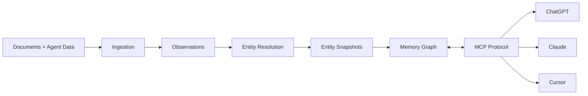

# Neotoma: Truth Layer for Persistent Agent Memory


_Give your agents memory you can inspect, replay, and trust._

For a guided overview, see [neotoma.io](https://neotoma.io).

Agent memory is forgetful. What keeps breaking automation is trust, not intelligence: memory changes implicitly, context drifts, and you cannot see what changed or replay it. When agents act, personal data becomes state. The missing primitive is a layer of explicit, inspectable, replayable state.

[Neotoma](https://neotoma.io) is that layer. Open-source, privacy-protective, and user-controlled. It is contract-first and deterministic (same input, same output), with immutable, queryable state in one graph for documents you upload and data agents write.

It works with Cursor, Claude, Codex, and other MCP-capable tools, with CLI fallback when MCP is unavailable. Install with npm, then configure MCP for your editor or use the CLI directly.

For the full rationale, see [Building a truth layer for persistent agent memory](https://markmhendrickson.com/posts/truth-layer-agent-memory).

---

## What Neotoma Is

Neotoma is a _truth layer_, not an app, agent, or workflow engine. It is the lowest-level canonical source of truth for personal data (documents and agent-created data), exposed to AI tools via Model Context Protocol (MCP).

You upload documents (PDFs, images, receipts, contracts) or share information during agent conversations. You don't have to structure it yourself: agents structure and store it via Neotoma when you provide unstructured or semi-structured content. Neotoma resolves entities across all sources, builds timelines from date fields, and keeps every fact traceable to its source. ChatGPT, Claude, and Cursor can read this memory, write new structured data, correct mistakes, and trigger reinterpretation. One graph connects people, companies, events, and relationships across all your data.

It's not a note-taking app or "second brain." Not provider-controlled ChatGPT Memory or Claude Projects (those are conversation-only and platform-locked; Neotoma is structured personal data memory with entity resolution and timelines, cross-platform via MCP). Not a vector store or RAG layer. Not an autonomous agent. It is the memory layer agents read and write; you control what goes in and what stays.

---

## Three Foundations

Neotoma is built on three architectural choices that provider memory cannot offer:

| Foundation         | What it means                                                                                                                                         |
| ------------------ | ----------------------------------------------------------------------------------------------------------------------------------------------------- |
| **Privacy-first**  | User-controlled memory, end-to-end encryption and row-level security, never used for training. Your data remains yours.                               |
| **Deterministic**  | Same input always produces same output. Schema-first extraction, hash-based entity IDs, full provenance. No hallucinations or probabilistic behavior. |
| **Cross-platform** | Works with ChatGPT, Claude, Cursor, and Claude Code via MCP. One memory system across tools; no platform lock-in. Localhost-agent friendly.           |

**These enable:** Immutable audit trail and time-travel queries, cryptographic integrity, event-sourced history, entity resolution across documents and agent data, timeline generation, dual-path storing (files + agent interactions), and persistent memory without context-window limits.

**System architecture:**


```mermaid
graph LR
  Sources[Documents + Agent Data] --> Ingest[Ingestion]
  Ingest --> Obs[Observations]
  Obs --> Entities[Entity Resolution]
  Entities --> Snapshots[Entity Snapshots]
  Snapshots --> Graph[Memory Graph]
  Graph <--> MCP[MCP Protocol]
  MCP --> ChatGPT
  MCP --> Claude
  MCP --> Cursor
```

---

## Problems Solved

| Problem                              | How Neotoma addresses it                                                                                      |
| ------------------------------------ | ------------------------------------------------------------------------------------------------------------- |
| Personal data is fragmented          | Dual-path storing from file uploads and agent interactions into one source of truth.                          |
| Provider memory is conversation-only | Structured personal data memory with entity resolution and timelines across documents and agent-created data. |
| No trust when agents act             | Explicit, named operations; visible inputs; reconstructable history. Replay and audit trail.                  |
| No cross-data reasoning              | One graph: sources, entities, events, typed relationships.                                                    |
| Entity fragmentation                 | Hash-based canonical IDs unify "Acme Corp" across all personal data.                                          |
| No temporal reasoning                | Automatic timeline generation from date fields.                                                               |
| Platform lock-in                     | MCP-based access; works with any compatible AI tool.                                                          |

---

## Core Terminology

| Term            | Definition                                                                                    |
| --------------- | --------------------------------------------------------------------------------------------- |
| Truth Layer     | Deterministic, immutable structured memory substrate that tools and agents read and write.    |
| Source          | Raw data (file, text, URL, or structured JSON) stored with content-addressed deduplication.   |
| Observation     | Granular fact extracted from a source; reducers merge observations into entity snapshots.     |
| Entity          | Canonical representation of a person, company, task, or other object with a deterministic ID. |
| Entity snapshot | Current truth for an entity computed from all related observations.                           |
| Provenance      | Origin tracking (source, timestamp, operation) so each value is traceable.                    |
| Memory graph    | Graph of sources, observations, entities, events, and typed relationships.                    |

For the full glossary, see [Core terminology](https://neotoma.io/#terminology).

---

## Who It's For

| Who                                   | What they need                                                           | Example data to remember                                                |
| ------------------------------------- | ------------------------------------------------------------------------ | ----------------------------------------------------------------------- |
| AI-native individual operators        | Memory that follows across daily tools and sessions                      | Tasks, preferences, notes, recurring reminders, contacts, deadlines     |
| Knowledge workers with scattered data | Durable context across documents and sessions, with evidence and lineage | Source documents, extracted entities, citations, key quotes, timelines  |
| Builders of agentic systems           | Structured memory agents can read and write with provenance              | Session histories, accumulated facts, decisions, runbooks, tool configs |

**Why Neotoma:** One memory graph across documents and agent-created data; agents remember context without re-explanation; full provenance and audit trail; works with any MCP-compatible tool; privacy-first and user-controlled. The same substrate serves both human-in-the-loop use and agent frameworks or toolchains that need deterministic memory and provenance.

**Suggested GitHub topics:** `ai-agents` `ai-memory` `memory-system` `entity-resolution` `event-sourcing` `truth-layer` `mcp` `provenance` `privacy-first`

---

## Security Defaults

Neotoma stores personal data and requires secure configuration.

**Authentication:** Local auth is the active mode (dev stub or key-based when encryption is enabled). Session tokens are deprecated. See [OAuth implementation](docs/developer/mcp_oauth_implementation.md) for current local flow details.

**Authorization:** Local data isolation and explicit operation-level access controls are enforced in local-only mode.

**Data protection:** User-controlled data with full export and deletion control; never used for training or provider access. Local backend supports optional encryption at rest (key file or mnemonic). End-to-end encryption planned (v2.0.0).

**Verify your setup:** Run `npm run doctor` for environment, database, RLS, and security checks. See [Health check](docs/operations/health_check.md), [Auth](docs/subsystems/auth.md), [Privacy](docs/subsystems/privacy.md), and [Compliance](docs/legal/compliance.md).

---

## Current Status

**Version:** v0.3.0  
**Status:** Completed (reconciliation release establishing current baseline)

**Developer preview:** Planned during dogfooding once core invariants are stable.

**What's implemented:** Sources-first architecture with content-addressed storage, dual-path storing (file uploads + agent interactions), observations architecture, entity resolution with hash-based IDs, schema registry system, auto-enhancement, timeline generation, optional entity semantic search for `retrieve_entities` and `retrieve_entity_by_identifier` (local embeddings), MCP integration (ChatGPT, Claude, Cursor), full provenance and audit trail, React frontend, CLI. See [Release roadmap](#release-roadmap) and [docs/releases/](docs/releases/) for details.

**Next steps:** Review current uncommitted changes, apply pending migrations, audit the test suite, and plan v0.4.0 realistically based on the current baseline.

---

## Developer preview

The developer preview exposes the **core contract only**: CLI for humans, MCP for agents, OpenAPI as the single source of truth. There is no web app in scope for the preview; the frontend in this repo exists for development and future use.

### What is guaranteed (even in preview)

- **No silent data loss** – Operations either succeed and are recorded or fail with explicit errors.
- **Explicit, inspectable state mutations** – Every change is a named operation with visible inputs; state is reconstructable from the audit trail.
- **Auditable operations** – Full provenance; CLI and MCP map to the same underlying contract. If it cannot be expressed via the contract, it is not real.
- **Same contract for CLI and MCP** – Both use the same OpenAPI-backed operations; MCP tool calls log the equivalent CLI invocation (redaction-aware).

### What is not guaranteed yet

- Stable schemas
- Deterministic extraction across versions
- Long-term replay compatibility
- Backward compatibility

Breaking changes should be expected.

### Who this is for

- Developers comfortable with CLI-first workflows
- People building or operating agentic systems
- Anyone who treats personal data like production infrastructure

### Who this is not for (yet)

- UI-first users
- Casual note-taking
- Anyone expecting reliability guarantees today

**Storage:** The developer preview supports **local storage only** (SQLite + local file storage). See [Developer preview storage](docs/developer/developer_preview_storage.md) and [Getting started](docs/developer/getting_started.md) for setup.

---

## Release Roadmap

### Completed Releases

- **v0.2.0** – Minimal ingestion + correction loop (`in_testing`). [docs/releases/v0.2.0/](docs/releases/v0.2.0/)
- **v0.2.1** – Documentation generation system (`in_progress`). [docs/releases/v0.2.1/](docs/releases/v0.2.1/)
- **v0.2.2** – `list_capabilities` MCP action (`planning`). [docs/releases/v0.2.2/](docs/releases/v0.2.2/)
- **v0.2.15** – Complete architecture migration (`implemented`, pending migrations). [docs/releases/v0.2.15/](docs/releases/v0.2.15/)
- **v0.3.0** – Reconciliation release (`completed`). [docs/releases/v0.3.0/](docs/releases/v0.3.0/)

### Future Planning

Future releases will be planned realistically based on the v0.3.0 baseline. Previous aspirational releases (v0.4.0 through v2.2.0) have been archived to [docs/releases/archived/aspirational/](docs/releases/archived/aspirational/) and can be revisited for future planning.

Full release index: [docs/releases/](docs/releases/).

---

## Documentation Index

The **primary entrypoint** for all documentation is the index and navigation guide. All contributors and AI assistants working on the repo should load it first.

- **[Documentation index and navigation](#documentation-index)** – Map of the docs system, reading order by change type, dependency graph, and quick-reference answers. Start here when contributing or navigating the repo.

**Foundational (load first):**

- [Core identity](docs/foundation/core_identity.md) – What Neotoma is and is not
- [Philosophy](docs/foundation/philosophy.md) – Principles and invariants
- [Problem statement](docs/foundation/problem_statement.md) – Why Neotoma exists
- [Layered architecture](docs/foundation/layered_architecture.md) – Truth / Strategy / Execution layers

**Specifications and architecture:**

- [MVP overview](docs/specs/MVP_OVERVIEW.md) – Product summary
- [Architecture](docs/architecture/architecture.md) – System design
- [MCP spec](docs/specs/MCP_SPEC.md) – MCP action catalog
- [Schema](docs/subsystems/schema.md) – Database schema and JSONB structures

**Developer:**

- [Getting started](docs/developer/getting_started.md) – Setup, local-only storage, first run
- [Developer preview storage](docs/developer/developer_preview_storage.md) – Local-only stance for the preview
- [CLI overview](docs/developer/cli_overview.md) – CLI workflows
- [CLI reference](docs/developer/cli_reference.md) – Commands and scripts
- [MCP overview](docs/developer/mcp_overview.md) – MCP entry points and setup links
- [Development workflow](docs/developer/development_workflow.md) – Git, branches, PRs
- [MCP developer docs](docs/developer/mcp/) – Instructions, tool descriptions, unauthenticated use

**Other categories (see index for full tables):**

- [Specs](docs/specs/) – Requirements, ICP profiles, data models, test plan
- [Subsystems](docs/subsystems/) – Ingestion, observation architecture, reducer, relationships, auth, events, errors, privacy
- [Feature units](docs/feature_units/) – Standards, manifests, execution instructions
- [Testing](docs/testing/) – [Automated test catalog](docs/testing/automated_test_catalog.md), [testing standard](docs/testing/testing_standard.md)
- [Operations](docs/operations/) – [Runbook](docs/operations/runbook.md) (startup, health, shutdown), [Health check](docs/operations/health_check.md) (`npm run doctor`), [Troubleshooting](docs/operations/troubleshooting.md)
- [API](docs/api/rest_api.md), [Error codes](docs/reference/error_codes.md), [Vocabulary](docs/vocabulary/canonical_terms.md)

---

## Installation

### Option 1: Install from npm (recommended for users)

```bash
# Global install (recommended for MCP server use)
npm install -g neotoma

# Initialize (creates data directories, database; init can prompt for encryption)
neotoma init

# Start the API server
neotoma api start
```

CLI transport defaults are API-first. Use `--offline` only when you explicitly want in-process local transport:

```bash
# Default (API transport; no implicit local fallback)
neotoma entities list --type task

# Explicit local inline mode (no API server required)
neotoma --offline entities list --type task
```

After installation, configure MCP for your AI tool:

```bash
neotoma mcp config
```

Marketing site: **https://neotoma.io** (GitHub Pages, deployed from **main**; custom domain set in repo Settings → Pages). See [Deployment](docs/infrastructure/deployment.md#marketing-site-neotomaio).

### Option 2: Clone source checkout (for development)

```bash
git clone https://github.com/markmhendrickson/neotoma.git
cd neotoma
npm install
npm test
```

**Prerequisites:** Node.js v18.x or v20.x (LTS), npm v9+. Developer preview uses **local storage only**. For local storage, **no `.env` is required**; the app uses defaults (`./data`, `./data/neotoma.db`, `./data/sources`). Optional overrides: [Getting started](docs/developer/getting_started.md).

### Option 3: Run with Docker

```bash
git clone https://github.com/markmhendrickson/neotoma.git
cd neotoma
docker build -t neotoma .

docker run -d \
  --name neotoma \
  -p 3080:3080 \
  -v neotoma-data:/app/data \
  neotoma

docker exec neotoma neotoma init --yes --data-dir /app/data
```

Connect MCP from Docker:

```json
{
  "mcpServers": {
    "neotoma": {
      "command": "docker",
      "args": ["exec", "-i", "neotoma", "node", "dist/index.js"]
    }
  }
}
```

Use the CLI from Docker:

```bash
docker exec neotoma neotoma store \
  --json='[{"entity_type":"task","title":"Submit expense report","status":"open"}]'

docker exec neotoma neotoma entities list --type task
```

---

## Get started

After installation:

1. Run `neotoma init` and configure your MCP client.
2. In a conversation, tell your assistant: "Remind me to review my subscription Friday."
3. In the same conversation, ask it to list your open tasks.

This gives you a quick end-to-end validation that memory is persisting and retrievable across sessions and tools. For full setup steps, see [Getting started](docs/developer/getting_started.md).

---

## Development

**Servers:**

```bash
npm run dev          # MCP server (stdio)
npm run dev:ui       # Frontend
npm run dev:server   # API only (MCP at /mcp)
npm run dev:full     # API + UI + build watch
npm run dev:ws       # WebSocket MCP bridge
npm run watch:prod:tunnel # Production mode + HTTPS tunnel (local storage, remote access)
```

For `watch:prod:tunnel`, no `.env` is required - server auto-discovers tunnel URL. Tunnel prefers Cloudflare when `cloudflared` is installed; else ngrok. Optional: `NEOTOMA_HOST_URL` (for fixed domain), `NEOTOMA_BEARER_TOKEN`. Full tunnel and env: [Tunnels](docs/developer/tunnels.md), [Getting started – Production with tunnel](docs/developer/getting_started.md#start-development-server).

**CLI:**

```bash
npm run cli        # Run via npm (no global install)
npm run cli:dev    # Dev mode (tsx; picks up source changes)
npm run setup:cli  # Build and link so `neotoma` is available globally
# Or manually: npm run build:server && npm install -g .  (or npm link)
```

If `neotoma` is not found after global install or link, add npm's global bin to your PATH (e.g. `export PATH="$(npm config get prefix)/bin:$PATH"`). See [Getting started](docs/developer/getting_started.md#cli-setup) for details.

Interactive `neotoma` startup is connect-only. It discovers healthy local API instances, applies `--env` as a preference, and prompts when multiple instances are available.

**Testing:** `npm test` | `npm run test:integration` | `npm run test:e2e` | `npm run test:agent-mcp` | `npm run type-check` | `npm run lint`

**IDE instructions:** Neotoma supports both Cursor and Claude Code with project-specific instructions. Instructions in `.cursor/` and `.claude/` are generated from sources in `foundation/` and `docs/`. To sync: `npm run setup:cursor` | `npm run setup:claude` (auto-syncs on commit).

See [Getting started](docs/developer/getting_started.md) for full setup and storage options.

---

## Using with AI Tools (MCP)

Neotoma exposes memory via MCP. **Developer preview:** Local storage only; local auth. **Auth:** local built-in auth with OAuth-style flow support where applicable. Dev stub: `neotoma auth login --dev-stub`.

**Setup:**

- [Cursor MCP setup](docs/developer/mcp_cursor_setup.md)
- [Claude Code MCP setup](docs/developer/mcp_claude_code_setup.md)
- [ChatGPT Custom GPT setup](docs/developer/mcp_chatgpt_setup.md)
- [OAuth implementation](docs/developer/mcp_oauth_implementation.md)

**Representative actions:** `store`, `reinterpret`, `correct`, `retrieve_entities`, `retrieve_entity_snapshot`, `merge_entities`, `list_observations`, `create_relationship`, `list_relationships`, `list_timeline_events`, `retrieve_graph_neighborhood`, `retrieve_file_url`, schema tools (`analyze_schema_candidates`, `get_schema_recommendations`, `update_schema_incremental`, `register_schema`). Full list: [MCP spec](docs/specs/MCP_SPEC.md).

To use the Neotoma MCP server from another workspace, see [Cursor MCP setup](docs/developer/mcp_cursor_setup.md).

---

## Agent Instructions (Behavior Summary)

Neotoma-compatible agents follow a consistent behavior contract across MCP and CLI:

- **Store first:** Persist the conversation turn before responding.
- **Bounded retrieval:** Retrieve likely related entities before storing new ones.
- **Entity extraction:** Extract and store relevant people, tasks, events, places, and relationships from user input.
- **Task creation:** Create tasks when users express intent, obligations, deadlines, or reminders.
- **External data safety:** Store relevant entities from external tool results before responding.

Full instructions: [MCP instructions](docs/developer/mcp/instructions.md) and [CLI agent instructions](docs/developer/cli_agent_instructions.md).

---

## Core Principles

1. **Deterministic** – Same input → same output. Hash-based IDs, no randomness in core components.
2. **Schema-first** – Type-driven extraction and storage, not freeform blobs.
3. **Explainable** – Every field traces to source (document or agent interaction).
4. **Entity-unified** – Canonical IDs across all personal data.
5. **Timeline-aware** – Chronological ordering from date fields.
6. **Cross-platform** – MCP for any compatible AI tool.
7. **Privacy-first** – User-controlled memory, encryption, RLS.
8. **Immutable** – Truth does not change after storage; corrections create new observations.
9. **Provenance** – Full audit trail; event-sourced, replayable history.
10. **Explicit control** – Ingestion only of what you explicitly provide; no background scanning.
11. **Four-layer model** – Source → Observation → Entity → Entity Snapshot.

---

## Local-only storage

Neotoma is intentionally local-only in this active codebase (SQLite + local file storage).
If remote backend support is needed later, recover it from git history.

---

## Related posts

- [Neotoma developer release](https://markmhendrickson.com/posts/neotoma-developer-release)
- [Building a truth layer for persistent agent memory](https://markmhendrickson.com/posts/truth-layer-agent-memory)
- [Agent memory has a truth problem](https://markmhendrickson.com/posts/agent-memory-truth-problem)
- [Why agent memory needs more than RAG](https://markmhendrickson.com/posts/why-agent-memory-needs-more-than-rag)

---

## Contributing

Neotoma is in active development. For questions or collaboration, open an issue or discussion. The work is in the open: [github.com/markmhendrickson/neotoma](https://github.com/markmhendrickson/neotoma). See [CONTRIBUTING.md](CONTRIBUTING.md) and [SECURITY.md](SECURITY.md).

## License

MIT
