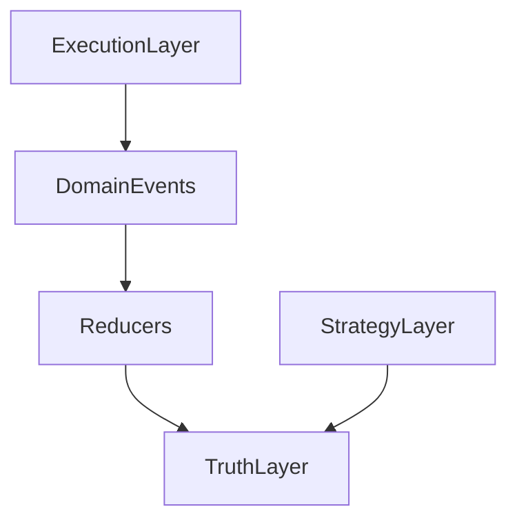

# Neotoma Manifest
## Scope
This manifest defines the canonical architectural principles, product context, and non negotiable invariants for Neotoma. It does not define implementation details, APIs, or feature unit plans.

## Purpose
Provide a single root of truth for Neotoma. All documentation, code, and tests must remain consistent with this manifest.

## Scope
This document covers:
- Truth Layer identity and boundaries
- Determinism and immutability requirements
- Schema first processing constraints
- Entity and timeline doctrine
- Product positioning and target users
It does not cover:
- Implementation details in services or UI
- Release planning and execution schedules
- Feature unit templates or manifests

## Invariants
1. Neotoma is a Truth Layer. It does not implement strategy or execution logic.
2. Determinism is mandatory. The same input must produce the same output.
3. Truth is immutable. Raw text, schema type, and extracted fields do not change after storage.
4. Provenance is required. Every field must trace to a source and rule.
5. Schema first processing is required. Extraction derives from schema definitions.
6. Explicit user control is required. No background ingestion or hidden data collection.
7. Privacy is required. No PII in logs and no hidden access paths.

## Definitions
- **Truth Layer**: The canonical storage and computation layer for structured personal data.
- **Observation**: A source specific fact extracted from a payload or agent submission.
- **Entity**: A canonical representation of a real world object with a deterministic ID.
- **Snapshot**: A deterministic reducer output that represents current truth.
- **Provenance**: Trace data that links fields to source, rule, and timestamp.

## Architecture overview
Neotoma sits below the Strategy and Execution layers.



## 5. Core principles and constraints

### 5.1 Determinism above all
- Same input must yield the same output.
- No random IDs, no nondeterministic ordering, no time based IDs.
- LLM interpretation is auditable but not replay deterministic.

### 5.2 Explicit user control
- Only user provided data is ingested.
- No background scanning or implicit ingestion.

### 5.3 Truth Layer boundaries
- No inference, prediction, or strategy logic in the Truth Layer.
- No execution side effects. All mutations are via explicit actions.

### 5.4 Truth is immutable
- `raw_text`, `schema_type`, and `extracted_fields` do not change after storage.
- Corrections create new observations with higher priority.

### 5.5 Schema first processing
- All extraction flows from schema definitions and rules.
- No freeform or semantic inference for schema assignment.

### 5.6 No synthetic data
- No guessed fields, inferred entities, or hallucinated relationships.

### 5.7 Full provenance
- Every field must trace to a source and rule.

## 12. Data model commitments
Neotoma uses a Source, Observation, Entity, Snapshot model. See `docs/foundation/data_models.md` for details.

### 12.2 Schema expectations
- JSON schema definable
- Versioned and backward compatible
- Deterministic extraction rules
- Additive evolution only

## 14. Ingestion and extraction constraints
- All ingestion is explicit.
- All extraction is rule based.

### 14.4 Multi pattern matching
Schema detection must use two or more patterns per type. See `docs/subsystems/record_types.md`.

## 15. Entity resolution doctrine
- Entity IDs are hash based and deterministic.
- Same canonical name yields the same entity ID.
- Entities are never inferred beyond extracted fields.

## 16. Timeline and events doctrine
- Events derive only from extracted date fields.
- Events use deterministic IDs and stable ordering.
- Events are immutable after creation.

## Product positioning
Neotoma is a deterministic, privacy first, cross platform Truth Layer for AI tools. It is not a note app or a strategy engine. See `docs/foundation/product_positioning.md`.

## Examples
**Deterministic entity ID**
```
ent_{sha256(entity_type + ":" + normalized_name)}
```

**Explicit correction flow**
```
source -> observation(priority=100) -> correction(priority=1000) -> snapshot
```

## Testing requirements
1. Determinism tests for IDs, reducers, and ordering.
2. Idempotency tests for ingestion and corrections.
3. Provenance tests that verify field level traceability.

## Agent Instructions
### When to Load This Document
Load this manifest before any code or documentation work.

### Required Co-Loaded Documents
- `docs/context/index_rules.mdc`
- `docs/foundation/core_identity.md`
- `docs/foundation/philosophy.md`
- `docs/architecture/determinism.md`

### Constraints Agents Must Enforce
1. No strategy or execution logic in the Truth Layer.
2. No nondeterministic logic in core components.
3. No schema mutation after assignment.
4. All outputs trace to provenance.

### Forbidden Patterns
- LLM based field extraction in MVP
- Semantic search in MVP
- Implicit ingestion or hidden data collection

### Validation Checklist
- [ ] Truth Layer boundaries respected
- [ ] No nondeterministic logic introduced
- [ ] Schema first constraints enforced
- [ ] Provenance preserved
