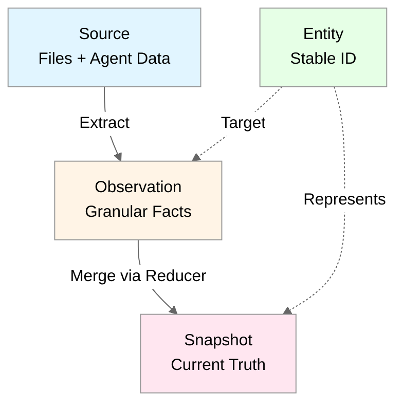
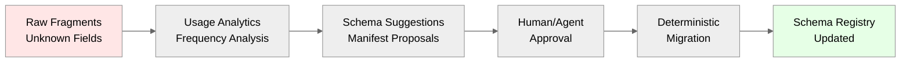

# Neotoma Architectural Decisions

**Authoritative Vocabulary:** [`docs/vocabulary/canonical_terms.md`](../vocabulary/canonical_terms.md)

## Scope

This document covers:
- Core architectural decisions and their rationale
- Three-layer truth model ([Source](../vocabulary/canonical_terms.md#source) → [Entity](../vocabulary/canonical_terms.md#entity) → [Observation](../vocabulary/canonical_terms.md#observation) → [Entity Snapshot](../vocabulary/canonical_terms.md#entity-snapshot))
- Schema evolution and registry patterns
- [Reducer](../vocabulary/canonical_terms.md#reducer)-based merge strategies
- [Relationship](../vocabulary/canonical_terms.md#relationship) modeling approach
- [Provenance](../vocabulary/canonical_terms.md#provenance) and explainability patterns

This document does NOT cover:
- Implementation details (see subsystem docs)
- Specific schema definitions (see `docs/subsystems/schema.md`)
- [Reducer](../vocabulary/canonical_terms.md#reducer) implementation patterns (see `docs/subsystems/reducer.md`)
- [Relationship](../vocabulary/canonical_terms.md#relationship) query patterns (see `docs/subsystems/relationships.md`)

## 1. [Entity](../vocabulary/canonical_terms.md#entity)-Centric Architecture

**Decision:** [Entities](../vocabulary/canonical_terms.md#entity) are the primary unit of truth and UX navigation (invoice, transaction, contract, person, account, trip, property, etc.).

**Rationale:**
- Users and agents interact with [entities](../vocabulary/canonical_terms.md#entity), [relationships](../vocabulary/canonical_terms.md#relationship), and properties—not files
- Files are secondary: treated as immutable _evidence nodes_ rather than first-class entities
- [Entity](../vocabulary/canonical_terms.md#entity)-centric design enables natural navigation and query patterns
- Supports multi-source [entity](../vocabulary/canonical_terms.md#entity) resolution and merging

**Implications:**
- All user-facing APIs expose [entities](../vocabulary/canonical_terms.md#entity) as primary objects
- Files serve as evidence sources linked to [entities](../vocabulary/canonical_terms.md#entity)
- UI navigation centers on [entity](../vocabulary/canonical_terms.md#entity) lists and detail views
- MCP actions operate on [entities](../vocabulary/canonical_terms.md#entity), not files

**Related Documents:**
- `docs/subsystems/entity_resolution.md`
- `docs/foundation/data_models.md`

## 2. Three-Layer Truth Model

**Decision:** Neotoma implements a three-layer truth model:
1. **[Source](../vocabulary/canonical_terms.md#source)** — unified [ingestion](../vocabulary/canonical_terms.md#ingestion) primitive (files + agent data)
2. **[Observation](../vocabulary/canonical_terms.md#observation)** — granular, source-specific facts [extracted](../vocabulary/canonical_terms.md#extraction) from [source](../vocabulary/canonical_terms.md#source)
3. **[Entity](../vocabulary/canonical_terms.md#entity)** — the logical thing in the world with a stable ID
4. **[Entity Snapshot](../vocabulary/canonical_terms.md#entity-snapshot)** — deterministic [reducer](../vocabulary/canonical_terms.md#reducer) output representing current truth

**Rationale:**
- Decouples [ingestion](../vocabulary/canonical_terms.md#ingestion) order from truth
- Enables multiple sources to contribute [observations](../vocabulary/canonical_terms.md#observation) about the same [entity](../vocabulary/canonical_terms.md#entity)
- Supports deterministic merging via [reducers](../vocabulary/canonical_terms.md#reducer)
- Provides full [provenance](../vocabulary/canonical_terms.md#provenance): every [entity snapshot](../vocabulary/canonical_terms.md#entity-snapshot) field traces to specific [observations](../vocabulary/canonical_terms.md#observation) and [source](../vocabulary/canonical_terms.md#source)
- Unifies file uploads and agent submissions into single [ingestion](../vocabulary/canonical_terms.md#ingestion) primitive

**Model Diagram:**


**Implications:**
- [Ingestion](../vocabulary/canonical_terms.md#ingestion) creates [observations](../vocabulary/canonical_terms.md#observation), not direct [entity](../vocabulary/canonical_terms.md#entity) updates
- [Reducers](../vocabulary/canonical_terms.md#reducer) compute [entity snapshots](../vocabulary/canonical_terms.md#entity-snapshot) from [observations](../vocabulary/canonical_terms.md#observation) deterministically
- Multiple [observations](../vocabulary/canonical_terms.md#observation) about same [entity](../vocabulary/canonical_terms.md#entity) can coexist
- [Provenance](../vocabulary/canonical_terms.md#provenance) tracks [observation](../vocabulary/canonical_terms.md#observation) → [source](../vocabulary/canonical_terms.md#source) chain
- File uploads and agent submissions both create [source](../vocabulary/canonical_terms.md#source) (unified [ingestion](../vocabulary/canonical_terms.md#ingestion))

**Related Documents:**
- `docs/subsystems/observation_architecture.md`
- `docs/subsystems/reducer.md`
- `docs/foundation/data_models.md`

## 3. Typed, Deterministic [Entity Schemas](../vocabulary/canonical_terms.md#entity-schema)

**Decision:** Strict [entity schemas](../vocabulary/canonical_terms.md#entity-schema) apply to [source](../vocabulary/canonical_terms.md#source), [entities](../vocabulary/canonical_terms.md#entity), [observations](../vocabulary/canonical_terms.md#observation), and [relationships](../vocabulary/canonical_terms.md#relationship). [Entity schemas](../vocabulary/canonical_terms.md#entity-schema) are typed and versioned; [ingestion](../vocabulary/canonical_terms.md#ingestion) is deterministic.

**Rationale:**
- Ensures deterministic [extraction](../vocabulary/canonical_terms.md#extraction) and processing
- Enables [entity schema](../vocabulary/canonical_terms.md#entity-schema) evolution without breaking existing data
- Supports type-safe operations and validation
- New fields enter through a typed **raw_fragments** overflow bucket, not ad-hoc JSON

**Key Principles:**
- [Observations](../vocabulary/canonical_terms.md#observation) reference `(entity_type, schema_version)` for full replay determinism
- Unknown fields stored in `raw_fragments` with typed envelopes
- Schema registry manages [entity schema](../vocabulary/canonical_terms.md#entity-schema) definitions and versions
- All [extraction](../vocabulary/canonical_terms.md#extraction) follows [entity schema](../vocabulary/canonical_terms.md#entity-schema) rules deterministically

**Implications:**
- No ad-hoc JSON fields in core schemas
- [Entity schema](../vocabulary/canonical_terms.md#entity-schema) versioning enables backward compatibility
- Raw fragments enable schema discovery and promotion
- Deterministic [extraction](../vocabulary/canonical_terms.md#extraction): same [source](../vocabulary/canonical_terms.md#source) + [entity schema](../vocabulary/canonical_terms.md#entity-schema) → same [observations](../vocabulary/canonical_terms.md#observation)

**Related Documents:**
- `docs/subsystems/schema.md`
- `docs/subsystems/schema_registry.md`
- `docs/architecture/determinism.md`

## 4. Open Ontology via Graph [Relationships](../vocabulary/canonical_terms.md#relationship)

**Decision:** System does **not** hard-code hierarchies (no rigid parent–child tables). [Relationships](../vocabulary/canonical_terms.md#relationship) are first-class typed edges with types like `PART_OF`, `CORRECTS`, `REFERS_TO`, `SETTLES`, `DUPLICATE_OF`, etc.

**Rationale:**
- Hierarchies **emerge from edges** rather than schema design
- Enables out-of-order [ingestion](../vocabulary/canonical_terms.md#ingestion), multiple parents, overlapping summaries, corrections
- Supports flexible domain modeling without schema changes
- [Relationships](../vocabulary/canonical_terms.md#relationship) are queryable and traversable

**[Relationship](../vocabulary/canonical_terms.md#relationship) Types:**
- `PART_OF` — hierarchical [relationships](../vocabulary/canonical_terms.md#relationship) (invoice line item part of invoice)
- `CORRECTS` — correction [relationships](../vocabulary/canonical_terms.md#relationship) (corrected invoice corrects original)
- `REFERS_TO` — reference [relationships](../vocabulary/canonical_terms.md#relationship) (invoice refers to contract)
- `SETTLES` — settlement [relationships](../vocabulary/canonical_terms.md#relationship) (payment settles invoice)
- `DUPLICATE_OF` — duplicate detection (duplicate [entity](../vocabulary/canonical_terms.md#entity))
- `DEPENDS_ON` — dependency [relationships](../vocabulary/canonical_terms.md#relationship)
- `SUPERSEDES` — version [relationships](../vocabulary/canonical_terms.md#relationship)

**Implications:**
- No hard-coded parent-child foreign keys
- Graph queries traverse [relationships](../vocabulary/canonical_terms.md#relationship) dynamically
- Multiple [relationship](../vocabulary/canonical_terms.md#relationship) types can exist between same [entities](../vocabulary/canonical_terms.md#entity)
- [Relationships](../vocabulary/canonical_terms.md#relationship) carry metadata and [provenance](../vocabulary/canonical_terms.md#provenance)

**Related Documents:**
- `docs/subsystems/relationships.md`
- `docs/foundation/entity_resolution.md`

## 5. [Reducers](../vocabulary/canonical_terms.md#reducer) as Deterministic Merge Engines

**Decision:** [Reducers](../vocabulary/canonical_terms.md#reducer) compute [entity](../vocabulary/canonical_terms.md#entity) [entity snapshots](../vocabulary/canonical_terms.md#entity-snapshot) from [observations](../vocabulary/canonical_terms.md#observation). Merge policy controlled by `specificity_score`, `source_priority`, `observed_at`, and manual overrides.

**Rationale:**
- [Reducers](../vocabulary/canonical_terms.md#reducer) are pure functions: deterministic given the same inputs + [entity schema](../vocabulary/canonical_terms.md#entity-schema) version
- Enables multiple sources to contribute [observations](../vocabulary/canonical_terms.md#observation)
- Supports conflict resolution via merge policies
- Ensures reproducible truth computation

**Merge Strategies:**
- **Last Write Wins:** Most recent [observation](../vocabulary/canonical_terms.md#observation) wins
- **Highest Priority:** Source priority determines winner
- **Most Specific:** Highest specificity_score wins
- **Merge Array:** Combine values into array

**Merge Policy Configuration:**
```typescript
interface MergePolicy {
  strategy: "last_write" | "highest_priority" | "most_specific" | "merge_array";
  tie_breaker?: "observed_at" | "source_priority";
}
```

**Implications:**
- Same [observations](../vocabulary/canonical_terms.md#observation) + same merge rules → same [entity snapshot](../vocabulary/canonical_terms.md#entity-snapshot) (deterministic)
- Merge policies configured per field in [entity schema](../vocabulary/canonical_terms.md#entity-schema)
- [Reducers](../vocabulary/canonical_terms.md#reducer) recompute [entity snapshots](../vocabulary/canonical_terms.md#entity-snapshot) when new [observations](../vocabulary/canonical_terms.md#observation) arrive
- [Provenance](../vocabulary/canonical_terms.md#provenance) tracks which [observation](../vocabulary/canonical_terms.md#observation) contributed each field

**Related Documents:**
- `docs/subsystems/reducer.md`
- `docs/architecture/determinism.md`
- `docs/subsystems/schema_registry.md`

## 6. Schema Registry for Config-Driven Evolution

**Decision:** Core physical DB schema is stable and minimal. All domain-specific [entity schemas](../vocabulary/canonical_terms.md#entity-schema) live in a versioned **schema_registry**. New [entity](../vocabulary/canonical_terms.md#entity) properties, [observation](../vocabulary/canonical_terms.md#observation) types, merge rules, and [relationship](../vocabulary/canonical_terms.md#relationship) types added **via config**, not code.

**Rationale:**
- Enables runtime [entity schema](../vocabulary/canonical_terms.md#entity-schema) evolution without deployments
- Full type validation maintained
- Migrations (backfills) run deterministically using manifests
- Reduces code changes for [entity schema](../vocabulary/canonical_terms.md#entity-schema) updates

**Schema Registry Structure:**
- [Entity type](../vocabulary/canonical_terms.md#entity-type) definitions
- Field definitions with types and validators
- [Reducer](../vocabulary/canonical_terms.md#reducer) merge policies per field
- [Canonicalization rules](../vocabulary/canonical_terms.md#canonicalization-rules) for deduplication
- [Entity extraction rules](../vocabulary/canonical_terms.md#entity-extraction-rule) for multi-[entity](../vocabulary/canonical_terms.md#entity) [extraction](../vocabulary/canonical_terms.md#extraction)
- [Entity schema](../vocabulary/canonical_terms.md#entity-schema) versioning and migration manifests

**Implications:**
- [Entity schema](../vocabulary/canonical_terms.md#entity-schema) changes don't require code deployments
- New fields can be added via registry updates
- [Entity schema](../vocabulary/canonical_terms.md#entity-schema) versions enable backward compatibility
- Automated schema promotion discovers new fields from raw_fragments

**Related Documents:**
- `docs/subsystems/schema_registry.md`
- `docs/subsystems/schema.md`

## 7. Automated Schema Promotion Pipeline

**Decision:** Unknown fields stored in `raw_fragments` with typed envelopes. Usage analytics identify which unknowns matter. Automated jobs propose [entity schema](../vocabulary/canonical_terms.md#entity-schema) updates as manifests. Human/agent approves; system generates deterministic migrators.

**Rationale:**
- Discovers [entity schema](../vocabulary/canonical_terms.md#entity-schema) patterns from actual usage
- Reduces manual schema design work
- Ensures [entity schemas](../vocabulary/canonical_terms.md#entity-schema) evolve based on real data
- Maintains determinism through manifest-based migrations

**Pipeline Flow:**


**Implications:**
- Raw fragments accumulate until patterns emerge
- Analytics identify high-frequency unknown fields
- Automated suggestions reduce manual [entity schema](../vocabulary/canonical_terms.md#entity-schema) work
- Migrations are deterministic and replayable

**Related Documents:**
- `docs/subsystems/schema_registry.md`
- `docs/architecture/schema_expansion.md`

## 8. UX Anchored on [Entities](../vocabulary/canonical_terms.md#entity) + Insights

**Decision:** Primary UX = [entity](../vocabulary/canonical_terms.md#entity) lists, detail views, graphs of [relationships](../vocabulary/canonical_terms.md#relationship). Evidence panel shows exactly where each [observation](../vocabulary/canonical_terms.md#observation) came from. Insights computed from [reducers](../vocabulary/canonical_terms.md#reducer) at activation.

**Rationale:**
- User's "aha moment" comes from structured understanding, not OCR previews
- [Provenance](../vocabulary/canonical_terms.md#provenance) visibility builds trust
- Insights surface patterns and anomalies
- [Entity](../vocabulary/canonical_terms.md#entity)-centric navigation matches mental model

**UX Components:**
- **[Entity](../vocabulary/canonical_terms.md#entity) Lists:** Filterable, sortable [entity](../vocabulary/canonical_terms.md#entity) views
- **[Entity](../vocabulary/canonical_terms.md#entity) Detail Views:** [Entity Snapshot](../vocabulary/canonical_terms.md#entity-snapshot) with [provenance](../vocabulary/canonical_terms.md#provenance) panel
- **Evidence Panel:** Shows [observation](../vocabulary/canonical_terms.md#observation) → [source](../vocabulary/canonical_terms.md#source) → file chain
- **[Relationship](../vocabulary/canonical_terms.md#relationship) Graphs:** Visualize [entity](../vocabulary/canonical_terms.md#entity) connections
- **Insights:** Unsettled invoices, duplicate transactions, mismatched summaries, spending analysis, subscription detection

**Implications:**
- UI focuses on [entities](../vocabulary/canonical_terms.md#entity), not files
- [Provenance](../vocabulary/canonical_terms.md#provenance) always visible
- Insights computed from [reducer](../vocabulary/canonical_terms.md#reducer) [entity snapshots](../vocabulary/canonical_terms.md#entity-snapshot)
- Evidence panel enables trust and debugging

**Related Documents:**
- `docs/ui/patterns/detail.md`
- `docs/ui/patterns/list.md`
- `docs/subsystems/observation_architecture.md`

## 9. Explainability & [Provenance](../vocabulary/canonical_terms.md#provenance)

**Decision:** Every property in a [entity snapshot](../vocabulary/canonical_terms.md#entity-snapshot) traces back to specific [observations](../vocabulary/canonical_terms.md#observation) and files. Timeline view: how a property changed across [source](../vocabulary/canonical_terms.md#source), corrections, and sources.

**Rationale:**
- Enables trust, auditability, and debugging
- Users can verify truth sources
- Agents can reason about data quality
- Supports compliance and audit requirements

**[Provenance](../vocabulary/canonical_terms.md#provenance) Chain:**
```
Snapshot Field → Observation → Source → File
```

**Timeline View:**
- Shows how [entity](../vocabulary/canonical_terms.md#entity) properties changed over time
- Tracks corrections and updates
- Shows source priority and specificity
- Enables "why did this value change?" queries

**Implications:**
- Every [entity snapshot](../vocabulary/canonical_terms.md#entity-snapshot) field has [provenance](../vocabulary/canonical_terms.md#provenance) metadata
- Timeline queries traverse [observation](../vocabulary/canonical_terms.md#observation) history
- Evidence panel shows full chain
- Debugging uses [provenance](../vocabulary/canonical_terms.md#provenance) to trace issues

**Related Documents:**
- `docs/subsystems/observation_architecture.md`
- `docs/foundation/data_models.md`

## 10. Agent Integration

**Decision:** Agents operate on first-class [entities](../vocabulary/canonical_terms.md#entity) and [relationships](../vocabulary/canonical_terms.md#relationship). Files only used for evidence visualization or [extraction](../vocabulary/canonical_terms.md#extraction) tasks. Agents leverage [reducers](../vocabulary/canonical_terms.md#reducer) and [entity schemas](../vocabulary/canonical_terms.md#entity-schema) for deterministic behavior.

**Rationale:**
- Clean action surface for automation
- Deterministic operations enable reliable agent behavior
- [Entity](../vocabulary/canonical_terms.md#entity)-centric operations match agent mental models
- Files are evidence, not primary objects

**Agent Patterns:**
- Query [entities](../vocabulary/canonical_terms.md#entity) via MCP actions
- Create [relationships](../vocabulary/canonical_terms.md#relationship) between [entities](../vocabulary/canonical_terms.md#entity)
- Access [entity snapshots](../vocabulary/canonical_terms.md#entity-snapshot) with [provenance](../vocabulary/canonical_terms.md#provenance)
- Trigger [reducer](../vocabulary/canonical_terms.md#reducer) recomputation
- Query [relationships](../vocabulary/canonical_terms.md#relationship) graph

**Implications:**
- MCP actions expose [entities](../vocabulary/canonical_terms.md#entity), not files
- Agents work with structured [entity snapshots](../vocabulary/canonical_terms.md#entity-snapshot)
- [Provenance](../vocabulary/canonical_terms.md#provenance) enables agent reasoning
- Deterministic operations ensure reproducibility

**Related Documents:**
- `docs/specs/MCP_SPEC.md`
- `docs/subsystems/observation_architecture.md`

## 11. System Behavior Under Change

**Decision:** [Entity schema](../vocabulary/canonical_terms.md#entity-schema) expansion does not break [ingestion](../vocabulary/canonical_terms.md#ingestion) or [reducers](../vocabulary/canonical_terms.md#reducer). All change is append-only and versioned: new [entity schemas](../vocabulary/canonical_terms.md#entity-schema), new [relationships](../vocabulary/canonical_terms.md#relationship), new merge rules, new parser versions. Rollback supported by switching active [entity schema](../vocabulary/canonical_terms.md#entity-schema) versions, no DDL reversals.

**Rationale:**
- Enables safe [entity schema](../vocabulary/canonical_terms.md#entity-schema) evolution
- No data loss during changes
- Rollback via version switching
- Append-only ensures immutability

**Change Patterns:**
- **[Entity Schema](../vocabulary/canonical_terms.md#entity-schema) Evolution:** New [entity schema](../vocabulary/canonical_terms.md#entity-schema) versions, old data remains valid
- **[Relationship](../vocabulary/canonical_terms.md#relationship) Types:** New types added without breaking existing
- **Merge Rules:** Updated via [entity schema](../vocabulary/canonical_terms.md#entity-schema), applied to new [observations](../vocabulary/canonical_terms.md#observation)
- **Parser Versions:** Tracked per [observation](../vocabulary/canonical_terms.md#observation), enables replay

**Rollback Strategy:**
- Switch active [entity schema](../vocabulary/canonical_terms.md#entity-schema) version in registry
- [Reducers](../vocabulary/canonical_terms.md#reducer) use different version
- No DDL changes required
- Historical data remains accessible

**Implications:**
- All changes are additive
- Versioning enables safe evolution
- Rollback is configuration change, not migration
- Immutability preserved

**Related Documents:**
- `docs/subsystems/schema_registry.md`
- `docs/architecture/consistency.md`

## Resulting Architectural Properties

These 11 decisions produce the following architectural properties:

### Deterministic
Same inputs → same truth. [Reducers](../vocabulary/canonical_terms.md#reducer) are pure functions. [Entity schema](../vocabulary/canonical_terms.md#entity-schema)-based [extraction](../vocabulary/canonical_terms.md#extraction) is reproducible.

### Explainable
Every field is sourced and intelligible. [Provenance](../vocabulary/canonical_terms.md#provenance) chain: [entity snapshot](../vocabulary/canonical_terms.md#entity-snapshot) → [observation](../vocabulary/canonical_terms.md#observation) → [source](../vocabulary/canonical_terms.md#source) → file.

### Extensible
New properties/[relationships](../vocabulary/canonical_terms.md#relationship) added without code. Schema registry enables config-driven evolution.

### Robust
No dependency on [ingestion](../vocabulary/canonical_terms.md#ingestion) ordering or one fixed hierarchy. Multiple sources merge deterministically.

### Agent-Native
[Entities](../vocabulary/canonical_terms.md#entity) form a clean action surface for automation. Deterministic operations enable reliable agent behavior.

### User-Trustable
Transparency through [observations](../vocabulary/canonical_terms.md#observation) + evidence. [Provenance](../vocabulary/canonical_terms.md#provenance) visible in UI. Timeline shows change history.

## Agent Instructions

### When to Load This Document

Load `docs/architecture/architectural_decisions.md` when:
- Making architectural decisions or evaluating design alternatives
- Implementing new subsystems or features
- Reviewing code for architectural compliance
- Understanding the three-layer truth model
- Working with [reducers](../vocabulary/canonical_terms.md#reducer), [observations](../vocabulary/canonical_terms.md#observation), or [entity snapshots](../vocabulary/canonical_terms.md#entity-snapshot)
- Designing [entity schema](../vocabulary/canonical_terms.md#entity-schema) evolution patterns

### Required Co-Loaded Documents
- `docs/foundation/core_identity.md` (Neotoma's core identity)
- `docs/architecture/architecture.md` (canonical platform architecture)
- `docs/vocabulary/canonical_terms.md` (authoritative terminology)
- `docs/subsystems/observation_architecture.md` ([observation](../vocabulary/canonical_terms.md#observation) layer details)
- `docs/subsystems/reducer.md` ([reducer](../vocabulary/canonical_terms.md#reducer) implementation patterns)
- `docs/subsystems/schema_registry.md` ([entity schema](../vocabulary/canonical_terms.md#entity-schema) registry patterns)

### Constraints Agents Must Enforce

1. **[Entity](../vocabulary/canonical_terms.md#entity)-centric design:** All user-facing APIs expose [entities](../vocabulary/canonical_terms.md#entity) as primary objects
2. **Three-layer model:** [Source](../vocabulary/canonical_terms.md#source) → [Entity](../vocabulary/canonical_terms.md#entity) → [Observation](../vocabulary/canonical_terms.md#observation) → [Entity Snapshot](../vocabulary/canonical_terms.md#entity-snapshot) must be respected
3. **Deterministic [reducers](../vocabulary/canonical_terms.md#reducer):** Same [observations](../vocabulary/canonical_terms.md#observation) + merge rules → same [entity snapshot](../vocabulary/canonical_terms.md#entity-snapshot)
4. **Schema registry:** Domain [entity schemas](../vocabulary/canonical_terms.md#entity-schema) live in registry, not code
5. **[Provenance](../vocabulary/canonical_terms.md#provenance) tracking:** Every [entity snapshot](../vocabulary/canonical_terms.md#entity-snapshot) field traces to [observations](../vocabulary/canonical_terms.md#observation) and [source](../vocabulary/canonical_terms.md#source)
6. **[Relationship](../vocabulary/canonical_terms.md#relationship)-first:** No hard-coded hierarchies, [relationships](../vocabulary/canonical_terms.md#relationship) are first-class
7. **Append-only changes:** All [entity schema](../vocabulary/canonical_terms.md#entity-schema) evolution is additive and versioned

### Forbidden Patterns

- **NEVER** use direct file-to-[entity](../vocabulary/canonical_terms.md#entity) updates (must go through [observations](../vocabulary/canonical_terms.md#observation))
- **NEVER** use hard-coded parent-child [relationships](../vocabulary/canonical_terms.md#relationship) (use [relationship](../vocabulary/canonical_terms.md#relationship) types)
- **NEVER** use ad-hoc JSON fields in core schemas (use raw_fragments)
- **NEVER** use non-deterministic [reducers](../vocabulary/canonical_terms.md#reducer) (must be pure functions)
- **NEVER** make [entity schema](../vocabulary/canonical_terms.md#entity-schema) changes without versioning (must use schema registry)
- **NEVER** make breaking changes to existing [entity schemas](../vocabulary/canonical_terms.md#entity-schema) (must be additive)

### Validation Checklist

- [ ] [Entity](../vocabulary/canonical_terms.md#entity)-centric design maintained
- [ ] Three-layer model respected ([Source](../vocabulary/canonical_terms.md#source) → [Observation](../vocabulary/canonical_terms.md#observation) → [Entity](../vocabulary/canonical_terms.md#entity) → [Entity Snapshot](../vocabulary/canonical_terms.md#entity-snapshot))
- [ ] [Reducers](../vocabulary/canonical_terms.md#reducer) are deterministic (same inputs → same outputs)
- [ ] [Entity schemas](../vocabulary/canonical_terms.md#entity-schema) managed via registry, not code
- [ ] [Provenance](../vocabulary/canonical_terms.md#provenance) tracked for all [entity snapshot](../vocabulary/canonical_terms.md#entity-snapshot) fields
- [ ] [Relationships](../vocabulary/canonical_terms.md#relationship) are first-class, not hard-coded
- [ ] [Entity schema](../vocabulary/canonical_terms.md#entity-schema) evolution is append-only and versioned
- [ ] No breaking changes to existing [entity schemas](../vocabulary/canonical_terms.md#entity-schema)

## References

### Related Documents
- `docs/architecture/architecture.md` — Canonical platform architecture
- `docs/architecture/source_material_model.md` — [Source](../vocabulary/canonical_terms.md#source) architecture
- `docs/vocabulary/canonical_terms.md` — Authoritative terminology
- `docs/subsystems/observation_architecture.md` — [Observation](../vocabulary/canonical_terms.md#observation) layer architecture
- `docs/subsystems/reducer.md` — [Reducer](../vocabulary/canonical_terms.md#reducer) engine patterns
- `docs/subsystems/schema_registry.md` — Schema registry patterns
- `docs/subsystems/relationships.md` — [Relationship](../vocabulary/canonical_terms.md#relationship) types and patterns
- `docs/architecture/determinism.md` — Determinism requirements
- `docs/architecture/consistency.md` — Consistency models
- `docs/foundation/data_models.md` — Data model definitions

### Release Documentation
- `docs/releases/v0.1.0/` — Internal MCP Release (foundational architecture)
- `docs/releases/v0.2.0/` — Sources-First [Ingestion](../vocabulary/canonical_terms.md#ingestion) Architecture ([source](../vocabulary/canonical_terms.md#source) storage, [interpretations](../vocabulary/canonical_terms.md#interpretation), [provenance](../vocabulary/canonical_terms.md#provenance))
- `docs/releases/v0.2.15/` — Complete Architecture Migration (unified `ingest`, vocabulary alignment)
- `docs/releases/v2.0.0/` — End-to-End Encryption (local-first E2EE architecture)
- `docs/releases/v2.1.0/` — GDPR & Privacy Compliance

### Architectural Principles
- **Determinism:** Same input → same output, always
- **Immutability:** Truth never changes after storage
- **[Provenance](../vocabulary/canonical_terms.md#provenance):** Every output traces to source
- **[Entity Schema](../vocabulary/canonical_terms.md#entity-schema)-first:** All [extraction](../vocabulary/canonical_terms.md#extraction) derives from [entity schemas](../vocabulary/canonical_terms.md#entity-schema)
- **[Entity](../vocabulary/canonical_terms.md#entity)-centric:** [Entities](../vocabulary/canonical_terms.md#entity) are primary unit of truth
- **[Relationship](../vocabulary/canonical_terms.md#relationship)-first:** Hierarchies emerge from edges
- **Config-driven:** [Entity schema](../vocabulary/canonical_terms.md#entity-schema) evolution via registry, not code
