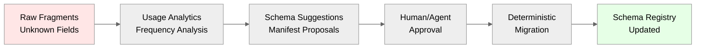

# Neotoma Architectural Decisions

_(Core Architectural Principles and Design Decisions)_

---

## Purpose

This document defines the **11 core architectural decisions** that govern Neotoma's design and implementation. These decisions establish the fundamental patterns, models, and principles that ensure Neotoma functions as a deterministic, explainable, extensible Truth Layer.

These decisions are **canonical** and must be reflected in all implementation, documentation, and architectural discussions.

---

## Scope

This document covers:

- Core architectural decisions and their rationale
- Four-layer truth model (Document → Entity → Observation → Snapshot)
- Schema evolution and registry patterns
- Reducer-based merge strategies
- Relationship modeling approach
- Provenance and explainability patterns

This document does NOT cover:

- Implementation details (see subsystem docs)
- Specific schema definitions (see `docs/subsystems/schema.md`)
- Reducer implementation patterns (see `docs/subsystems/reducer.md`)
- Relationship query patterns (see `docs/subsystems/relationships.md`)

---

## 1. Entity-Centric Architecture

**Decision:** Entities are the primary unit of truth and UX navigation (invoice, transaction, contract, person, account, trip, property, etc.).

**Rationale:**

- Users and agents interact with entities, relationships, and properties—not files
- Files are secondary: treated as immutable _evidence nodes_ rather than first-class records
- Entity-centric design enables natural navigation and query patterns
- Supports multi-source entity resolution and merging

**Implications:**

- All user-facing APIs expose entities as primary objects
- Files serve as evidence sources linked to entities
- UI navigation centers on entity lists and detail views
- MCP actions operate on entities, not files

**Related Documents:**

- `docs/subsystems/entity_resolution.md`
- `docs/foundation/data_models.md`

---

## 2. Three-Layer Truth Model

**Decision:** Neotoma implements a three-layer truth model:

1. **Payload (Document)** — unified ingestion primitive (files + agent data)
2. **Observation** — granular, source-specific facts extracted from payloads
3. **Entity** — the logical thing in the world with a stable ID
4. **Snapshot** — deterministic reducer output representing current truth

**Rationale:**

- Decouples ingestion order from truth
- Enables multiple sources to contribute observations about the same entity
- Supports deterministic merging via reducers
- Provides full provenance: every snapshot field traces to specific observations and payloads
- Unifies file uploads and agent submissions into single ingestion primitive

**Model Diagram:**


**Implications:**

- Ingestion creates observations, not direct entity updates
- Reducers compute snapshots from observations deterministically
- Multiple observations about same entity can coexist
- Provenance tracks observation → payload chain
- File uploads and agent submissions both create payloads (unified ingestion)

**Related Documents:**

- `docs/subsystems/observation_architecture.md`
- `docs/subsystems/reducer.md`
- `docs/foundation/data_models.md`

---

## 3. Typed, Deterministic Schemas

**Decision:** Strict schemas apply to documents, entities, observations, and relationships. Schemas are typed and versioned; ingestion is deterministic.

**Rationale:**

- Ensures deterministic extraction and processing
- Enables schema evolution without breaking existing data
- Supports type-safe operations and validation
- New fields enter through a typed **raw_fragments** overflow bucket, not ad-hoc JSON

**Key Principles:**

- Observations reference `(entity_type, schema_version)` for full replay determinism
- Unknown fields stored in `raw_fragments` with typed envelopes
- Schema registry manages schema definitions and versions
- All extraction follows schema rules deterministically

**Implications:**

- No ad-hoc JSON fields in core schemas
- Schema versioning enables backward compatibility
- Raw fragments enable schema discovery and promotion
- Deterministic extraction: same document + schema → same observations

**Related Documents:**

- `docs/subsystems/schema.md`
- `docs/subsystems/schema_registry.md`
- `docs/architecture/determinism.md`

---

## 4. Open Ontology via Graph Relationships

**Decision:** System does **not** hard-code hierarchies (no rigid parent–child tables). Relationships are first-class records with types like `PART_OF`, `CORRECTS`, `REFERS_TO`, `SETTLES`, `DUPLICATE_OF`, etc.

**Rationale:**

- Hierarchies **emerge from edges** rather than schema design
- Enables out-of-order ingestion, multiple parents, overlapping summaries, corrections
- Supports flexible domain modeling without schema changes
- Relationships are queryable and traversable

**Relationship Types:**

- `PART_OF` — hierarchical relationships (invoice line item part of invoice)
- `CORRECTS` — correction relationships (corrected invoice corrects original)
- `REFERS_TO` — reference relationships (invoice refers to contract)
- `SETTLES` — settlement relationships (payment settles invoice)
- `DUPLICATE_OF` — duplicate detection (duplicate record)
- `DEPENDS_ON` — dependency relationships
- `SUPERSEDES` — version relationships

**Implications:**

- No hard-coded parent-child foreign keys
- Graph queries traverse relationships dynamically
- Multiple relationship types can exist between same entities
- Relationships carry metadata and provenance

**Related Documents:**

- `docs/subsystems/relationships.md`
- `docs/foundation/entity_resolution.md`

---

## 5. Reducers as Deterministic Merge Engines

**Decision:** Reducers compute entity snapshots from observations. Merge policy controlled by `specificity_score`, `source_priority`, `observed_at`, and manual overrides.

**Rationale:**

- Reducers are pure functions: deterministic given the same inputs + schema version
- Enables multiple sources to contribute observations
- Supports conflict resolution via merge policies
- Ensures reproducible truth computation

**Merge Strategies:**

- **Last Write Wins:** Most recent observation wins
- **Highest Priority:** Source priority determines winner
- **Most Specific:** Highest specificity_score wins
- **Merge Array:** Combine values into array

**Merge Policy Configuration:**

```typescript
interface MergePolicy {
  strategy: "last_write" | "highest_priority" | "most_specific" | "merge_array";
  tie_breaker?: "observed_at" | "source_priority";
}
```

**Implications:**

- Same observations + same merge rules → same snapshot (deterministic)
- Merge policies configured per field in schema registry
- Reducers recompute snapshots when new observations arrive
- Provenance tracks which observation contributed each field

**Related Documents:**

- `docs/subsystems/reducer.md`
- `docs/architecture/determinism.md`
- `docs/subsystems/schema_registry.md`

---

## 6. Schema Registry for Config-Driven Evolution

**Decision:** Core physical DB schema is stable and minimal. All domain-specific schema lives in a versioned **schema_registry**. New entity properties, observation types, merge rules, and relationship types added **via config**, not code.

**Rationale:**

- Enables runtime schema evolution without deployments
- Full type validation maintained
- Migrations (backfills) run deterministically using manifests
- Reduces code changes for schema updates

**Schema Registry Structure:**

- Entity type definitions
- Field definitions with types and validators
- Reducer merge policies per field
- Schema versioning and migration manifests

**Implications:**

- Schema changes don't require code deployments
- New fields can be added via registry updates
- Schema versions enable backward compatibility
- Automated schema promotion discovers new fields from raw_fragments

**Related Documents:**

- `docs/subsystems/schema_registry.md`
- `docs/subsystems/schema.md`

---

## 7. Automated Schema Promotion Pipeline

**Decision:** Unknown fields stored in `raw_fragments` with typed envelopes. Usage analytics identify which unknowns matter. Automated jobs propose schema updates as manifests. Human/agent approves; system generates deterministic migrators.

**Rationale:**

- Discovers schema patterns from actual usage
- Reduces manual schema design work
- Ensures schemas evolve based on real data
- Maintains determinism through manifest-based migrations

**Pipeline Flow:**



**Implications:**

- Raw fragments accumulate until patterns emerge
- Analytics identify high-frequency unknown fields
- Automated suggestions reduce manual schema work
- Migrations are deterministic and replayable

**Related Documents:**

- `docs/subsystems/schema_registry.md`
- `docs/architecture/schema_expansion.md`

---

## 8. UX Anchored on Entities + Insights

**Decision:** Primary UX = entity lists, detail views, graphs of relationships. Evidence panel shows exactly where each observation came from. Insights computed from reducers at activation.

**Rationale:**

- User's "aha moment" comes from structured understanding, not OCR previews
- Provenance visibility builds trust
- Insights surface patterns and anomalies
- Entity-centric navigation matches mental model

**UX Components:**

- **Entity Lists:** Filterable, sortable entity views
- **Entity Detail Views:** Snapshot with provenance panel
- **Evidence Panel:** Shows observation → document → file chain
- **Relationship Graphs:** Visualize entity connections
- **Insights:** Unsettled invoices, duplicate transactions, mismatched summaries, spending analysis, subscription detection

**Implications:**

- UI focuses on entities, not files
- Provenance always visible
- Insights computed from reducer snapshots
- Evidence panel enables trust and debugging

**Related Documents:**

- `docs/ui/patterns/detail.md`
- `docs/ui/patterns/list.md`
- `docs/subsystems/observation_architecture.md`

---

## 9. Explainability & Provenance

**Decision:** Every property in a snapshot traces back to specific observations and files. Timeline view: how a property changed across documents, corrections, and sources.

**Rationale:**

- Enables trust, auditability, and debugging
- Users can verify truth sources
- Agents can reason about data quality
- Supports compliance and audit requirements

**Provenance Chain:**

```
Snapshot Field → Observation → Document → File
```

**Timeline View:**

- Shows how entity properties changed over time
- Tracks corrections and updates
- Shows source priority and specificity
- Enables "why did this value change?" queries

**Implications:**

- Every snapshot field has provenance metadata
- Timeline queries traverse observation history
- Evidence panel shows full chain
- Debugging uses provenance to trace issues

**Related Documents:**

- `docs/subsystems/observation_architecture.md`
- `docs/foundation/data_models.md`

---

## 10. Agent Integration

**Decision:** Agents operate on first-class entities and relationships. Files only used for evidence visualization or extraction tasks. Agents leverage reducers and schemas for deterministic behavior.

**Rationale:**

- Clean action surface for automation
- Deterministic operations enable reliable agent behavior
- Entity-centric operations match agent mental models
- Files are evidence, not primary objects

**Agent Patterns:**

- Query entities via MCP actions
- Create relationships between entities
- Access snapshots with provenance
- Trigger reducer recomputation
- Query relationships graph

**Implications:**

- MCP actions expose entities, not files
- Agents work with structured snapshots
- Provenance enables agent reasoning
- Deterministic operations ensure reproducibility

**Related Documents:**

- `docs/specs/MCP_SPEC.md`
- `docs/subsystems/observation_architecture.md`

---

## 11. System Behavior Under Change

**Decision:** Schema expansion does not break ingestion or reducers. All change is append-only and versioned: new schemas, new relationships, new merge rules, new parser versions. Rollback supported by switching active schema versions, no DDL reversals.

**Rationale:**

- Enables safe schema evolution
- No data loss during changes
- Rollback via version switching
- Append-only ensures immutability

**Change Patterns:**

- **Schema Evolution:** New schema versions, old data remains valid
- **Relationship Types:** New types added without breaking existing
- **Merge Rules:** Updated via schema registry, applied to new observations
- **Parser Versions:** Tracked per observation, enables replay

**Rollback Strategy:**

- Switch active schema version in registry
- Reducers use different version
- No DDL changes required
- Historical data remains accessible

**Implications:**

- All changes are additive
- Versioning enables safe evolution
- Rollback is configuration change, not migration
- Immutability preserved

**Related Documents:**

- `docs/subsystems/schema_registry.md`
- `docs/architecture/consistency.md`

---

## Resulting Architectural Properties

These 11 decisions produce the following architectural properties:

### Deterministic

Same inputs → same truth. Reducers are pure functions. Schema-based extraction is reproducible.

### Explainable

Every field is sourced and intelligible. Provenance chain: snapshot → observation → document → file.

### Extensible

New properties/relationships added without code. Schema registry enables config-driven evolution.

### Robust

No dependency on ingestion ordering or one fixed hierarchy. Multiple sources merge deterministically.

### Agent-Native

Entities form a clean action surface for automation. Deterministic operations enable reliable agent behavior.

### User-Trustable

Transparency through observations + evidence. Provenance visible in UI. Timeline shows change history.

---

## Agent Instructions

### When to Load This Document

Load `docs/architecture/architectural_decisions.md` when:

- Making architectural decisions or evaluating design alternatives
- Implementing new subsystems or features
- Reviewing code for architectural compliance
- Understanding the four-layer truth model
- Working with reducers, observations, or snapshots
- Designing schema evolution patterns

### Required Co-Loaded Documents

- `docs/foundation/core_identity.md` (Neotoma's core identity)
- `docs/architecture/architecture.md` (canonical platform architecture)
- `docs/subsystems/observation_architecture.md` (observation layer details)
- `docs/subsystems/reducer.md` (reducer implementation patterns)
- `docs/subsystems/schema_registry.md` (schema registry patterns)

### Constraints Agents Must Enforce

1. **Entity-centric design:** All user-facing APIs expose entities as primary objects
2. **Four-layer model:** Document → Entity → Observation → Snapshot must be respected
3. **Deterministic reducers:** Same observations + merge rules → same snapshot
4. **Schema registry:** Domain schemas live in registry, not code
5. **Provenance tracking:** Every snapshot field traces to observations and documents
6. **Relationship-first:** No hard-coded hierarchies, relationships are first-class
7. **Append-only changes:** All schema evolution is additive and versioned

### Forbidden Patterns

- ❌ Direct file-to-entity updates (must go through observations)
- ❌ Hard-coded parent-child relationships (use relationship types)
- ❌ Ad-hoc JSON fields in core schemas (use raw_fragments)
- ❌ Non-deterministic reducers (must be pure functions)
- ❌ Schema changes without versioning (must use schema registry)
- ❌ Breaking changes to existing schemas (must be additive)

### Validation Checklist

- [ ] Entity-centric design maintained
- [ ] Three-layer model respected (Payload → Observation → Entity → Snapshot)
- [ ] Reducers are deterministic (same inputs → same outputs)
- [ ] Schemas managed via registry, not code
- [ ] Provenance tracked for all snapshot fields
- [ ] Relationships are first-class, not hard-coded
- [ ] Schema evolution is append-only and versioned
- [ ] No breaking changes to existing schemas

---

## References

### Related Documents

- `docs/architecture/architecture.md` — Canonical platform architecture
- `docs/subsystems/observation_architecture.md` — Observation layer architecture
- `docs/subsystems/reducer.md` — Reducer engine patterns
- `docs/subsystems/schema_registry.md` — Schema registry patterns
- `docs/subsystems/relationships.md` — Relationship types and patterns
- `docs/architecture/determinism.md` — Determinism requirements
- `docs/architecture/consistency.md` — Consistency models
- `docs/foundation/data_models.md` — Data model definitions

### Architectural Principles

- **Determinism:** Same input → same output, always
- **Immutability:** Truth never changes after storage
- **Provenance:** Every output traces to source
- **Schema-first:** All extraction derives from schemas
- **Entity-centric:** Entities are primary unit of truth
- **Relationship-first:** Hierarchies emerge from edges
- **Config-driven:** Schema evolution via registry, not code


