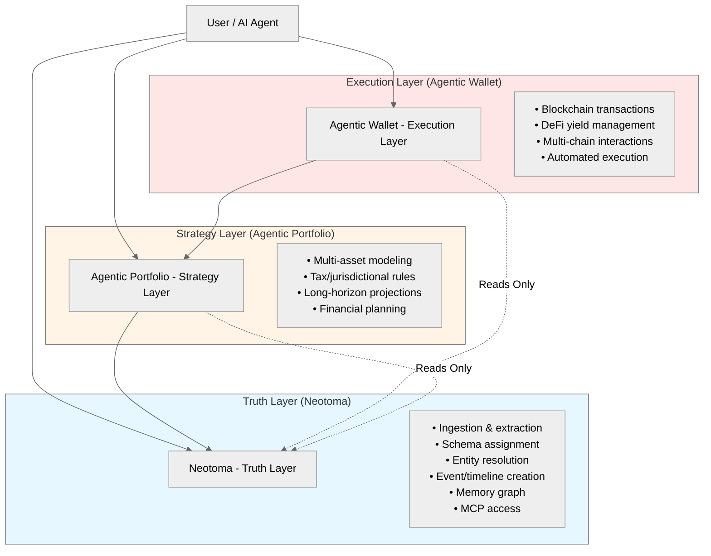
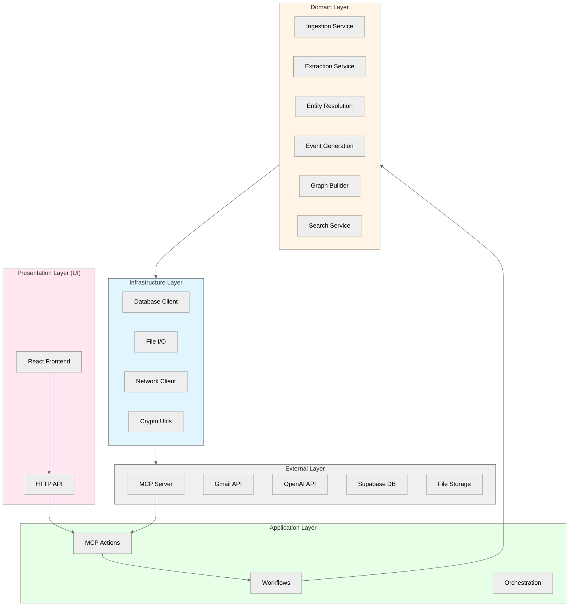
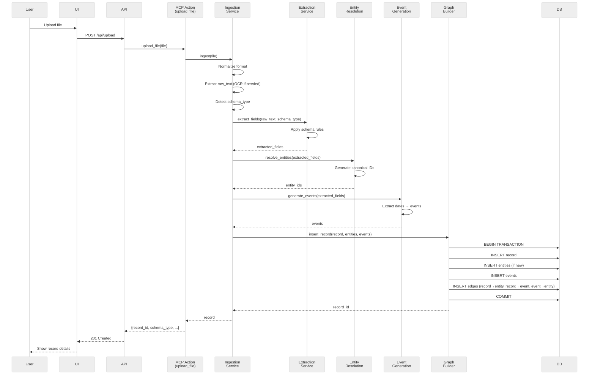
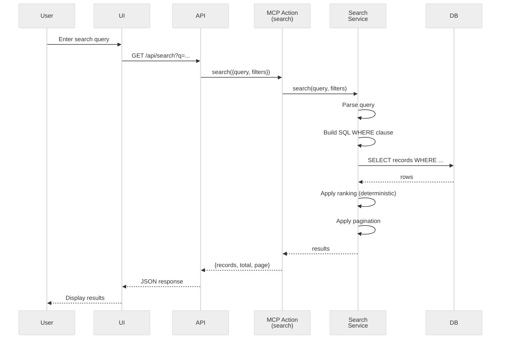
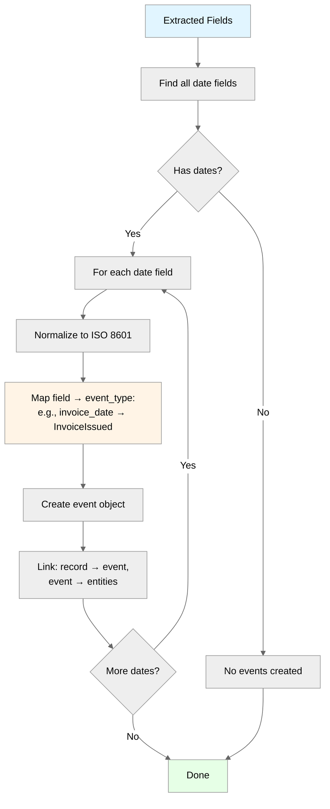

# Neotoma Architecture — Canonical Platform Definition
*(Truth Layer System Architecture)*

---

## Purpose

This document defines the **canonical architecture** of the Neotoma Truth Layer platform. It specifies:

- High-level system structure and boundaries
- Architectural layers and their responsibilities
- Component organization and dependencies
- Data flow patterns for all major operations
- Error propagation model
- Performance and security boundaries
- Testing implications of architectural decisions

This architecture enforces Neotoma's role as a **deterministic, immutable, schema-first Truth Layer** — never an app, agent, or strategy/execution system.

---

## Scope

This document covers:
- Platform-level architectural layers
- Component boundaries and allowed dependencies
- Request/response flows for core operations
- Cross-cutting architectural concerns (consistency, determinism, security)

This document does NOT cover:
- Implementation details (see subsystem docs)
- Specific schemas (see `docs/subsystems/schema.md`)
- UI component structure (see `docs/ui/dsl_spec.md`)
- Deployment or infrastructure (infrastructure docs)

---

## 1. Neotoma in Context: Layered Architecture

Neotoma is designed as a **Truth Layer** that can support multiple upper layers implementing agent-driven data processing and action execution. Understanding this layered architecture is **critical** to maintaining architectural purity.



*Figure: Example financial system architecture. Agentic Portfolio and Agentic Wallet are two important examples of layers that can be built on Neotoma, but many other agent-driven layers are possible.*

### 1.1 Truth Layer Responsibilities (Neotoma)

Neotoma MUST:
- Ingest user-provided files (explicit upload, Gmail attachments)
- Extract structured data via deterministic rules
- Assign schemas based on field detection
- Resolve entities (people, companies, locations)
- Generate timeline events from extracted dates
- Build and maintain the memory graph (records → entities → events)
- Expose truth via MCP tools
- Maintain provenance and immutability

Neotoma MUST NOT:
- Infer meaning beyond extracted fields
- Predict future states
- Execute financial transactions
- Implement strategy or planning logic
- Act as an autonomous agent
- Perform semantic search (MVP constraint)

### 1.2 Layer Boundaries

**Critical Invariant:** Upper layers (e.g., Agentic Portfolio, Agentic Wallet, or any agent-driven layer) MAY read from Neotoma but MUST NEVER write or modify truth.

**Note:** The financial system (Agentic Portfolio + Agentic Wallet) is one important example of layers that can be built on Neotoma, but many other agent-driven layers are possible. Neotoma is a general-purpose Truth Layer substrate.

---

## 2. Neotoma Internal Architecture: Five-Layer Model

Neotoma itself is structured as a **five-layer architecture**:



### 2.1 Layer Definitions

#### Layer 1: External Layer
**Responsibility:** Third-party services and data stores outside Neotoma's control.

**Components:**
- MCP client connections (from ChatGPT, Claude, Cursor)
- Gmail API for attachment retrieval
- OpenAI API for embeddings (deterministic, not extraction)
- Supabase PostgreSQL database
- File storage (local or S3)

**Constraints:**
- MUST NOT contain business logic
- MUST be swappable (abstracted by Infrastructure layer)

#### Layer 2: Infrastructure Layer
**Responsibility:** Abstract external dependencies, provide stable internal APIs.

**Components:**
- Database client wrappers (SQL query builders, connection pooling)
- File I/O abstractions (read, write, delete)
- Network client utilities (HTTP, retries, timeouts)
- Cryptographic utilities (hashing, signing, key derivation)

**Constraints:**
- MUST provide deterministic APIs
- MUST handle transient errors (retries, circuit breakers)
- MUST NOT contain domain logic

#### Layer 3: Domain Layer
**Responsibility:** Core Truth Layer business logic — ingestion, extraction, entity resolution, graph construction.

**Components:**
- **Ingestion Service:** File upload → normalization → chunking → OCR
- **Extraction Service:** Deterministic field extraction via regex/parsing
- **Entity Resolution:** Canonical entity ID generation and deduplication
- **Event Generation:** Extract dates → create timeline events
- **Graph Builder:** Insert nodes (records, entities, events) and edges
- **Search Service:** Query records, entities, events by structured filters

**Constraints:**
- MUST be deterministic (same input → same output)
- MUST NOT call upper layers
- MUST validate all inputs
- MUST emit events for observability

**Dependencies:**
- Infrastructure layer only (no direct External calls)

#### Layer 4: Application Layer
**Responsibility:** Orchestrate domain services, implement MCP actions, manage workflows.

**Components:**
- **MCP Actions:** `upload_file`, `list_records`, `fetch_record`, `search`, `create_entity`, `link`
- **Workflows:** Multi-step orchestrations (e.g., Gmail sync → download attachments → ingest)
- **Orchestration:** Retry logic, transaction management, saga patterns

**Constraints:**
- MUST coordinate Domain services
- MUST enforce authorization
- MUST provide structured error responses
- MUST NOT contain extraction or graph logic (that's Domain)

**Dependencies:**
- Domain layer + Infrastructure layer

#### Layer 5: Presentation Layer
**Responsibility:** User-facing interfaces — web UI, HTTP API endpoints.

**Components:**
- **React Frontend:** Record list, detail, timeline, search UI
- **HTTP API:** REST endpoints for UI (separate from MCP)

**Constraints:**
- MUST NOT contain business logic
- MUST call Application or Domain layers via defined contracts
- MUST handle UI state and rendering only

**Dependencies:**
- Application layer (via HTTP/WebSocket)

---

## 3. Dependency Rules and Constraints

### 3.1 Allowed Dependencies

```
Presentation → Application → Domain → Infrastructure → External
```

**Rules:**
- Each layer MAY depend on layers below it
- Each layer MUST NOT depend on layers above it
- Each layer SHOULD minimize direct calls to Infrastructure (prefer Domain abstractions)

### 3.2 Forbidden Dependencies

❌ Domain → Application (domain logic calling orchestration)
❌ Domain → Presentation (domain logic calling UI)
❌ Infrastructure → Domain (infra calling business logic)
❌ External → Any internal layer (external services can't call in)

### 3.3 Dependency Injection

All dependencies MUST be injected:
- Domain services receive Infrastructure clients via constructors
- Application workflows receive Domain services via constructors
- Presentation components receive Application actions via props/context

No global singletons for services.

---

## 4. Data Flow Patterns

### 4.1 Ingestion Flow (File Upload → Memory Graph)



**Key Characteristics:**
- **Deterministic:** Same file + same timestamp → same record_id, entities, events
- **Transactional:** All graph inserts in a single transaction
- **Immutable:** Once committed, raw_text and schema_type never change
- **Provenance:** All entities and events trace back to source record

### 4.2 Search Flow (Query → Results)



**Key Characteristics:**
- **Deterministic ranking:** Same query + same DB state → same order
- **Structured filters:** No semantic search in MVP
- **Consistent:** May show stale results during indexing (bounded eventual consistency)

### 4.3 Entity Resolution Flow (Extracted Fields → Canonical Entity)

```mermaid
%%{init: {'theme':'neutral'}}%%
flowchart TD
    Start[Extracted Fields] --> HasEntity{Contains entity<br/>field?}
    HasEntity -->|No| Skip[Skip entity resolution]
    HasEntity -->|Yes| Extract[Extract entity value]
    
    Extract --> Normalize[Normalize:<br/>trim, lowercase, dedupe]
    Normalize --> GenerateID[Generate canonical ID:<br/>hash(entity_type:normalized_value)]
    GenerateID --> CheckExists{Entity ID<br/>exists in DB?}
    
    CheckExists -->|Yes| Link[Link record to existing entity]
    CheckExists -->|No| Create[Create new entity]
    Create --> Link
    
    Link --> InsertEdge[Insert graph edge:<br/>record → entity]
    InsertEdge --> Done[Done]
    Skip --> Done
    
    style Start fill:#e1f5ff
    style Done fill:#e6ffe6
    style GenerateID fill:#fff4e6
```

**Key Characteristics:**
- **Deterministic IDs:** Same normalized value → same entity ID (globally)
- **Automatic deduplication:** Multiple records with "Acme Corp" link to same entity
- **No inference:** Only extract entities explicitly present in fields

### 4.4 Timeline Event Flow (Extracted Dates → Events)



**Key Characteristics:**
- **One event per date field:** `invoice_date` → `InvoiceIssued` event
- **Deterministic event IDs:** hash(record_id + field_name + date)
- **Timeline ordering:** Events sorted by timestamp for UI

---

## 5. Error Propagation Model

### 5.1 Error Flow

Errors propagate **up** the layer stack, never down:

```
Domain error → Application catches → Application returns structured error → Presentation displays
```

### 5.2 Error Envelope

All errors MUST use a structured envelope (see `docs/subsystems/errors.md`):

```typescript
interface ErrorEnvelope {
  error_code: string;          // e.g., "INGESTION_INVALID_FILE"
  message: string;              // Human-readable description
  details?: Record<string, any>; // Additional context
  trace_id?: string;            // Distributed tracing ID
  timestamp: string;            // ISO 8601
}
```

### 5.3 Error Handling by Layer

**Domain Layer:**
- Throws typed errors (e.g., `InvalidSchemaError`, `EntityResolutionError`)
- MUST NOT return partial results on error
- MUST rollback transactions on failure

**Application Layer:**
- Catches Domain errors
- Converts to ErrorEnvelope
- Logs errors with trace_id
- Returns error to caller (UI or MCP client)

**Presentation Layer:**
- Displays user-friendly error messages
- Shows retry options if transient error
- Logs errors for debugging (no PII)

### 5.4 Transient vs Permanent Errors

**Transient (retry allowed):**
- Network timeouts
- Database connection errors
- Rate limits

**Permanent (no retry):**
- Invalid file format
- Schema validation failures
- Authorization errors

Application layer MUST distinguish and signal retry eligibility.

---

## 6. Performance Boundaries

### 6.1 Response Time Targets

| Operation | Target | Max Acceptable |
|-----------|--------|----------------|
| Search query | < 200ms | 1s |
| Record fetch | < 100ms | 500ms |
| File upload (< 10MB) | < 5s | 30s |
| Entity resolution | < 500ms | 2s |
| Timeline generation | < 1s | 5s |

### 6.2 Throughput Targets

| Operation | Target | Notes |
|-----------|--------|-------|
| Concurrent ingestions | 10/sec | Per user |
| Search queries | 100/sec | Across all users |
| MCP tool calls | 50/sec | Per user |

### 6.3 Scalability Constraints

**Vertical Scaling (MVP):**
- Single-instance Supabase PostgreSQL
- Local or S3 file storage
- No horizontal scaling in MVP

**Future Horizontal Scaling:**
- Ingestion workers (queue-based)
- Read replicas for search
- Distributed graph storage

---

## 7. Security Boundaries

### 7.1 Authentication and Authorization

**Authentication:**
- User authentication via Supabase Auth
- MCP connections authenticated via session tokens
- No anonymous access

**Authorization:**
- Row-level security (RLS) in PostgreSQL
- User can only access their own records, entities, events
- Application layer enforces user_id filtering

### 7.2 Data Security

**At Rest:**
- Database encryption via Supabase
- File storage encryption (S3 server-side encryption)

**In Transit:**
- HTTPS for all HTTP API calls
- WSS (WebSocket Secure) for MCP connections

**PII Handling:**
- MUST NOT log PII (see `docs/subsystems/privacy.md`)
- Extraction preserves original text (no redaction)
- User controls deletion via MCP `delete_record` action (future)

### 7.3 Input Validation

**All layers MUST validate inputs:**
- **Presentation:** Client-side validation (UX, not security)
- **Application:** Server-side validation (schema validation)
- **Domain:** Business rule validation (e.g., valid date formats)
- **Infrastructure:** Type validation (e.g., SQL injection prevention)

---

## 8. Testing Implications

### 8.1 Layer-Specific Testing

**Domain Layer:**
- **Unit tests:** Pure functions (extraction, entity ID generation)
- **Integration tests:** Domain service + in-memory DB
- **Property tests:** Determinism (same input → same output)

**Application Layer:**
- **Integration tests:** Workflows calling real Domain services + test DB
- **Contract tests:** MCP action signatures

**Presentation Layer:**
- **Component tests:** React component rendering
- **E2E tests:** Full user flows (Playwright)

### 8.2 Cross-Layer Testing

**End-to-End Tests:**
- Upload file via UI → verify record in DB
- Search via MCP → verify results match expected entities
- Timeline view → verify events sorted correctly

**Performance Tests:**
- Load test search with 10K records
- Ingestion throughput test (100 files in 30s)

### 8.3 Architectural Invariant Tests

**Dependency Tests:**
- Domain layer MUST NOT import Application or Presentation modules
- Infrastructure layer MUST NOT import Domain modules

**Determinism Tests:**
- Upload same file twice → same record_id, entities, events
- Search same query twice → same order

---

## 9. Architectural Invariants (MUST/MUST NOT)

### MUST

1. **Layers MUST respect dependency rules** (no upward dependencies)
2. **Domain logic MUST be deterministic** (same input → same output)
3. **All errors MUST use ErrorEnvelope structure**
4. **All external calls MUST go through Infrastructure layer**
5. **All database writes MUST be transactional**
6. **All user data MUST be isolated by user_id** (RLS)
7. **All MCP actions MUST validate inputs**
8. **All timeline events MUST trace to source fields**
9. **All entities MUST have canonical IDs**
10. **All graph edges MUST be typed**

### MUST NOT

1. **Domain layer MUST NOT call Application or Presentation**
2. **Infrastructure MUST NOT contain business logic**
3. **Presentation MUST NOT call External layer directly**
4. **Any layer MUST NOT introduce nondeterminism** (randomness, LLM extraction)
5. **Graph MUST NOT contain orphan nodes** (all nodes have edges)
6. **Schema assignments MUST NOT change post-creation**
7. **Raw text MUST NOT be modified after ingestion**
8. **Entities MUST NOT be inferred** (only extracted)
9. **Search MUST NOT use semantic embeddings for ranking** (MVP)
10. **MCP MUST NOT expose strategy or execution logic** (Truth Layer only)

---

## 10. Future Architectural Extensions

### 10.1 Planned Additions (Post-MVP)

**Horizontal Scaling:**
- Ingestion worker pool (queue-based with Redis/RabbitMQ)
- Read replicas for search and timeline queries
- CDN for file storage

**Advanced Search:**
- Hybrid search (structured + embeddings)
- Cross-language search refinements

**Graph Query Language:**
- Custom query language for graph traversal (e.g., "Find all entities linked to records from Q1 2024")

### 10.2 Non-Goals (Never)

- LLM-based extraction (violates determinism)
- Autonomous agents in Truth Layer (belongs in Agentic Wallet/Agentic Portfolio)
- Predictive analytics (belongs in Agentic Portfolio)
- Blockchain integration (belongs in Wallet)

---

## Agent Instructions

### When to Load This Document
Load `docs/architecture/architecture.md` when:
- Making any structural or cross-layer change
- Adding a new subsystem or service
- Implementing MCP actions
- Refactoring Domain, Application, or Infrastructure layers
- Designing data flows for new features
- Reviewing pull requests for architectural compliance

### Required Co-Loaded Documents
- `docs/NEOTOMA_MANIFEST.md` (always)
- `docs/context/index.md` (navigation)
- `docs/conventions/documentation_standards.md` (formatting)
- `docs/architecture/consistency.md` (consistency models)
- `docs/architecture/determinism.md` (determinism rules)

### Constraints Agents Must Enforce
1. **Respect layer boundaries:** No upward dependencies
2. **Maintain determinism:** All Domain logic must be reproducible
3. **Use ErrorEnvelope:** All errors follow structured format
4. **Validate inputs:** Every layer validates its inputs
5. **Transactional writes:** All graph writes in transactions
6. **User isolation:** RLS enforced for all user data
7. **No global state:** Dependency injection for all services
8. **Truth Layer purity:** No strategy, execution, or agent logic in Neotoma

### Forbidden Patterns
- Domain service calling Application layer
- Infrastructure layer containing business rules
- Direct External calls from Domain or Application
- Non-transactional graph writes
- Mutable records or schema reassignment
- Nondeterministic extraction or entity resolution
- Semantic search in MVP
- PII in logs

### Validation Checklist
- [ ] Change respects five-layer architecture
- [ ] No upward dependencies introduced
- [ ] Domain logic is deterministic and testable
- [ ] Errors use ErrorEnvelope structure
- [ ] Database writes are transactional
- [ ] User data isolation maintained (RLS)
- [ ] MCP actions validate inputs
- [ ] Performance targets considered
- [ ] Security boundaries respected
- [ ] Tests cover new architectural paths
- [ ] Documentation updated if patterns change

