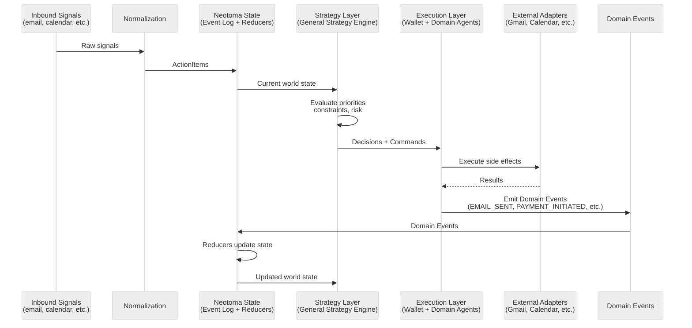
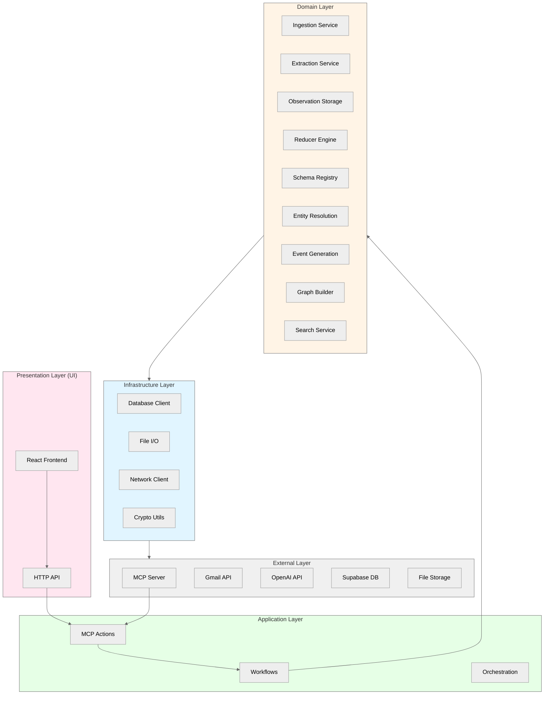
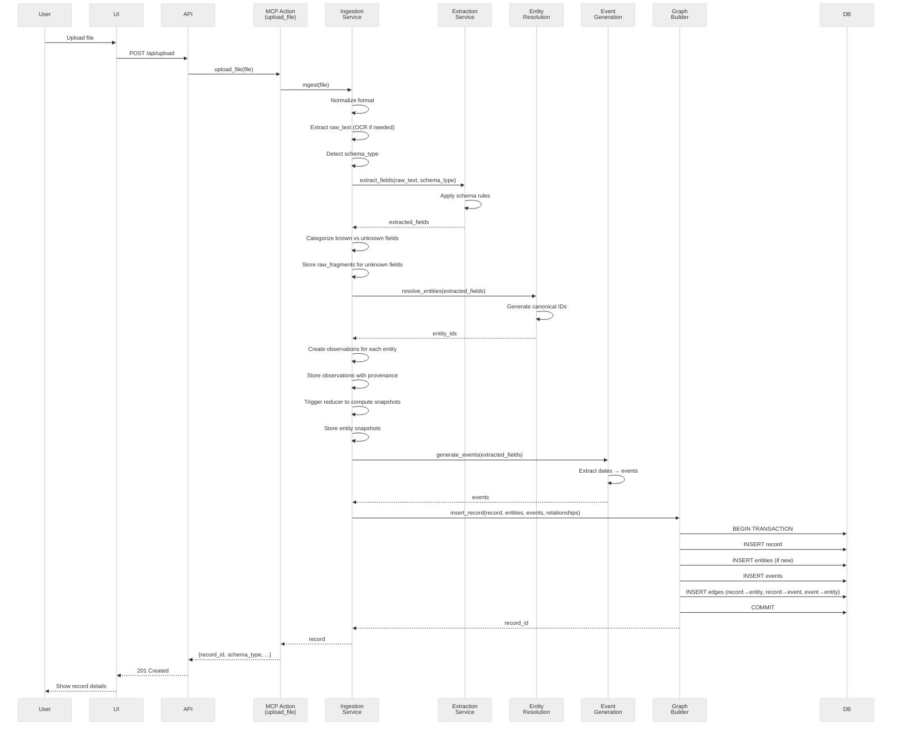

# Neotoma Architecture — Canonical Platform Definition

_(Truth Layer System Architecture)_

---

## Purpose

This document defines the **canonical architecture** of the Neotoma Truth Layer platform. It specifies:

- High-level system structure and boundaries
- Architectural layers and their responsibilities
- Component organization and dependencies
- Data flow patterns for all major operations
- Error propagation model
- Performance and security boundaries
- Testing implications of architectural decisions

This architecture enforces Neotoma's role as a **deterministic, immutable, schema-first Truth Layer** — never an app, agent, or strategy/execution system.

---

## Scope

This document covers:

- Platform-level architectural layers
- Component boundaries and allowed dependencies
- Request/response flows for core operations
- Cross-cutting architectural concerns (consistency, determinism, security)

This document does NOT cover:

- Implementation details (see subsystem docs)
- Specific schemas (see `docs/subsystems/schema.md`)
- UI component structure (see `docs/ui/dsl_spec.md`)
- Deployment or infrastructure (infrastructure docs)

---

## 1. Neotoma in Context: Layered Architecture

Neotoma is designed as a **Truth Layer** that can support multiple upper layers implementing agent-driven data processing and action execution. Understanding this layered architecture is **critical** to maintaining architectural purity.

### 1.1 Core Architectural Model

Neotoma is the **truth layer**:

- Event-sourced
- Reducer-driven
- Deterministic world model
- All agents read from it, none write to it directly

Above Neotoma sit two layers:

#### A. Strategy Layer (General Strategy Engine)

This layer:

- Reads the current world state
- Evaluates priorities, constraints, risk, commitments, time, and financial posture
- Plans _what_ should happen next
- Outputs **Decisions** + **Commands** (intents)
- NEVER mutates truth or performs side effects

Strategy is pure cognition:

- State in → Decisions out
- Declarative, testable, deterministic

#### B. Execution Layer (Agentic Wallet + Domain Agents)

This layer:

- Takes commands from the Strategy Layer
- Performs side effects using **external adapters** (email, scheduling APIs, financial services, messaging systems, etc.)
- Emits **Domain Events** describing what happened
- Domain Events are validated → Reducers → Updated world state

Execution is pure effect:

- Commands in → Events out
- All truth updates flow through reducers

```mermaid
%%{init: {'theme':'neutral'}}%%
flowchart TD
    User[User / AI Agent]

    User --> Execution[Execution Layer]
    User --> Strategy[Strategy Layer]
    User --> Neotoma[Neotoma - Truth Layer]

    Execution --> Strategy
    Strategy --> Neotoma

    Execution -.->|Reads Only| Neotoma
    Strategy -.->|Reads Only| Neotoma
    Execution -.->|Emits Domain Events| Neotoma

    subgraph ExecutionLayer["Execution Layer"]
        Wallet[Agentic Wallet]
        DomainAgents[Domain Agents]
        ExecutionResp["• Takes Commands<br/>• Performs side effects via adapters<br/>• Emits Domain Events<br/>• Pure effect: Commands → Events"]
    end

    subgraph StrategyLayer["Strategy Layer"]
        Portfolio[Agentic Portfolio<br/>(Example)]
        StrategyEngine[General Strategy Engine]
        StrategyResp["• Reads world state<br/>• Evaluates priorities/constraints<br/>• Outputs Decisions + Commands<br/>• Pure cognition: State → Decisions"]
    end

    subgraph TruthLayer["Truth Layer (Neotoma)"]
        Neotoma
        Reducers[Reducers]
        EventLog[Event Log]
        NeoResp["• Event-sourced<br/>• Reducer-driven<br/>• Deterministic world model<br/>• Domain Events → State updates"]
    end

    Execution -.->|Domain Events| Reducers
    Reducers --> EventLog
    EventLog --> Neotoma

    style ExecutionLayer fill:#ffe6e6
    style StrategyLayer fill:#fff4e6
    style TruthLayer fill:#e6f7ff
```

_Figure: Layered architecture showing Strategy Layer (pure cognition) and Execution Layer (pure effect) above Neotoma's event-sourced truth layer. Agentic Portfolio is an example instance of the Strategy Layer; Agentic Wallet is part of the Execution Layer alongside domain agents._

### 1.2 Event Flow & State Management

The closed loop of autonomy:

```
Inbound Signals (email, WhatsApp, calendar, financial data)
↓
Normalization → ActionItems
↓
Neotoma State (event log + reducers)
↓
Strategy Tick (General Strategy Engine)
↓
Decisions + Commands
↓
Execution Agents
↓
Domain Events (what actually happened)
↓
Reducers → Updated State
↓
Next Tick
```



_Figure: Event flow showing the closed loop from inbound signals through normalization, strategy evaluation, execution, and back to state updates via reducers._

### 1.3 Truth Layer Responsibilities (Neotoma)

Neotoma MUST:

- Ingest user-provided files (explicit upload, Gmail attachments)
- Extract structured data via deterministic rules
- Assign schemas based on field detection
- Resolve entities (people, companies, locations)
- Generate timeline events from extracted dates
- Build and maintain the memory graph (records → entities → events)
- Expose truth via MCP tools
- Maintain provenance and immutability
- Process Domain Events through reducers to update state
- Maintain event log for auditability and replay

Neotoma MUST NOT:

- Infer meaning beyond extracted fields
- Predict future states
- Execute financial transactions
- Implement strategy or planning logic
- Act as an autonomous agent
- Perform semantic search (MVP constraint)
- Mutate state directly (only via reducers processing Domain Events)

### 1.4 Strategy Layer Responsibilities

The Strategy Layer (General Strategy Engine) MUST:

- Read current world state from Neotoma
- Evaluate tasks, obligations, schedules, financial positions
- Compute priority scores
- Determine whether tasks are AUTO_EXECUTE, ASK_USER (Watch prompts), or ESCALATE (iPhone/Mac)
- Read values/constraints config (budgets, time blocks, autonomy caps, risk tolerances)
- Enforce constraints at decision time
- Reason across multiple domains (communications, household operations, financial flows, portfolio management, tax & entity logic, scheduling, projects, logistics)
- Output binary or ternary choices for Watch interaction (micro-prompts, minimal user input)
- NEVER mutate truth or perform side effects

The Strategy Layer MUST NOT:

- Perform side effects (send emails, execute transactions, modify calendars)
- Mutate Neotoma truth directly
- Bypass the Execution Layer
- Contain execution logic

### 1.5 Execution Layer Responsibilities

Execution Agents (Agentic Wallet + domain agents) MUST:

- Take commands from the Strategy Layer
- Perform side effects using external adapters (GmailAdapter, WhatsAppAdapter, CalendarAdapter, PaymentsAdapter, TradingAdapter, etc.)
- Emit Domain Events describing what actually happened (EMAIL_SENT, PAYMENT_INITIATED, TRADE_EXECUTED, SCHEDULE_BLOCKED, CONTRACTOR_CONFIRMED, TASK_COMPLETED)
- Ensure all actions are idempotent
- Execute commands exactly once
- Enforce safety limits via execution adapters

Execution Agents MUST NOT:

- Mutate Neotoma truth directly (only via Domain Events → Reducers)
- Implement strategy or planning logic
- Bypass adapters for side effects
- Emit events without performing the actual action

### 1.6 Layer Boundaries

**Critical Invariant:** Upper layers (Strategy Layer and Execution Layer) MAY read from Neotoma but MUST NEVER write or modify truth directly.

**Truth updates flow only through:**

1. Domain Events emitted by Execution Layer
2. Reducers processing Domain Events
3. Updated world state

**Note:** Agentic Portfolio is an example instance of the Strategy Layer. Agentic Wallet is part of the Execution Layer alongside domain agents. Many other agent-driven layers are possible. Neotoma is a general-purpose Truth Layer substrate.

---

## 1.7 Required Engineering Patterns

All strategy/execution code MUST follow these patterns:

### 1.7.1 Pure Strategy Functions

- No side effects
- No file I/O
- Inputs: world state
- Outputs: decisions, commands

### 1.7.2 Execution via Adapters Only

- GmailAdapter, WhatsAppAdapter, CalendarAdapter, PaymentsAdapter, TradingAdapter, etc.
- Adapters generate events, not truth writes
- All side effects go through adapters

### 1.7.3 Event-Sourced Truth

- All state updates come from reducers
- No direct mutations
- Reducers MUST be deterministic and pure
- Domain Events are the only source of truth changes

### 1.7.4 Ports & Adapters Architecture

Repositories:

- EventRepository
- StateRepository
- CapabilityRepository
- CommandRepository

Adapters for:

- Flat files (now)
- Databases (later)
- Distributed/multi-node (future)
- Blockchain anchoring (future optional)

### 1.7.5 Capability Tokens (future-proofing)

- Agent permissions encoded as explicit capabilities
- Constraints (limits, expiry, scopes) verified before accepting events
- Replace static whitelists

### 1.7.6 Hash-Chained Event Log (optional scaffolding)

- Events optionally include `previousHash` + `hash`
- Ensures long-term audit integrity
- Enables future on-chain anchoring

---

## 2. Neotoma Internal Architecture: Five-Layer Model

Neotoma itself is structured as a **five-layer architecture**:



### 2.1 Layer Definitions

#### Layer 1: External Layer

**Responsibility:** Third-party services and data stores outside Neotoma's control.

**Components:**

- MCP client connections (from ChatGPT, Claude, Cursor)
- Gmail API for attachment retrieval
- OpenAI API for embeddings (deterministic, not extraction)
- Supabase PostgreSQL database
- File storage (local or S3)

**Constraints:**

- MUST NOT contain business logic
- MUST be swappable (abstracted by Infrastructure layer)

#### Layer 2: Infrastructure Layer

**Responsibility:** Abstract external dependencies, provide stable internal APIs.

**Components:**

- Database client wrappers (SQL query builders, connection pooling)
- File I/O abstractions (read, write, delete)
- Network client utilities (HTTP, retries, timeouts)
- Cryptographic utilities (hashing, signing, key derivation)

**Constraints:**

- MUST provide deterministic APIs
- MUST handle transient errors (retries, circuit breakers)
- MUST NOT contain domain logic

#### Layer 3: Domain Layer

**Responsibility:** Core Truth Layer business logic — ingestion, extraction, entity resolution, graph construction.

**Components:**

- **Ingestion Service:** File upload → normalization → chunking → OCR
- **Extraction Service:** Deterministic field extraction via regex/parsing
- **Observation Storage:** Store granular, source-specific facts extracted from documents
- **Reducer Engine:** Compute entity snapshots from observations using deterministic merge strategies
- **Schema Registry:** Manage config-driven schema definitions, versions, and merge policies
- **Entity Resolution:** Canonical entity ID generation and deduplication
- **Event Generation:** Extract dates → create timeline events
- **Graph Builder:** Insert nodes (records, entities, events) and edges, manage relationships
- **Search Service:** Query records, entities, events by structured filters

**Constraints:**

- MUST be deterministic (same input → same output)
- MUST NOT call upper layers
- MUST validate all inputs
- MUST emit events for observability

**Dependencies:**

- Infrastructure layer only (no direct External calls)

#### Layer 4: Application Layer

**Responsibility:** Orchestrate domain services, implement MCP actions, manage workflows.

**Components:**

- **MCP Actions:** `upload_file`, `list_records`, `fetch_record`, `search`, `create_entity`, `link`
- **Workflows:** Multi-step operations orchestrating domain services
- **Orchestration:** Request routing, validation, error handling

**Constraints:**

- MUST NOT contain conversational logic or chat state management
- MUST expose only deterministic, typed operations via MCP
- MUST validate all inputs before calling Domain layer
- MUST use ErrorEnvelope for all errors
- **Workflows:** Multi-step orchestrations (e.g., Gmail sync → download attachments → ingest)
- **Orchestration:** Retry logic, transaction management, saga patterns

**Constraints:**

- MUST coordinate Domain services
- MUST enforce authorization
- MUST provide structured error responses
- MUST NOT contain extraction or graph logic (that's Domain)

**Dependencies:**

- Domain layer + Infrastructure layer

#### Layer 5: Presentation Layer

**Responsibility:** User-facing interfaces — web UI, HTTP API endpoints.

**Components:**

- **React Frontend:** Record list, detail, timeline, search UI, upload UI
- **HTTP API:** REST endpoints for UI (separate from MCP)

**Constraints:**

- MUST NOT contain business logic
- MUST call Application or Domain layers via defined contracts
- MUST handle UI state and rendering only
- MUST NOT include chat UI or conversational interfaces (see `docs/architecture/conversational_ux_architecture.md`)

**Dependencies:**

- Application layer (via HTTP/WebSocket)

---

## 3. Dependency Rules and Constraints

### 3.1 Allowed Dependencies

```
Presentation → Application → Domain → Infrastructure → External
```

**Rules:**

- Each layer MAY depend on layers below it
- Each layer MUST NOT depend on layers above it
- Each layer SHOULD minimize direct calls to Infrastructure (prefer Domain abstractions)

### 3.2 Forbidden Dependencies

❌ Domain → Application (domain logic calling orchestration)
❌ Domain → Presentation (domain logic calling UI)
❌ Infrastructure → Domain (infra calling business logic)
❌ External → Any internal layer (external services can't call in)

### 3.3 Dependency Injection

All dependencies MUST be injected:

- Domain services receive Infrastructure clients via constructors
- Application workflows receive Domain services via constructors
- Presentation components receive Application actions via props/context

No global singletons for services.

---

## 4. Data Flow Patterns

### 4.1 Ingestion Flow (File Upload → Memory Graph)



**Key Characteristics:**

- **Deterministic:** Same file + same timestamp → same record_id, entities, events
- **Transactional:** All graph inserts in a single transaction
- **Immutable:** Once committed, raw_text and schema_type never change
- **Provenance:** All entities and events trace back to source record

### 4.2 Search Flow (Query → Results)


**Key Characteristics:**

- **Deterministic ranking:** Same query + same DB state → same order
- **Structured filters:** No semantic search in MVP
- **Consistent:** May show stale results during indexing (bounded eventual consistency)

### 4.3 Entity Resolution Flow (Extracted Fields → Canonical Entity)

```mermaid
%%{init: {'theme':'neutral'}}%%
flowchart TD
    Start[Extracted Fields] --> HasEntity{Contains entity<br/>field?}
    HasEntity -->|No| Skip[Skip entity resolution]
    HasEntity -->|Yes| Extract[Extract entity value]

    Extract --> Normalize[Normalize:<br/>trim, lowercase, dedupe]
    Normalize --> GenerateID[Generate canonical ID:<br/>hash(entity_type:normalized_value)]
    GenerateID --> CheckExists{Entity ID<br/>exists in DB?}

    CheckExists -->|Yes| Link[Link record to existing entity]
    CheckExists -->|No| Create[Create new entity]
    Create --> Link

    Link --> InsertEdge[Insert graph edge:<br/>record → entity]
    InsertEdge --> Done[Done]
    Skip --> Done

    style Start fill:#e1f5ff
    style Done fill:#e6ffe6
    style GenerateID fill:#fff4e6
```

**Key Characteristics:**

- **Deterministic IDs:** Same normalized value → same entity ID (globally)
- **Automatic deduplication:** Multiple records with "Acme Corp" link to same entity
- **No inference:** Only extract entities explicitly present in fields

### 4.4 Timeline Event Flow (Extracted Dates → Events)


**Key Characteristics:**

- **One event per date field:** `invoice_date` → `InvoiceIssued` event
- **Deterministic event IDs:** hash(record_id + field_name + date)
- **Timeline ordering:** Events sorted by timestamp for UI

---

## 5. Error Propagation Model

### 5.1 Error Flow

Errors propagate **up** the layer stack, never down:

```
Domain error → Application catches → Application returns structured error → Presentation displays
```

### 5.2 Error Envelope

All errors MUST use a structured envelope (see `docs/subsystems/errors.md`):

```typescript
interface ErrorEnvelope {
  error_code: string; // e.g., "INGESTION_INVALID_FILE"
  message: string; // Human-readable description
  details?: Record<string, any>; // Additional context
  trace_id?: string; // Distributed tracing ID
  timestamp: string; // ISO 8601
}
```

### 5.3 Error Handling by Layer

**Domain Layer:**

- Throws typed errors (e.g., `InvalidSchemaError`, `EntityResolutionError`)
- MUST NOT return partial results on error
- MUST rollback transactions on failure

**Application Layer:**

- Catches Domain errors
- Converts to ErrorEnvelope
- Logs errors with trace_id
- Returns error to caller (UI or MCP client)

**Presentation Layer:**

- Displays user-friendly error messages
- Shows retry options if transient error
- Logs errors for debugging (no PII)

### 5.4 Transient vs Permanent Errors

**Transient (retry allowed):**

- Network timeouts
- Database connection errors
- Rate limits

**Permanent (no retry):**

- Invalid file format
- Schema validation failures
- Authorization errors

Application layer MUST distinguish and signal retry eligibility.

---

## 6. Performance Boundaries

### 6.1 Response Time Targets

| Operation            | Target  | Max Acceptable |
| -------------------- | ------- | -------------- |
| Search query         | < 200ms | 1s             |
| Record fetch         | < 100ms | 500ms          |
| File upload (< 10MB) | < 5s    | 30s            |
| Entity resolution    | < 500ms | 2s             |
| Timeline generation  | < 1s    | 5s             |

### 6.2 Throughput Targets

| Operation             | Target  | Notes            |
| --------------------- | ------- | ---------------- |
| Concurrent ingestions | 10/sec  | Per user         |
| Search queries        | 100/sec | Across all users |
| MCP tool calls        | 50/sec  | Per user         |

### 6.3 Scalability Constraints

**Vertical Scaling (MVP):**

- Single-instance Supabase PostgreSQL
- Local or S3 file storage
- No horizontal scaling in MVP

**Future Horizontal Scaling:**

- Ingestion workers (queue-based)
- Read replicas for search
- Distributed graph storage

---

## 7. Security Boundaries

### 7.1 Authentication and Authorization

**Authentication:**

- User authentication via Supabase Auth
- MCP connections authenticated via session tokens
- No anonymous access

**Authorization:**

- Row-level security (RLS) in PostgreSQL
- User can only access their own records, entities, events
- Application layer enforces user_id filtering

### 7.2 Data Security

**At Rest:**

- Database encryption via Supabase
- File storage encryption (S3 server-side encryption)

**In Transit:**

- HTTPS for all HTTP API calls
- WSS (WebSocket Secure) for MCP connections

**PII Handling:**

- MUST NOT log PII (see `docs/subsystems/privacy.md`)
- Extraction preserves original text (no redaction)
- User controls deletion via MCP `delete_record` action (future)

### 7.3 Input Validation

**All layers MUST validate inputs:**

- **Presentation:** Client-side validation (UX, not security)
- **Application:** Server-side validation (schema validation)
- **Domain:** Business rule validation (e.g., valid date formats)
- **Infrastructure:** Type validation (e.g., SQL injection prevention)

---

## 8. Testing Implications

### 8.1 Layer-Specific Testing

**Domain Layer:**

- **Unit tests:** Pure functions (extraction, entity ID generation)
- **Integration tests:** Domain service + in-memory DB
- **Property tests:** Determinism (same input → same output)

**Application Layer:**

- **Integration tests:** Workflows calling real Domain services + test DB
- **Contract tests:** MCP action signatures

**Presentation Layer:**

- **Component tests:** React component rendering
- **E2E tests:** Full user flows (Playwright)

### 8.2 Cross-Layer Testing

**End-to-End Tests:**

- Upload file via UI → verify record in DB
- Search via MCP → verify results match expected entities
- Timeline view → verify events sorted correctly

**Performance Tests:**

- Load test search with 10K records
- Ingestion throughput test (100 files in 30s)

### 8.3 Architectural Invariant Tests

**Dependency Tests:**

- Domain layer MUST NOT import Application or Presentation modules
- Infrastructure layer MUST NOT import Domain modules

**Determinism Tests:**

- Upload same file twice → same record_id, entities, events
- Search same query twice → same order

---

## 9. Architectural Invariants (MUST/MUST NOT)

### MUST

1. **Layers MUST respect dependency rules** (no upward dependencies)
2. **Domain logic MUST be deterministic** (same input → same output)
3. **All errors MUST use ErrorEnvelope structure**
4. **All external calls MUST go through Infrastructure layer**
5. **All database writes MUST be transactional**
6. **All user data MUST be isolated by user_id** (RLS)
7. **All MCP actions MUST validate inputs**
8. **All timeline events MUST trace to source fields**
9. **All entities MUST have canonical IDs**
10. **All graph edges MUST be typed**
11. **Reducers MUST be deterministic** (same observations + merge rules → same snapshot)
12. **All snapshot fields MUST have provenance** (trace to specific observations and documents)
13. **Observations MUST reference schema version** (for deterministic replay)
14. **Schema evolution MUST be append-only and versioned** (no breaking changes)

### MUST NOT

1. **Domain layer MUST NOT call Application or Presentation**
2. **Infrastructure MUST NOT contain business logic**
3. **Presentation MUST NOT call External layer directly**
4. **Any layer MUST NOT introduce nondeterminism** (randomness, LLM extraction)
5. **Graph MUST NOT contain orphan nodes** (all nodes have edges)
6. **Schema assignments MUST NOT change post-creation**
7. **Raw text MUST NOT be modified after ingestion**
8. **Entities MUST NOT be inferred** (only extracted)
9. **Search MUST NOT use semantic embeddings for ranking** (MVP)
10. **MCP MUST NOT expose strategy or execution logic** (Truth Layer only)
11. **Reducers MUST NOT be nondeterministic** (must be pure functions)
12. **Snapshots MUST NOT be computed without observations** (observations are source of truth)
13. **Schema changes MUST NOT break existing data** (must be backward compatible)
14. **Observations MUST NOT be modified after creation** (immutable)

---

## 10. Future Architectural Extensions

### 10.1 Planned Additions (Post-MVP)

**Horizontal Scaling:**

- Ingestion worker pool (queue-based with Redis/RabbitMQ)
- Read replicas for search and timeline queries
- CDN for file storage

**Advanced Search:**

- Hybrid search (structured + embeddings)
- Cross-language search refinements

**Graph Query Language:**

- Custom query language for graph traversal (e.g., "Find all entities linked to records from Q1 2024")

### 10.2 Non-Goals (Never)

- LLM-based extraction (violates determinism)
- Autonomous agents in Truth Layer (belongs in Strategy Layer or Execution Layer)
- Predictive analytics (belongs in Strategy Layer)
- Strategy or execution logic in Truth Layer (belongs in upper layers)
- Direct truth mutations (all updates via Domain Events → Reducers)
- Side effects in Strategy Layer (belongs in Execution Layer)
- Internal chat UI or conversational interfaces (externalized to MCP-compatible agents; see `docs/architecture/conversational_ux_architecture.md`)

---

## Agent Instructions

### When to Load This Document

Load `docs/architecture/architecture.md` when:

- Making any structural or cross-layer change
- Adding a new subsystem or service
- Implementing MCP actions
- Refactoring Domain, Application, or Infrastructure layers
- Designing data flows for new features
- Reviewing pull requests for architectural compliance

### Required Co-Loaded Documents

- `docs/foundation/core_identity.md` (always)
- `docs/context/index.md` (navigation)
- `docs/conventions/documentation_standards.md` (formatting)
- `docs/architecture/architectural_decisions.md` (core architectural decisions)
- `docs/architecture/consistency.md` (consistency models)
- `docs/architecture/determinism.md` (determinism rules)
- `docs/architecture/conversational_ux_architecture.md` (when evaluating chat/conversational features)

### Constraints Agents Must Enforce

1. **Respect layer boundaries:** No upward dependencies
2. **Maintain determinism:** All Domain logic must be reproducible
3. **Use ErrorEnvelope:** All errors follow structured format
4. **Validate inputs:** Every layer validates its inputs
5. **Transactional writes:** All graph writes in transactions
6. **User isolation:** RLS enforced for all user data
7. **No global state:** Dependency injection for all services
8. **Truth Layer purity:** No strategy, execution, or agent logic in Neotoma
9. **Event-sourced updates:** All state changes via Domain Events → Reducers
10. **Pure Strategy:** Strategy Layer has no side effects
11. **Pure Execution:** Execution Layer emits Domain Events, never writes truth directly
12. **Four-layer model:** Document → Entity → Observation → Snapshot must be respected
13. **Reducer determinism:** Same observations + merge rules → same snapshot
14. **Provenance tracking:** All snapshot fields trace to observations and documents
15. **Schema registry:** Domain schemas managed via registry, not code

### Forbidden Patterns

- Domain service calling Application layer
- Infrastructure layer containing business rules
- Direct External calls from Domain or Application
- Non-transactional graph writes
- Mutable records or schema reassignment
- Nondeterministic extraction or entity resolution
- Semantic search in MVP
- Internal chat UI or conversational interfaces (externalize to MCP-compatible agents)
- PII in logs
- Strategy Layer performing side effects
- Execution Layer mutating truth directly (must use Domain Events)
- Bypassing reducers for state updates
- Direct file-to-entity updates (must go through observations)
- Hard-coded parent-child relationships (use relationship types)
- Ad-hoc JSON fields in core schemas (use raw_fragments)
- Non-deterministic reducers (must be pure functions)
- Schema changes without versioning (must use schema registry)
- Breaking changes to existing schemas (must be additive)
- Modifying observations after creation (immutable)

### Validation Checklist

- [ ] Change respects five-layer architecture
- [ ] No upward dependencies introduced
- [ ] Domain logic is deterministic and testable
- [ ] Errors use ErrorEnvelope structure
- [ ] Database writes are transactional
- [ ] User data isolation maintained (RLS)
- [ ] MCP actions validate inputs
- [ ] Performance targets considered
- [ ] Security boundaries respected
- [ ] Tests cover new architectural paths
- [ ] Documentation updated if patterns change
