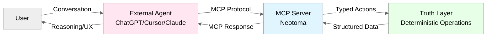
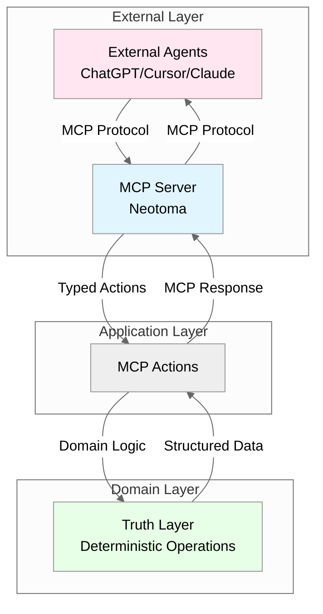

# Conversational UX Architecture Assessment — MCP-First Design Decision
## Scope
This document covers:
- Architectural decision: MCP-first conversational architecture
- Rationale for externalizing all conversational interactions
- Validation of core architectural principles
- Prescribed architecture boundaries
- Migration path for existing chat UI components
This document does NOT cover:
- MCP protocol implementation details (see `docs/specs/MCP_SPEC.md`)
- External agent implementation (ChatGPT, Cursor, Claude)
- UI component removal implementation (see migration notes)
## 1. Architectural Decision
### 1.1 Decision Statement
**Neotoma MUST NOT embed its own chat UI or conversational interfaces.**
**Neotoma MUST externalize all conversational interactions to MCP-compatible agents.**
### 1.2 Decision Context
Neotoma is architected as a **deterministic Truth Layer** that provides structured, schema-bound, entity-centric operations. The question of whether to embed conversational UX internally or externalize it to MCP-compatible agents directly impacts:
- Architectural purity and separation of concerns
- Determinism guarantees
- Maintenance burden and UX volatility
- Future evolution toward protocol-first, decentralized architecture
## 2. Core Arguments Validation
### 2.1 Neotoma = Deterministic Truth Layer
**Principle:** All writes must be typed, replayable domain events.
**Validation:**
Neotoma's core invariants require determinism (see `docs/architecture/determinism.md`):
- Same input → same output, always
- All extraction derives from schemas (rule-based, not LLM-based)
- All state mutations are domain events with full provenance
- Graph operations maintain integrity (no orphans, no cycles)
**Internal chat introduces nondeterministic state mutation paths:**
- Conversational context creates implicit state that cannot be deterministically replayed
- User intent interpretation varies across conversations
- Chat transcripts become shadow state that diverges from canonical truth
- Reasoning and inference inside Neotoma violates Truth Layer boundaries
**Conclusion:** Internal chat violates determinism and Truth Layer purity.
### 2.2 External Chat via MCP = Leverage + Modularity
**Principle:** Users already engage through ChatGPT/Cursor; MCP standardizes capabilities.
**Validation:**
- **Existing user behavior:** Users already use ChatGPT, Cursor, and Claude for conversational interactions
- **MCP standardization:** MCP provides standardized capabilities, identity, permissions, and file access
- **Neotoma as substrate:** Neotoma becomes the stable substrate, not a UI competitor
- **Separation of concerns:** Neotoma = truth; Agents = intelligence
**MCP architecture already established:**

**Conclusion:** MCP-first architecture leverages existing user workflows and provides modular separation.
### 2.3 Avoid "Shadow Intelligence" Inside Neotoma
**Principle:** Chat inside the product leads to user expectation of reasoning.
**Validation:**
- **User expectations:** Internal chat UI creates expectation that Neotoma provides reasoning, strategy, or planning
- **Architectural violation:** Neotoma MUST NOT implement strategy, execution, or agent logic (see `docs/architecture/architecture.md` section 1.1)
- **Truth Layer purity:** Neotoma = truth; Agents = intelligence
- **Separation of concerns:** Reasoning belongs in upper layers (Strategy Layer, e.g., Agentic Portfolio; Execution Layer, e.g., Agentic Wallet), not Truth Layer
**Forbidden patterns:**
- ❌ LLM-based extraction (violates determinism)
- ❌ Autonomous agents in Truth Layer
- ❌ Predictive analytics (belongs in Strategy Layer, e.g., Agentic Portfolio)
- ❌ Conversational reasoning (belongs in external agents)
**Conclusion:** Internal chat creates architectural drag and violates Truth Layer boundaries.
### 2.4 UX Volatility
**Principle:** Providers iterate conversational UX faster than Neotoma can.
**Validation:**
- **Provider velocity:** ChatGPT, Claude, and Cursor iterate conversational UX continuously
- **Maintenance burden:** Internal chat requires maintaining:
  - Transcript storage and threading
  - Safety and moderation
  - Retrieval and context management
  - Multimodal parsing (images, documents)
  - Conversation state management
- **Resource allocation:** Neotoma resources should focus on Truth Layer capabilities, not conversational UX
- **Competitive disadvantage:** Neotoma cannot match provider UX velocity
**Conclusion:** Offloading chat eliminates maintenance burden and aligns with Neotoma's core mission.
### 2.5 Protocol-First Future Evolution
**Principle:** If Neotoma becomes semi-public or decentralized, internal chat creates liability and architectural drag.
**Validation:**
- **Decentralization path:** Neotoma's architecture supports future evolution toward protocol-first, decentralized substrate (see `docs/architecture/blockchain_readiness_assessment.md`)
- **MCP-based interfaces:** Support replication and tokenized permission layers
- **Internal chat liability:** Creates centralized state, moderation requirements, and UX maintenance burden
- **Protocol purity:** MCP-based interfaces maintain protocol-first architecture
**Conclusion:** MCP-first architecture supports future evolution without architectural drag.
## 3. Prescribed Architecture
### 3.1 What Neotoma MUST Expose
Neotoma MUST expose only:
- **Ingestion endpoints:** File upload, normalization, chunking
- **Typed entity schemas:** Schema definitions, validation rules
- **Graph operations:** Entity resolution, event generation, graph construction
- **Domain-event surfaces:** Event emission, replay, versioning
- **Diffing/versioning:** Historical state, record versions
- **Search + embedding endpoints:** Structured search, deterministic embeddings
- **MCP tool definitions:** Complete MCP action catalog (see `docs/specs/MCP_SPEC.md`)
### 3.2 What Neotoma MUST NOT Include
Neotoma MUST NOT include:
- ❌ Chat UI components
- ❌ Conversational state management
- ❌ Transcript storage or threading
- ❌ LLM-based reasoning or inference
- ❌ Conversational context management
- ❌ Multimodal parsing beyond deterministic extraction
### 3.3 External Agent Responsibilities
External MCP-compatible agents (ChatGPT, Cursor, Claude) provide:
- Conversational UX and reasoning
- User intent interpretation
- Context management and threading
- Multimodal parsing and understanding
- Safety and moderation (provider responsibility)
- UX iteration and innovation
## 4. Architecture Boundaries
### 4.1 Layer Boundaries

**Critical Invariant:** All conversational interactions occur in external agents. Neotoma provides only deterministic, typed operations via MCP.
### 4.2 Truth Layer Purity
Neotoma maintains Truth Layer purity by:
- **Deterministic operations only:** All operations are replayable and reproducible
- **Schema-bound writes:** All writes conform to typed schemas
- **Event-sourced state:** All state mutations are domain events
- **No reasoning:** No LLM-based inference or conversational logic
- **MCP-only interface:** All external access via MCP protocol
## 5. Migration Path
### 5.1 Existing Chat UI Components
**Current state:** `frontend/src/components/ChatPanel.tsx` exists and provides chat functionality.
**Migration approach:**
1. **Deprecate ChatPanel:** Mark as deprecated, document MCP-first architecture
2. **Extract deterministic operations:** Preserve any deterministic search/filter operations as standalone components
3. **Remove conversational state:** Remove transcript storage, threading, and conversational context
4. **Document MCP integration:** Provide clear documentation for external agent integration
### 5.2 UI Component Evolution
**Preserved components:**
- List views (records, entities, events)
- Detail views (record detail, entity detail)
- Timeline views
- Upload UI (deterministic file upload)
- Search/filter UI (deterministic search)
**Removed components:**
- ChatPanel (conversational UI)
- Conversational state management
- Transcript storage
**New focus:**
- MCP integration documentation
- External agent setup guides
- MCP action examples
## 6. Validation Checklist
### 6.1 Architectural Compliance
- [x] Neotoma exposes only deterministic, schema-bound operations
- [x] All conversational interactions externalized to MCP-compatible agents
- [x] No internal chat UI or conversational state management
- [x] MCP tool definitions complete and documented
- [x] Truth Layer purity maintained (no reasoning, no strategy, no execution)
### 6.2 Determinism Validation
- [x] All operations are replayable and reproducible
- [x] No nondeterministic state mutation paths introduced
- [x] All writes are typed domain events
- [x] Graph operations maintain integrity
### 6.3 Separation of Concerns
- [x] Neotoma = deterministic truth layer
- [x] External agents = reasoning and conversational UX
- [x] Clear boundaries between Truth Layer and agent layers
- [x] No shadow intelligence inside Neotoma
## 7. References
### 7.1 Related Documents
- `docs/architecture/architecture.md` — Canonical platform architecture
- `docs/architecture/determinism.md` — Determinism requirements
- `docs/specs/MCP_SPEC.md` — MCP specification and action catalog
- `docs/NEOTOMA_MANIFEST.md` — Unified architectural context
### 7.2 Architectural Principles
- **Truth Layer purity:** Neotoma is a Truth Layer — not an app, agent, or strategy/execution system
- **Determinism:** Same input → same output, always
- **Schema-first:** All extraction derives from schemas
- **Event-sourced:** All state mutations are domain events
- **MCP-first:** All external access via MCP protocol
## Agent Instructions
### When to Load This Document
Load `docs/architecture/conversational_ux_architecture.md` when:
- Evaluating whether to add conversational or chat features
- Designing new UI components that might include conversational elements
- Reviewing pull requests that introduce chat or conversational state
- Planning migration of existing chat UI components
- Validating architectural compliance for new features
### Required Co-Loaded Documents
- `docs/NEOTOMA_MANIFEST.md` (always)
- `docs/architecture/architecture.md` (layer boundaries)
- `docs/architecture/determinism.md` (determinism requirements)
- `docs/specs/MCP_SPEC.md` (MCP action catalog)
### Constraints Agents Must Enforce
1. **No internal chat UI:** All conversational interactions MUST be externalized to MCP-compatible agents
2. **Deterministic operations only:** All Neotoma operations MUST be replayable and reproducible
3. **Schema-bound writes:** All writes MUST conform to typed schemas
4. **MCP-only interface:** All external access MUST be via MCP protocol
5. **Truth Layer purity:** No reasoning, strategy, or execution logic in Neotoma
### Forbidden Patterns
- ❌ Chat UI components inside Neotoma
- ❌ Conversational state management
- ❌ Transcript storage or threading
- ❌ LLM-based reasoning or inference
- ❌ Conversational context management
- ❌ Internal chat endpoints or APIs
### Validation Checklist
- [ ] Change respects Truth Layer boundaries
- [ ] No conversational UI introduced
- [ ] All operations are deterministic
- [ ] MCP tool definitions updated if needed
- [ ] Documentation updated to reflect MCP-first architecture
