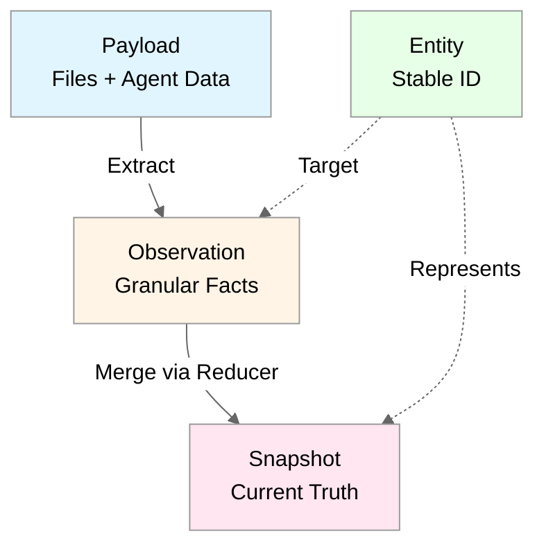

# Payload Model Architecture

_(Unified Ingestion Primitive for MCP)_

---

## Purpose

This document defines the **payload model** — Neotoma's unified ingestion primitive that replaces the previous document/record separation. The payload model enables deterministic, capability-based submission of data from both file uploads and agent interactions.

---

## Overview

The payload model unifies ingestion through a single write primitive: **payloads**. Agents and file upload handlers submit payloads via capability-based envelopes. The server compiles payloads into observations and entities using deterministic extraction rules.

**Key Principle:** Agents submit payloads. The server compiles knowledge.

---

## Three-Layer Truth Model

Neotoma implements a three-layer truth model (evolved from four-layer model):

1. **Payload (Document)** — Unified ingestion primitive (files + agent data)
2. **Observation** — Granular facts extracted from payloads
3. **Entity** — Logical thing with stable ID
4. **Snapshot** — Deterministic reducer output

**Rationale:** Payloads serve as the document layer, unifying file uploads and agent submissions into a single ingestion path. This eliminates the previous document/record separation and simplifies the architecture.



---

## Payload Envelope

Agents submit payloads via the `submit_payload` MCP action using a payload envelope:

```typescript
interface PayloadEnvelope {
  capability_id: string; // Versioned intent (e.g., "neotoma:store_invoice:v1")
  body: Record<string, unknown>; // Payload data
  provenance: {
    source_refs: string[]; // Immediate source payload IDs
    extracted_at: string; // ISO 8601 timestamp
    extractor_version: string; // "neotoma-mcp:v0.1.1"
    agent_id?: string; // Optional agent identifier
  };
  client_request_id?: string; // Optional: retry correlation
}
```

---

## Capability Registry

Capabilities define how payloads are processed:

```typescript
interface Capability {
  id: string; // Format: "neotoma:{intent}:{version}"
  intent: string; // "store_invoice", "store_transaction", etc.
  version: string; // "v1", "v2", etc.
  primary_entity_type: string; // Primary entity type (payload itself)
  schema_version: string; // Schema registry version
  canonicalization_rules: CanonicalizationRules;
  entity_extraction_rules: EntityExtractionRule[];
}
```

**Capability Versioning:**

- Format: `{domain}:{intent}:{version}` (e.g., `neotoma:store_invoice:v1`)
- Version bumps create new capability (e.g., `neotoma:store_invoice:v2`)
- New capabilities can map to same entity type with different normalization rules

**Initial Capabilities:**

- `neotoma:store_invoice:v1`
- `neotoma:store_transaction:v1`
- `neotoma:store_receipt:v1`
- `neotoma:store_contract:v1`
- `neotoma:store_note:v1`

---

## Entity Extraction Rules

All payloads extract at least one entity (the payload itself). Capabilities define extraction rules:

```typescript
interface EntityExtractionRule {
  source_field?: string; // Field in payload.body
  entity_type: string; // Entity type to create
  extraction_type: "field_value" | "payload_self" | "array_items";
}
```

**Extraction Types:**

1. **`payload_self`**: Payload itself becomes entity (e.g., note → note entity)
2. **`field_value`**: Extract from single field (e.g., vendor_name → company entity)
3. **`array_items`**: Extract from array field (e.g., tasks array → task entities)

**Example: Note with tasks**

```typescript
{
  capability_id: "neotoma:store_note:v1",
  body: {
    title: "Project Alpha",
    content: "Project notes...",
    tasks: ["Design UI", "Implement API", "Write tests"]
  },
  provenance: {
    source_refs: [],
    extracted_at: "2025-01-15T10:00:00Z",
    extractor_version: "neotoma-mcp:v0.1.1"
  }
}
```

**Entities extracted:**

- Note entity (from `payload_self` rule): "Project Alpha"
- Task entity: "Design UI"
- Task entity: "Implement API"
- Task entity: "Write tests"

---

## Deduplication Strategy

Payloads use deterministic deduplication via `payload_content_id`:

1. **Normalize** body per capability canonicalization rules
2. **Compute hash** from: `{ capability_id, normalized_body, source_refs, extractor_version }`
3. **Check for existing** payload with same `payload_content_id`
4. **Return existing** if duplicate, **create new** if unique

**Unique constraint:** `payload_content_id` is unique in `payload_submissions` table.

---

## Provenance Tracking

Payload provenance includes:

- **`source_refs`**: Immediate source payload IDs (not full chain)
- **`extracted_at`**: ISO 8601 timestamp
- **`extractor_version`**: Version of extraction logic
- **`agent_id`**: Optional agent identifier

**Provenance chain:** Payload → Observation → Entity → Snapshot

Each layer maintains full provenance:

- Observations reference `source_payload_id`
- Snapshots include provenance from observations
- Timeline events reference source payloads

---

## File Upload Integration

File uploads create payloads via `upload_file` MCP action:

1. **Analyze file**: Extract data and metadata
2. **Determine capability**: Based on file type and content
3. **Create payload envelope**: Map extracted data to body
4. **Compile payload**: Same deduplication and observation extraction as agent submissions

**File metadata** (embeddings, summaries) stored in payload table.

**Unified ingestion:** Files and agent submissions both create payloads — single write primitive.

---

## UX Model

**Primary UX:** Entities, observations, relationships (what users interact with)

**Secondary UX:** Payload inspection (historical/debugging via MCP queries, temporal log review)

**Key Points:**

- Payloads are internal compiled artifacts, not primary user-facing objects
- File uploads create payloads, but UI shows resulting entities/observations
- Payload inspection available via MCP queries for debugging/provenance

**UI Navigation:**

- Entity lists and detail views
- Observation provenance panels
- Relationship graphs
- Timeline views

**Payload Inspection:**

- MCP queries for payload history
- Temporal log review (audit trail)
- Provenance chains (which payloads contributed to entity)

---

## Migration from Records

**v0.1.1 Breaking Change:**

- **Removed:** `store_record` MCP action
- **Added:** `submit_payload` MCP action
- **Eliminated:** `records` table (replaced by `payload_submissions` table)
- **Updated:** Observations reference `source_payload_id` instead of `source_record_id`

**Migration strategy:** Clean break for v0.1.1 (pre-v1.0.0, migrations not required)

---

## Design Decisions

1. **Payload Storage:** Dedicated `payload_submissions` table with unique constraint on `payload_content_id`
2. **Capability Versioning:** Version bumps create new capability ID
3. **Provenance Depth:** `source_refs` includes immediate source payload IDs only (not full chain)
4. **Three-Layer Model:** Payload (Document) → Observation → Entity → Snapshot
5. **Unified Ingestion:** File uploads and agent submissions both create payloads
6. **Observation Schema:** `source_payload_id` replaces `source_record_id`
7. **Entity Extraction:** All payloads extract at least one entity

---

## Success Criteria

- ✅ Agents can submit payloads via `submit_payload` MCP action
- ✅ Same payload content → same payload ID (deterministic deduplication)
- ✅ Payloads compile into observations → entities → snapshots
- ✅ File uploads create payloads (unified ingestion path)
- ✅ Observations reference `source_payload_id`
- ✅ All payloads extract at least one entity
- ✅ Multi-entity extraction supported (note with tasks example)

---

## Related Documents

- `docs/specs/MCP_SPEC.md` — MCP action specification for `submit_payload`
- `docs/architecture/architectural_decisions.md` — Three-layer truth model rationale
- `docs/subsystems/observation_architecture.md` — Observation layer details
- `docs/subsystems/schema_registry.md` — Schema versioning and registry


