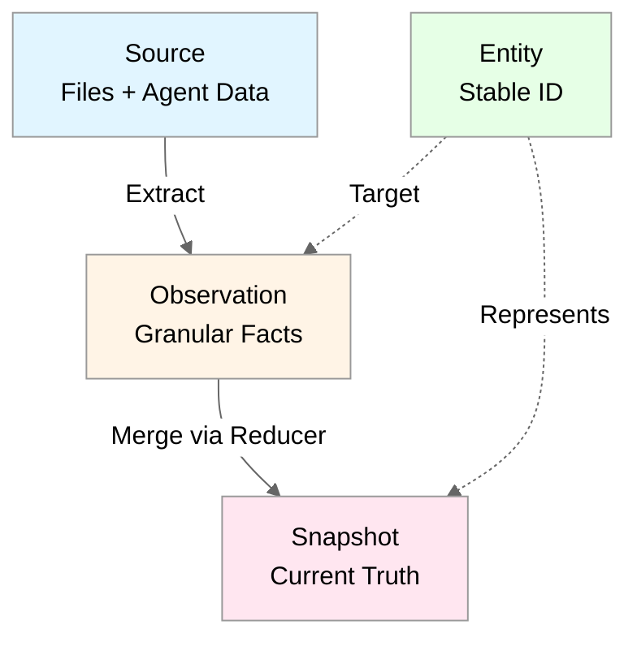
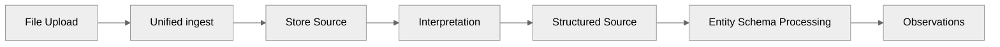
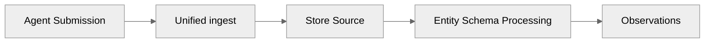

# Source Model Architecture

**Authoritative Vocabulary:** [`docs/vocabulary/canonical_terms.md`](../vocabulary/canonical_terms.md)

## Overview

The [source](../vocabulary/canonical_terms.md#source) model unifies [ingestion](../vocabulary/canonical_terms.md#ingestion) through a single write primitive. Agents and file upload handlers submit [source](../vocabulary/canonical_terms.md#source) via the unified `ingest` MCP action. The server processes [source](../vocabulary/canonical_terms.md#source) into [observations](../vocabulary/canonical_terms.md#observation) and [entities](../vocabulary/canonical_terms.md#entity) using [entity schemas](../vocabulary/canonical_terms.md#entity-schema) with deterministic [extraction](../vocabulary/canonical_terms.md#extraction) rules.

**Key Principle:** Agents submit [source](../vocabulary/canonical_terms.md#source). The server compiles knowledge.

## Three-Layer Truth Model

Neotoma implements a three-layer truth model:

1. **[Source](../vocabulary/canonical_terms.md#source)** — Unified [ingestion](../vocabulary/canonical_terms.md#ingestion) primitive (files + agent data)
2. **[Observation](../vocabulary/canonical_terms.md#observation)** — Granular facts [extracted](../vocabulary/canonical_terms.md#extraction) from [source](../vocabulary/canonical_terms.md#source)
3. **[Entity](../vocabulary/canonical_terms.md#entity)** — Logical thing with stable ID
4. **[Snapshot](../vocabulary/canonical_terms.md#snapshot)** — Deterministic [reducer](../vocabulary/canonical_terms.md#reducer) output

**Rationale:** [Source](../vocabulary/canonical_terms.md#source) serves as the document layer, unifying file uploads and agent submissions into a single [ingestion](../vocabulary/canonical_terms.md#ingestion) path. This eliminates the previous document/record separation and simplifies the architecture.



## Unified `ingest` Action

Agents and file handlers submit [source](../vocabulary/canonical_terms.md#source) via the unified `ingest` MCP action:

**For Unstructured [Source](../vocabulary/canonical_terms.md#source):**
```typescript
// Unstructured source (files, raw text)
{
  user_id: string;                    // Required: User ID (UUID)
  file_content: string;               // Base64-encoded file content
  mime_type: string;                  // MIME type (e.g., "application/pdf")
  original_filename?: string;         // Optional: Original filename
  interpret?: boolean;                // Optional: Run interpretation (default: true)
  interpretation_config?: {           // Optional: Interpretation configuration
    provider?: string;
    model_id?: string;
    temperature?: number;
  };
}
```

**For Structured [Source](../vocabulary/canonical_terms.md#source):**
```typescript
// Structured source (JSON with entity types)
{
  user_id: string;                    // Required: User ID (UUID)
  entities: Array<{                   // Array of entity data
    entity_type: string;              // Entity type (e.g., "invoice", "note")
    // ... entity-specific fields
  }>;
  provenance?: {
    source_refs?: string[];           // Immediate source IDs
    extracted_at: string;             // ISO 8601 timestamp
    extractor_version: string;        // Version string
    agent_id?: string;                // Optional agent identifier
  };
}
```

## [Entity Schema](../vocabulary/canonical_terms.md#entity-schema) (Replaces Capabilities)

[Entity schemas](../vocabulary/canonical_terms.md#entity-schema) define how [source](../vocabulary/canonical_terms.md#source) is processed. Each [entity type](../vocabulary/canonical_terms.md#entity-type) has an [entity schema](../vocabulary/canonical_terms.md#entity-schema) that includes:

```typescript
interface EntitySchema {
  entity_type: string;                        // "invoice", "transaction", etc.
  schema_version: string;                     // Schema registry version
  fields: Record<string, FieldDefinition>;    // Field definitions
  merge_policies: Record<string, MergePolicy>; // Per-field merge policies
  canonicalization_rules: CanonicalizationRules; // For deduplication
  entity_extraction_rules: EntityExtractionRule[]; // Multi-entity extraction
}
```

**[Entity Schema](../vocabulary/canonical_terms.md#entity-schema) Components:**
- **Field definitions**: Types, validators, required fields
- **Merge policies**: How [observations](../vocabulary/canonical_terms.md#observation) are merged into [entity snapshots](../vocabulary/canonical_terms.md#entity-snapshot)
- **[Canonicalization rules](../vocabulary/canonical_terms.md#canonicalization-rules)**: For deterministic deduplication
- **[Entity extraction rules](../vocabulary/canonical_terms.md#entity-extraction-rule)**: For multi-[entity](../vocabulary/canonical_terms.md#entity) [extraction](../vocabulary/canonical_terms.md#extraction)

**Initial [Entity Types](../vocabulary/canonical_terms.md#entity-type):**
- `invoice`
- `transaction`
- `receipt`
- `contract`
- `note`
- `company`
- `person`
- `task`

## [Entity Extraction Rules](../vocabulary/canonical_terms.md#entity-extraction-rule)

All [source](../vocabulary/canonical_terms.md#source) [extracts](../vocabulary/canonical_terms.md#extraction) at least one [entity](../vocabulary/canonical_terms.md#entity). [Entity schemas](../vocabulary/canonical_terms.md#entity-schema) define [extraction](../vocabulary/canonical_terms.md#extraction) rules:

```typescript
interface EntityExtractionRule {
  source_field?: string;      // Field in source
  entity_type: string;        // Entity type to create
  extraction_type: "material_self" | "field_value" | "array_items";
}
```

**[Extraction](../vocabulary/canonical_terms.md#extraction) Types:**
1. **`material_self`**: [Source](../vocabulary/canonical_terms.md#source) itself becomes [entity](../vocabulary/canonical_terms.md#entity) (e.g., note → note [entity](../vocabulary/canonical_terms.md#entity))
2. **`field_value`**: [Extract](../vocabulary/canonical_terms.md#extraction) from single field (e.g., vendor_name → company [entity](../vocabulary/canonical_terms.md#entity))
3. **`array_items`**: [Extract](../vocabulary/canonical_terms.md#extraction) from array field (e.g., tasks array → task [entities](../vocabulary/canonical_terms.md#entity))

**Example: Note with tasks**
```typescript
// Structured source via unified ingest action
{
  user_id: "user-uuid",
  entities: [{
    entity_type: "note",
    title: "Project Alpha",
    content: "Project notes...",
    tasks: ["Design UI", "Implement API", "Write tests"]
  }],
  provenance: {
    source_refs: [],
    extracted_at: "2025-01-15T10:00:00Z",
    extractor_version: "neotoma-mcp:v0.2.15"
  }
}
```

**[Entities](../vocabulary/canonical_terms.md#entity) [extracted](../vocabulary/canonical_terms.md#extraction):**
- Note [entity](../vocabulary/canonical_terms.md#entity) (from `material_self` rule): "Project Alpha"
- Task [entity](../vocabulary/canonical_terms.md#entity): "Design UI"
- Task [entity](../vocabulary/canonical_terms.md#entity): "Implement API"
- Task [entity](../vocabulary/canonical_terms.md#entity): "Write tests"

## Deduplication Strategy

[Source](../vocabulary/canonical_terms.md#source) uses deterministic deduplication via `content_id`:

1. **Normalize** data per [entity schema](../vocabulary/canonical_terms.md#entity-schema) [canonicalization rules](../vocabulary/canonical_terms.md#canonicalization-rules)
2. **Compute hash** from: `{ entity_type, normalized_body, source_refs, extractor_version }`
3. **Check for existing** [source](../vocabulary/canonical_terms.md#source) with same `content_id`
4. **Return existing** if duplicate, **create new** if unique

**Unique constraint:** `content_id` is unique in `sources` table.

## [Provenance](../vocabulary/canonical_terms.md#provenance) Tracking

[Source](../vocabulary/canonical_terms.md#source) [provenance](../vocabulary/canonical_terms.md#provenance) includes:
- **`source_refs`**: Immediate source IDs (not full chain)
- **`extracted_at`**: ISO 8601 timestamp
- **`extractor_version`**: Version of [extraction](../vocabulary/canonical_terms.md#extraction) logic
- **`agent_id`**: Optional agent identifier

**[Provenance](../vocabulary/canonical_terms.md#provenance) chain:** [Source](../vocabulary/canonical_terms.md#source) → [Observation](../vocabulary/canonical_terms.md#observation) → [Entity](../vocabulary/canonical_terms.md#entity) → [Snapshot](../vocabulary/canonical_terms.md#snapshot)

Each layer maintains full [provenance](../vocabulary/canonical_terms.md#provenance):
- [Observations](../vocabulary/canonical_terms.md#observation) reference `source_material_id`
- [Snapshots](../vocabulary/canonical_terms.md#snapshot) include [provenance](../vocabulary/canonical_terms.md#provenance) from [observations](../vocabulary/canonical_terms.md#observation)
- Timeline [events](../vocabulary/canonical_terms.md#event) reference [source](../vocabulary/canonical_terms.md#source)

## [Ingestion](../vocabulary/canonical_terms.md#ingestion) Flow

### Unstructured [Source](../vocabulary/canonical_terms.md#source) (Files)



1. **Upload file** via `ingest` with `file_content` and `mime_type`
2. **Store** unstructured [source](../vocabulary/canonical_terms.md#source) with content-addressed deduplication
3. **Run [interpretation](../vocabulary/canonical_terms.md#interpretation)** to transform into structured [source](../vocabulary/canonical_terms.md#source) with [entity types](../vocabulary/canonical_terms.md#entity-type)
4. **Process via [entity schema](../vocabulary/canonical_terms.md#entity-schema)** for normalization and [entity extraction](../vocabulary/canonical_terms.md#entity-extraction-rule)
5. **Create [observations](../vocabulary/canonical_terms.md#observation)** for each [extracted](../vocabulary/canonical_terms.md#extraction) [entity](../vocabulary/canonical_terms.md#entity)

### Structured [Source](../vocabulary/canonical_terms.md#source) (Agent Data)



1. **Submit** via `ingest` with `entities` array
2. **Store** structured [source](../vocabulary/canonical_terms.md#source) with content-addressed deduplication
3. **Process via [entity schema](../vocabulary/canonical_terms.md#entity-schema)** for normalization and [entity extraction](../vocabulary/canonical_terms.md#entity-extraction-rule)
4. **Create [observations](../vocabulary/canonical_terms.md#observation)** for each [extracted](../vocabulary/canonical_terms.md#extraction) [entity](../vocabulary/canonical_terms.md#entity)

**Unified [ingestion](../vocabulary/canonical_terms.md#ingestion):** Files and agent submissions both create [source](../vocabulary/canonical_terms.md#source) — single write primitive.

## UX Model

**Primary UX:** [Entities](../vocabulary/canonical_terms.md#entity), [observations](../vocabulary/canonical_terms.md#observation), [relationships](../vocabulary/canonical_terms.md#relationship) (what users interact with)

**Secondary UX:** [Source](../vocabulary/canonical_terms.md#source) inspection (historical/debugging via MCP queries, temporal log review)

**Key Points:**
- [Source](../vocabulary/canonical_terms.md#source) is internal storage artifacts, not primary user-facing objects
- File uploads create [source](../vocabulary/canonical_terms.md#source), but UI shows resulting [entities](../vocabulary/canonical_terms.md#entity)/[observations](../vocabulary/canonical_terms.md#observation)
- [Source](../vocabulary/canonical_terms.md#source) inspection available via MCP queries for debugging/[provenance](../vocabulary/canonical_terms.md#provenance)

**UI Navigation:**
- [Entity](../vocabulary/canonical_terms.md#entity) lists and detail views
- [Observation](../vocabulary/canonical_terms.md#observation) [provenance](../vocabulary/canonical_terms.md#provenance) panels
- [Relationship](../vocabulary/canonical_terms.md#relationship) graphs
- Timeline views

**[Source](../vocabulary/canonical_terms.md#source) Inspection:**
- MCP queries for [source](../vocabulary/canonical_terms.md#source) history
- Temporal log review (audit trail)
- [Provenance](../vocabulary/canonical_terms.md#provenance) chains (which [source](../vocabulary/canonical_terms.md#source) contributed to [entity](../vocabulary/canonical_terms.md#entity))

## Migration from Legacy Systems

**v0.2.15 Breaking Change:**
- **Removed:** `store_record` MCP action
- **Deprecated:** `submit_payload` and `ingest_structured` MCP actions (merged into unified `ingest`)
- **Eliminated:** `records` table (replaced by `sources` table)
- **Updated:** [Observations](../vocabulary/canonical_terms.md#observation) reference `source_material_id` instead of `source_record_id` or `source_payload_id`
- **Eliminated:** Capability registry (rules moved to [entity schemas](../vocabulary/canonical_terms.md#entity-schema))

**Migration strategy:** See [`docs/releases/v0.2.15/release_plan.md`](../releases/v0.2.15/release_plan.md)

## Design Decisions

1. **[Source](../vocabulary/canonical_terms.md#source) Storage:** Dedicated `sources` table with unique constraint on `content_id`
2. **[Entity Schema](../vocabulary/canonical_terms.md#entity-schema) Versioning:** Version bumps create new schema version
3. **[Provenance](../vocabulary/canonical_terms.md#provenance) Depth:** `source_refs` includes immediate source IDs only (not full chain)
4. **Three-Layer Model:** [Source](../vocabulary/canonical_terms.md#source) → [Observation](../vocabulary/canonical_terms.md#observation) → [Entity](../vocabulary/canonical_terms.md#entity) → [Snapshot](../vocabulary/canonical_terms.md#snapshot)
5. **Unified [Ingestion](../vocabulary/canonical_terms.md#ingestion):** File uploads and agent submissions both use unified `ingest` action
6. **[Observation](../vocabulary/canonical_terms.md#observation) Schema:** `source_material_id` references [source](../vocabulary/canonical_terms.md#source)
7. **[Entity Extraction](../vocabulary/canonical_terms.md#entity-extraction-rule):** All [source](../vocabulary/canonical_terms.md#source) [extracts](../vocabulary/canonical_terms.md#extraction) at least one [entity](../vocabulary/canonical_terms.md#entity)
8. **No Capabilities:** [Canonicalization rules](../vocabulary/canonical_terms.md#canonicalization-rules) and [entity extraction rules](../vocabulary/canonical_terms.md#entity-extraction-rule) defined in [entity schemas](../vocabulary/canonical_terms.md#entity-schema)

## Success Criteria

- Agents can submit [source](../vocabulary/canonical_terms.md#source) via unified `ingest` MCP action
- Same [source](../vocabulary/canonical_terms.md#source) content → same `content_id` (deterministic deduplication)
- [Source](../vocabulary/canonical_terms.md#source) compiles into [observations](../vocabulary/canonical_terms.md#observation) → [entities](../vocabulary/canonical_terms.md#entity) → [entity snapshots](../vocabulary/canonical_terms.md#entity-snapshot)
- File uploads create [source](../vocabulary/canonical_terms.md#source) (unified [ingestion](../vocabulary/canonical_terms.md#ingestion) path)
- [Observations](../vocabulary/canonical_terms.md#observation) reference `source_material_id`
- All [source](../vocabulary/canonical_terms.md#source) [extracts](../vocabulary/canonical_terms.md#extraction) at least one [entity](../vocabulary/canonical_terms.md#entity)
- Multi-[entity](../vocabulary/canonical_terms.md#entity) [extraction](../vocabulary/canonical_terms.md#extraction) supported (note with tasks example)

