# Neotoma Documentation System — Index and Navigation Guide

_(Primary Entrypoint for All AI Agents and Developers)_

---

## Purpose

This document serves as the **primary entrypoint** for all AI assistants (Cursor, ChatGPT, Claude, IDE agents) and developers working on the Neotoma codebase. It provides:

1. A complete map of the documentation system
2. Reading-order rules for different types of changes
3. Dependency relationships between documents
4. Quick-reference guide to finding relevant context
5. Rules for deterministic documentation consumption

**Every agent session MUST begin by loading this file.**

---

## Scope

This index covers:

- All documentation files in the `docs/` directory
- Reading strategies for different change types
- Documentation dependency graph
- Feature Unit workflow integration

This index does NOT cover:

- Implementation details (see subsystem docs)
- Specific API contracts (see architecture docs)
- Test execution (see testing docs)

---

## 1. Documentation Hierarchy and Reading Order

### 1.1 Foundational Documents (Load FIRST, ALWAYS)

These documents are the **root of truth** for all Neotoma work:

1. **Foundation Documents** (`docs/foundation/`)

   - **Core Identity:** [`docs/foundation/core_identity.md`](../foundation/core_identity.md) — What Neotoma is and is not
   - **Philosophy:** [`docs/foundation/philosophy.md`](../foundation/philosophy.md) — Core principles and architectural invariants
   - **Layered Architecture:** [`docs/foundation/layered_architecture.md`](../foundation/layered_architecture.md) — Truth Layer, Strategy Layer, Execution Layer
   - **Problem Statement:** [`docs/foundation/problem_statement.md`](../foundation/problem_statement.md) — Why Neotoma exists
   - **Product Positioning:** [`docs/foundation/product_positioning.md`](../foundation/product_positioning.md) — Market positioning
   - **User Workflows:** [`docs/foundation/user_workflows.md`](../foundation/user_workflows.md) — Key workflows
   - **Product Principles:** [`docs/foundation/product_principles.md`](../foundation/product_principles.md) — Product design principles
   - **Data Models:** [`docs/foundation/data_models.md`](../foundation/data_models.md) — Global data commitments
   - **Entity Resolution:** [`docs/foundation/entity_resolution.md`](../foundation/entity_resolution.md) — Entity doctrine
   - **Timeline Events:** [`docs/foundation/timeline_events.md`](../foundation/timeline_events.md) — Event doctrine
   - **AI Safety:** [`docs/foundation/ai_safety.md`](../foundation/ai_safety.md) — AI tool interaction rules
   - **Quality Requirements:** [`docs/foundation/quality_requirements.md`](../foundation/quality_requirements.md) — Testing, observability, privacy, security
   - **Agent Instructions:** [`docs/foundation/agent_instructions.md`](../foundation/agent_instructions.md) — Complete agent instructions and validation checklist
   - **Load foundation documents FIRST in every agent session**

2. **[`docs/private/governance/00_GENERATION.md`](../private/governance/00_GENERATION.md)**
   - Master checklist for documentation generation
   - Required sections for each doc type
   - Global doctrine (determinism, Truth Layer boundaries)
   - **Load when creating or regenerating documentation**

### 1.2 Documentation Conventions

4. **[`docs/conventions/documentation_standards.md`](../conventions/documentation_standards.md)**
   - Shared formatting, structure, and style rules
   - Mermaid diagram standards
   - Example formatting requirements
   - MUST/MUST NOT language conventions
   - **Load when creating or modifying any documentation**

---

## 2. Documentation Categories and Structure

### 2.1 Consolidated Specifications (High-Level Summaries)

**Directory:** `docs/specs/`

**Purpose:** Executive summaries and consolidated specifications for stakeholders, planning, and quick reference.

| Document                                                                  | Purpose                                                            | Audience                          |
| ------------------------------------------------------------------------- | ------------------------------------------------------------------ | --------------------------------- |
| [`MVP_OVERVIEW.md`](../specs/MVP_OVERVIEW.md)                             | Executive summary of Neotoma MVP                                   | Stakeholders, new team members    |
| [`GENERAL_REQUIREMENTS.md`](../specs/GENERAL_REQUIREMENTS.md)             | High-level MVP ingestion + UI requirements                         | Product, implementation planning  |
| [`ICP_PRIORITY_TIERS.md`](../specs/ICP_PRIORITY_TIERS.md)                 | Target user tiers, GTM strategy, revenue prioritization            | Product, GTM, planning            |
| [`ICP_PROFILES.md`](../specs/ICP_PROFILES.md)                             | Detailed profiles for all ICPs (pain points, use cases, workflows) | Product, design, marketing, sales |
| [`FUNCTIONAL_REQUIREMENTS.md`](../specs/FUNCTIONAL_REQUIREMENTS.md)       | Consolidated functional requirements                               | Product, planning                 |
| [`NONFUNCTIONAL_REQUIREMENTS.md`](../specs/NONFUNCTIONAL_REQUIREMENTS.md) | Performance, security, quality requirements                        | Product, engineering leads        |
| [`METRICS_REQUIREMENTS.md`](../specs/METRICS_REQUIREMENTS.md)             | Activation, business, and technical metrics                        | Product, analytics                |
| [`DATA_MODELS.md`](../specs/DATA_MODELS.md)                               | Record, Entity, Event model summaries                              | Product, data analysts            |
| [`MCP_SPEC.md`](../specs/MCP_SPEC.md)                                     | Complete MCP action catalog                                        | AI tool integrators               |
| [`UI_SPEC.md`](../specs/UI_SPEC.md)                                       | UI patterns and design summary                                     | Product, designers                |
| [`ONBOARDING_SPEC.md`](../specs/ONBOARDING_SPEC.md)                       | First-run user experience                                          | Product, UX                       |
| [`TEST_PLAN.md`](../specs/TEST_PLAN.md)                                   | Testing strategy summary                                           | QA, engineering leads             |

**Note:** These are **synthesis documents**. For implementation details, use the modular docs below (architecture/, subsystems/, etc.).

---

### 2.2 Architecture (Core System Design)

**Directory:** `docs/architecture/`

| Document                                                                                 | Purpose                                                 | Load When                                                              |
| ---------------------------------------------------------------------------------------- | ------------------------------------------------------- | ---------------------------------------------------------------------- |
| [`architecture.md`](../architecture/architecture.md)                                     | Canonical platform architecture, layers, boundaries     | Any structural change, new subsystem, cross-layer interaction          |
| [`architectural_decisions.md`](../architecture/architectural_decisions.md)               | Core architectural decisions and four-layer truth model | Making architectural decisions, understanding observation architecture |
| [`consistency.md`](../architecture/consistency.md)                                       | Consistency models per subsystem, UI handling rules     | Working with async operations, indexing, or eventual consistency       |
| [`determinism.md`](../architecture/determinism.md)                                       | Determinism doctrine, ordering rules, testing patterns  | Any logic that must be reproducible, sorting, or randomness concerns   |
| [`conversational_ux_architecture.md`](../architecture/conversational_ux_architecture.md) | MCP-first conversational architecture decision          | Evaluating chat/conversational features, UI component design           |

### 2.3 Subsystems (Domain-Specific Logic)

**Directory:** `docs/subsystems/`

#### Core Data and Schema

| Document                                                                   | Purpose                                                           | Load When                                                                |
| -------------------------------------------------------------------------- | ----------------------------------------------------------------- | ------------------------------------------------------------------------ |
| [`schema.md`](../subsystems/schema.md)                                     | DB tables, JSONB structures, schema evolution                     | Modifying database schema, adding fields, migrations                     |
| [`record_types.md`](../subsystems/record_types.md)                         | Canonical application type catalog, field mappings, extract rules | Working with record types, schema detection, extraction, entities/events |
| [`observation_architecture.md`](../subsystems/observation_architecture.md) | Complete overview of observation architecture, four-layer model   | Understanding observation layer, snapshot computation, provenance        |
| [`reducer.md`](../subsystems/reducer.md)                                   | Reducer engine patterns, merge strategies, determinism            | Implementing reducers, configuring merge policies, testing snapshots     |
| [`relationships.md`](../subsystems/relationships.md)                       | Relationship types, graph patterns, query patterns                | Creating relationships, graph traversal, relationship metadata           |

#### Ingestion Pipeline

| Document                                                                   | Purpose                                                     | Load When                                                 |
| -------------------------------------------------------------------------- | ----------------------------------------------------------- | --------------------------------------------------------- |
| [`ingestion/ingestion.md`](../subsystems/ingestion/ingestion.md)           | Full ingestion pipeline, deduplication, chunking, embedding | Working with file upload, processing, or extraction logic |
| [`ingestion/state_machines.md`](../subsystems/ingestion/state_machines.md) | Canonical ingestion state machine, transitions, retries     | Managing ingestion status, error handling, retry logic    |

#### Search and Retrieval

| Document                                             | Purpose                                                | Load When                                                      |
| ---------------------------------------------------- | ------------------------------------------------------ | -------------------------------------------------------------- |
| [`search/search.md`](../subsystems/search/search.md) | Search query models, ranking, filtering, pagination    | Implementing search features, query logic, or ranking          |
| [`vector_ops.md`](../subsystems/vector_ops.md)       | Embedding lifecycle, vector indexes, similarity search | Working with embeddings, vector storage, or similarity queries |

#### Cross-Cutting Concerns

| Document                                             | Purpose                                                       | Load When                                                 |
| ---------------------------------------------------- | ------------------------------------------------------------- | --------------------------------------------------------- |
| [`auth.md`](../subsystems/auth.md)                   | Authentication flows, permissions, access control             | Implementing auth, adding permissions, securing endpoints |
| [`i18n.md`](../subsystems/i18n.md)                   | Locale vs content language, formatting, cross-language search | Handling locales, translations, or multi-language content |
| [`accessibility.md`](../subsystems/accessibility.md) | Semantic HTML, keyboard nav, ARIA, focus management           | Building UI components, forms, or interactive elements    |
| [`privacy.md`](../subsystems/privacy.md)             | PII categories, logging restrictions, retention, erasure      | Handling user data, logging, or implementing deletion     |
| [`events.md`](../subsystems/events.md)               | Event envelope schema, emission rules, event types            | Emitting events, tracking state changes, observability    |
| [`errors.md`](../subsystems/errors.md)               | Error envelope, canonical error codes, propagation            | Implementing error handling, defining new error types     |

### 2.4 Feature Units (Development Workflow)

**Directory:** `docs/feature_units/standards/`

| Document                                                                            | Purpose                                                                                   | Load When                                                  |
| ----------------------------------------------------------------------------------- | ----------------------------------------------------------------------------------------- | ---------------------------------------------------------- |
| [`release_workflow.md`](../feature_units/standards/release_workflow.md)             | **Release orchestration workflow** (multi-FU coordination, batching, integration testing) | **Planning/executing releases** (MVP = first release)      |
| [`creating_feature_units.md`](../feature_units/standards/creating_feature_units.md) | **Complete workflow for creating new Feature Units** (4 checkpoints)                      | **Starting a new Feature Unit** — primary reference        |
| [`feature_unit_spec.md`](../feature_units/standards/feature_unit_spec.md)           | Feature Unit definition, spec template, examples                                          | Planning a new feature or reviewing Feature Unit structure |
| [`manifest_template.yaml`](../feature_units/standards/manifest_template.yaml)       | YAML schema for manifests, i18n, A11y, metrics fields                                     | Creating a Feature Unit manifest                           |
| [`execution_instructions.md`](../feature_units/standards/execution_instructions.md) | Feature Unit lifecycle, planning hierarchy, implementation flow                           | Implementing an existing Feature Unit after spec approval  |
| [`error_protocol.md`](../feature_units/standards/error_protocol.md)                 | Error classification (Class 1/2/3), remediation, regression tests                         | Handling Feature Unit errors, debugging, or post-mortems   |

### 2.5 UI Design System

**Directory:** `docs/ui/`

| Document                                                                     | Purpose                                           | Load When                                                               |
| ---------------------------------------------------------------------------- | ------------------------------------------------- | ----------------------------------------------------------------------- |
| [`dsl_spec.md`](../ui/dsl_spec.md)                                           | UI DSL schema, components, interaction model      | Defining UI specs, generating components, or understanding UI structure |
| [`design_constraints_template.yaml`](../ui/design_constraints_template.yaml) | Brand, density, hierarchy, A11y, i18n constraints | Planning UI design, setting visual standards                            |

**UI Patterns:** `docs/ui/patterns/`

| Document                                      | Purpose                                               | Load When                              |
| --------------------------------------------- | ----------------------------------------------------- | -------------------------------------- |
| [`list.md`](../ui/patterns/list.md)           | List view pattern (tables, grids, filters)            | Building list/table views              |
| [`detail.md`](../ui/patterns/detail.md)       | Detail view pattern (single item, metadata, actions)  | Building detail/single-item views      |
| [`dashboard.md`](../ui/patterns/dashboard.md) | Dashboard pattern (widgets, metrics, summaries)       | Building dashboard or overview pages   |
| [`wizard.md`](../ui/patterns/wizard.md)       | Wizard/multi-step pattern (onboarding, complex forms) | Building multi-step flows              |
| [`settings.md`](../ui/patterns/settings.md)   | Settings pattern (preferences, configuration)         | Building settings or configuration UIs |

### 2.6 Testing and Quality

**Directory:** `docs/testing/`

| Document                                                  | Purpose                                                      | Load When                             |
| --------------------------------------------------------- | ------------------------------------------------------------ | ------------------------------------- |
| [`testing_standard.md`](../testing/testing_standard.md)   | Test types, required tests per Feature Unit, coverage rules  | Writing tests, planning test strategy |
| [`fixtures_standard.md`](../testing/fixtures_standard.md) | Fixture categories, naming, multi-language, privacy handling | Creating test fixtures or test data   |

### 2.7 Observability

**Directory:** `docs/observability/`

| Document                                                      | Purpose                                   | Load When                                   |
| ------------------------------------------------------------- | ----------------------------------------- | ------------------------------------------- |
| [`metrics_standard.md`](../observability/metrics_standard.md) | Metrics naming, types, collection rules   | Adding metrics, instrumentation             |
| [`logging.md`](../observability/logging.md)                   | Logging schema, levels, PII restrictions  | Adding logs, debugging                      |
| [`tracing.md`](../observability/tracing.md)                   | Tracing span naming, propagation, context | Adding tracing, debugging distributed flows |

### 2.8 Migration and Evolution

**Directory:** `docs/private/migration/`

| Document                                                                  | Purpose                                                | Load When                              |
| ------------------------------------------------------------------------- | ------------------------------------------------------ | -------------------------------------- |
| [`migrations_lifecycle.md`](../private/migration/migrations_lifecycle.md) | Migration versioning, rollback, backward compatibility | Creating database or schema migrations |

### 2.9 Governance and Risk

**Directories:** `docs/private/governance/` and `docs/private/strategy_governance/`

| Document                                                                               | Purpose                                                                    | Load When                                                  |
| -------------------------------------------------------------------------------------- | -------------------------------------------------------------------------- | ---------------------------------------------------------- |
| [`operational_strategy.md`](../private/strategy_governance/operational_strategy.md)    | Company strategy, financing, organizational design, operational principles | Strategic planning, business decisions, capital allocation |
| [`revenue_timeline.md`](../private/strategy_governance/revenue_timeline.md)            | Time-bound revenue objectives, milestone dates, execution timeline         | Revenue planning, milestone tracking, progress review      |
| [`user_acquisition.md`](../private/strategy_governance/user_acquisition.md)            | User acquisition strategy and ICP sequencing                               | Planning GTM and acquisition                               |
| [`agent_global.md`](../private/governance/agent_global.md)                             | Global agent rules, boundaries, constraints                                | Any automated or agent-driven development                  |
| [`agent_background_execution.md`](../private/governance/agent_background_execution.md) | Rules for background/autonomous execution                                  | Running automated tasks or background jobs                 |
| [`review_checklist_mark.md`](../private/governance/review_checklist_mark.md)           | Human review checklist for risky changes                                   | Reviewing PRs, especially high-risk changes                |
| [`risk_classification.md`](../private/governance/risk_classification.md)               | Risk levels, hold points, approval thresholds                              | Assessing risk of a change, determining review needs       |

### 2.10 Developer Documentation

**Directory:** `docs/developer/`

| Document                                                          | Purpose                                     | Load When                                                     |
| ----------------------------------------------------------------- | ------------------------------------------- | ------------------------------------------------------------- |
| [`getting_started.md`](../developer/getting_started.md)           | Local environment setup, first contribution | Setting up development environment, onboarding new developers |
| [`development_workflow.md`](../developer/development_workflow.md) | Git workflow, branch strategy, PR process   | Creating feature branches, preparing pull requests            |

### 2.11 Integration Documentation

**Directory:** `docs/integrations/`

| Document                                                         | Purpose                                      | Load When                                           |
| ---------------------------------------------------------------- | -------------------------------------------- | --------------------------------------------------- |
| [`gmail_setup.md`](../integrations/gmail_setup.md)               | Gmail OAuth setup, attachment import         | Setting up Gmail integration, troubleshooting OAuth |
| [`plaid_setup.md`](../integrations/plaid_setup.md)               | Plaid sandbox setup, bank connection         | Setting up Plaid integration, testing transactions  |
| [`external_providers.md`](../integrations/external_providers.md) | Post-MVP provider setup (X, Instagram, etc.) | Setting up post-MVP external provider integrations  |

### 2.12 Operations and Infrastructure

**Directory:** `docs/operations/` and `docs/infrastructure/`

| Document                                                 | Purpose                      | Load When                                                   |
| -------------------------------------------------------- | ---------------------------- | ----------------------------------------------------------- |
| [`troubleshooting.md`](../operations/troubleshooting.md) | Common issues and solutions  | Debugging setup or runtime issues                           |
| [`deployment.md`](../infrastructure/deployment.md)       | Fly.io deployment procedures | Deploying to production, configuring production environment |

### 2.13 Legal and Compliance

**Directory:** `docs/legal/`

| Document                                              | Purpose                                               | Load When                                                                 |
| ----------------------------------------------------- | ----------------------------------------------------- | ------------------------------------------------------------------------- |
| [`compliance.md`](../legal/compliance.md)             | GDPR compliance, breach response, incident management | Handling data subject requests, responding to breaches, compliance audits |
| [`privacy_policy.md`](../legal/privacy_policy.md)     | Privacy Policy template                               | Updating privacy policy, legal review                                     |
| [`terms_of_service.md`](../legal/terms_of_service.md) | Terms of Service template                             | Updating terms of service, legal review                                   |
| [`README.md`](../legal/README.md)                     | Legal documentation index                             | Navigating legal documentation                                            |

### 2.14 API Documentation

**Directory:** `docs/api/` and `docs/reference/`

| Document                                        | Purpose                     | Load When                                                     |
| ----------------------------------------------- | --------------------------- | ------------------------------------------------------------- |
| [`rest_api.md`](../api/rest_api.md)             | REST API endpoint reference | Implementing frontend API calls, integrating external clients |
| [`error_codes.md`](../reference/error_codes.md) | Complete error code catalog | Implementing error handling, debugging API errors             |

### 2.15 Vocabulary and Templates

**Directory:** `docs/vocabulary/` and `docs/templates/`

| Document                                                 | Purpose                                              | Load When                                            |
| -------------------------------------------------------- | ---------------------------------------------------- | ---------------------------------------------------- |
| [`canonical_terms.md`](../vocabulary/canonical_terms.md) | Domain vocabulary, forbidden synonyms, correct usage | Writing specs, docs, or code with domain terminology |
| `templates/pr_template.md`                               | PR template with required fields                     | Creating a pull request                              |
| `templates/issue_template.md`                            | Issue template for bug reports and features          | Creating an issue                                    |

---

## 3. Documentation Dependency Graph

The following diagram shows which documents depend on which foundational contexts:

```mermaid
%%{init: {'theme':'neutral'}}%%
graph TD
    %% Foundational Layer
    NeoManifest[NEOTOMA_MANIFEST.md]
    Generation[private/governance/00_GENERATION.md]
    Conventions[conventions/documentation_standards.md]

    %% Architecture Layer
    Architecture[architecture/architecture.md]
    ArchDecisions[architecture/architectural_decisions.md]
    Consistency[architecture/consistency.md]
    Determinism[architecture/determinism.md]

    %% Subsystems Layer
    Schema[subsystems/schema.md]
    ObservationArch[subsystems/observation_architecture.md]
    Reducer[subsystems/reducer.md]
    SchemaRegistry[subsystems/schema_registry.md]
    Relationships[subsystems/relationships.md]
    Ingestion[subsystems/ingestion/ingestion.md]
    StateMachines[subsystems/ingestion/state_machines.md]
    Search[subsystems/search/search.md]
    VectorOps[subsystems/vector_ops.md]
    Auth[subsystems/auth.md]
    I18n[subsystems/i18n.md]
    A11y[subsystems/accessibility.md]
    Privacy[subsystems/privacy.md]
    Events[subsystems/events.md]
    Errors[subsystems/errors.md]

    %% Feature Units Layer
    FUSpec[feature_units/standards/feature_unit_spec.md]
    Manifest[feature_units/standards/manifest_template.yaml]
    Execution[feature_units/standards/execution_instructions.md]
    ErrorProtocol[feature_units/standards/error_protocol.md]

    %% UI Layer
    DSL[ui/dsl_spec.md]
    DesignConstraints[ui/design_constraints_template.yaml]
    UIPatterns[ui/patterns/*.md]

    %% Testing & Observability
    TestStandard[testing/testing_standard.md]
    Fixtures[testing/fixtures_standard.md]
    Metrics[observability/metrics_standard.md]
    Logging[observability/logging.md]
    Tracing[observability/tracing.md]

    %% Governance
    AgentGlobal[private/governance/agent_global.md]
    RiskClass[private/governance/risk_classification.md]

    %% Dependencies: Manifest to Architecture
    NeoManifest --> Architecture
    NeoManifest --> ArchDecisions
    NeoManifest --> Consistency
    NeoManifest --> Determinism
    Conventions --> Architecture
    Conventions --> ArchDecisions
    Conventions --> Consistency
    Conventions --> Determinism
    Architecture --> ArchDecisions

    %% Dependencies: Architecture to Subsystems
    Architecture --> Schema
    Architecture --> Ingestion
    Architecture --> Search
    Architecture --> Auth
    ArchDecisions --> ObservationArch
    ArchDecisions --> Reducer
    ArchDecisions --> Relationships
    ArchDecisions --> Schema
    Determinism --> Schema
    Determinism --> Ingestion
    Determinism --> Search
    Determinism --> Reducer
    Consistency --> Ingestion
    Consistency --> Search
    Consistency --> ObservationArch

    %% Dependencies: Subsystems Internal
    Schema --> Ingestion
    Schema --> ObservationArch
    Schema --> SchemaRegistry
    Ingestion --> StateMachines
    Ingestion --> ObservationArch
    ObservationArch --> Reducer
    ObservationArch --> SchemaRegistry
    Reducer --> SchemaRegistry
    SchemaRegistry --> Schema
    ObservationArch --> Relationships
    Schema --> Search
    Schema --> VectorOps
    Ingestion --> VectorOps
    Reducer --> Schema

    %% Dependencies: Cross-cutting
    Architecture --> I18n
    Architecture --> A11y
    Architecture --> Privacy
    Architecture --> Events
    Architecture --> Errors
    Privacy --> Logging
    Events --> Errors

    %% Dependencies: Feature Units
    NeoManifest --> FUSpec
    Architecture --> FUSpec
    FUSpec --> FUManifest
    FUSpec --> Execution
    FUSpec --> ErrorProtocol
    Errors --> ErrorProtocol

    %% Dependencies: UI
    NeoManifest --> DSL
    A11y --> DSL
    I18n --> DSL
    DSL --> DesignConstraints
    DSL --> UIPatterns
    A11y --> UIPatterns
    I18n --> UIPatterns

    %% Dependencies: Testing
    Determinism --> TestStandard
    Architecture --> TestStandard
    TestStandard --> Fixtures
    Privacy --> Fixtures

    %% Dependencies: Observability
    Architecture --> Metrics
    Architecture --> Logging
    Architecture --> Tracing
    Privacy --> Logging
    Events --> Metrics

    %% Dependencies: Governance
    NeoManifest --> AgentGlobal
    AgentGlobal --> RiskClass

    style NeoManifest fill:#e1f5ff
    style Generation fill:#fff4e6
    style Conventions fill:#e1f5ff
```

---

## 4. Reading Strategies by Change Type

### 4.1 Adding a New Feature

**Required Reading Order:**

1. `docs/foundation/core_identity.md` — Verify feature fits Truth Layer scope and product vision
2. `docs/foundation/layered_architecture.md` — Understand layer boundaries
3. `docs/foundation/product_principles.md` — Ensure principles are reflected
4. `docs/feature_units/standards/feature_unit_spec.md` — Understand Feature Unit structure
5. `docs/feature_units/standards/manifest_template.yaml` — Create manifest
6. Relevant subsystem docs (e.g., `ingestion.md`, `search.md`)
7. `docs/testing/testing_standard.md` — Plan testing strategy
8. `docs/private/governance/risk_classification.md` — Assess risk level

### 4.2 Modifying Database Schema

**Required Reading Order:**

1. `docs/foundation/core_identity.md` — Verify immutability constraints
2. `docs/foundation/layered_architecture.md` — Understand event-sourced architecture
3. `docs/subsystems/schema.md` — Understand current schema and evolution rules
4. `docs/subsystems/schema_registry.md` — Schema versioning and registry patterns
5. `docs/architecture/determinism.md` — Ensure deterministic migration
6. `docs/migration/migrations_lifecycle.md` — Plan migration strategy
7. `docs/private/governance/risk_classification.md` — Schema changes are typically high-risk

### 4.3 Building a UI Component

**Required Reading Order:**

1. `docs/foundation/core_identity.md` — UI as inspection window, not agent
2. `docs/foundation/product_principles.md` — Truth Before Experience, Minimal Over Magical
3. `docs/ui/dsl_spec.md` — UI DSL structure
4. Relevant `docs/ui/patterns/*.md` — Appropriate pattern (list/detail/dashboard/etc.)
5. `docs/subsystems/accessibility.md` — A11y requirements
6. `docs/subsystems/i18n.md` — Localization requirements
7. `docs/testing/testing_standard.md` — UI testing requirements

### 4.4 Implementing Ingestion Logic

**Required Reading Order:**

1. `docs/foundation/core_identity.md` — Determinism, explicit control, provenance
2. `docs/foundation/layered_architecture.md` — Truth Layer boundaries
3. `docs/foundation/product_principles.md` — Explicit Over Implicit, Determinism Over Heuristics
4. `docs/architecture/architecture.md` — Ingestion layer boundaries
5. `docs/subsystems/ingestion/ingestion.md` — Full pipeline details (includes observation creation)
6. `docs/subsystems/ingestion/state_machines.md` — State transitions
7. `docs/subsystems/schema.md` — Schema assignment rules
8. `docs/subsystems/schema_registry.md` — Schema registry lookup
9. `docs/subsystems/observation_architecture.md` — Observation creation during ingestion
10. `docs/architecture/determinism.md` — Deterministic extraction
11. `docs/subsystems/events.md` — Event emission during ingestion

### 4.5 Implementing Search or Retrieval

**Required Reading Order:**

1. `docs/foundation/core_identity.md` — No semantic search in MVP
2. `docs/architecture/architecture.md` — Search layer placement
3. `docs/subsystems/search/search.md` — Search models and ranking
4. `docs/architecture/consistency.md` — Search index consistency model
5. `docs/subsystems/i18n.md` — Cross-language search rules
6. `docs/subsystems/vector_ops.md` — If using embeddings

### 4.6 Adding Authentication or Authorization

**Required Reading Order:**

1. `docs/foundation/core_identity.md` — Privacy and explicit control
2. `docs/subsystems/auth.md` — Auth flows and permissions
3. `docs/subsystems/privacy.md` — PII handling
4. `docs/subsystems/errors.md` — Auth error handling
5. `docs/observability/logging.md` — Never log PII or tokens

### 4.7 Implementing Reducer Logic

**Required Reading Order:**

1. `docs/architecture/architectural_decisions.md` — Core architectural decisions, four-layer model
2. `docs/subsystems/reducer.md` — Reducer patterns, merge strategies
3. `docs/architecture/determinism.md` — Reducer determinism requirements
4. `docs/subsystems/schema_registry.md` — Schema registry, merge policy configuration
5. `docs/subsystems/observation_architecture.md` — Observation architecture overview

### 4.8 Working with Observations and Snapshots

**Required Reading Order:**

1. `docs/architecture/architectural_decisions.md` — Four-layer truth model
2. `docs/subsystems/observation_architecture.md` — Observation lifecycle, snapshot computation
3. `docs/subsystems/reducer.md` — Reducer execution, merge strategies
4. `docs/subsystems/schema.md` — Observations and snapshots tables
5. `docs/architecture/consistency.md` — Observation and snapshot consistency

### 4.9 Implementing Schema Registry

**Required Reading Order:**

1. `docs/architecture/architectural_decisions.md` — Schema registry rationale
2. `docs/subsystems/schema_registry.md` — Schema registry patterns
3. `docs/subsystems/schema.md` — Schema registry table
4. `docs/architecture/schema_expansion.md` — Automated schema promotion (if applicable)

### 4.10 Working with Relationships

**Required Reading Order:**

1. `docs/architecture/architectural_decisions.md` — Open ontology via relationships
2. `docs/subsystems/relationships.md` — Relationship types, graph patterns
3. `docs/subsystems/schema.md` — Relationships table
4. `docs/foundation/entity_resolution.md` — Entity resolution patterns

### 4.11 Working with Four-Layer Truth Model

**Required Reading Order:**

1. `docs/foundation/core_identity.md` — Truth Layer boundaries and scope
2. `docs/foundation/layered_architecture.md` — Event-sourced architecture
3. `docs/architecture/architectural_decisions.md` — Four-layer truth model rationale
4. `docs/subsystems/observation_architecture.md` — Complete observation architecture
5. `docs/subsystems/reducer.md` — Reducer patterns and merge strategies
6. `docs/subsystems/schema_registry.md` — Schema registry for merge policies
7. `docs/subsystems/ingestion/ingestion.md` — How ingestion creates observations
8. `docs/architecture/determinism.md` — Deterministic computation requirements

### 4.12 Writing Tests

**Required Reading Order:**

1. `docs/architecture/determinism.md` — Deterministic test requirements
2. `docs/testing/testing_standard.md` — Test types and coverage
3. `docs/testing/fixtures_standard.md` — Fixture creation and usage
4. Relevant subsystem docs for domain logic

### 4.13 Creating Documentation

**Required Reading Order:**

1. `docs/foundation/core_identity.md` — Foundational + product context
2. `docs/foundation/product_principles.md` — Product design principles
3. `docs/private/governance/00_GENERATION.md` — Required sections for doc type
4. `docs/conventions/documentation_standards.md` — Formatting and style rules

### 4.14 Debugging or Error Handling

**Required Reading Order:**

1. `docs/subsystems/errors.md` — Error envelope and codes
2. Relevant subsystem doc for the failing component
3. `docs/observability/logging.md` — Logging for debugging
4. `docs/observability/tracing.md` — Distributed tracing if multi-service
5. `docs/feature_units/standards/error_protocol.md` — Error classification

### 4.15 Agent or Automated Development

**Required Reading Order:**

1. `docs/foundation/core_identity.md` — Absolute constraints and product context
2. `docs/foundation/layered_architecture.md` — Layer boundaries
3. `docs/foundation/product_principles.md` — Product principles validation
4. `docs/private/governance/agent_global.md` — Global agent rules
5. `docs/private/governance/risk_classification.md` — Risk assessment
6. `docs/private/governance/agent_background_execution.md` — If running autonomously
7. Relevant domain docs as needed

---

## 5. Rules for Deterministic Documentation Reading

### 5.1 Always Load Foundational Docs First

Agents MUST load these docs before any other documentation:

1. `docs/context/index.md` (this file)
2. Foundation documents from `docs/foundation/` (see Section 1.1)

### 5.2 Load Dependencies Before Dependents

Follow the dependency graph (Section 3). Load parent nodes before child nodes.

Example:

- Load `architecture.md` before `ingestion.md`
- Load `schema.md` before `search.md`
- Load `feature_unit_spec.md` before `manifest_template.yaml`

### 5.3 Load Cross-Cutting Concerns When Relevant

If a change touches:

- User data → load `privacy.md`
- Multiple languages → load `i18n.md`
- UI components → load `accessibility.md`
- State changes → load `events.md`
- Error paths → load `errors.md`

### 5.4 Never Make Assumptions

If unsure whether a doc is relevant:

- Load it (documentation loading is fast)
- Cross-reference the dependency graph
- Check the "Load When" column in Section 2 tables

### 5.5 Update This Index When Adding Docs

If creating new documentation:

1. Add entry to appropriate table in Section 2
2. Add node to dependency graph in Section 3
3. Add relevant reading strategy in Section 4 if applicable

---

## 6. Feature Unit Workflow Integration

### 6.1 Feature Unit Lifecycle and Documentation

Every Feature Unit MUST reference relevant documentation:

**Planning Phase:**

- Load foundational docs + `feature_unit_spec.md`
- Identify affected subsystems and load their docs
- Document dependencies in manifest

**Implementation Phase:**

- Follow subsystem docs for implementation details
- Reference architecture docs for layer boundaries
- Use testing docs for test planning

**Review Phase:**

- Use `review_checklist_mark.md` for human review
- Reference `risk_classification.md` for approval routing
- Verify alignment with foundational docs

**Post-Launch Phase:**

- Update documentation if patterns change
- Document new error codes in `errors.md`
- Update metrics in `metrics_standard.md`

### 6.2 Documentation as a Gate

No Feature Unit may be implemented without:

1. Loading relevant documentation
2. Verifying consistency with foundational docs
3. Updating docs if introducing new patterns
4. Passing documentation lint checks

---

## 7. Anti-Patterns and Forbidden Behaviors

### 7.1 Never Skip Foundational Docs

❌ **FORBIDDEN:** Starting implementation without loading foundation documents

✅ **REQUIRED:** Always load foundation documents first, even for "small" changes

### 7.2 Never Violate Truth Layer Boundaries

❌ **FORBIDDEN:** Introducing strategy, execution, or agent logic into Neotoma code

✅ **REQUIRED:** Verify all changes respect Truth Layer boundaries defined in foundation documents

### 7.3 Never Introduce Nondeterminism

❌ **FORBIDDEN:** Adding randomness, LLM-based extraction, or unstable ordering

✅ **REQUIRED:** Follow `architecture/determinism.md` for all logic

### 7.4 Never Guess Schema or API Contracts

❌ **FORBIDDEN:** Assuming schema structure or API behavior

✅ **REQUIRED:** Load `subsystems/schema.md` and relevant subsystem docs

### 7.5 Never Bypass Documentation Updates

❌ **FORBIDDEN:** Changing patterns without updating documentation

✅ **REQUIRED:** Update docs when introducing new patterns, error codes, or architectural changes

---

## 8. Quick Reference: Common Questions

**Q: Where do I find the database schema?**
A: `docs/subsystems/schema.md`

**Q: How do I implement deterministic sorting?**
A: `docs/architecture/determinism.md`

**Q: What are the required tests for a Feature Unit?**
A: `docs/testing/testing_standard.md`

**Q: How do I handle user PII?**
A: `docs/subsystems/privacy.md`

**Q: What error codes should I use?**
A: `docs/subsystems/errors.md`

**Q: How do I make a UI component accessible?**
A: `docs/subsystems/accessibility.md`

**Q: What metrics should I emit?**
A: `docs/observability/metrics_standard.md`

**Q: How do I handle multiple languages?**
A: `docs/subsystems/i18n.md`

**Q: What's the ingestion pipeline flow?**
A: `docs/subsystems/ingestion/ingestion.md`

**Q: How do I classify a change as high-risk?**
A: `docs/private/governance/risk_classification.md`

**Q: What are Feature Units?**
A: `docs/feature_units/standards/feature_unit_spec.md`

**Q: How do I write a manifest?**
A: `docs/feature_units/standards/manifest_template.yaml`

---

## 9. Documentation TODO and Future Expansion

### 9.1 Planned Documentation (Not Yet Created)

The following documents are referenced but not yet implemented:

- `docs/traceability.md` — End-to-end traceability from requirements to tests
- `docs/private/governance/hold_points.md` — Explicit hold points requiring human approval
- Additional UI patterns (modal, toast, form validation)
- MCP-specific documentation (tool definitions, contracts)
- Integration testing patterns
- Performance testing standards

### 9.2 Documentation Maintenance

Documentation MUST be updated when:

- New subsystems are added
- Architectural patterns change
- New Feature Unit patterns emerge
- Error codes or schemas evolve
- Risk thresholds change

Agents MUST propose documentation updates alongside code changes.

---

## Agent Instructions

### When to Load This Document

Load `docs/context/index.md` at the **start of every agent session**, regardless of task type.

### Required Co-Loaded Documents

After loading this file, immediately load foundation documents from `docs/foundation/` (see Section 1.1), then load task-specific docs as indicated in Section 4 (Reading Strategies).

### Constraints Agents Must Enforce

1. **Always load foundational docs first** — Never skip foundation documents from `docs/foundation/`
2. **Follow dependency graph** — Load parent docs before child docs
3. **Load cross-cutting concerns** — Privacy, i18n, A11y, events, errors when relevant
4. **Update this index** — When adding new documentation files
5. **Verify Truth Layer boundaries** — All changes must respect architectural constraints
6. **Never introduce nondeterminism** — Follow `determinism.md` rules
7. **Document references in manifests** — Feature Units MUST cite relevant docs

### Forbidden Patterns

- Starting implementation without loading foundational docs
- Guessing schema or API contracts
- Introducing logic that violates Truth Layer boundaries
- Skipping documentation updates when patterns change
- Creating new docs without adding them to this index
- Bypassing risk classification for high-risk changes

### Validation Checklist

- [ ] Loaded this index (`context/index.md`) first
- [ ] Loaded foundation documents from `docs/foundation/` second
- [ ] Identified change type and followed appropriate reading strategy (Section 4)
- [ ] Loaded all dependency docs from graph (Section 3)
- [ ] Loaded relevant cross-cutting concern docs (privacy, i18n, A11y, etc.)
- [ ] Verified change respects Truth Layer boundaries
- [ ] Followed determinism rules from `determinism.md`
- [ ] Planned documentation updates if introducing new patterns
- [ ] Assessed risk level using `risk_classification.md`
