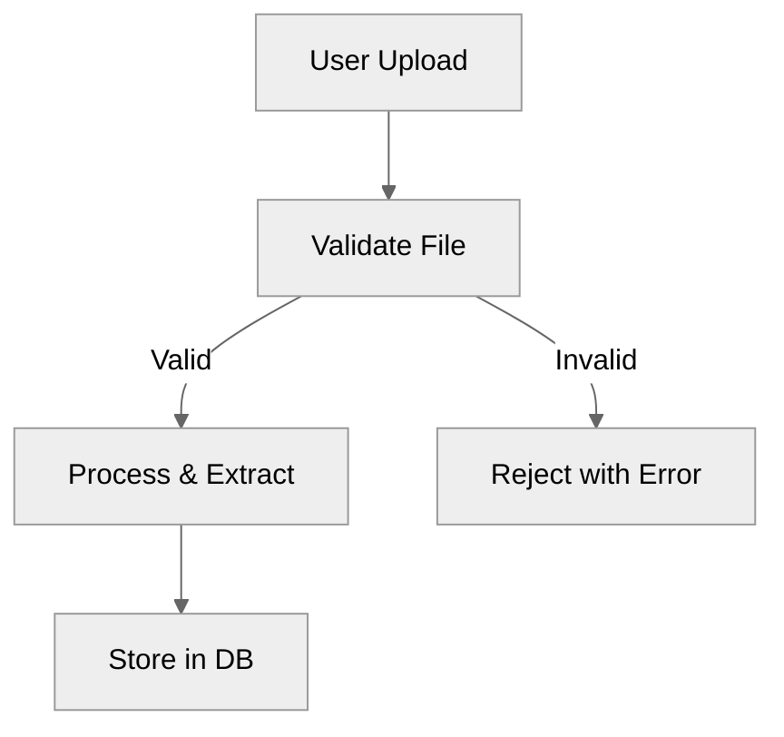
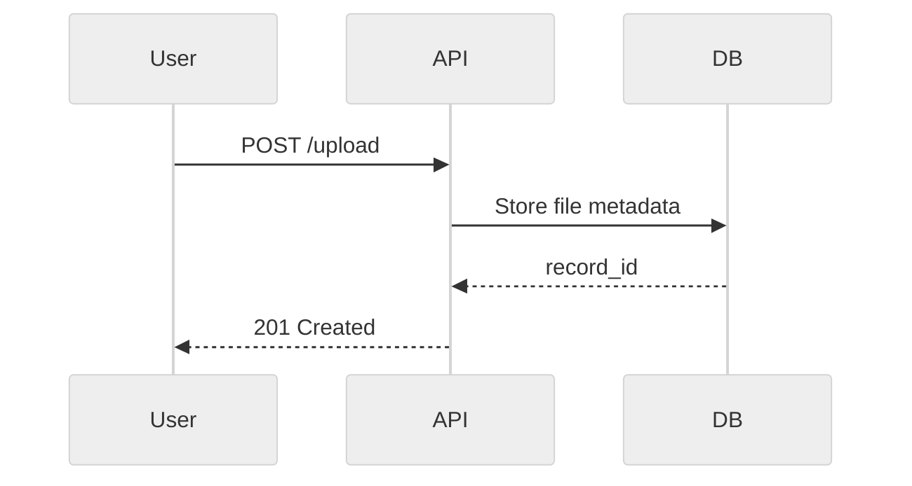
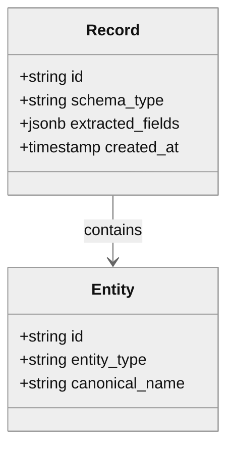
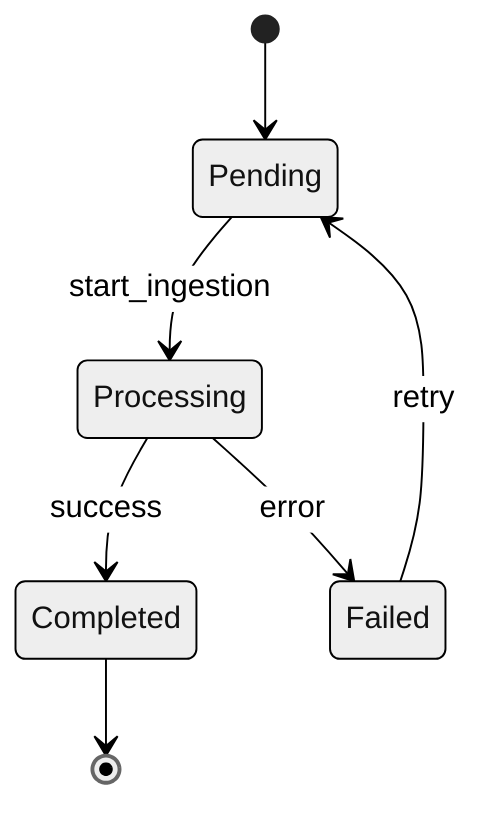
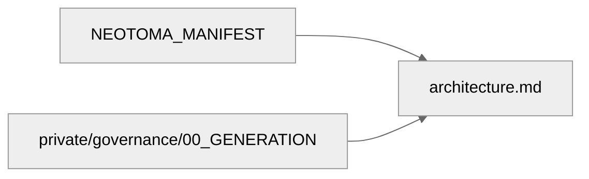

# Neotoma Documentation Standards and Conventions

## Purpose

This document defines the shared conventions, formatting rules, and structural patterns used across all Neotoma documentation. Every documentation file in this repository MUST follow these standards to ensure consistency, determinism, and agent-readability.

---

## 1. Foundational Context

Every documentation file is governed by three root-of-truth documents:

1. **`docs/NEOTOMA_MANIFEST.md`** — Unified architectural and product context
2. **`docs/private/governance/00_GENERATION.md`** — Required documentation artifacts and sections

All documentation MUST:

- Remain consistent with these three sources
- Never contradict the Truth Layer boundaries
- Encode determinism, immutability, provenance, schema-first processing, explicit user control, privacy guarantees, and graph integrity

---

## 2. Documentation Doctrine

Every documentation file MUST embed or reference this doctrine:

### Neotoma Documentation Doctrine

```
Neotoma is a Truth Layer — not an app, agent, or strategy/execution system.

Core invariants:
- Deterministic: Same input → same output, always
- Immutable: Truth never changes after storage
- Provenance: Every output traces to source
- Schema-first: All extraction derives from schemas
- Explicit control: User approves all ingestion
- Privacy-maximal: No background data collection
- Graph integrity: No orphans, no cycles, no inferred edges
- Truth-Layer bounded: No strategy, execution, or agent logic

Layered architecture (example: financial system):
┌─────────────────────────────────┐
│ Agentic Wallet (Execution Layer)│
└────────────▲────────────────────┘
             │
┌────────────▼────────────────────┐
│ Agentic Portfolio (Strategy Layer)│
└────────────▲────────────────────┘
             │
┌────────────▼────────────────────┐
│    Neotoma (Truth Layer)        │
│  Ingestion → Schema → Memory    │
└─────────────────────────────────┘

Note: Agentic Portfolio and Agentic Wallet are examples; many other agent-driven layers are possible.

This document enforces Truth Layer purity.
```

---

## 3. Required Document Structure

### 3.1 File Header

Every documentation file MUST begin with:

```markdown
# [Document Title]

_([Brief descriptor: e.g., "Canonical Architecture Definition"])_

---

## Purpose

[One paragraph describing the document's role and scope]

## Scope

[Explicit statement of what this document covers and what it does NOT cover]
```

### 3.2 Core Sections

Documentation files MUST include these sections where applicable:

1. **Purpose** — Why this document exists
2. **Scope** — What is/isn't covered
3. **Invariants** — Non-negotiable MUST/MUST NOT rules
4. **Definitions** — Canonical terms and their meanings
5. **Data Models** or **Schemas** (for subsystem docs)
6. **Flows** or **Sequences** (for process docs)
7. **Diagrams** — Mermaid visualizations
8. **Examples** — Complete, deterministic examples
9. **Testing Requirements** — How to test this domain
10. **Agent Instructions** — How agents must read and apply this file

### 3.3 Closing Section

Every file MUST end with an **Agent Instructions** section following this template:

```markdown
---

## Agent Instructions

### When to Load This Document
[Specific triggers: e.g., "Load when modifying ingestion pipeline code"]

### Required Co-Loaded Documents
- `docs/NEOTOMA_MANIFEST.md` (always)
- [Additional context-specific docs]

### Constraints Agents Must Enforce
1. [Specific constraint 1]
2. [Specific constraint 2]
...

### Forbidden Patterns

- [Anti-pattern 1]
- [Anti-pattern 2]
  ...

### Validation Checklist

- [ ] Change respects Truth Layer boundaries
- [ ] No nondeterministic logic introduced
- [ ] Schema changes are additive only
- [ ] Tests cover all new paths
- [ ] Documentation updated to reflect changes
```

---

## 4. Language and Phrasing Conventions

### 4.1 MUST/MUST NOT Language

Use RFC 2119 terminology consistently:

- **MUST** / **REQUIRED** / **SHALL** — Absolute requirement
- **MUST NOT** / **SHALL NOT** — Absolute prohibition
- **SHOULD** / **RECOMMENDED** — Strong recommendation (exceptions allowed)
- **SHOULD NOT** / **NOT RECOMMENDED** — Strong discouragement
- **MAY** / **OPTIONAL** — Truly optional

### 4.2 Directive Tone

Documentation uses clear, directive language:

- ✅ "The system MUST validate input before storage."
- ❌ "The system should probably validate input."

### 4.3 Forbidden Language

NEVER use:

- Vague qualifiers: "maybe", "perhaps", "possibly"
- Marketing language: "powerful", "seamless", "revolutionary"
- Uncertain phrasing: "it might work if...", "this could be..."

---

## 5. Mermaid Diagram Standards

### 5.1 General Rules

All Mermaid diagrams MUST:

- Use consistent node naming (camelCase or snake_case within a diagram)
- Include a title comment above the diagram
- Use deterministic ordering of nodes and edges
- Be versionable (no auto-generated IDs)

### 5.2 Diagram Types and Usage

**Flowchart (TD/LR)** — For sequential processes:



**Sequence Diagram** — For request/response flows:



**Class Diagram** — For data models:



**State Diagram** — For state machines:



**Graph (Entity-Relationship)** — For dependency/relationship maps:



### 5.3 Node and Edge Styling

Use consistent styles:

- **Processes/Actions**: Rectangles `[Process Name]`
- **Decisions**: Diamonds `{Decision?}`
- **Data/State**: Rounded rectangles `(Data Item)`
- **External Systems**: Double rectangles `[[External API]]`
- **Terminal States**: Circle edges `((Terminal))`

---

## 6. Example Formatting Standards

### 6.1 Complete Examples Only

All code examples MUST be:

- Complete (not pseudo-code or partial snippets)
- Deterministic (no randomness, no undefined fields)
- Valid (parseable JSON/YAML/TypeScript)
- Annotated (comments explaining non-obvious aspects)

### 6.2 Example Structure

**JSON Examples:**

```json
{
  "record_id": "rec_01H8X9Y2Z3A4B5C6D7E8F9G0",
  "schema_type": "FinancialRecord",
  "extracted_fields": {
    "invoice_number": "INV-2024-001",
    "amount": 1500.0,
    "currency": "USD",
    "date_issued": "2024-01-15T00:00:00Z"
  },
  "provenance": {
    "source_file": "invoice_jan_2024.pdf",
    "ingestion_timestamp": "2024-01-16T10:30:00Z"
  }
}
```

**YAML Examples:**

```yaml
# Feature Unit Manifest Example
feature_id: "fu_record_upload"
version: "1.0.0"
schema_changes:
  - table: "records"
    operation: "add_column"
    column_name: "processing_status"
    column_type: "varchar(50)"
observability:
  metrics:
    - "record_upload_duration_ms"
    - "record_upload_errors_total"
  logs:
    - level: "info"
      event: "record_uploaded"
```

**TypeScript Examples:**

```typescript
// Deterministic entity ID generation
export function generateEntityId(
  entityType: string,
  canonicalName: string
): string {
  const normalized = canonicalName.toLowerCase().trim();
  const hash = sha256(`${entityType}:${normalized}`);
  return `ent_${hash.substring(0, 24)}`;
}
```

---

## 7. Cross-Referencing Standards

### 7.1 Internal Links

Use relative paths for internal documentation links:

```markdown
See [`docs/architecture/architecture.md`](../architecture/architecture.md) for details.
```

**File Extension Standardization:**

- **MUST use lowercase `.md` extension** (not `.MD` or `.Markdown`)
- All markdown files MUST be named with `.md` extension
- All internal links MUST use lowercase `.md` extension
- **Rationale:** Case-sensitivity issues on some systems (Linux, CI/CD) can break links

### 7.2 Foundation Links

Always reference the foundational docs when restating core principles:

```markdown
As defined in `docs/NEOTOMA_MANIFEST.md`, Neotoma MUST remain deterministic.
```

### 7.3 Section Anchors

Use explicit anchors for subsections:

```markdown
## 3. Data Models {#data-models}

Reference this section: [Data Models](#data-models)
```

---

## 8. Tables and Matrices

### 8.1 Table Format

Use consistent table formatting with clear headers:

| Subsystem    | Consistency Model | UI Handling              |
| ------------ | ----------------- | ------------------------ |
| Ingestion    | Eventual          | Show "Processing..."     |
| Search Index | Bounded Eventual  | Stale results acceptable |
| Graph Edges  | Strong            | Block until committed    |

### 8.2 Decision Matrices

For complex decision logic, use matrices:

| Condition                   | Schema Type      | Action               |
| --------------------------- | ---------------- | -------------------- |
| Has `invoice_number` field  | FinancialRecord  | Extract as invoice   |
| Has `passport_number` field | IdentityDocument | Extract as passport  |
| No recognized fields        | PDFDocument      | Store as generic PDF |

---

## 9. Versioning and Evolution

### 9.1 Document Versioning

Each documentation file SHOULD include a version indicator in frontmatter:

```markdown
---
version: 1.0.0
last_updated: 2024-01-15
status: canonical
---
```

### 9.2 Additive Changes Only

Documentation changes MUST be additive:

- ✅ Add new sections
- ✅ Clarify existing content
- ✅ Add examples
- ❌ Remove required sections
- ❌ Contradict existing invariants
- ❌ Weaken MUST requirements

### 9.3 Breaking Changes

If a breaking change is required:

1. Document the change in a migration guide
2. Update all dependent documentation
3. Create a PR with full impact analysis
4. Get explicit approval before merging

---

## 10. Testing Documentation

### 10.1 Testable Assertions

Documentation SHOULD include testable assertions:

```markdown
### Testable Requirement

The ingestion pipeline MUST process files in deterministic order by `created_at` timestamp (ascending).

**Test:** Upload 3 files with timestamps T1 < T2 < T3. Verify processing order is always T1 → T2 → T3.
```

### 10.2 Test Coverage Mapping

Link documentation sections to test files:

```markdown
### Coverage

This section is tested by:

- `src/services/ingestion.test.ts` (unit)
- `playwright/tests/ingestion-e2e.ts` (E2E)
```

---

## 11. Privacy and Security Content

### 11.1 PII Handling in Examples

Examples MUST NOT contain real PII:

- ✅ Use: `user@example.com`, `John Doe`, `123-45-6789`
- ❌ Use: Real email addresses, names, or SSNs

### 11.2 Security-Sensitive Information

Documentation MUST NOT include:

- API keys or secrets
- Production URLs or credentials
- Real user data
- Internal system architecture details that expose vulnerabilities

---

## 12. Accessibility in Documentation

### 12.1 Alt Text for Diagrams

Provide text descriptions for all diagrams:

````markdown
```mermaid
[diagram code]
```
````

_Figure 1: Ingestion pipeline showing file upload → validation → extraction → storage flow._

````

### 12.2 Heading Hierarchy
Use proper heading hierarchy (no skipped levels):
- ✅ H1 → H2 → H3
- ❌ H1 → H3 (skipped H2)

---

## 13. Internationalization Considerations

### 13.1 Language-Neutral Examples
Use language-neutral or multi-language examples where applicable:
```json
{
  "content": "Hello world",
  "content_language": "en",
  "ui_locale": "en-US"
}
````

### 13.2 Avoid Cultural Assumptions

Examples should work globally:

- ✅ Use ISO 8601 dates: `2024-01-15T10:30:00Z`
- ❌ Use: `01/15/2024` (ambiguous)

---

## 14. Agent Constraints for Documentation Changes

Agents modifying documentation MUST:

1. Load `docs/NEOTOMA_MANIFEST.md` first
2. Load this conventions file second
3. Verify changes don't violate Truth Layer boundaries
4. Ensure all required sections are present
5. Use deterministic examples only
6. Include proper Agent Instructions section
7. Cross-link to foundational documents where relevant
8. Update the `docs/context/index.md` if adding new files
9. Run documentation linter (if available) before committing

---

## Agent Instructions

### When to Load This Document

Load this document whenever:

- Creating new documentation files
- Modifying existing documentation
- Reviewing documentation for consistency
- Generating Feature Unit specs or manifests

### Required Co-Loaded Documents

- `docs/NEOTOMA_MANIFEST.md` (always)
- `docs/private/governance/00_GENERATION.md` (when creating new docs)

### Constraints Agents Must Enforce

1. All documentation follows the structure defined in Section 3
2. All Mermaid diagrams follow standards in Section 5
3. All examples are complete and deterministic (Section 6)
4. MUST/MUST NOT language is used correctly (Section 4)
5. Agent Instructions section is present in every doc
6. No PII or secrets in examples (Section 11)

### Forbidden Patterns

- Partial or pseudo-code examples
- Vague or marketing language
- Skipped heading levels
- Missing Agent Instructions sections
- Contradictions with foundational documents
- Nondeterministic examples or diagrams

### Validation Checklist

- [ ] Document includes all required sections
- [ ] Mermaid diagrams use consistent styling
- [ ] Examples are complete and deterministic
- [ ] MUST/MUST NOT language used correctly
- [ ] Agent Instructions section present and complete
- [ ] Cross-references use correct relative paths
- [ ] No PII or secrets in examples
- [ ] Consistent with NEOTOMA_MANIFEST.md
