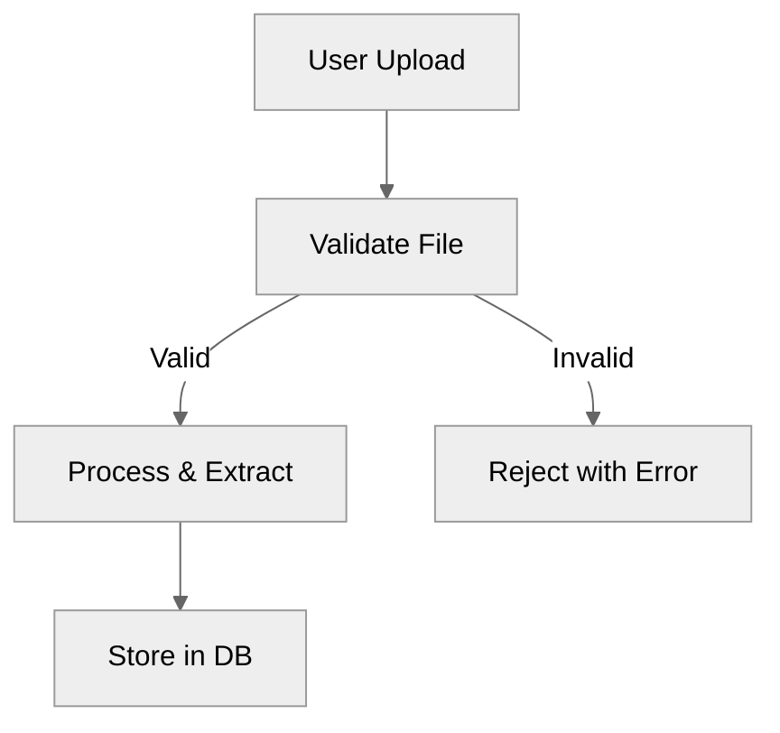
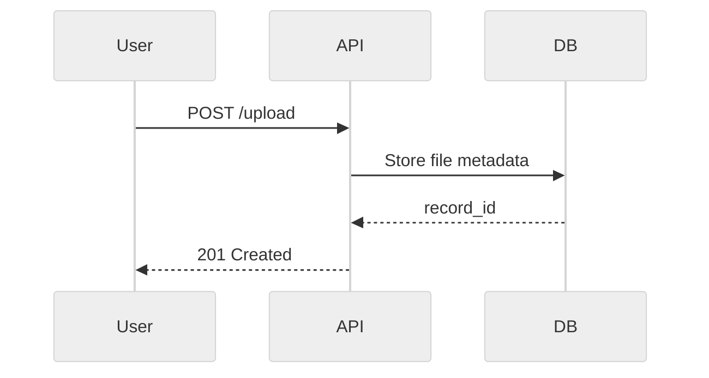
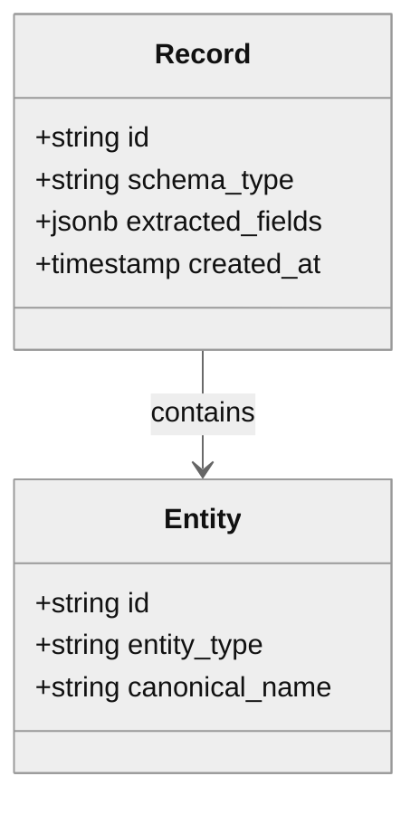
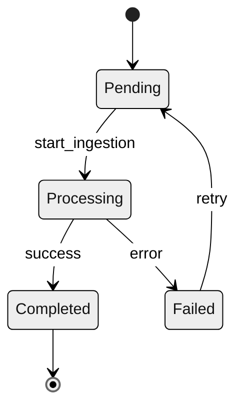
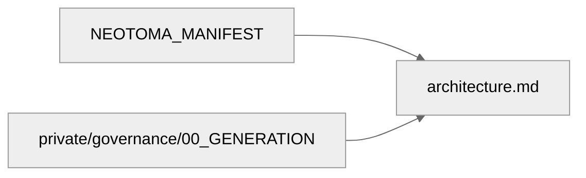

# Neotoma Documentation Standards and Conventions

## Purpose

This document defines the shared conventions, formatting rules, and structural patterns used across all Neotoma documentation. Every documentation file in this repository MUST follow these standards to ensure consistency, determinism, and agent-readability.

---

## 1. Foundational Context

Every documentation file is governed by three root-of-truth documents:

1. **`docs/NEOTOMA_MANIFEST.md`** — Unified architectural and product context
2. **`docs/private/governance/00_GENERATION.md`** — Required documentation artifacts and sections

**Related Conventions:**

- **`docs/conventions/code_conventions.md`** — Code style, naming, and patterns for TypeScript, SQL, YAML, and Shell scripts

All documentation MUST:

- Remain consistent with these three sources
- Never contradict the Truth Layer boundaries
- Encode determinism, immutability, provenance, schema-first processing, explicit user control, privacy guarantees, and graph integrity

---

## 2. Documentation Doctrine

Every documentation file MUST embed or reference this doctrine:

### Neotoma Documentation Doctrine

```
Neotoma is a Truth Layer — not an app, agent, or strategy/execution system.

Core invariants:
- Deterministic: Same input → same output, always
- Immutable: Truth never changes after storage
- Provenance: Every output traces to source
- Schema-first: All extraction derives from schemas
- Explicit control: User approves all ingestion
- Privacy-maximal: No background data collection
- Graph integrity: No orphans, no cycles, no inferred edges
- Truth-Layer bounded: No strategy, execution, or agent logic
- Event-sourced: All state updates via Domain Events → Reducers
- Pure Strategy: Strategy Layer has no side effects (State in → Decisions out)
- Pure Execution: Execution Layer emits Domain Events (Commands in → Events out)

Layered architecture (example: financial system):
┌───────────────────────────────────────────────┐
│      Execution Layer                          │
│  (Agentic Wallet + Domain Agents)            │
│  Commands → Side Effects → Domain Events    │
└────────────▲─────────────────────────────────┘
             │ Reads Only, Receives Commands
┌────────────▼─────────────────────────────────┐
│      Strategy Layer                           │
│  (Agentic Portfolio is example instance)    │
│  State → Evaluates → Decisions + Commands   │
└────────────▲─────────────────────────────────┘
             │ Reads Only
┌────────────▼─────────────────────────────────┐
│    Neotoma (Truth Layer)                    │
│  Event-sourced, Reducer-driven             │
│  Domain Events → Reducers → State          │
└─────────────────────────────────────────────┘

Note: Agentic Portfolio is an example instance of Strategy Layer. Agentic Wallet is part of Execution Layer alongside domain agents. Many other agent-driven layers are possible.

This document enforces Truth Layer purity.
```

---

## 3. Required Document Structure

### 3.1 File Header

Every documentation file MUST begin with:

```markdown
# [Document Title]

_([Brief descriptor: e.g., "Canonical Architecture Definition"])_

---

## Purpose

[One paragraph describing the document's role and scope]

## Scope

[Explicit statement of what this document covers and what it does NOT cover]
```

### 3.2 Core Sections

Documentation files MUST include these sections where applicable:

1. **Purpose** — Why this document exists
2. **Scope** — What is/isn't covered
3. **Invariants** — Non-negotiable MUST/MUST NOT rules
4. **Definitions** — Canonical terms and their meanings
5. **Data Models** or **Schemas** (for subsystem docs)
6. **Flows** or **Sequences** (for process docs)
7. **Diagrams** — Mermaid visualizations
8. **Examples** — Complete, deterministic examples
9. **Testing Requirements** — How to test this domain
10. **Agent Instructions** — How agents must read and apply this file

### 3.3 Closing Section

Every file MUST end with an **Agent Instructions** section following this template:

```markdown
---

## Agent Instructions

### When to Load This Document
[Specific triggers: e.g., "Load when modifying ingestion pipeline code"]

### Required Co-Loaded Documents
- `docs/NEOTOMA_MANIFEST.md` (always)
- [Additional context-specific docs]

### Constraints Agents Must Enforce
1. [Specific constraint 1]
2. [Specific constraint 2]
...

### Forbidden Patterns

- [Anti-pattern 1]
- [Anti-pattern 2]
  ...

### Validation Checklist

- [ ] Change respects Truth Layer boundaries
- [ ] No nondeterministic logic introduced
- [ ] Schema changes are additive only
- [ ] Tests cover all new paths
- [ ] Documentation updated to reflect changes
```

---

## 4. Document Decomposition and Format Standards

### 4.1 Decomposition Principles

When creating planning or specification documents (especially for Releases), follow these decomposition principles:

1. **Decompose by Topic**: Large documents should be decomposed into topic-specific documents:

   - **Overview/coordination documents** (`{topic}_plan.md`): Provide high-level summaries, coordination framework, and references to detailed documents
   - **Detailed topic documents** (`{topic}_{subtopic}_plan.md`): Contain comprehensive details for specific topics (interview questions, test scenarios, tactics, etc.)
   - Example: `discovery_plan.md` (overview) → `value_discovery_plan.md`, `usability_discovery_plan.md`, `business_viability_discovery_plan.md`

2. **Use Markdown for Human-Readable Content**:

   - All detailed documentation should be in Markdown format
   - Markdown provides better readability, version control diff clarity, and collaboration
   - Use Markdown for: specifications, plans, reports, logs, detailed documentation

3. **Use YAML Only When Required**:

   - YAML files should be used ONLY when:
     - Required for workflow automation (e.g., `manifest.yaml` for FU dependency resolution)
     - Structured metadata/summaries needed for programmatic access (e.g., hypotheses, success criteria, timelines)
     - Machine-readable format is essential for tooling
   - YAML files should contain: metadata, summaries, success criteria, hypotheses, participant counts, timelines
   - YAML files should NOT contain: detailed interview questions, test scenarios, comprehensive tactics, lengthy descriptions

4. **Eliminate Redundancy**:

   - Each piece of information should exist in only one place
   - YAML files reference detailed markdown plans via `detailed_plan` fields
   - Markdown overview documents provide coordination and cross-references
   - Detailed markdown documents contain comprehensive content without duplication

5. **Cross-Reference Documents**:

   - All documents should include a "Related Documents" section
   - Overview documents should list all related detailed documents
   - Detailed documents should reference back to overview documents
   - Use consistent cross-reference format: `` `filename.md` ``

6. **File Naming Conventions**:
   - Overview: `{topic}_plan.md` (e.g., `discovery_plan.md`, `marketing_plan.md`)
   - Detailed topics: `{topic}_{subtopic}_plan.md` (e.g., `value_discovery_plan.md`, `pre_launch_marketing_plan.md`)
   - YAML summaries: `{topic}_plan.yaml` (e.g., `discovery_plan.yaml`, `marketing_plan.yaml`)
   - Logs/tracking: `{topic}_log.md` (e.g., `continuous_discovery_log.md`)

**Example Structure:**

```
release/
  ├── discovery_plan.md              # Overview and coordination
  ├── discovery_plan.yaml            # Metadata, summaries (hypotheses, success criteria)
  ├── value_discovery_plan.md        # Detailed value discovery content
  ├── usability_discovery_plan.md    # Detailed usability discovery content
  └── ...
```

**Release Planning Document Structure:**

```
docs/releases/in_progress/vX.Y.Z/
  ├── release_plan.md              # Overview and coordination
  ├── manifest.yaml                # FU metadata, dependencies (YAML required for automation)
  ├── acceptance_criteria.md       # Release-level acceptance criteria
  ├── pre_mortem.md               # Failure mode analysis
  ├── deployment_strategy.md      # Deployment and rollback procedures
  ├── monitoring_plan.md          # Post-release monitoring and observability
  ├── discovery_plan.md           # Discovery overview (if discovery enabled)
  ├── discovery_plan.yaml         # Discovery metadata/summary (if discovery enabled)
  ├── value_discovery_plan.md     # Value discovery details
  ├── usability_discovery_plan.md # Usability discovery details
  ├── marketing_plan.md           # Marketing overview (if external release)
  ├── marketing_plan.yaml         # Marketing metadata/summary (if external release)
  ├── pre_launch_marketing_plan.md # Pre-launch marketing details
  └── ...
```

---

## 5. Language and Phrasing Conventions

### 5.1 MUST/MUST NOT Language

Use RFC 2119 terminology consistently:

- **MUST** / **REQUIRED** / **SHALL** — Absolute requirement
- **MUST NOT** / **SHALL NOT** — Absolute prohibition
- **SHOULD** / **RECOMMENDED** — Strong recommendation (exceptions allowed)
- **SHOULD NOT** / **NOT RECOMMENDED** — Strong discouragement
- **MAY** / **OPTIONAL** — Truly optional

### 5.2 Directive Tone

Documentation uses clear, directive language:

- ✅ "The system MUST validate input before storage."
- ❌ "The system should probably validate input."

### 5.3 Forbidden Language

NEVER use:

- Vague qualifiers: "maybe", "perhaps", "possibly"
- Marketing language: "powerful", "seamless", "revolutionary"
- Uncertain phrasing: "it might work if...", "this could be..."

### 5.4 Writing Style: Avoid AI-Generated Patterns

NEVER use AI-specific writing patterns that make documentation sound machine-generated:

**Prohibited:**

- Em dashes (—) — Use commas, periods, or colons instead
- En dashes (–) — Use hyphens (-) or "to" for ranges
- Excessive parenthetical asides (common in AI writing)
- Overly complex sentence structures
- Redundant qualifiers ("very", "quite", "rather", "somewhat")
- Conversational transitions ("Now, let's...", "So, you might...", "Interestingly...")
- Soft questions ("Would you like to...?", "Have you considered...?")
- Motivational language ("Get started!", "Try it now!", "You're all set!")

**Preferred:**

- ✅ Use commas: "The system processes files, validates them, and stores records."
- ✅ Use periods: "The system processes files. It then validates them."
- ✅ Use colons: "The system performs three steps: processing, validation, and storage."
- ✅ Direct statements: "The system processes files."
- ✅ Simple, declarative sentences
- ✅ One idea per sentence
- ✅ Active voice: "The system validates input" (not "Input is validated by the system")

**Examples:**

❌ "Neotoma transforms fragmented personal data—connecting people, companies, and events—into a unified memory graph that enables agents to reason across all your data."

✅ "Neotoma transforms fragmented personal data into a unified memory graph. The graph connects people, companies, and events. This enables agents to reason across all your data."

❌ "Would you like to store a record? Simply use the `store_record` action!"

✅ "Use the `store_record` action to store a record."

❌ "Neotoma provides persistent structured memory—ensuring agents can access truth layer data—with full provenance tracking."

✅ "Neotoma provides persistent structured memory with full provenance tracking. Agents can access truth layer data via MCP."

### 5.5 Punctuation Rules

- Use standard hyphens (-) for compound words and ranges: "file-based", "v0.1.0-v0.2.0"
- Use commas for lists and appositives: "files, records, and entities"
- Use periods to end sentences
- Use colons to introduce lists or explanations
- Use semicolons sparingly, only to connect closely related independent clauses
- Avoid dashes (em or en) entirely

---

## 6. Mermaid Diagram Standards

### 6.1 General Rules

All Mermaid diagrams MUST:

- Use consistent node naming (camelCase or snake_case within a diagram)
- Include a title comment above the diagram
- Use deterministic ordering of nodes and edges
- Be versionable (no auto-generated IDs)

### 6.2 Diagram Types and Usage

**Flowchart (TD/LR)** — For sequential processes:



**Sequence Diagram** — For request/response flows:



**Class Diagram** — For data models:



**State Diagram** — For state machines:



**Graph (Entity-Relationship)** — For dependency/relationship maps:



### 6.3 Node and Edge Styling

Use consistent styles:

- **Processes/Actions**: Rectangles `[Process Name]`
- **Decisions**: Diamonds `{Decision?}`
- **Data/State**: Rounded rectangles `(Data Item)`
- **External Systems**: Double rectangles `[[External API]]`
- **Terminal States**: Circle edges `((Terminal))`

---

## 7. Example Formatting Standards

### 7.1 Complete Examples Only

All code examples MUST be:

- Complete (not pseudo-code or partial snippets)
- Deterministic (no randomness, no undefined fields)
- Valid (parseable JSON/YAML/TypeScript)
- Annotated (comments explaining non-obvious aspects)

### 7.2 Example Structure

**JSON Examples:**

```json
{
  "record_id": "rec_01H8X9Y2Z3A4B5C6D7E8F9G0",
  "schema_type": "FinancialRecord",
  "extracted_fields": {
    "invoice_number": "INV-2024-001",
    "amount": 1500.0,
    "currency": "USD",
    "date_issued": "2024-01-15T00:00:00Z"
  },
  "provenance": {
    "source_file": "invoice_jan_2024.pdf",
    "ingestion_timestamp": "2024-01-16T10:30:00Z"
  }
}
```

**YAML Examples:**

```yaml
# Feature Unit Manifest Example
feature_id: "fu_record_upload"
version: "1.0.0"
schema_changes:
  - table: "records"
    operation: "add_column"
    column_name: "processing_status"
    column_type: "varchar(50)"
observability:
  metrics:
    - "record_upload_duration_ms"
    - "record_upload_errors_total"
  logs:
    - level: "info"
      event: "record_uploaded"
```

**TypeScript Examples:**

```typescript
// Deterministic entity ID generation
export function generateEntityId(
  entityType: string,
  canonicalName: string
): string {
  const normalized = canonicalName.toLowerCase().trim();
  const hash = sha256(`${entityType}:${normalized}`);
  return `ent_${hash.substring(0, 24)}`;
}
```

---

## 8. Cross-Referencing Standards

### 8.1 Internal Links

Use relative paths for internal documentation links:

```markdown
See [`docs/architecture/architecture.md`](../architecture/architecture.md) for details.
```

**File Extension Standardization:**

- **MUST use lowercase `.md` extension** (not `.MD` or `.Markdown`)
- All markdown files MUST be named with `.md` extension
- All internal links MUST use lowercase `.md` extension
- **Rationale:** Case-sensitivity issues on some systems (Linux, CI/CD) can break links

### 8.2 Foundation Links

Always reference the foundational docs when restating core principles:

```markdown
As defined in `docs/NEOTOMA_MANIFEST.md`, Neotoma MUST remain deterministic.
```

### 8.3 Section Anchors

Use explicit anchors for subsections:

```markdown
## 3. Data Models {#data-models}

Reference this section: [Data Models](#data-models)
```

---

## 9. Tables and Matrices

### 9.1 Table Format

Use consistent table formatting with clear headers:

| Subsystem    | Consistency Model | UI Handling              |
| ------------ | ----------------- | ------------------------ |
| Ingestion    | Eventual          | Show "Processing..."     |
| Search Index | Bounded Eventual  | Stale results acceptable |
| Graph Edges  | Strong            | Block until committed    |

### 9.2 Decision Matrices

For complex decision logic, use matrices:

| Condition                   | Schema Type      | Action               |
| --------------------------- | ---------------- | -------------------- |
| Has `invoice_number` field  | FinancialRecord  | Extract as invoice   |
| Has `passport_number` field | IdentityDocument | Extract as passport  |
| No recognized fields        | PDFDocument      | Store as generic PDF |

---

## 10. Versioning and Evolution

### 10.1 Document Versioning

Each documentation file SHOULD include a version indicator in frontmatter:

```markdown
---
version: 1.0.0
last_updated: 2024-01-15
status: canonical
---
```

### 10.2 Additive Changes Only

Documentation changes MUST be additive:

- ✅ Add new sections
- ✅ Clarify existing content
- ✅ Add examples
- ❌ Remove required sections
- ❌ Contradict existing invariants
- ❌ Weaken MUST requirements

### 10.3 Breaking Changes

If a breaking change is required:

1. Document the change in a migration guide
2. Update all dependent documentation
3. Create a PR with full impact analysis
4. Get explicit approval before merging

---

## 11. Timeline Estimates

### 11.1 Agent-Based Estimation Assumption

All timeline estimates in documentation MUST assume Cursor agents (or equivalent AI coding assistants) performing the work, NOT human developers.

**Rationale:** Neotoma development workflow uses Cursor agents as the primary execution mechanism. Timeline estimates based on human developer velocity would be inaccurate and misleading.

### 11.2 Timeline Estimate Format

When documenting timeline estimates:

- ✅ Use explicit duration units: "3 days", "2 weeks", "5 hours"
- ✅ State the assumption: "Estimated: 3 days (assumes Cursor agent execution)"
- ✅ Include parallelization notes: "With 3 agents in parallel: ~14-17 days"
- ❌ Do not assume human developer velocity
- ❌ Do not omit the agent execution assumption

### 11.3 Where Timeline Estimates Appear

Timeline estimates MUST follow this convention in:

- `execution_schedule.md` files
- Release plan documents (`release_plan.md`)
- Feature Unit specifications
- Any planning documents with duration estimates

### 11.4 Example

```markdown
### Estimated Timeline

**Assumptions:**

- All estimates assume Cursor agent execution
- FU-100: 5 days (high-risk, rule-based extraction)
- FU-101: 3 days
- FU-102: 3 days

**Sequential Timeline:** ~11 days
**With Parallelization (3 agents):** ~5-6 days
```

---

## 12. Testing Documentation

### 12.1 Testable Assertions

Documentation SHOULD include testable assertions:

```markdown
### Testable Requirement

The ingestion pipeline MUST process files in deterministic order by `created_at` timestamp (ascending).

**Test:** Upload 3 files with timestamps T1 < T2 < T3. Verify processing order is always T1 → T2 → T3.
```

### 12.2 Test Coverage Mapping

Link documentation sections to test files:

```markdown
### Coverage

This section is tested by:

- `src/services/ingestion.test.ts` (unit)
- `playwright/tests/ingestion-e2e.ts` (E2E)
```

---

## 13. Privacy and Security Content

### 13.1 PII Handling in Examples

Examples MUST NOT contain real PII:

- ✅ Use: `user@example.com`, `John Doe`, `123-45-6789`
- ❌ Use: Real email addresses, names, or SSNs

### 13.2 Security-Sensitive Information

Documentation MUST NOT include:

- API keys or secrets
- Production URLs or credentials
- Real user data
- Internal system architecture details that expose vulnerabilities

---

## 14. Accessibility in Documentation

### 14.1 Alt Text for Diagrams

Provide text descriptions for all diagrams:

````markdown
```mermaid
[diagram code]
```
````

_Figure 1: Ingestion pipeline showing file upload → validation → extraction → storage flow._

````

### 14.2 Heading Hierarchy
Use proper heading hierarchy (no skipped levels):
- ✅ H1 → H2 → H3
- ❌ H1 → H3 (skipped H2)

---

## 15. Internationalization Considerations

### 15.1 Language-Neutral Examples
Use language-neutral or multi-language examples where applicable:
```json
{
  "content": "Hello world",
  "content_language": "en",
  "ui_locale": "en-US"
}
````

### 15.2 Avoid Cultural Assumptions

Examples should work globally:

- ✅ Use ISO 8601 dates: `2024-01-15T10:30:00Z`
- ❌ Use: `01/15/2024` (ambiguous)

---

## 16. Agent Constraints for Documentation Changes

Agents modifying documentation MUST:

1. Load `docs/NEOTOMA_MANIFEST.md` first
2. Load this conventions file second
3. Verify changes don't violate Truth Layer boundaries
4. Ensure all required sections are present
5. Use deterministic examples only
6. Include proper Agent Instructions section
7. Cross-link to foundational documents where relevant
8. Update the `docs/context/index.md` if adding new files
9. **Identify and update downstream documentation** that depends on changes:
   - Check `docs/doc_dependencies.yaml` for explicit dependencies
   - Run `node scripts/validate-doc-dependencies.js [modified-doc-path]` to validate
   - Update downstream docs as needed (see `.cursor/rules/downstream_doc_updates.md`)
   - Update dependency map if new relationships discovered
10. **Update README.md** if changes affect user-facing information (see `.cursor/rules/readme_maintenance.md`)
11. **Follow writing style rules** (Section 5.4): No em dashes, no AI-generated patterns, use commas/periods/colons instead
12. Run documentation validation before committing (automatic via pre-commit hook)

---

## Agent Instructions

### When to Load This Document

Load this document whenever:

- Creating new documentation files
- Modifying existing documentation
- Reviewing documentation for consistency
- Generating Feature Unit specs or manifests

### Required Co-Loaded Documents

- `docs/NEOTOMA_MANIFEST.md` (always)
- `docs/private/governance/00_GENERATION.md` (when creating new docs)

### Constraints Agents Must Enforce

1. All documentation follows the structure defined in Section 3
2. All Mermaid diagrams follow standards in Section 5
3. All examples are complete and deterministic (Section 6)
4. MUST/MUST NOT language is used correctly (Section 4)
5. Agent Instructions section is present in every doc
6. No PII or secrets in examples (Section 13)
7. Timeline estimates assume Cursor agent execution (Section 11)
8. Downstream documentation updated when upstream docs change:
   - Use `docs/doc_dependencies.yaml` to identify dependencies
   - Run validation script: `node scripts/validate-doc-dependencies.js [doc-path]`
   - See `.cursor/rules/downstream_doc_updates.md` for complete requirements
9. README.md updated when documentation changes affect user-facing information (see `.cursor/rules/readme_maintenance.md`)
10. Dependency map (`docs/doc_dependencies.yaml`) updated when new doc relationships are created

### Forbidden Patterns

- Partial or pseudo-code examples
- Vague or marketing language
- Skipped heading levels
- Missing Agent Instructions sections
- Contradictions with foundational documents
- Nondeterministic examples or diagrams
- Em dashes (—) or en dashes (–)
- AI-generated writing patterns (em dashes, excessive parentheticals, conversational transitions)
- Soft questions or motivational language

### Validation Checklist

- [ ] Document includes all required sections
- [ ] Mermaid diagrams use consistent styling
- [ ] Examples are complete and deterministic
- [ ] MUST/MUST NOT language used correctly
- [ ] Agent Instructions section present and complete
- [ ] Cross-references use correct relative paths
- [ ] No PII or secrets in examples
- [ ] Consistent with NEOTOMA_MANIFEST.md
- [ ] Downstream documentation updated if upstream doc changed (validated via script)
- [ ] Dependency map (`docs/doc_dependencies.yaml`) updated if new relationships created
- [ ] README.md updated if changes affect user-facing information
- [ ] No em dashes (—) or en dashes (–) used (use commas, periods, or colons instead)
- [ ] No AI-generated writing patterns (conversational transitions, soft questions, motivational language)
- [ ] Simple, declarative sentences with active voice
