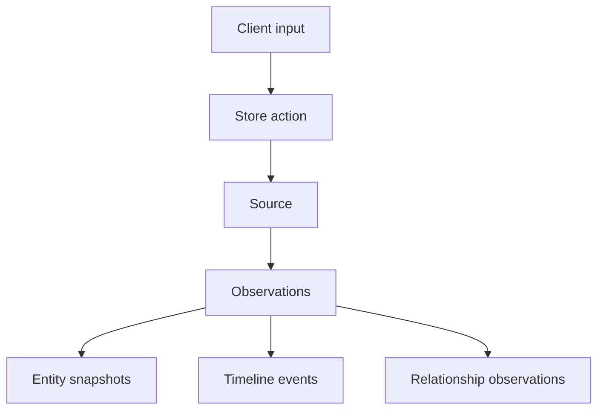

# Canonical ingestion walkthrough
## Scope
This document describes the end to end ingestion flow from MCP or REST input to observations, snapshots, and timeline events. It does not define UI behavior or schema design details.

## Purpose
Provide a single, deterministic walkthrough of the ingestion pipeline so developers can reason about state changes and outputs.

## Invariants
1. Inputs are explicit and user provided only.
2. Idempotency is enforced with `idempotency_key`.
3. Observations are immutable and corrections create new observations.
4. Snapshots are deterministic reducer outputs.
5. Events derive only from extracted date fields.
6. No inference or prediction is allowed.

## Definitions
- **Source**: A stored payload with provenance and raw content.
- **Observation**: A source specific fact derived from structured input or extraction.
- **Entity**: A canonical object with a deterministic ID.
- **Snapshot**: Reducer output representing current truth.
- **Event**: Timeline item derived from source date fields.
- **Idempotency key**: Client provided key used to deduplicate store and correct operations.

## Data models
- Sources and observations are stored in `sources` and `observations`.
- Entities and snapshots are stored in `entities` and `entity_snapshots`.
- Timeline events are stored in `timeline_events`.
- Relationship observations are stored in `relationship_observations`.

## Flows
### Structured ingestion
1. Client calls `store_structured` or `POST /api/store` with `entities` and `idempotency_key`.
2. Server checks `sources` for an existing `idempotency_key` for the user.
3. If present, return the existing observations for the source.
4. If not present, create a source with a content hash and provenance.
5. For each entity payload, resolve entity ID deterministically.
6. Create observations for each entity with `source_priority` and `fields`.
7. Reducers compute entity snapshots deterministically.
8. Timeline events are generated from extracted date fields.

### Unstructured ingestion
1. Client calls `store_unstructured` with `file_content` and `mime_type`, or `file_path`, plus `idempotency_key`.
2. Server stores raw content and deduplicates by content hash.
3. If `interpret=true`, the interpretation pipeline extracts fields.
4. Extracted fields are written as observations with provenance.
5. Reducers compute entity snapshots deterministically.
6. Timeline events are generated from extracted date fields.

## Diagram


## Examples
### Structured store
Request:
```json
{
  "idempotency_key": "idem_contact_001",
  "entities": [
    {
      "entity_type": "contact",
      "name": "Ada Lovelace",
      "email": "ada@example.com",
      "role": "Engineer"
    }
  ]
}
```

Expected outcomes:
- One source created with `idempotency_key=idem_contact_001`
- One observation for the contact
- One entity snapshot with `name`, `email`, `role`

### Unstructured store
Request:
```json
{
  "idempotency_key": "idem_invoice_001",
  "file_content": "BASE64_DATA",
  "mime_type": "application/pdf",
  "interpret": true
}
```

Expected outcomes:
- One source created with `idempotency_key=idem_invoice_001`
- Observations created from extracted fields
- Timeline events created from extracted date fields

## Testing requirements
1. Run `tests/contract/contract_mapping.test.ts` for contract coverage.
2. Run `tests/fixtures/replay_graph.test.ts` for deterministic snapshot replay.
3. Run `tests/integration` for ingestion and reducer integration.

## Agent Instructions
### When to Load This Document
Load when implementing ingestion, reducer, or timeline changes.

### Required Co-Loaded Documents
- `docs/NEOTOMA_MANIFEST.md`
- `docs/foundation/core_identity.md`
- `docs/foundation/layered_architecture.md`
- `docs/foundation/product_principles.md`
- `docs/architecture/determinism.md`
- `docs/subsystems/ingestion/ingestion.md`
- `docs/subsystems/observation_architecture.md`
- `docs/subsystems/errors.md`
- `docs/testing/testing_standard.md`

### Constraints Agents Must Enforce
1. Idempotency keys are required for store and correct operations.
2. Observations are immutable, corrections create new observations.
3. Snapshots are deterministic reducer outputs.
4. Events derive only from extracted date fields.
5. No inference beyond extracted fields.

### Forbidden Patterns
- Implicit ingestion or background data collection
- Nondeterministic sorting or random IDs
- Modifying existing observations
- Missing idempotency keys in store or correct requests

### Validation Checklist
- [ ] Change respects Truth Layer boundaries
- [ ] Idempotency enforced for store and correct
- [ ] Observations remain immutable
- [ ] Reducer output deterministic
- [ ] Timeline events derived only from extracted dates
- [ ] Tests updated or added
