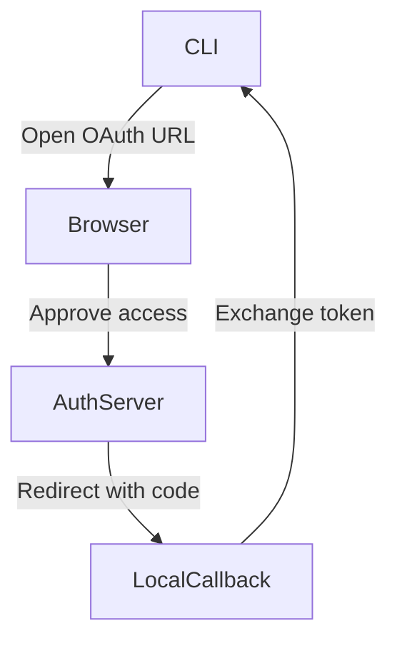

# Neotoma CLI overview
## Scope
This document covers user-facing CLI usage, authentication, and common workflows. It does not cover MCP usage, server implementation details, or non CLI API clients.

## Purpose
Provide a concise, user-facing guide to the Neotoma CLI for interacting with the Truth Layer.

## Invariants
1. CLI interactions MUST respect Truth Layer boundaries and explicit user control.
2. CLI output MUST remain deterministic for the same inputs and server state.
3. CLI examples MUST use synthetic data and never include credentials.

## Definitions
- **CLI**: The `neotoma` command line interface.
- **Base URL**: The HTTP API endpoint used by the CLI.
- **Output mode**: The CLI response formatting mode, either `json` or `pretty`.
- **Config file**: Local file storing CLI connection settings and tokens.

## Installation and setup

### Running the CLI

From the project root, you can run the CLI without installing globally:

```bash
# Run built CLI
npm run cli

# Run in dev mode (TypeScript; source changes picked up immediately)
npm run cli:dev
```

To use the `neotoma` command from any directory:

```bash
npm run setup:cli   # Build and link in one step (recommended)
# Or manually:
npm run build
npm install -g .    # Or: npm link (for development)
```

If `neotoma` is not found after install or link, add the npm global bin to your PATH. See [CLI setup](getting_started.md#cli-setup) in the getting started guide for the fix and diagnostic commands.

### Authentication

CLI auth aligns with MCP and REST API (same patterns across all interfaces):

**When encryption is off (default):** No login needed. CLI works immediately. Commands like `entities list`, `sources list`, and `watch` authenticate automatically as the local dev user.

**When encryption is on:** Set `NEOTOMA_KEY_FILE_PATH` or `NEOTOMA_MNEMONIC`. The CLI derives the auth token from your key (same as MCP).

**Auth commands:**
- `neotoma auth status`: Show current auth mode (none, dev-token, or key-derived) and user details.
- `neotoma auth login`: For MCP Connect (Cursor) setup only. Not required for CLI usage.
- `neotoma auth logout`: Clear stored OAuth credentials (affects MCP Connect, not CLI API calls).

## Core workflows
### List entities
```
neotoma entities list --type company --limit 10
```

### Fetch a single entity
```
neotoma entities get ent_1234567890abcdef12345678
```

### Store structured entities from JSON
```
neotoma store --json '[{"entity_type":"task","title":"Submit expense report","status":"open"}]'
```

### Upload a file for ingestion
```
neotoma upload ./fixtures/invoice.pdf
```

### Analyze a file without storing
```
neotoma analyze ./fixtures/invoice.pdf
```

### Watch record changes (local backend)
```
neotoma watch       # works when encryption is off (no login needed)
neotoma watch --tail --human
```

### Run developer scripts
```
neotoma dev list
neotoma dev dev:server
neotoma dev test:unit -- --reporter=dot
```

## Output modes
The CLI supports deterministic output formats:
- `--json` for machine readable output.
- `--pretty` for formatted JSON output.

Example:
```
neotoma entities list --type company --json
```

## Configuration and storage
The CLI stores configuration locally. See `docs/developer/cli_reference.md` for the config file path and format. To see where server data is stored (file paths for SQLite, raw sources, event log), run `neotoma storage info`.

## Diagrams

Auth flow for `neotoma auth login` (MCP Connect setup only; CLI API usage does not require this):



## Examples
### List entities (works immediately when encryption is off)
```
neotoma entities list --type company --limit 5 --pretty
```

### Store a task
```
neotoma store --json '[{"entity_type":"task","title":"Prepare Q1 budget","status":"open"}]'
```

## Testing requirements
1. Run CLI smoke tests with local server.
2. Validate JSON output is stable for repeated calls.

## Agent Instructions
### When to Load This Document
Load this document when updating or describing CLI usage or onboarding users to the CLI.

### Required Co-Loaded Documents
- `docs/NEOTOMA_MANIFEST.md`
- `docs/developer/cli_reference.md`
- `docs/conventions/documentation_standards.md`

### Constraints Agents Must Enforce
1. Examples MUST use synthetic data and no credentials.
2. CLI usage MUST respect Truth Layer boundaries and explicit user control.
3. Output mode descriptions MUST remain accurate to current CLI flags.

### Forbidden Patterns
- Using real tokens or credentials in examples
- Describing MCP functionality as CLI behavior
- Omitting required sections

### Validation Checklist
- [ ] Purpose, Scope, Invariants, Definitions present
- [ ] Examples are deterministic and credential free
- [ ] CLI flags and commands match implementation
- [ ] Agent Instructions included
