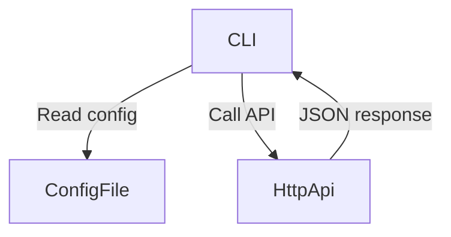

# Neotoma CLI reference
## Scope
This document covers CLI commands, options, configuration, and developer facing details. It does not cover MCP behavior or server side implementation beyond public API references.

## Purpose
Provide a complete CLI command reference and developer context for Neotoma CLI behavior.

## Invariants
1. Commands and options MUST match the CLI implementation.
2. Output formatting MUST remain deterministic and stable.
3. Configuration details MUST remain consistent with the CLI config module.

## Definitions
- **Operation ID**: OpenAPI operation identifier used by `neotoma request`.
- **Config path**: The file path where CLI stores connection settings.
- **PKCE**: OAuth Proof Key for Code Exchange used for login.

## Running the CLI

Run via npm scripts: `npm run cli` or `npm run cli:dev` (dev mode with immediate source changes). For global `neotoma` command: `npm run setup:cli` (build and link in one step), or manually `npm run build:server` then `npm install -g .` or `npm link`. If `neotoma` is not found, add `$(npm config get prefix)/bin` to PATH. See [CLI setup](getting_started.md#cli-setup) and [CLI overview](cli_overview.md#installation-and-setup) for full installation and troubleshooting details.

### Keeping the global CLI in sync

The global `neotoma` runs the built files in `dist/`, not the TypeScript source. After you change CLI code, either build once (`npm run build:server`) or run a watcher so the global install stays current:

- **One-off:** `npm run build:server` after CLI changes.
- **Ongoing (terminal):** Run `npm run watch:build` in a terminal. It runs `tsc --watch` so every save recompiles `dist/`; the next `neotoma` invocation uses the new code. With `npm link`, no re-link is needed.
- **Ongoing (after reboot):** Run `npm run setup:launchd-watch-build` once. This installs a macOS LaunchAgent that runs `tsc --watch` at login and keeps it running, so the global CLI stays in sync even after restart. Logs: `data/logs/launchd-watch-build.log`. Unload with `launchctl unload ~/Library/LaunchAgents/com.neotoma.watch-build.plist`.

### Environment: `neotoma dev` / `neotoma prod`

To start the CLI in a specific environment, pass `dev` or `prod` as the first argument. This sets `NEOTOMA_ENV` (and `NODE_ENV`) before any config is loaded, so API ports, data paths, and session preference match that environment.

- `neotoma dev` — development (default port 8080, dev data paths).
- `neotoma prod` — production (port 8180, prod data paths).

Examples: `neotoma prod`, `neotoma dev`, `neotoma prod storage info`. Equivalent to using the `--env` option for the session; the positional form also affects config and server startup when the CLI starts servers.

### Default: interactive session with servers (no arguments)

When you run `neotoma` with **no arguments**, the CLI finds the repo from the current directory, from `~/.config/neotoma/config.json` (set by `neotoma init`), or from `NEOTOMA_REPO_ROOT`. If no repo is found, it prompts to run `neotoma init` (which can set the repo path so future runs work from any cwd). With a repo, the CLI:

1. Asks for **server policy** (unless already set by flag or config): **(s) Start** API for this session, or **(e) Use existing** (connect only; fail if nothing reachable on 8080/8180). The choice is saved to config for next run.
2. If Start: picks two free ports, starts dev and prod API servers in watch mode, then enters the session.
3. If Use existing: probes 8180 and 8080; if none respond, exits with a clear message. Otherwise connects to the first reachable and enters the session.
4. Enters an **interactive session** with a `neotoma> ` prompt. Commands use the session server (or existing one).
5. When you type `exit`, `quit`, or press Ctrl+D, the session ends and any servers started by this run are stopped.

**Non-interactive (e.g. agents):** When stdout is not a TTY, the CLI does **not** prompt. It defaults to **use-existing** (connect only). To start servers from a script or agent, pass `--servers=start`. To force connect-only, pass `--no-servers` or `--servers=use-existing`.

To show the intro and then a **command menu** (prompt `> ` and `? for shortcuts`; no servers), use:

- `neotoma --no-session`  
  You get the same intro panel, then an interactive prompt. Type a command, or `?` / `help` to list commands. Type `exit` or `quit`, or press Ctrl+D, to exit.

To enter a session without starting any servers (connect to an already-running API):

- `neotoma --no-servers` or `neotoma --servers=use-existing`  
  Probes 8180 then 8080; if none respond, exits with instructions. Otherwise enters the session using that port.

To start dev and prod servers in the **background** and exit (for tools like Claude Code that invoke the CLI non-interactively):

- `neotoma --background`  
  Picks ports, starts both servers detached, writes PIDs and ports to `~/.config/neotoma/background_servers.json`, prints URLs and PIDs, then exits. By default no HTTPS tunnel is started; add `--tunnel` to enable (ngrok/cloudflared). Stop them with:

- `neotoma stop`  
  Reads the state file, sends SIGTERM to the dev and prod processes, then removes the state file. Use after `neotoma --background`.

## npm scripts summary

All `npm run <script>` commands in one place. The `dev:*` names are aliases for the corresponding `watch:*` scripts.

### Build and start

| Script | Description |
|--------|-------------|
| `build:server` | Compile server TypeScript (`tsc`) → MCP, API, CLI, services |
| `build:ui` | Build frontend (Vite) |
| `start:mcp` | Run built MCP server (stdio) |
| `start:api` | Run built HTTP Actions API |
| `start:api:prod` | Run `build:server`, then run API with `NEOTOMA_ENV=production`. Prefers port 8180; uses next free port if in use. Does not build UI or run MCP. |
| `start:ws` | Run MCP WebSocket bridge |

### Development (watch mode)

| Script | Port | Description |
|--------|------|-------------|
| `watch`, `dev` | — | MCP stdio watch |
| `watch:server`, `dev:server` | 8080 | HTTP Actions API + watch |
| `watch:ui`, `dev:ui` | Vite | Frontend dev server |
| `watch:dev:tunnel`, `dev:api` | 8080 | API + HTTPS tunnel (Cloudflare/ngrok) |
| `watch:server+api`, `watch:dev` | 8080 | API + tunnel + `tsc --watch` |
| `watch:full`, `dev:full` | 8080, Vite, WS | API + UI + build |
| `watch:mcp:stdio`, `dev:mcp:stdio` | — | MCP stdio watch |
| `watch:mcp:stdio:prod`, `dev:mcp:stdio:prod` | — | MCP stdio, production env |
| `dev:server+mcp` | 8080, 8280 | API + MCP HTTP + build |
    | `dev:ws` | 8080, 8280 | API + WebSocket bridge watch |
| `watch:prod`, `dev:prod` | 8180 | API + build, production env |
| `watch:prod:tunnel` | 8180 | API + tunnel + build, production env |

Scripts that start servers use the port(s) above when free; if a port is in use, they bind to the next available port (no process killing). See `scripts/pick-port.js`.

### Tunnel and setup

| Script | Description |
|--------|-------------|
| `tunnel:https` | Start HTTPS tunnel only (Cloudflare or ngrok) |
| `setup:cli` | Build and link `neotoma` globally |
| `setup:env-hook` | Install git hook to copy `.env` into worktrees |
| `copy:env` | Copy env file into current worktree |
| `setup:worktree` | Cursor worktree init |
| `setup:data` | Data directory symlink |
| `setup:foundation` | Foundation submodule symlink |
| `setup:storage` | Create storage buckets |

### Test and quality

| Script | Description |
|--------|-------------|
| `test` | Run Vitest |
| `test:unit` | Vitest, skip migrations |
| `test:supabase` | Vitest with Supabase tests |
| `test:frontend` | Vitest for frontend |
| `test:integration` | Integration tests |
| `test:agent-mcp` | Agent MCP tests |
| `test:coverage` | Vitest with coverage |
| `test:coverage:critical` | Coverage for critical paths |
| `test:e2e` | Playwright E2E |
| `test:e2e:headed` | Playwright E2E, headed browser |
| `lint` | ESLint (src) |
| `type-check` | `tsc --noEmit` |
| `validate:coverage` | Validate coverage map |
| `validate:doc-deps` | Validate doc dependencies |
| `doctor` | Project health check |
| `check:advisors` | Supabase advisors (RLS, etc.) |

### Database and schema

| Script | Description |
|--------|-------------|
| `migrate` | Run migrations |
| `migrate:dry-run` | Migrations dry run |
| `migrate:plans` | Migrate plans |
| `migrate:plans:dry-run` | Migrate plans dry run |
| `schema:export` | Export schema snapshots |
| `schema:init` | Initialize schemas |
| `schema:init:dry-run` | Schema init dry run |
| `schema:icons:generate` | Generate schema icons |
| `schema:cleanup:test` | Cleanup test schemas |
| `wipe:dev` | Wipe dev database |
| `wipe:prod` | Wipe prod database |
| `wipe:local` | Wipe local database |
| `wipe:*:storage` | Wipe + storage (e.g. `wipe:prod:storage`) |

### Docs and other

| Script | Description |
|--------|-------------|
| `cli`, `cli:dev` | Run Neotoma CLI (built / dev) |
| `docs:generate` | Generate docs |
| `docs:build`, `docs:dev`, `docs:serve` | Docs site build/dev/serve |
| `openapi:generate` | Generate OpenAPI types |
| `branches:prune` | Prune merged branches |
| `parquet:samples` | Create sample parquet files |
| `sync:env` | Sync env from 1Password |

For environment and ports, see [Getting started](getting_started.md#start-development-server).

## Command reference

### Global options
- `--base-url <url>`: Override API base URL.
- `--json`: Output machine readable JSON.
- `--pretty`: Output formatted JSON.
- `--no-session`: With no arguments, show intro then command menu (prompt `> `, `? for shortcuts`). No servers started.
- `--no-servers`: With no arguments, enter session without starting dev/prod servers.
- `--background`: With no arguments, start dev and prod servers in the background and exit; stop with `neotoma stop`.
- `--tunnel`: Start HTTPS tunnel (ngrok/cloudflared) with dev/prod servers. Off by default; use with no args (session) or with `--background` to enable remote MCP access.

### stop

- `neotoma stop`: Stop dev and prod servers started with `neotoma --background`. Reads `~/.config/neotoma/background_servers.json`, sends SIGTERM to the stored PIDs, then removes the file. If the file is missing or invalid, prints "No background servers found."

### Session (interactive prompt)

- `neotoma session`: Start an interactive session with a persistent `neotoma> ` prompt. Run subcommands (e.g. `storage info`, `api status`) without restarting the CLI. Similar to a native shell or IDE command prompt. Does **not** start servers by default.
  - `--servers`: Start dev and prod API servers in watch mode; they stop when you exit the session.
  - Type `help` to list commands.
  - Type `exit` or `quit`, or press Ctrl+D, to end the session.
  - Arguments with spaces can be quoted: `request --operation "GET /api/entities"`.

**Examples:**
```bash
# Session only (no servers; use when API is already running)
neotoma session
# neotoma> storage info
# neotoma> api status
# neotoma> exit

# Session with dev + prod servers (same as running `neotoma` with no args)
neotoma session --servers
```

### Initialization

- `neotoma init`: Initialize Neotoma for first-time use. Creates data directories, initializes the SQLite database, and optionally generates encryption keys. If run from the repo (or a subdirectory), saves the repo path to `~/.config/neotoma/config.json` and adds `NEOTOMA_REPO_ROOT` to `.env.example` so `neotoma` can start servers from any cwd. If run from outside the repo, prompts for an optional repo path to save.
  - `--data-dir <path>`: Custom data directory path. Default: `./data` (if in repo) or `~/neotoma/data` (if installed globally).
  - `--generate-keys`: Generate encryption keys for privacy-first mode.
  - `--force`: Overwrite existing configuration.
  - `--skip-db`: Skip database initialization.

**Example:**
```bash
# Basic initialization
neotoma init

# Initialize with encryption
neotoma init --generate-keys

# Initialize with custom data directory
neotoma init --data-dir /path/to/data
```

**What it creates:**
- Data directories: `<data-dir>/`, `<data-dir>/sources/`, `<data-dir>/events/`, `<data-dir>/logs/`
- SQLite database: `<data-dir>/neotoma.db` (with WAL mode enabled)
- Encryption key (if `--generate-keys`): `<data-dir>/neotoma.key` (mode 0600)
- Environment template: `<parent-dir>/.env.example`

### Authentication

CLI uses the same auth patterns as MCP and REST API. When encryption is off, no login is needed; commands work immediately.

- `neotoma auth status`: Show auth mode (none, dev-token, key-derived) and user details. Works without prior login.
- `neotoma auth login`: OAuth PKCE flow for MCP Connect (Cursor) setup. Not required for CLI API usage.
  - `--dev-stub`: Skip local-login page redirect (local backend only).
- `neotoma auth logout`: Clear stored OAuth credentials (MCP Connect only).
- `neotoma auth mcp-token`: Print MCP auth token derived from private key (when encryption is enabled). Add to mcp.json headers.

### MCP configuration

Commands for managing MCP server configuration files (Cursor, Claude Code, Windsurf, etc.):

- `neotoma mcp config`: Show MCP configuration guidance for Cursor and other clients.
  - `--no-check`: Skip checking for existing MCP config files (default: check and suggest `mcp check` if servers are missing).
  - Prints example JSON config for Cursor with URL or stdio server entries.
  - After printing config, scans current directory for MCP config files and suggests running `neotoma mcp check` if dev or prod servers are missing.

- `neotoma mcp check`: Scan for MCP config files in current directory and subdirectories, detect whether dev and prod Neotoma servers are configured, and offer to install missing servers.
  - `--user-level`: Include user-level MCP config paths (e.g. `~/.cursor/mcp.json`, Claude, Windsurf) in scan (default: project-local only).
  - Scans for known config file patterns:
    - **Cursor:** `.cursor/mcp.json`, `.mcp.json` (project), `~/.cursor/mcp.json` (user-level with `--user-level`)
    - **Claude Code:** `claude_desktop_config.json` (project or user-level with `--user-level`):
      - macOS: `~/Library/Application Support/Claude/claude_desktop_config.json`
      - Linux: `~/.config/Claude/claude_desktop_config.json`
      - Windows: `%APPDATA%\Claude\claude_desktop_config.json`
    - **Windsurf:** `mcp_config.json` (project or user-level with `--user-level`):
      - macOS/Linux: `~/.codeium/windsurf/mcp_config.json`
      - Windows: `%APPDATA%\Codeium\Windsurf\mcp_config.json`
  - For each found config, checks for `neotoma-dev` and `neotoma-prod` server entries (based on `command` script names or `url` patterns).
  - If any config is missing dev or prod servers, prompts to add them with absolute script paths.
  - If no config files found, offers to create `.cursor/mcp.json` in current directory.
  - Uses Neotoma repo root (from `findRepoRoot`, config, or `NEOTOMA_REPO_ROOT`) to resolve absolute script paths for `run_neotoma_mcp_stdio.sh` and `run_neotoma_mcp_stdio_prod.sh`.

**Dev vs Prod detection patterns:**

- **Dev:** `command` contains `run_neotoma_mcp_stdio.sh` or `run_neotoma_mcp_stdio_dev_watch.sh`, or `url` contains `localhost:8080/mcp` or `127.0.0.1:8080/mcp`.
- **Prod:** `command` contains `run_neotoma_mcp_stdio_prod.sh` or `run_neotoma_mcp_stdio_prod_watch.sh`, or `url` contains `localhost:8180/mcp`, `127.0.0.1:8180/mcp`, or `neotoma.fly.dev/mcp`.

**Example workflow:**

```bash
# Show config guidance and check if servers are configured
neotoma mcp config

# Scan project-local MCP configs and add missing servers
neotoma mcp check

# Scan including user-level configs (Cursor, Claude, Windsurf)
neotoma mcp check --user-level
```

### Entities
- `neotoma entities list`:
  - `--type <entityType>`
  - `--search <query>`
  - `--limit <n>`
  - `--offset <n>`
  - `--include-merged`
- `neotoma entities get <id>`

### Sources
- `neotoma sources list`:
  - `--search <query>`
  - `--mime-type <mimeType>`
  - `--limit <n>`
  - `--offset <n>`

### Observations
- `neotoma observations list`:
  - `--entity-id <id>`
  - `--entity-type <type>`
  - `--limit <n>`
  - `--offset <n>`

### Relationships
- `neotoma relationships list <entityId>`:
  - `--direction <direction>`: inbound, outbound, or both

### Timeline
- `neotoma timeline list`:
  - `--start-date <date>`
  - `--end-date <date>`
  - `--event-type <type>`
  - `--limit <n>`
  - `--offset <n>`

### Schemas
- `neotoma schemas list`
- `neotoma schemas get <entityType>`

### Store
- `neotoma store`:
  - `--json <json>`: Inline JSON array of entities.
  - `--file <path>`: Path to JSON file containing entity array.

### Upload
- `neotoma upload <filePath>`

### Analyze
- `neotoma analyze <filePath>`

### Stats
- `neotoma stats`

### Watch (local backend only)
- `neotoma watch`: Stream record changes (entities, observations, sources, etc.) as they happen. Uses local dev user when encryption is off (no login needed).
  - `--interval <ms>`: Polling interval in ms (default: 400).
  - `--json`: Output NDJSON (one JSON object per line).
  - `--human`: Output one sentence per change (e.g. "Created person \"George\"", "Updated relationship \"wife\" for person \"Alice\" with person \"Bob\""). No timestamps, emoji, or IDs.
  - `--tail`: Only show changes from now (skip existing records).
  - When encryption is on, set `NEOTOMA_KEY_FILE_PATH` or `NEOTOMA_MNEMONIC`.

### Storage
- `neotoma storage info`: Show where CLI config and server data are stored (file paths and backend).
  - With local backend (`NEOTOMA_STORAGE_BACKEND=local` or unset): prints `data_dir`, `sqlite_db` (default `data/neotoma.db` in development, `data/neotoma.prod.db` in production), `raw_sources` (e.g. `data/sources`), `event_log` (e.g. `data/events`). Paths are resolved from current directory when run from the Neotoma repo, or from `NEOTOMA_PROJECT_ROOT` / env overrides.
  - With Supabase backend: notes that data is in Supabase (Postgres + Storage bucket `sources`).

### Backup and restore
- `neotoma backup create`: Create a backup of the local database, sources, and logs.
  - `--output <dir>`: Output directory (default: `./backups`).
  - Creates a timestamped subdirectory with `neotoma.db`, WAL file, `sources/`, `events/`, `logs/`, and a `manifest.json` with checksums.
  - If encryption is enabled, data in the backup remains encrypted. Preserve the key file or mnemonic for restore.
- `neotoma backup restore`: Restore a backup into the data directory.
  - `--from <dir>`: Backup directory to restore from (required).
  - `--target <dir>`: Target data directory (default: `NEOTOMA_DATA_DIR` or `./data`).

### Logs
- `neotoma logs tail`: Read persistent log files.
  - `--decrypt`: Decrypt encrypted log lines using `NEOTOMA_KEY_FILE_PATH` or `NEOTOMA_MNEMONIC`.
  - `--lines <n>`: Number of lines to show (default: 50).
  - `--file <path>`: Specific log file (default: latest in env-specific `data/logs` or `data/events`; prod uses `data/logs_prod`, `data/events_prod`).

### Developer scripts
- `neotoma dev list`: List available npm scripts from `package.json`.
- `neotoma dev <script>`: Run a script from `package.json` (equivalent to `npm run <script>`).
- `neotoma dev run <script>`: Run a script by name (same as `neotoma dev <script>`).
- Use `-- <args>` to pass through extra arguments to the npm script.
- The repo is found by: config `repo_root` (set by `neotoma init`), then `NEOTOMA_REPO_ROOT`, then walking up from the current directory (package.json name must be `neotoma`).

### Debugging and testing (e.g. with an agent)
- **When debugging CLI-related issues, always check the CLI log first.** In dev the default path is `~/.config/neotoma/cli.log`. If the user passed `--log-file`, check that path. For session server output, check `<repo>/data/logs/session-dev.log` or `session-prod.log`. For background API, check `neotoma api logs` or `~/.config/neotoma/logs/api.log`. See **Where to look for what (logs)** in `docs/operations/troubleshooting.md` for a per-component log map.
- **Dev** (default): CLI appends stdout and stderr to `~/.config/neotoma/cli.log`. Use `--no-log-file` to disable.
- **Prod** (`NEOTOMA_ENV=production` or `NODE_ENV=production`): No log file by default; use `--log-file <path>` to enable.
- `--log-file <path>`: Append CLI output to this path (overrides env default).
- `--no-log-file`: Do not write to the log file (dev only; prod has no default log file).
- `--debug`: Emit detailed initialization logs to stderr when starting a session.

### OpenAPI request
- `neotoma request --operation <id>`:
  - `--params <json>`: JSON object with `{ path, query, body }`.
  - `--body <json>`: JSON body override.
  - `--query <json>`: JSON query override.
  - `--path <json>`: JSON path override.
  - `--skip-auth`: Skip auth token for public endpoints.

## Configuration and storage paths
The CLI stores configuration in:
- `~/.config/neotoma/config.json`

To see where server data is stored (SQLite path, raw sources dir, etc.), run:
- `neotoma storage info`

Fields:
```
{
  "base_url": "http://localhost:8080",
  "access_token": "redacted",
  "token_type": "bearer",
  "expires_at": "2026-02-01T12:00:00Z",
  "connection_id": "redacted"
}
```

## Deterministic output
The CLI sorts object keys before outputting JSON. This keeps output stable between runs.

## Diagrams


## Examples
### Request by OpenAPI operation ID
```
neotoma request --operation listEntities --params '{"query":{"limit":5}}' --pretty
```

### Store entities from a file
```
neotoma store --file ./fixtures/tasks.json
```

### Stream record changes alongside MCP actions
```
neotoma watch --tail --json   # NDJSON, only new changes
neotoma watch --tail --human  # Plain one-line-per-change, only new
neotoma watch --tail          # Human-readable, only new changes
neotoma watch --human         # Plain one-line-per-change, no technical formatting
neotoma watch                 # Human-readable, includes existing records on startup
```

## Testing requirements
1. Verify each command prints deterministic JSON output.
2. Validate auth login flow against local server.

## Agent Instructions
### When to Load This Document
Load this document when updating CLI commands, options, or configuration behavior.

### Required Co-Loaded Documents
- `docs/NEOTOMA_MANIFEST.md`
- `docs/conventions/documentation_standards.md`
- `docs/api/rest_api.md`

### Constraints Agents Must Enforce
1. Commands and flags MUST match the CLI implementation.
2. Config path and fields MUST be accurate.
3. Examples MUST use synthetic data.

### Forbidden Patterns
- Listing commands that do not exist
- Using real tokens or private values
- Omitting required sections

### Validation Checklist
- [ ] Purpose, Scope, Invariants, Definitions present
- [ ] Commands and options match CLI implementation
- [ ] Config path and fields are accurate
- [ ] Agent Instructions included
