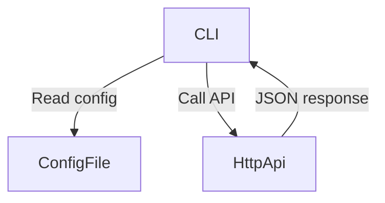

# Neotoma CLI reference
## Scope
This document covers CLI commands, options, configuration, and developer facing details. It does not cover MCP behavior or server side implementation beyond public API references.

## Purpose
Provide a complete CLI command reference and developer context for Neotoma CLI behavior.

## Invariants
1. Commands and options MUST match the CLI implementation.
2. Output formatting MUST remain deterministic and stable.
3. Configuration details MUST remain consistent with the CLI config module.

## Definitions
- **Operation ID**: OpenAPI operation identifier used by `neotoma request`.
- **Config path**: The file path where CLI stores connection settings.
- **PKCE**: OAuth Proof Key for Code Exchange used for login.

## Running the CLI

Run via npm scripts: `npm run cli` or `npm run cli:dev` (dev mode with immediate source changes). For global `neotoma` command: `npm run setup:cli` (build and link in one step), or manually `npm run build` then `npm install -g .` or `npm link`. If `neotoma` is not found, add `$(npm config get prefix)/bin` to PATH. See [CLI setup](getting_started.md#cli-setup) and [CLI overview](cli_overview.md#installation-and-setup) for full installation and troubleshooting details.

## Command reference
### Global options
- `--base-url <url>`: Override API base URL.
- `--json`: Output machine readable JSON.
- `--pretty`: Output formatted JSON.

### Authentication
- `neotoma auth login`: Start OAuth PKCE flow in browser.
  - `--dev-stub`: Use local dev stub authentication (local backend only).
- `neotoma auth status`: Show stored auth status.
- `neotoma auth logout`: Clear stored credentials.

### Entities
- `neotoma entities list`:
  - `--type <entityType>`
  - `--search <query>`
  - `--limit <n>`
  - `--offset <n>`
  - `--include-merged`
- `neotoma entities get <id>`

### Sources
- `neotoma sources list`:
  - `--search <query>`
  - `--mime-type <mimeType>`
  - `--limit <n>`
  - `--offset <n>`

### Observations
- `neotoma observations list`:
  - `--entity-id <id>`
  - `--entity-type <type>`
  - `--limit <n>`
  - `--offset <n>`

### Relationships
- `neotoma relationships list <entityId>`:
  - `--direction <direction>`: inbound, outbound, or both

### Timeline
- `neotoma timeline list`:
  - `--start-date <date>`
  - `--end-date <date>`
  - `--event-type <type>`
  - `--limit <n>`
  - `--offset <n>`

### Schemas
- `neotoma schemas list`
- `neotoma schemas get <entityType>`

### Store
- `neotoma store`:
  - `--json <json>`: Inline JSON array of entities.
  - `--file <path>`: Path to JSON file containing entity array.

### Upload
- `neotoma upload <filePath>`

### Analyze
- `neotoma analyze <filePath>`

### Stats
- `neotoma stats`

### Storage
- `neotoma storage info`: Show where CLI config and server data are stored (file paths and backend).
  - With local backend (`NEOTOMA_STORAGE_BACKEND=local` or unset): prints `data_dir`, `sqlite_db` (e.g. `data/neotoma.db`), `raw_sources` (e.g. `data/sources`), `event_log` (e.g. `data/events`). Paths are resolved from current directory when run from the Neotoma repo, or from `NEOTOMA_PROJECT_ROOT` / env overrides.
  - With Supabase backend: notes that data is in Supabase (Postgres + Storage bucket `sources`).

### Developer scripts
- `neotoma dev list`: List available npm scripts from `package.json`.
- `neotoma dev <script>`: Run a script from `package.json` (equivalent to `npm run <script>`).
- `neotoma dev run <script>`: Run a script by name (same as `neotoma dev <script>`).
- Use `-- <args>` to pass through extra arguments to the npm script.
- Commands must be run from the Neotoma repo root (package.json name must be `neotoma`).

### OpenAPI request
- `neotoma request --operation <id>`:
  - `--params <json>`: JSON object with `{ path, query, body }`.
  - `--body <json>`: JSON body override.
  - `--query <json>`: JSON query override.
  - `--path <json>`: JSON path override.
  - `--skip-auth`: Skip auth token for public endpoints.

## Configuration and storage paths
The CLI stores configuration in:
- `~/.config/neotoma/config.json`

To see where server data is stored (SQLite path, raw sources dir, etc.), run:
- `neotoma storage info`

Fields:
```
{
  "base_url": "http://localhost:8080",
  "access_token": "redacted",
  "token_type": "bearer",
  "expires_at": "2026-02-01T12:00:00Z",
  "connection_id": "redacted"
}
```

## Deterministic output
The CLI sorts object keys before outputting JSON. This keeps output stable between runs.

## Diagrams


## Examples
### Request by OpenAPI operation ID
```
neotoma request --operation listEntities --params '{"query":{"limit":5}}' --pretty
```

### Store entities from a file
```
neotoma store --file ./fixtures/tasks.json
```

## Testing requirements
1. Verify each command prints deterministic JSON output.
2. Validate auth login flow against local server.

## Agent Instructions
### When to Load This Document
Load this document when updating CLI commands, options, or configuration behavior.

### Required Co-Loaded Documents
- `docs/NEOTOMA_MANIFEST.md`
- `docs/conventions/documentation_standards.md`
- `docs/api/rest_api.md`

### Constraints Agents Must Enforce
1. Commands and flags MUST match the CLI implementation.
2. Config path and fields MUST be accurate.
3. Examples MUST use synthetic data.

### Forbidden Patterns
- Listing commands that do not exist
- Using real tokens or private values
- Omitting required sections

### Validation Checklist
- [ ] Purpose, Scope, Invariants, Definitions present
- [ ] Commands and options match CLI implementation
- [ ] Config path and fields are accurate
- [ ] Agent Instructions included
