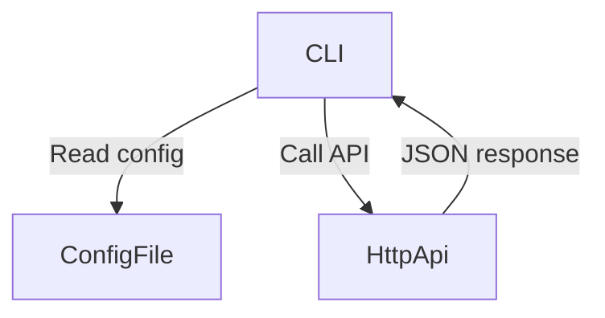

# Neotoma CLI reference

## Scope

This document covers CLI commands, options, configuration, and developer facing details. It does not cover MCP behavior or server side implementation beyond public API references.

## Purpose

Provide a complete CLI command reference and developer context for Neotoma CLI behavior.

## Invariants

1. Commands and options MUST match the CLI implementation.
2. Output formatting MUST remain deterministic and stable.
3. Configuration details MUST remain consistent with the CLI config module.

## Definitions

- **Operation ID**: OpenAPI operation identifier used by `neotoma request`.
- **Config path**: The file path where CLI stores connection settings.
- **PKCE**: OAuth Proof Key for Code Exchange used for login.

## Running the CLI

Run via npm scripts: `npm run cli` or `npm run cli:dev` (dev mode with immediate source changes). For global `neotoma` command: `npm run setup:cli` (build and link in one step), or manually `npm run build:server` then `npm install -g .` or `npm link`. If `neotoma` is not found, add `$(npm config get prefix)/bin` to PATH. See [CLI setup](getting_started.md#cli-setup) and [CLI overview](cli_overview.md#installation-and-setup) for full installation and troubleshooting details.

### Keeping the global CLI in sync

The global `neotoma` runs the built files in `dist/`, not the TypeScript source. After you change CLI code, either build once (`npm run build:server`) or run a watcher so the global install stays current:

- **One-off:** `npm run build:server` after CLI changes.
- **Ongoing (terminal):** Run `npm run watch:build` in a terminal. It runs `tsc --watch` so every save recompiles `dist/`; the next `neotoma` invocation uses the new code. With `npm link`, no re-link is needed.
- **Ongoing (after reboot):** Run `npm run setup:launchd-watch-build` once. This installs a macOS LaunchAgent that runs `tsc --watch` at login and keeps it running, so the global CLI stays in sync even after restart. Logs: `data/logs/launchd-watch-build.log`. Unload with `launchctl unload ~/Library/LaunchAgents/com.neotoma.watch-build.plist`.

### Environment: `neotoma dev` / `neotoma prod`

To target a specific API environment, pass `dev` or `prod` as the first argument or use `--env`.

- `neotoma dev` — development API (port 3080).
- `neotoma prod` — production API (port 3180).

Examples: `neotoma prod`, `neotoma dev`, `neotoma prod storage info`. Equivalent to using `--env`.

### Default: interactive session (use-existing only)

When you run `neotoma` with **no arguments**, source checkout selection follows this precedence:

1. explicit CLI flags (for commands that accept root/path flags)
2. `NEOTOMA_REPO_ROOT`
3. directory-local checkout (walk up from current directory)
4. saved config `project_root` (legacy `repo_root`) in `~/.config/neotoma/config.json`
5. user-level env at `~/.config/neotoma/.env` when no checkout is detected

With a source checkout, the CLI:

1. Uses **use-existing** policy only (no automatic server start).
2. Discovers running API instances from session ports, default ports (`3080`, `3180`), remembered ports, and optional extra configured ports.
3. Applies `--env` as a preference when selecting among multiple detected instances.
4. If multiple candidates remain, prompts you to choose the instance.
5. If none respond, shows fallback startup guidance and the command menu.
6. Enters an **interactive session** with a `neotoma> ` prompt.

**Non-interactive (e.g. agents):** When stdout is not a TTY, the CLI does **not** prompt. It uses **use-existing** (connect only). If **no command** is given and stdout is not a TTY (e.g. an agent runs `neotoma` with no args), the CLI prints: "No command given. Run neotoma <command> (e.g. neotoma entities list). Use neotoma --help for options." and exits with code 1.

**Direct invocation and session parity:** Every action available at the interactive `neotoma>` prompt is available as a direct CLI call: `neotoma <top-level> [subcommand] [options] [args]`. Examples: `neotoma entities list`, `neotoma relationships list <entityId>`, `neotoma storage info`. Agents and scripts should always use direct invocation; do not depend on entering the interactive session. See [CLI overview](cli_overview.md) and the command sections below for the full command tree.

To show the intro and then a **command menu** (prompt `> ` and `? for shortcuts`; no servers), use:

- `neotoma --no-session`  
  You get the same intro panel, then an interactive prompt. Type a command, or `?` / `help` to list commands. Type `exit` or `quit`, or press Ctrl+D, to exit.

To enter a session without starting any servers (connect to an already-running API):

- `neotoma --no-servers` or `neotoma --servers=use-existing`  
  Connect-only startup. Detects all available local API instances (not only `3080`/`3180`), prefers `--env` matches when available, and prompts when multiple candidates remain.

To start the API in the **background**:

- `neotoma api start --background --env dev` (or `--env prod`)  
  Starts the selected environment only and writes env-specific PID/log files.
- `neotoma api start --background --env dev --tunnel` (or `--env prod --tunnel`)
  Starts the API with an HTTPS tunnel (ngrok/cloudflared) for remote MCP access. Tunnel URL is written to `/tmp/ngrok-mcp-url.txt` when ready. Use `--tunnel-provider ngrok` or `--tunnel-provider cloudflare` to force a provider; otherwise the script auto-detects from installed tools.
- `neotoma api start --env dev --tunnel` (or `--env prod --tunnel`, no `--background`)
  Runs the API and tunnel in the **foreground** in the current terminal (same as `npm run dev:api`). Logs stream to the terminal; Ctrl+C stops both. Tunnel URL: `cat /tmp/ngrok-mcp-url.txt`.

**`--watch` flag (source checkouts, v0.5.2+).** On a source checkout `neotoma api start --env prod` currently spawns `dev:prod` (tsx watcher with `NEOTOMA_ENV=production`). In **v0.6.0 the default will flip** to the built runner (`start:api:prod`, which builds server TypeScript and runs `dist/actions.js`), which is what headless-production operators actually want. Contributors who want to keep iterating with hot-reload under the prod env should pass `--watch`:

- `neotoma api start --env prod --watch` — preserves the current watcher behavior across the v0.6.0 flip. In v0.6.0 this routes to `watch:prod` (the `dev:prod` alias is dropped; `watch:prod` itself is unchanged).
- `neotoma api start --env prod` (no `--watch`) — in v0.5.2 still selects the watcher and prints a one-line stderr deprecation notice announcing the flip. In v0.6.0 this switches to `start:api:prod`.

The flag is a no-op on `--env dev`, on installed-package checkouts without source watch scripts, and on the `--tunnel` path (the tunnel flow always wants the watcher). The deprecation line is suppressed under `--output json`.

For a real **headless / systemd** production deployment, install the published npm package (`npm install -g neotoma`) and use the recipe in [install.md § Production deployment (headless / systemd)](../../install.md#production-deployment-headless--systemd) rather than `neotoma api start` on a source checkout.

## npm scripts summary

All `npm run <script>` commands in one place. Scripts follow the three-category prefix convention documented in [`docs/developer/package_scripts.md`](package_scripts.md): `watch:*` for developer watchers, `serve:*`/`start:*` for compiled-`dist` runners, `dev:*` for other dev tooling. Some `dev:*` entries remain as aliases for their `watch:*` counterparts for historical reasons; new aliases that cross the category boundary are not introduced.

### Build and start

| Script           | Description                                                                                                                                     |
| ---------------- | ----------------------------------------------------------------------------------------------------------------------------------------------- |
| `build:server`   | Compile server TypeScript (`tsc`) → MCP, API, CLI, services                                                                                     |
| `build:ui`       | Build frontend (Vite)                                                                                                                           |
| `start:mcp`      | Run built MCP server (stdio)                                                                                                                    |
| `start:api`      | Run built HTTP Actions API                                                                                                                      |
| `start:api:prod` | Run `build:server`, then run API with `NEOTOMA_ENV=production`. Prefers port 3180; uses next free port if in use. Does not build UI or run MCP. |
| `start:ws`       | Run MCP WebSocket bridge                                                                                                                        |

### Development (watch mode)

| Script                                       | Port           | Description                           |
| -------------------------------------------- | -------------- | ------------------------------------- |
| `watch`, `dev`                               | —              | MCP stdio watch                       |
| `watch:server`, `dev:server`                 | 3080           | HTTP Actions API + watch              |
| `watch:ui`, `dev:ui`                         | Vite           | Frontend dev server                   |
| `watch:dev:tunnel`, `dev:api`                | 3080           | API + HTTPS tunnel (Cloudflare/ngrok) |
| `watch:server+api`, `watch:dev`              | 3080           | API + tunnel + `tsc --watch`          |
| `watch:full`, `dev:full`                     | 3080, Vite, WS | API + UI + build + resource banner + **`vite build --watch`** for Inspector into `dist/inspector` (`NEOTOMA_INSPECTOR_LIVE_BUILD=1`: no long cache + **full page reload** when `index.html` mtime changes after each rebuild) |
| `watch:full:prod`, `dev:full:prod`           | 3180, Vite, WS | Same as `watch:full` with `NEOTOMA_ENV=production` and prod-scoped Inspector watch (`watch:inspector:prod`) |
| `watch:inspector`, `watch:inspector:prod`    | —              | Inspector only: `vite build --watch` → repo `dist/inspector` (use with API already running, or rely on `watch:full` / `watch:full:prod`) |
| `watch:mcp:dev-shim`, `dev:mcp:dev-shim`     | —              | Stable stdio dev shim that restarts its MCP worker behind the client connection |
| `watch:mcp:stdio`, `dev:mcp:stdio`           | —              | MCP stdio watch                       |
| `watch:mcp:stdio:prod`, `dev:mcp:stdio:prod` | —              | MCP stdio, production env             |
| `dev:server+mcp`                             | 3080, 8280     | API + MCP HTTP + build                |
| `dev:ws`                                     | 3080, 8280     | API + WebSocket bridge watch          |
| `watch:prod`, `dev:prod`                     | 3180           | API + build, production env           |
| `watch:prod:tunnel`                          | 3180           | API + tunnel + build, production env  |

Scripts that start servers use the port(s) above when free; if a port is in use, they bind to the next available port (no process killing). See `scripts/pick-port.js`.

### Tunnel and setup

| Script             | Description                                    |
| ------------------ | ---------------------------------------------- |
| `tunnel:https`     | Start HTTPS tunnel only (Cloudflare or ngrok)  |
| `setup:cli`        | Build and link `neotoma` globally              |
| `setup:env-hook`   | Install git hook to copy `.env` into worktrees |
| `copy:env`         | Copy env file into current worktree            |
| `setup:worktree`   | Cursor worktree init                           |
| `setup:data`       | Data directory symlink                         |
| `setup:foundation` | Foundation submodule symlink                   |
| `setup:storage`    | Create storage buckets                         |

### Test and quality

| Script                   | Description                                      |
| ------------------------ | ------------------------------------------------ |
| `test`                   | Run Vitest                                       |
| `test:unit`              | Vitest, skip migrations                          |
| `test:remote`            | Vitest with remote DB tests (RUN_REMOTE_TESTS=1) |
| `test:frontend`          | Vitest for frontend                              |
| `test:integration`       | Integration tests                                |
| `test:agent-mcp`         | Agent MCP tests                                  |
| `test:coverage`          | Vitest with coverage                             |
| `test:coverage:critical` | Coverage for critical paths                      |
| `test:e2e`               | Playwright E2E                                   |
| `test:e2e:headed`        | Playwright E2E, headed browser                   |
| `lint`                   | ESLint (src)                                     |
| `type-check`             | `tsc --noEmit`                                   |
| `validate:coverage`      | Validate coverage map                            |
| `validate:doc-deps`      | Validate doc dependencies                        |
| `doctor`                 | Project health check (env, local SQLite hints)   |

### Database and schema

| Script                  | Description                               |
| ----------------------- | ----------------------------------------- |
| `migrate`               | Run migrations                            |
| `migrate:dry-run`       | Migrations dry run                        |
| `migrate:plans`         | Migrate plans                             |
| `migrate:plans:dry-run` | Migrate plans dry run                     |
| `schema:export`         | Export schema snapshots                   |
| `schema:init`           | Initialize schemas                        |
| `schema:init:dry-run`   | Schema init dry run                       |
| `schema:icons:generate` | Generate schema icons                     |
| `schema:cleanup:test`   | Cleanup test schemas                      |
| `recover:db`            | Check dev SQLite integrity / recover copy |
| `recover:db:prod`       | Check prod SQLite integrity / recover copy |
| `wipe:dev`              | Wipe dev database                         |
| `wipe:prod`             | Wipe prod database                        |
| `wipe:local`            | Wipe local database                       |
| `wipe:*:storage`        | Wipe + storage (e.g. `wipe:prod:storage`) |

### Docs and other

| Script                                 | Description                   |
| -------------------------------------- | ----------------------------- |
| `cli`, `cli:dev`                       | Run Neotoma CLI (built / dev) |
| `docs:generate`                        | Generate docs                 |
| `docs:build`, `docs:dev`, `docs:serve` | Docs site build/dev/serve     |
| `openapi:generate`                     | Generate OpenAPI types        |
| `branches:prune`                       | Prune merged branches         |
| `parquet:samples`                      | Create sample parquet files   |
| `sync:env`                             | Sync env from 1Password       |

For environment and ports, see [Getting started](getting_started.md#start-development-server).

## Command reference

### Global options

- `--base-url <url>`: Override API base URL.
- `--env <env>`: Environment selector (`dev` or `prod`). Required for server commands such as `api start`, `api stop`, `api logs`, and `watch`.
- `--offline`: Force in-process local transport for data commands (no external API process required).
- `--api-only`: Force API-only mode; fail when API is unreachable (use when you want to avoid loading the local DB).
- `--json`: Output machine readable JSON.
- `--pretty`: Output formatted JSON.
- `--no-session`: With no arguments, show intro then command menu (prompt `> `, `? for shortcuts`). No servers started.
- `--no-servers`: With no arguments, enter session with connect-only behavior.
- `--tunnel`: Start HTTPS tunnel (ngrok/cloudflared) with server start commands.
- `--tunnel-provider <provider>`: Force tunnel provider to `ngrok` or `cloudflare` when using `--tunnel`; default is auto-detect from installed tools.
- `--no-update-check`: Disable the update availability check. When enabled (default), the CLI checks the npm registry for a newer version and, if available, prints a one-line notice to stderr. The notice is never shown when `--json` is used.

### Runtime overrides (precedence: flag > env > default)

CLI behavior can be pinned per invocation via flags or across invocations via environment variables. Every runtime override follows the same precedence: explicit flag > environment variable > default.

| Flag | Environment variable | Purpose |
|------|----------------------|---------|
| `--api-only` | `NEOTOMA_API_ONLY` | Force API-only transport; fail if API is unreachable. |
| `--offline` | `NEOTOMA_OFFLINE` | Force in-process local transport; do not contact a remote API. |
| `--env <env>` | `NEOTOMA_ENV` (`development` / `production`) | Environment selector for server lifecycle commands. |
| `--root <path>` | `NEOTOMA_REPO_ROOT` | Source-checkout root when `neotoma` is run with no args. |
| `--user-id <id>` | `NEOTOMA_USER_ID` | Pin the user scope for read-verb requests (`entities`, `observations`, `relationships`, `timeline`, `schemas`, `sources`, `stats`, `list-recent-changes` (alias `recent`), `memory-export`). The flag wins per call; the env var acts as a session-wide pin; the server falls back to the authenticated user when both are unset. |

`--offline` and `--api-only` are mutually exclusive; setting both (via flag or env) raises an error at startup.

`NEOTOMA_USER_ID` must be non-empty when set — an empty or whitespace-only value causes the CLI to fail fast with a clear error rather than silently falling back to the authenticated user. Resolution is performed by `resolveEffectiveUserId()` in `src/cli/index.ts`.

Any new runtime override must follow this precedence model: add the env var read in the `preAction` hook in `src/cli/index.ts` alongside the existing transport variables, use a `NEOTOMA_`-prefixed name, let an explicit flag override it, and document it in the table above. See `docs/architecture/change_guardrails_rules.mdc` for the cross-cutting guardrails.

### Update check (stderr notice)

When the CLI runs in an interactive context (TTY, not `--json`), it may check the npm registry for a newer version of the package. If an update is available, it writes one or two lines to **stderr only** (e.g. "Update available: neotoma 0.2.15 → 0.2.16" and "Run: npm i -g neotoma@latest"). The check is fire-and-forget and does not block startup. To disable: set `NO_UPDATE_NOTIFIER=1` or pass `--no-update-check`. The check is also skipped when `CI` is set. Cache: `~/.config/neotoma/update_check.json` with a 24-hour TTL so the registry is not queried on every run.

### Session (interactive prompt)

- `neotoma session`: Start an interactive session with a persistent `neotoma> ` prompt. Run subcommands (e.g. `storage info`, `api status`) without restarting the CLI. Similar to a native shell or IDE command prompt. Does **not** start servers automatically.
  - Type `help` to list commands.
  - Type `/` to open the live command list (command + description per line), and keep typing to filter matches.
  - Type `exit` or `quit`, or press Ctrl+D, to end the session.
  - Arguments with spaces can be quoted: `request --operation "GET /api/entities"`.
  - Maintenance invariant (TTY redraw): slash suggestions are rendered on the next line with a leading newline, so cursor-up must move `rendered_lines + 1`. See `getSlashSuggestionCursorUpLines()` and `tests/cli/cli_session_startup_ux.test.ts` (regression guard).

### Offline support matrix

- **Data commands (entities, relationships, sources, observations, timeline, store, schemas, stats, corrections, snapshots):** offline-first in-process local transport by default (no API server required).
- **Explicit local path:** pass `--offline`.
- **Strict remote path:** pass `--api-only`.
- **Server lifecycle commands (`api start|stop|status|logs|processes`):** server-management behavior is unchanged and not redirected to local fallback.
- **Watch/storage/logs/backup:** already local backend commands and continue to run without a running API.

**Transport default rationale:** The CLI defaults to offline-first so that data commands work without a running API (e.g. `neotoma entities list` works right after `neotoma init`). The native SQLite addon is lazy-loaded only when a data command actually uses the local DB, so entry points that never touch the DB (e.g. `neotoma --help`, `neotoma api start`) do not trigger macOS permission prompts. The first time a user runs a data command, the local DB may be opened and the OS may show a one-time permission prompt for the native addon; this is an accepted tradeoff for out-of-the-box usability. Use `--api-only` if you want to avoid loading the local DB and require the API instead.

**Examples:**

```bash
# Session only (no servers; use when API is already running)
neotoma session
# neotoma> storage info
# neotoma> api status
# neotoma> exit

# Session with dev + prod servers (same as running `neotoma` with no args)
neotoma session --servers
```

### Initialization

- `neotoma init`: Initialize Neotoma for first-time use. Creates data directories, initializes the SQLite database, and can prompt to create encryption keys for privacy-first mode. Default flow is auto-detection-first: if a source checkout is detected, init targets project `.env`; otherwise it configures user `.env` at `~/.config/neotoma/.env` without prompting for a source path. Source-path prompts only appear in personalization mode. In interactive mode (TTY), init can prompt to set `OPENAI_API_KEY` for LLM extraction. Init can also prompt to add CLI instructions (`neotoma cli-instructions check`) when missing.
  - `--data-dir <path>`: Custom data directory path. Default: `./data` (if in repo) or `~/neotoma/data` (if installed globally).
  - `--force`: Overwrite existing configuration.
  - `--skip-db`: Skip database initialization.
  - `--skip-env`: Skip interactive `.env` creation and variable prompts (e.g. for CI or non-interactive use).

**Example:**

```bash
# Basic initialization
neotoma init

# Initialize with custom data directory
neotoma init --data-dir /path/to/data
```

**What it creates:**

- Data directories: `<data-dir>/`, `<data-dir>/sources/`, `<data-dir>/logs/` (event log is `<data-dir>/logs/events.log`)
- SQLite database: `<data-dir>/neotoma.db` (with WAL mode enabled)
- Encryption key (if user chooses key-derived auth when prompted): `~/.config/neotoma/keys/neotoma.key` (mode 0600).
- Environment file target: project `<checkout>/.env` when checkout is detected, otherwise `~/.config/neotoma/.env`

### Reset

- `neotoma reset`: Reset local Neotoma state to a clean slate.
  - Backs up and removes local Neotoma state (config/env/keys/instructions and known local data directories).
  - Always backs up a data directory before removing it.
  - If `.env` sets `NEOTOMA_DATA_DIR`, that configured data directory is protected: reset does not back it up or remove it.
  - Cleans Neotoma MCP entries from user/project MCP configs.
  - Attempts global uninstall via `npm uninstall -g neotoma` (best effort; failures are reported but do not roll back completed local cleanup).
  - `-y, --yes`: Skip confirmation prompt.

### Authentication

CLI uses the same auth patterns as MCP and REST API. Local CLI commands can run without login in development, but MCP OAuth now requires key-auth preflight.

- `neotoma auth status`: Show auth mode (none, dev-token, key-derived) and user details. Works without prior login.
- `neotoma auth login`: OAuth PKCE flow for MCP Connect (Cursor) setup. Browser flow requires key authentication (`/mcp/oauth/key-auth`) first. Use `--tunnel` to read the API base URL from `/tmp/ngrok-mcp-url.txt` (for testing OAuth when the API is behind a tunnel).
- `neotoma auth logout`: Clear stored OAuth credentials (MCP Connect only).
- `neotoma auth mcp-token`: Print MCP auth token derived from private key (when encryption is enabled). Add to mcp.json headers.
- If key-authenticated OAuth is unavailable, configure `Authorization: Bearer <NEOTOMA_BEARER_TOKEN>` for MCP instead of OAuth.

### MCP configuration

Commands for managing MCP server configuration files (Cursor, Claude Code, Windsurf, etc.):

- `neotoma mcp config`: Show MCP configuration guidance for Cursor and other clients.
  - `--no-check`: Skip checking for existing MCP config files (default: check and suggest `mcp check` if servers are missing).
  - Prints example JSON config for Cursor with URL or stdio server entries.
  - After printing config, scans current directory for MCP config files and suggests running `neotoma mcp check` if dev or prod servers are missing.

- `neotoma mcp check`: Scan for MCP config files in current directory and subdirectories, detect whether dev and prod Neotoma servers are configured, and offer to install missing servers.
  - `--user-level`: Include user-level MCP config paths (e.g. `~/.cursor/mcp.json`, Claude, Windsurf) in scan (default: project-local only).
  - `--install-hooks` / `--no-hooks`: Install or skip matching Neotoma lifecycle hooks when a configured MCP path maps to a hook-capable harness. Hook installation is enabled by default for non-JSON runs; use `--no-hooks` to limit the command to MCP config only.
  - `--yes`: Skip hook installation confirmation prompts. MCP server config prompts still follow the normal interactive flow.
  - Scans for known config file patterns:
    - **Cursor:** `.cursor/mcp.json`, `.mcp.json` (project), `~/.cursor/mcp.json` (user-level with `--user-level`)
    - **Claude Code:** `claude_desktop_config.json` (project or user-level with `--user-level`):
      - macOS: `~/Library/Application Support/Claude/claude_desktop_config.json`
      - Linux: `~/.config/Claude/claude_desktop_config.json`
      - Windows: `%APPDATA%\Claude\claude_desktop_config.json`
    - **Windsurf:** `mcp_config.json` (project or user-level with `--user-level`):
      - macOS/Linux: `~/.codeium/windsurf/mcp_config.json`
      - Windows: `%APPDATA%\Codeium\Windsurf\mcp_config.json`
  - For each found config, checks for `neotoma-dev` and `neotoma` server entries (based on `command` script names or `url` patterns). In Claude Desktop's `claude_desktop_config.json`, new entries use `mcpsrv_neotoma_dev` and `mcpsrv_neotoma`, and legacy `neotoma-dev` / `neotoma` keys are reported for repair because Claude Desktop validates server IDs as UUIDs or `mcpsrv_*` tags.
  - If any config is missing dev or prod servers, prompts to add them with absolute script paths.
  - If no config files found, offers to create `.cursor/mcp.json` in current directory.
  - Uses Neotoma source root (from `findRepoRoot`, config, or `NEOTOMA_REPO_ROOT`) to resolve absolute script paths for `run_neotoma_mcp_stdio.sh` and `run_neotoma_mcp_stdio_prod.sh`. The dev shim wrapper `run_neotoma_mcp_stdio_dev_shim.sh` is detected as a dev server when present in an MCP config, but it is not installed as the default local MCP command.
  - After install, verifies or installs lifecycle hooks for hook-capable harnesses inferred from the configured MCP paths (for example `.cursor/mcp.json` → Cursor hooks, `.codex/config.toml` → Codex hooks). Harnesses without an auto-installer print the matching manual instruction.
  - After install, shows a reminder to run `neotoma cli-instructions check`; when MCP servers are installed interactively, it can also prompt to add CLI instructions if missing.

**Dev vs Prod detection patterns:**

- **Dev:** `command` contains `run_neotoma_mcp_stdio.sh`, `run_neotoma_mcp_stdio_dev_watch.sh`, or `run_neotoma_mcp_stdio_dev_shim.sh`, or `url` contains `localhost:3080/mcp` or `127.0.0.1:3080/mcp`. During connect-only sessions, the currently selected instance port is also considered for dev if the active env is dev.
- **Prod:** `command` contains `run_neotoma_mcp_stdio_prod.sh` or `run_neotoma_mcp_stdio_prod_watch.sh`, or `url` contains `localhost:3180/mcp`, `127.0.0.1:3180/mcp`, or `neotoma.fly.dev/mcp`. During connect-only sessions, the currently selected instance port is also considered for prod if the active env is prod.

**Example workflow:**

```bash
# Show config guidance and check if servers are configured
neotoma mcp config

# Scan project-local MCP configs and add missing servers
neotoma mcp check

# Scan including user-level configs (Cursor, Claude, Windsurf)
neotoma mcp check --user-level

# Configure MCP and install matching hooks without hook prompts
neotoma mcp check --user-level --yes
```

### CLI instructions (prefer MCP when available, CLI as backup)

Commands to ensure agent instructions tell agents to use the Neotoma CLI when running locally and MCP when remote:

- `neotoma cli-instructions config`: Show guidance for adding the "prefer MCP when available, CLI as backup" rule to Cursor, Claude, and Codex (project: `.cursor/rules/`, `.claude/rules/`, `.codex/`; user: `~/.cursor/rules/`, `~/.claude/rules/`, `~/.codex/`). Does not modify files.
- `neotoma cli-instructions check`: Scan only paths that each IDE actually loads (applied paths). Reports Cursor, Claude, and Codex separately; if missing in any, prompts to add to project (all three), user (all three), or both. Writes to `.cursor/rules/neotoma_cli.mdc`, `.claude/rules/neotoma_cli.mdc`, `.codex/neotoma_cli.md` so the instruction is applied in all three environments.
  - `--user-level` / `--no-user-level`: Include or exclude user-level paths in scan (default: include).
  - `--yes`: Non-interactive; only report status and print snippet path, do not offer to add.

See `docs/developer/agent_cli_configuration.md` for the rule text and strategy.

### Entities

- `neotoma entities list`:
  - `--type <entityType>`
  - `--search <query>`
  - `--limit <n>`
  - `--offset <n>`
  - `--include-merged`
- `neotoma entities get <id>`
- `neotoma entities search [identifier]`:
  - Preferred: positional `identifier` or `--identifier <id>`
  - Compatibility alias: `--query <id>` (equivalent to `--identifier`)
  - If both `--identifier` and `--query` are provided, they must match

### Sources

- `neotoma sources list`:
  - `--search <query>`
  - `--mime-type <mimeType>`
  - `--limit <n>`
  - `--offset <n>`

### Observations

- `neotoma observations list`:
  - `--entity-id <id>`
  - `--entity-type <type>`
  - `--limit <n>`
  - `--offset <n>`

### Relationships

- `neotoma relationships create --source-entity-id <id> --target-entity-id <id> --relationship-type <type>`: Create one relationship.
  - `--metadata <json>`: attach relationship metadata.
  - `--file <path>`: create a batch from a JSON array, or an object with `relationships: [...]`. Each entry uses `relationship_type`, `source_entity_id`, `target_entity_id`, and optional `metadata`.
- `neotoma relationships list <entityId>`:
  - `--direction <direction>`: inbound, outbound, or both
- `neotoma relationships get-snapshot <relationshipType> <sourceEntityId> <targetEntityId>`: Get relationship snapshot with provenance (observations). Relationship type is one of: PART_OF, CORRECTS, REFERS_TO, SETTLES, DUPLICATE_OF, DEPENDS_ON, SUPERSEDES, EMBEDS.
- `neotoma relationships restore <relationshipType> <sourceEntityId> <targetEntityId>`: Restore a deleted relationship (creates restoration observation). Optional: `--reason <reason>`.

### Timeline

- `neotoma timeline list`:
  - `--start-date <date>`
  - `--end-date <date>`
  - `--event-type <type>`
  - `--entity-id <id>`: Filter by entity ID
  - `--user-id <userId>`: Filter by user ID (default: authenticated user)
  - `--limit <n>`
  - `--offset <n>`
  - `--order-by <column>`: `event_timestamp` (default, document dates) or `created_at` (when the timeline row was written)

### Schemas

- `neotoma schemas list`
- `neotoma schemas get <entityType>`

### Interpretations

- `neotoma interpretations reinterpret [sourceId]`:
  - `--source-id <id>`: Source ID to reinterpret.
  - `--interpretation-id <id>`: Resolve source from an existing interpretation.
  - `--interpretation-config <json>`: Override interpretation settings for this run.
- `neotoma interpretations interpret-uninterpreted`:
  - `--limit <n>`: Max number of sources to process (default: 50).
  - `--dry-run`: Return source IDs that would be interpreted without running interpretation.
  - `--interpretation-config <json>`: Optional settings applied to each backfill run.

### Store

- `neotoma store`:
  - Preferred structured input: `--entities <json>` or `--file <path>`
  - Compatibility alias: `--json=<json>` maps to structured `--entities` for backward compatibility.
    - Use `--json=` (equals, no space) so the payload is parsed as entities input.
    - Bare `--json` (without `=`) remains the global output-format flag.
  - `--file <path>`: Path to JSON file containing entity array. Use for long payloads.
  - Silent-failure guard (v0.5.1+): when a commit-mode store returns `entities_created=0`, no resolved entities, and is not an idempotency replay (`replayed: true`), the CLI emits a non-fatal stderr warning so agents/humans don't mistake an empty result for success. Typical root cause: fields nested under `attributes` (see v0.5.0 breaking change) or mismatched `user_id` scope.
  - Idempotency replays: `POST /store` returns `replayed: true` when a request is a deterministic re-commit of a previously committed `(user_id, idempotency_key)` tuple. Use this to distinguish "same call, no new work" from "call produced zero entities."

### Ingest

- `neotoma ingest`: Atomic structured-entities + source-file ingest (composes `/store`).
  - `--entities <path>` (required): JSON file containing the entity array extracted by the caller.
  - `--source-file <path>` (required): Raw source artifact (PDF, transcript, CSV, etc.) attached as provenance.
  - `--user-id <id>` / `--idempotency-key <key>` / `--file-idempotency-key <key>`: same semantics as `neotoma store`.
  - `--plan` / `--dry-run`: Preview planned actions without committing.
  - `--strict`: Refuse silent merges (schema `canonical_name_fields` must match, or `--target-id` must be supplied).
  - `--source-upload` (v0.5.1+): Force base64 upload of the source file via `file_content`. Use this when the CLI and API run on different machines so the server can't read the CLI's local filesystem.
  - `--source-content` (v0.5.1+): Alias for `--source-upload`.
  - Auto-upload (v0.5.1+): when the resolved base URL is non-localhost (anything other than `localhost`, `127.0.0.1`, `::1`, `0.0.0.0`), the CLI automatically switches from `file_path` to `file_content` so remote deployments work without any flag. Localhost base URLs continue to send `file_path` so the server reads the artifact directly from disk.
  - Upload size limit: the server caps JSON bodies at 10 MB (`express.json({ limit: "10mb" })`). Accounting for base64 overhead (~1.37×), the CLI refuses to upload source files larger than ~7.5 MB with a clear error pointing operators at a localhost API as the alternative.

### MCP/CLI parity note

For chat persistence recipes, MCP and CLI use the same underlying store contract. In CLI examples:
- entity lookup supports positional identifier, `--identifier`, and compatibility alias `--query`
- structured store supports preferred `--entities`/`--file` and compatibility alias `--json=<json>`

### Upload

- `neotoma upload <path>`: Store an unstructured file (raw upload with optional AI interpretation).
  - `--no-interpret`: Skip AI interpretation after store.
  - `--idempotency-key <key>`: Idempotency key (default: content hash).
  - `--mime-type <type>`: MIME type (default: inferred from extension).
  - `--local`: Run store and interpretation in-process without starting or connecting to the API server. Uses the same `.env`, database, and storage backend as the server. Requires `neotoma init` to have been run. Encryption-off only (local dev user) for MVP. Example: `neotoma upload --local invoice.pdf`.

### Analyze

- `neotoma analyze <filePath>`

### Stats

- `neotoma stats`

### Watch (local backend only)

- `neotoma watch`: Stream record changes (entities, observations, sources, etc.) as they happen. Uses local dev user when encryption is off (no login needed).
  - `--interval <ms>`: Polling interval in ms (default: 400).
  - `--json`: Output NDJSON (one JSON object per line).
  - `--human`: Output one sentence per change (e.g. "Created person \"George\"", "Updated relationship \"wife\" for person \"Alice\" with person \"Bob\""). No timestamps, emoji, or IDs.
  - `--tail`: Only show changes from now (skip existing records).
  - When encryption is on, set `NEOTOMA_KEY_FILE_PATH` or `NEOTOMA_MNEMONIC`.

### Mirror

- `neotoma mirror enable`: Enable the markdown mirror under `<NEOTOMA_DATA_DIR>/mirror/` and run an initial rebuild.
  - `--path <dir>`: Override mirror root.
  - `--git`: Enable git-backed history (`git init` on the mirror path, one commit per write batch). Requires the optional `simple-git` dependency (installed by default).
  - `--kinds <list>`: Comma-separated kinds to mirror (`entities,relationships,sources,timeline,schemas`, default all).
  - `--gitignore`: After enabling, append the resolved mirror path to the enclosing git repo's `.gitignore` (idempotent). No-op when the mirror path is not inside a repo. Equivalent to running `neotoma mirror gitignore` after `enable`.
  - `--no-gitignore`: Explicit form for `--yes` scripts that want to leave `.gitignore` alone (default).
- `neotoma mirror disable`: Disable mirror write-through. Does not delete existing files.
- `neotoma mirror rebuild`: Regenerate the mirror from SQLite.
  - `--kind <entities|relationships|sources|timeline|schemas|all>` (default `all`).
  - `--entity-type <type>`, `--entity-id <id>`: Scope rebuild to a type or single record.
  - `--clean`: Remove stale mirror files within the targeted scope that this rebuild did not produce.
- `neotoma mirror status`: Print current mirror config, file counts per kind, and whether git is enabled.
- `neotoma mirror gitignore`: Idempotently append the resolved mirror path to the enclosing git repo's `.gitignore`, under a `# Neotoma markdown mirror` comment. The helper walks up from the mirror path to find the enclosing `.git` directory; it never prompts for a path and never writes to a repo it did not detect. When the mirror path is not inside a repo, it exits 0 with a "not inside a git repo" message. Use `--json` to get the structured result (`repo_root`, `gitignore_path`, `entry`, `added`, `already_present`).

The mirror is a derived artifact: SQLite is the only source of truth. Mirror files carry a header warning that manual edits will be overwritten on the next write. To edit an entity, use `neotoma edit <id>` or the Inspector (see below). The mirror defaults to disabled; activation offers it as an opt-in (see [`install.md`](../../install.md#activation-step-66-offer-markdown-mirror-opt-in)). See `docs/subsystems/markdown_mirror.md` for layout, determinism, and git semantics.

### Edit

- `neotoma edit <id>`: Open the entity snapshot as YAML in `$EDITOR`, diff on save, and submit changed fields as one batch correction (one `correct()` observation per changed field, applied atomically).
  - `--set field=value` (repeatable): Non-interactive edit. No editor invoked. Same batch backend, same concurrency prompt.
  - `--force`: On optimistic-concurrency conflict, overwrite without prompting (non-interactive use).
  - Editor fallback order: `$EDITOR`, then `$VISUAL`, then `vi`.
  - Optimistic concurrency: captures `last_observation_at` on load. If a newer observation exists at save time, the CLI prints conflicting fields and prompts `[r]ebase / [o]verwrite / [a]bort`.
  - On validation failure, the draft file is preserved under `~/.config/neotoma/edit-drafts/<entity_id>-<ts>.yaml` and the path is printed so the user can rerun `neotoma edit <id>`.

The CLI and the Inspector share one `applyBatchCorrection` backend (`src/services/batch_correction.ts`), so both surfaces have identical semantics.

### Memory export

- `neotoma memory-export`: Write a single `MEMORY.md` file with bounded, deterministic contents for agent harnesses that consume file-based memory.
  - `--path <path>` (default `MEMORY.md`): Output path.
  - `--limit-lines <n>` (default 200): Hard line cap. When exceeded, output is truncated with a `<!-- fold: N entities not shown -->` marker. Set to `0` to include every entity with no line cap.
  - `--include-types <list>`: Comma-separated entity types to include. Omit to include all types (minus bookkeeping).
  - `--exclude-types <list>`: Comma-separated entity types to exclude. Applied on top of the default bookkeeping filter.
  - `--include-bookkeeping`: Include chat bookkeeping (`conversation`, `agent_message`). Excluded by default because they are noise in a memory manifest and already live in conversation history.
  - `--max-field-chars <n>` (default 400): Per-field character cap for long string values. Long bodies (posts, notes, transcripts) are truncated with a deterministic `… (<N> chars truncated)` suffix so one long entity cannot consume the entire line budget. Set to `0` to emit full values.
  - `--order <importance|recency>` (default `importance`): Sort strategy.
    - `importance`: type-weighted signal score `typeWeight × log2(observation_count + 2) × recency_decay` (half-life 30 days). Tier-1 types (`task`, `contact`, `event`, `transaction`, `product_feedback`, `business_opportunity`, `issue`, `user_persona_insight`, `life_tenets`, `architectural_decision`, `agent_decision`, `release`, `feature_unit`) rank above Tier-2 durable artifacts (`note`, `post`, `meeting_transcription`, `email_message`, `location`, `file_asset`, etc.). Bookkeeping types score 0 when included explicitly.
    - `recency`: `last_observation_at desc`, ties broken by `entity_id asc`.
  - `--user-id <id>`: Scope to a specific user. Defaults to the active local dev user when encryption is off.

`MEMORY.md` is regenerated automatically after each mirror batch when `mirror.memory_export.enabled` is set in `~/.config/neotoma/config.json`.

### Storage

- `neotoma storage info`: Show where CLI config and server data are stored (file paths and backend).
  - Local backend (only supported backend): prints `data_dir`, `sqlite_db` (default `data/neotoma.db` in development, `data/neotoma.prod.db` in production), `raw_sources` (e.g. `data/sources`), `event_log` (e.g. `data/logs/events.log`), `logs` (e.g. `data/logs`). Paths are resolved from current directory when run from a Neotoma source checkout, or from `NEOTOMA_PROJECT_ROOT` / `NEOTOMA_DATA_DIR` and other env overrides.
- `neotoma storage set-data-dir <dir>`: Update repo `.env` with `NEOTOMA_DATA_DIR=<dir>`, and optionally copy SQLite DB files (`neotoma.db`, `neotoma.prod.db`, and `-wal`/`-shm` sidecars) from the old data directory.
  - Interactive mode asks whether to copy DB files.
  - When DB files exist in both old and new directories, conflict handling is:
    - `merge`: back up target DB files, then insert missing rows from old DBs into target DBs.
    - `overwrite`: back up target DB files, then replace target DB files with old DB files.
    - `use-new`: keep target DB files unchanged and only switch `NEOTOMA_DATA_DIR`.
  - Old directory files are always preserved (copy/merge only, never delete old DB files).
  - Options:
    - `--move-db-files` / `--no-move-db-files`
    - `--on-conflict <merge|overwrite|use-new>`
    - `--yes` (skip prompts)
  - `--json` output includes backup paths, copied files, conflict strategy, and merge stats.
- `neotoma storage merge-db`: Merge one SQLite DB file into another.
  - Required:
    - `--source <path>`: Source DB file.
    - `--target <path>`: Target DB file.
  - Options:
    - `--mode <safe|keep-target|keep-source>`:
      - `safe` (default): fail when matching primary keys contain differing row values.
      - `keep-target`: insert missing rows; keep target rows on conflicts (`INSERT OR IGNORE` behavior).
      - `keep-source`: insert/replace source rows into target (`INSERT OR REPLACE` behavior).
    - `--dry-run`: Analyze conflicts and merge impact without writing the target DB.
    - `--no-recompute-snapshots`: Skip post-merge snapshot recomputation.
  - Behavior notes:
    - Default mode is safety-first (`safe`) to avoid silent row loss on conflicts.
    - Post-merge recomputation rebuilds `entity_snapshots` and `relationship_snapshots` when those tables exist.
    - This command merges DB rows only; it does not copy `sources/` files or log directories. Use backup/restore or storage migration workflows when file assets must move with DB content.
- `neotoma storage recover-db`: Check SQLite integrity and optionally write a recovered copy via `sqlite3 .recover`.
  - Default: check only. Exits non-zero when corruption is detected.
  - `--recover`: write a new sibling file such as `neotoma.prod.recovered-<timestamp>.db`.
  - `--output <path>`: explicit recovered DB path.
  - Behavior notes:
    - Requires `sqlite3` on `PATH`.
    - Does not replace the live DB automatically.
    - Stop Neotoma (MCP/API) before running `--recover`.
    - After a successful recover, manually archive the live `.db` / `-wal` / `-shm` and then copy the recovered file into place.

### Snapshots

Fleet-general write-integrity tooling built on the canonical snapshot layer. `snapshots check` / `snapshots request` operate on the runtime snapshot tables; `snapshots export`, `snapshots diff`, and `snapshots parsers` power the fleet-neutral drift workflow described in `docs/releases/in_progress/v0.6.0/` (item 3: snapshot export + drift comparison).

- `neotoma snapshots check`: Check for stale entity snapshots.
  - `--auto-fix`: Also recompute stale snapshots in place.
- `neotoma snapshots request`: Request snapshot recomputation for stale snapshots.
  - `--dry-run`: Check only; do not recompute.
- `neotoma snapshots export`: Export entity snapshots as fleet-neutral JSON (schema_version `0.1.0`) with per-field provenance, an `observation_source` histogram, and an `attribution_fingerprint` roll-up per entity.
  - `--entity-types <csv>`: Restrict to comma-separated entity types (e.g. `agent_task,agent_attempt`).
  - `--agent-sub <sub>`: Restrict to a single AAuth `agent_sub`.
  - `--attribution-tier <tier>`: Restrict to one tier — `hardware | software | unverified_client | anonymous`.
  - `--observation-source <kind>`: Restrict to one write kind — `sensor | llm_summary | workflow_state | human | import`.
  - `--since <iso>`: ISO-8601 lower bound on `last_observation_at`.
  - `--limit <n>`: Cap on returned entities (default: 500).
  - `--out <path>`: Write the export to this file instead of stdout.
  - `--user-id <id>`: Override user scope (flag > `NEOTOMA_USER_ID` > authenticated user).
  - Output shape: `{ schema_version, exported_at, filter, total_entities, entities[] }`.
- `neotoma snapshots diff`: Compare a Neotoma export against an external-state snapshot via a pluggable `ExternalParser`. Defaults to the identity `json` parser; fleet-specific parsers register via `registerExternalParser` in `src/services/drift_comparison.ts`.
  - `--neotoma <path>` (required): Path to a `snapshots export` JSON file.
  - `--external <path>` (required): Path to the external-state snapshot file.
  - `--parser <name>`: External parser name (default: `json`; list via `snapshots parsers`).
  - `--out <path>`: Write the drift report to this file instead of stdout.
  - Report shape: `{ summary, missing_in_neotoma[], missing_in_external[], field_diffs[], provenance_gaps[] }`. `provenance_gaps` flags entities with unclassified `observation_source` or anonymous / unverified_client attribution even when field values agree.
- `neotoma snapshots parsers`: List registered external parsers available to `snapshots diff`.

Fleet round-trip example (AIBTC Lumen, LangGraph, custom adapters all follow the same shape):

```bash
neotoma snapshots export --entity-types agent_task,agent_attempt --out ./neotoma.json
# produce a NormalizedExternalSnapshot from whatever your fleet keeps on disk
neotoma snapshots diff --neotoma ./neotoma.json --external ./fleet.json --parser json
```

### Backup and restore

- `neotoma backup create`: Create a backup of the local database, sources, and logs.
  - `--output <dir>`: Output directory (default: `./backups`).
  - Creates a timestamped subdirectory with `neotoma.db`, WAL file, `sources/`, `logs/` (includes `events.log`), and a `manifest.json` with checksums.
  - If encryption is enabled, data in the backup remains encrypted. Preserve the key file or mnemonic for restore.
- `neotoma backup restore`: Restore a backup into the data directory.
  - `--from <dir>`: Backup directory to restore from (required).
  - `--target <dir>`: Target data directory (default: `NEOTOMA_DATA_DIR` or `./data`).

### Logs

- `neotoma logs tail`: Read persistent log files.
  - `--decrypt`: Decrypt encrypted log lines using `NEOTOMA_KEY_FILE_PATH` or `NEOTOMA_MNEMONIC`.
  - `--lines <n>`: Number of lines to show (default: 50).
  - `--file <path>`: Specific log file (default: latest in env-specific `data/logs`; prod uses `data/logs_prod`).

### Developer scripts

- `neotoma dev list`: List available npm scripts from `package.json`.
- `neotoma dev <script>`: Run a script from `package.json` (equivalent to `npm run <script>`).
- `neotoma dev run <script>`: Run a script by name (same as `neotoma dev <script>`).
- Use `-- <args>` to pass through extra arguments to the npm script.
- The source checkout is found by: explicit CLI inputs (where supported), then `NEOTOMA_REPO_ROOT`, then walking up from the current directory, then saved config `project_root` (legacy `repo_root` is still read).

### Debugging and testing (e.g. with an agent)

- **When debugging CLI-related issues, always check the CLI log first.** In dev the default path is `~/.config/neotoma/cli.log`. If the user passed `--log-file`, check that path. For session server output, check `<repo>/data/logs/session.log` (dev) or `session.prod.log` (prod). The same file is used whether the API was started by the CLI or by the MCP server (both append); look for "started by MCP" in the log to see who started a given run. For background API, check `neotoma api logs` or `~/.config/neotoma/logs/api.log`. See **Where to look for what (logs)** in `docs/operations/troubleshooting.md` for a per-component log map.
- **Dev** (default): CLI appends stdout and stderr to `~/.config/neotoma/cli.log`. Use `--no-log-file` to disable.
- **Prod** (`NEOTOMA_ENV=production`): No log file by default; use `--log-file <path>` to enable.
- `--log-file <path>`: Append CLI output to this path (overrides env default).
- `--no-log-file`: Do not write to the log file (dev only; prod has no default log file).
- `--debug`: Emit detailed initialization logs to stderr when starting a session.

### OpenAPI request

- `neotoma request --operation <id>`:
  - `--params <json>`: JSON object with `{ path, query, body }`.
  - `--body <json>`: JSON body override.
  - `--query <json>`: JSON query override.
  - `--path <json>`: JSON path override.
  - `--skip-auth`: Skip auth token for public endpoints.

## Configuration and storage paths

The CLI stores configuration in:

- `~/.config/neotoma/config.json`

To see where server data is stored (SQLite path, raw sources dir, etc.), run:

- `neotoma storage info`

Fields:

```
{
  "base_url": "http://localhost:3080",
  "access_token": "redacted",
  "token_type": "bearer",
  "expires_at": "2026-02-01T12:00:00Z",
  "connection_id": "redacted"
}
```

## Deterministic output

The CLI sorts object keys before outputting JSON. This keeps output stable between runs.

## Diagrams


```mermaid
flowchart TD
    cli[CLI] -->|"Read config"| config[ConfigFile]
    cli -->|"Call API"| api[HttpApi]
    api -->|"JSON response"| cli
```

## Examples

### Request by OpenAPI operation ID

```
neotoma request --operation listEntities --params '{"query":{"limit":5}}' --pretty
```

### Store entities from a file

```
neotoma store --file ./fixtures/tasks.json
```

### Stream record changes alongside MCP actions

```
neotoma watch --tail --json   # NDJSON, only new changes
neotoma watch --tail --human  # Plain one-line-per-change, only new
neotoma watch --tail          # Human-readable, only new changes
neotoma watch --human         # Plain one-line-per-change, no technical formatting
neotoma watch                 # Human-readable, includes existing records on startup
```

## Testing requirements

1. Verify each command prints deterministic JSON output.
2. Validate auth login flow against local server.

## Agent Instructions

### When to Load This Document

Load this document when updating CLI commands, options, or configuration behavior.

### Required Co-Loaded Documents

- `docs/NEOTOMA_MANIFEST.md`
- `docs/conventions/documentation_standards.md`
- `docs/api/rest_api.md`

### Constraints Agents Must Enforce

1. Commands and flags MUST match the CLI implementation.
2. Config path and fields MUST be accurate.
3. Examples MUST use synthetic data.

### Forbidden Patterns

- Listing commands that do not exist
- Using real tokens or private values
- Omitting required sections

### Validation Checklist

- [ ] Purpose, Scope, Invariants, Definitions present
- [ ] Commands and options match CLI implementation
- [ ] Config path and fields are accurate
- [ ] Agent Instructions included
