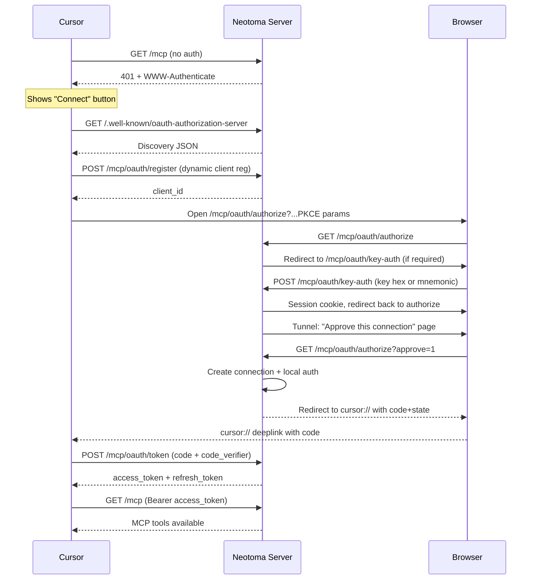

# MCP OAuth Implementation

Details of the OAuth 2.0 Authorization Code flow with PKCE used by the Neotoma MCP server.

## Overview

Neotoma uses OAuth 2.0 with PKCE for MCP client authentication. The flow supports both local (built-in auth) and remote (auth server) backends.

## Endpoints

All endpoints are registered on the Express app without an `/api/` prefix:

| Endpoint | Method | Purpose |
|----------|--------|---------|
| `/.well-known/oauth-authorization-server` | GET | RFC 8414 discovery |
| `/.well-known/oauth-protected-resource` | GET | Protected resource metadata |
| `/mcp/oauth/initiate` | POST | Start OAuth flow (frontend-initiated) |
| `/mcp/oauth/authorize` | GET | Authorization endpoint (Cursor Connect) |
| `/mcp/oauth/key-auth` | GET/POST | Key-auth preflight gate |
| `/mcp/oauth/local-login` | GET | Local backend login completion |
| `/mcp/oauth/callback` | GET | Auth code callback |
| `/mcp/oauth/token` | POST | Token exchange (SDK-managed) |
| `/mcp/oauth/register` | POST | Dynamic client registration |
| `/mcp/oauth/status` | GET | Connection status polling |
| `/mcp/oauth/connections` | GET | List connections |
| `/mcp/oauth/connections/:id` | DELETE | Revoke connection |

## Flow: Cursor Connect (Remote via Tunnel)

## Flow: Frontend-Initiated (OAuth Page)

1. User visits `/oauth` in the Neotoma frontend.
2. Enters or generates a `connection_id`.
3. Frontend calls `POST /mcp/oauth/initiate` with `connection_id`.
4. Server generates PKCE, stores state, returns `authUrl`.
5. User clicks "Open Authorization Page" → browser opens `authUrl`.
6. If key-auth required, user provides key/mnemonic.
7. Server creates connection, redirects to frontend `/oauth?connection_id=...&status=success`.
8. Frontend shows success; user copies `connection_id` for MCP config.

## Key-Auth Gate

When `NEOTOMA_REQUIRE_KEY_FOR_OAUTH=true` (default), the `/mcp/oauth/authorize` endpoint redirects to `/mcp/oauth/key-auth` before allowing OAuth. The user must provide:

- Private key hex (`NEOTOMA_KEY_FILE_PATH` contents), or
- BIP-39 mnemonic (`NEOTOMA_MNEMONIC` + optional passphrase)

A 15-minute httpOnly session cookie is set after successful key-auth.

## Tunnel-Specific Behavior

When the request arrives via a tunnel (non-local `Host` header):

1. **Redirect URI filtering**: Only `cursor://`, `vscode://`, `app://`, `http://localhost`, and `http://127.0.0.1` are allowed as redirect URIs. Third-party URLs are rejected (see `isRedirectUriAllowedForTunnel` in `src/services/mcp_oauth.ts`).

2. **Explicit approval**: Tunnel requests see an "Approve this connection" page before OAuth completes. Local requests auto-approve.

3. **Base URL**: OAuth callbacks use `config.apiBase` (auto-discovered from tunnel URL file or `NEOTOMA_HOST_URL`).

## Token Management

- **Access tokens**: 1-hour expiry, cached in memory.
- **Refresh tokens**: Encrypted at rest (AES-256-GCM via `MCP_TOKEN_ENCRYPTION_KEY`).
- **Token refresh**: Automatic, with 5-minute buffer before expiry.
- **Connection revocation**: Via `DELETE /mcp/oauth/connections/:id` or frontend UI.

## Environment Variables

| Variable | Purpose |
|----------|---------|
| `NEOTOMA_HOST_URL` | Base URL for OAuth redirects and discovery. Auto-discovered from tunnel URL file if not set. |
| `NEOTOMA_REQUIRE_KEY_FOR_OAUTH` | Require key-auth before OAuth (default: `true`). |
| `NEOTOMA_MCP_TOKEN_ENCRYPTION_KEY` | AES-256 key for encrypting refresh tokens (64 hex chars). |
| `NEOTOMA_OAUTH_CLIENT_ID` | Pre-registered OAuth client ID (optional; dynamic registration if not set). |
| `NEOTOMA_OAUTH_REDIRECT_BASE_URL` | Override OAuth callback base URL (advanced; defaults to `NEOTOMA_HOST_URL`). |
| `NEOTOMA_BEARER_TOKEN` | Shared bearer token alternative to OAuth (for scripts or single-user). |

## Implementation Files

- `src/actions.ts` — Express route definitions, auth middleware, `isLocalRequest`
- `src/services/mcp_oauth.ts` — OAuth service (PKCE, state management, token encryption, `isRedirectUriAllowedForTunnel`)
- `src/services/mcp_oauth_errors.ts` — Structured OAuth error types
- `src/services/oauth_key_gate.ts` — Key-auth session management
- `src/services/oauth_state.ts` — In-memory OAuth state for provider flows
- `src/config.ts` — `discoverTunnelUrl`, `config.apiBase`
- `frontend/src/components/OAuthPage.tsx` — Frontend OAuth UI

## Related Documents

- [tunnels.md](tunnels.md) — Tunnel setup and security
- [auth.md](../subsystems/auth.md) — Authentication overview
- [mcp_cursor_setup.md](mcp_cursor_setup.md) — Cursor setup with OAuth
- [mcp_oauth_troubleshooting.md](mcp_oauth_troubleshooting.md) — Troubleshooting
- [rest_api.md](../api/rest_api.md) — REST API reference
