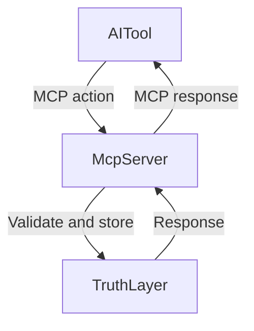

# MCP overview
## Scope
This document covers a curated overview of Neotoma MCP usage and links to canonical MCP references. It does not replace the full MCP specification or OAuth implementation details.

## Purpose
Provide a single entry point for MCP documentation with links to setup guides, the MCP spec, and authentication references.

## Invariants
1. MCP actions MUST follow the MCP specification.
2. MCP mutations MUST respect Truth Layer boundaries and explicit user control.
3. MCP examples MUST be deterministic and free of credentials.

## Definitions
- **MCP**: Model Context Protocol used by AI tools to access Neotoma.
- **Action catalog**: The list of supported MCP actions and schemas.
- **Setup guide**: Tool specific instructions for MCP integration.

## Canonical MCP documentation
- **MCP specification**: `docs/specs/MCP_SPEC.md`
- **Cursor setup**: `docs/developer/mcp_cursor_setup.md`
- **ChatGPT setup**: `docs/developer/mcp_chatgpt_setup.md`
- **Claude Code setup**: `docs/developer/mcp_claude_code_setup.md`
- **OAuth implementation**: `docs/developer/mcp_oauth_implementation.md`
- **Authentication summary**: `docs/developer/mcp_authentication_summary.md`

## What MCP provides
MCP exposes structured actions for:
1. Storing structured data and files.
2. Retrieving entities, observations, relationships, and timeline events.
3. Correcting and reinterpreting observations.
4. Schema recommendations and updates.

## Diagrams


## Examples
### Store a structured entity
```
{
  "action": "store",
  "entities": [
    {
      "entity_type": "task",
      "title": "Review quarterly report",
      "status": "open"
    }
  ]
}
```

### Retrieve entities
```
{
  "action": "retrieve_entities",
  "entity_type": "task",
  "limit": 5,
  "offset": 0
}
```

## Testing requirements
1. Verify MCP actions conform to `docs/specs/MCP_SPEC.md`.
2. Validate OAuth setup using the relevant setup guide.

## Agent Instructions
### When to Load This Document
Load this document when providing MCP entry points or curating MCP documentation navigation.

### Required Co-Loaded Documents
- `docs/NEOTOMA_MANIFEST.md`
- `docs/specs/MCP_SPEC.md`
- `docs/conventions/documentation_standards.md`

### Constraints Agents Must Enforce
1. Links MUST point to canonical MCP docs.
2. Examples MUST be deterministic and credential free.
3. Terminology MUST match the MCP spec.

### Forbidden Patterns
- Duplicating the MCP spec content in this overview
- Using real tokens or credentials in examples
- Omitting required sections

### Validation Checklist
- [ ] Purpose, Scope, Invariants, Definitions present
- [ ] Links to MCP spec and setup guides included
- [ ] Examples are deterministic and credential free
- [ ] Agent Instructions included
