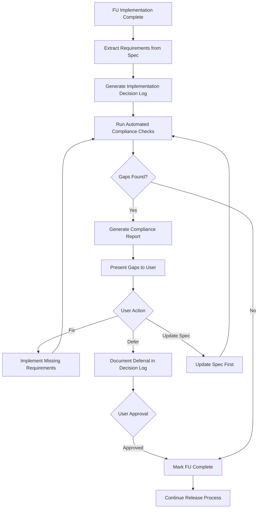

# Spec Compliance Validation System

## Problem Statement

Feature Unit FU-100 was marked "complete" but was missing required schema validation and field partitioning logic. The release process lacked automated checks to verify implementation matches spec requirements.

## Solution Overview

Add a mandatory **Spec Compliance Validation** step that:

1. Extracts requirements from FU specs (MUST/MUST NOT/SHALL statements)
2. Logs implementation decisions during build
3. Automatically checks code/schema against requirements
4. Generates compliance reports with gaps
5. Blocks completion until all requirements are met or explicitly deferred

## Architecture




## Implementation Steps

### 1. Create Requirement Extraction Module

**File:** `scripts/validate_spec_compliance.js`**Functions:**

- `extractRequirements(specPath)`: Parse spec markdown for MUST/MUST NOT/SHALL/MUST IMPLEMENT statements
- Returns structured requirement objects with:
                                                                                                                                - `text`: Full requirement text
                                                                                                                                - `section`: Section heading where found
                                                                                                                                - `lineNumber`: Line number in spec
                                                                                                                                - `type`: `must` | `must_not` | `shall` | `required`
                                                                                                                                - `category`: `implementation` | `database` | `validation` | `testing`

**Implementation:**

- Use regex patterns to find requirement statements
- Parse markdown headings for section context
- Track line numbers for traceability

### 2. Create Implementation Decision Logger

**File:** `scripts/validate_spec_compliance.js` (continued)**Functions:**

- `generateImplementationLog(fuId, requirements, outputPath)`: Create decision log template
- `logDecision(decisionLogPath, requirement, decision)`: Append decision to log

**Decision Log Format:**

```markdown
## Implementation Decisions

### Decision 1: [Requirement Summary]
**Requirement:** [Full requirement text]
**Location:** Section X.Y.Z, line N
**Implementation approach:** [What was implemented]
**Files changed:** [List files]
**Code references:** [Line numbers and functions]
**Verification:** [How requirement was verified]
**Status:** ✅ Implemented | ❌ Not Implemented | ⚠️ Partial
```


### 3. Create Automated Compliance Checks

**File:** `scripts/validate_spec_compliance.js` (continued)**Check Types:**a. **Code Existence Checks:**

                                                                                                                                                                                                - Function existence: `grep -r "functionName" src/`
                                                                                                                                                                                                - Import existence: `grep -r "import.*module" src/`
                                                                                                                                                                                                - Pattern matching: `grep -r "pattern" src/`

b. **Database Schema Checks:**

                                                                                                                                                                                                - Column existence: `grep -r "column_name" supabase/schema.sql supabase/migrations/`
                                                                                                                                                                                                - Table existence: Similar pattern
                                                                                                                                                                                                - Index existence: Similar pattern

c. **Integration Checks:**

                                                                                                                                                                                                - Service call verification: Check function calls in code
                                                                                                                                                                                                - Flow verification: Trace execution paths

d. **Validation Logic Checks:**

                                                                                                                                                                                                - Validate functions called: Check if validation functions are invoked
                                                                                                                                                                                                - Error handling: Check for required error handling

**Function:**

- `runComplianceChecks(fuId, requirements, implementationLog)`: Execute all checks
- Returns structured results with:
                                                                                                                                - `requirement`: Requirement object
                                                                                                                                - `status`: `pass` | `fail` | `partial`
                                                                                                                                - `evidence`: Code/file references proving implementation
                                                                                                                                - `gap`: Description of missing implementation

### 4. Create Compliance Report Generator

**File:** `scripts/validate_spec_compliance.js` (continued)**Function:**

- `generateComplianceReport(fuId, checkResults, outputPath)`: Generate markdown report

**Report Format:**

```markdown
## FU-XXX Compliance Report

### Requirements Status
| Requirement | Location | Status | Evidence | Gap |
|------------|----------|--------|----------|-----|
| [Requirement text] | Section X | ✅ Pass | [Code refs] | - |
| [Requirement text] | Section Y | ❌ Fail | - | [Gap description] |

### Implementation Gaps
1. **Critical Gap:** [Gap title]
            - **Requirement:** [Section reference]
            - **Current:** [What exists now]
            - **Required:** [What's needed]
            - **Files to modify:** [File list]
```


### 5. Integrate into Release Orchestrator

**File:** `scripts/release_orchestrator.js`**Changes:**

- Add `validateFUSpecCompliance(fuId, releaseId)` function
- Call before marking FU as complete in batch processing
- Block FU completion if gaps found (unless explicitly deferred with approval)

**Integration point:**

- After batch tests pass, before updating `status.completed_fus`
- Exit with error if critical gaps found

### 6. Update Release Workflow Documentation

**File:** `docs/feature_units/standards/release_workflow.md`**Changes:**

- Add **Step 3.6: Feature Unit Spec Compliance Validation** section
- Insert between Step 3 (integration tests) and Step 3.5 (architectural completeness)
- Document process flow, critical rules, and integration points

### 7. Update Final Review Command

**File:** `.cursor/commands/final_review.md`**Changes:**

- Add spec compliance validation as prerequisite
- Require compliance report generation before presenting review
- Include compliance status in review summary
- Block approval if gaps exist

### 8. Create Compliance Check Patterns Library

**File:** `scripts/spec_compliance_patterns.js`**Purpose:** Define common check patterns for reuse across FUs**Patterns:**

- `checkFunctionExists(functionName, filePattern)`
- `checkDatabaseColumn(columnName, tableName)`
- `checkImportExists(moduleName, filePattern)`
- `checkServiceCall(serviceName, functionName, callerPattern)`
- `checkValidationLogic(validationType, location)`

### 9. Add Compliance Report Storage

**Directory Structure:**

```javascript
docs/releases/vX.Y.Z/
  ├── compliance_reports/
  │   ├── FU-100_compliance.md
  │   └── FU-101_compliance.md
  └── implementation_logs/
      ├── FU-100_implementation_log.md
      └── FU-101_implementation_log.md
```


### 10. Update Status Tracking

**File:** `docs/releases/vX.Y.Z/status.md`**Changes:**

- Add compliance report links to FU status entries
- Track compliance validation status per FU
- Include in release summary

## Implementation Files

### New Files

1. `scripts/validate_spec_compliance.js` - Main validation script
2. `scripts/spec_compliance_patterns.js` - Reusable check patterns
3. `docs/feature_units/standards/spec_compliance_validation.md` - Detailed process documentation

### Modified Files

1. `scripts/release_orchestrator.js` - Add compliance validation call
2. `docs/feature_units/standards/release_workflow.md` - Add Step 3.6
3. `.cursor/commands/final_review.md` - Add compliance check requirement

## Validation Rules

**Critical Rules:**

- NO FU can be marked "complete" without passing spec compliance validation
- All implementation decisions MUST be logged before validation
- All gaps MUST be resolved OR explicitly deferred with user approval
- Deferred requirements MUST be tracked in decision log for future work

**Check Categories:**

1. **Implementation:** Functions, classes, modules exist
2. **Database:** Tables, columns, indexes exist
3. **Integration:** Service calls, flows connected
4. **Validation:** Validation logic present
5. **Testing:** Required tests exist

## Testing Strategy

1. **Unit tests** for requirement extraction (parse various spec formats)
2. **Unit tests** for compliance checks (mock file system, verify patterns)
3. **Integration test** with FU-100 spec (should catch known gaps)
4. **Integration test** with FU-101 spec (should pass if complete)

## Rollout Plan

1. Implement validation script and patterns
2. Test with FU-100 (should catch gaps)
3. Test with FU-101 (should pass)
4. Integrate into release orchestrator
5. Update documentation
6. Apply to next release cycle

## Success Criteria

- FU-100 compliance check catches missing `extraction_metadata` column
- FU-100 compliance check catches missing `partitionFields()` function
- Compliance reports generated for all FUs in release
- Release blocked if critical gaps found