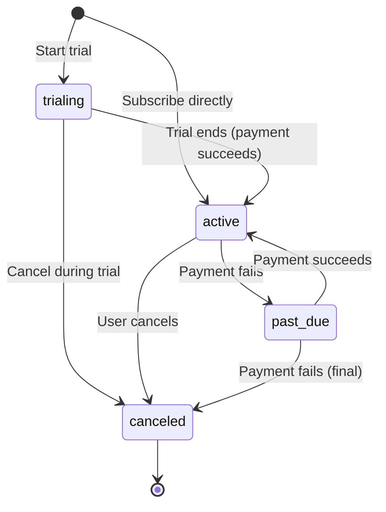

# Feature Unit: FU-702 Billing and Subscription Management
**Status:** Draft
**Priority:** P1 (High)
**Risk Level:** Medium
**Target Release:** v1.0.0
**Owner:** Engineering Team
**Reviewers:** Tech Lead, Product
**Created:** 2025-01-XX
**Last Updated:** 2025-01-XX
## Overview
**Brief Description:**
Implement billing and subscription management system to enable revenue collection for Tier 1 ICPs (individuals and small teams 2–20 people). Individual plans (€30–€150/month) align with ICP willingness to pay, while team plans (€500–€2,500/month) drive higher ACVs (€6k–€30k/yr).
**User Value:**
Enables Neotoma to collect revenue from Tier 1 users (individuals and small teams) who have experienced value and are ready to pay. Supports both individual subscriptions and team plans, enabling bottom-up B2B expansion through organic team growth.
**Technical Approach:**
- Payment processing: Stripe integration (subscriptions, invoices, webhooks)
- Subscription management: Database schema for plans, subscriptions, usage
- UI: Billing settings page, subscription management, invoice history
- API: Subscription endpoints, webhook handlers
- Usage tracking: Track usage metrics for usage-based billing (future)
## Requirements
### Functional Requirements
1. **Subscription Plans:**
   - Individual plan: €30–€150/month (€360–€1,800/yr)
   - Team plan: €500–€2,500/month (€6k–€30k/yr) for 2–20 users
   - Annual billing option (20% discount)
   - Free tier (limited features) for activation
2. **Payment Processing:**
   - Stripe integration for credit card payments
   - Support for annual and monthly billing cycles
   - Automatic invoice generation
   - Payment failure handling and retry logic
3. **Subscription Management:**
   - User can view current subscription
   - User can upgrade/downgrade plans
   - User can cancel subscription
   - User can switch between monthly/annual billing
4. **Team Billing:**
   - Team owner manages subscription
   - Team members inherit access
   - Usage tracking per team (for future usage-based billing)
   - Team plan limits (2–20 users)
5. **Invoice Management:**
   - Invoice history view
   - Download invoices (PDF)
   - Email invoice receipts
   - Invoice status tracking (paid, pending, failed)
6. **Usage Tracking:**
   - Track records ingested per user/team
   - Track API calls per user/team
   - Track storage usage per user/team
   - Display usage dashboard (for future usage-based billing)
### Non-Functional Requirements
1. **Performance:**
   - Subscription check: <100ms (cached)
   - Payment processing: <2s (Stripe API)
   - Invoice generation: <1s
2. **Determinism:**
   - Subscription status must be consistent across queries
   - Invoice amounts must be deterministic (no rounding errors)
3. **Consistency:**
   - Strong consistency for subscription status
   - Bounded eventual consistency for usage metrics (5s delay acceptable)
4. **Accessibility:**
   - Billing page keyboard navigable
   - ARIA labels for payment forms
   - Screen reader support for invoice tables
5. **Internationalization:**
   - Currency formatting (€, $, £)
   - Date formatting per locale
   - Invoice templates in multiple languages (future)
### Invariants
**MUST:**
- Subscription status MUST be checked on every authenticated request
- Payment processing MUST use Stripe (no direct card storage)
- Invoices MUST be immutable once created
- Subscription changes MUST be transactional
- Usage tracking MUST not include PII
**MUST NOT:**
- MUST NOT store credit card numbers (use Stripe tokens)
- MUST NOT allow subscription changes without payment method
- MUST NOT allow team members to modify billing (only team owner)
- MUST NOT expose payment details in logs
- MUST NOT process payments without user consent
## Affected Subsystems
**Primary Subsystems:**
- Billing: New subsystem for subscription management
- Auth: Subscription status checks in auth middleware
- Database: New tables for subscriptions, invoices, usage
**Dependencies:**
- Requires FU-700 (Authentication) — billing needs authenticated users
- Requires FU-701 (RLS) — team billing needs user/team isolation
- Blocks revenue collection (enables M2 milestone: €5k MRR)
**Documentation to Load:**
- `docs/NEOTOMA_MANIFEST.md`
- `docs/private/strategy_governance/revenue_timeline.md`
- `docs/specs/ICP_PROFILES.md` (for pricing context)
## Schema Changes
**Tables Affected:**
1. **`subscriptions` table:**
```sql
CREATE TABLE subscriptions (
  id UUID PRIMARY KEY DEFAULT gen_random_uuid(),
  user_id UUID NOT NULL REFERENCES auth.users(id) ON DELETE CASCADE,
  team_id UUID REFERENCES teams(id) ON DELETE CASCADE, -- NULL for individual
  plan_id TEXT NOT NULL, -- 'individual_monthly', 'individual_annual', 'team_monthly', 'team_annual'
  stripe_subscription_id TEXT UNIQUE NOT NULL,
  stripe_customer_id TEXT NOT NULL,
  status TEXT NOT NULL, -- 'active', 'canceled', 'past_due', 'trialing'
  current_period_start TIMESTAMPTZ NOT NULL,
  current_period_end TIMESTAMPTZ NOT NULL,
  cancel_at_period_end BOOLEAN DEFAULT false,
  created_at TIMESTAMPTZ NOT NULL DEFAULT now(),
  updated_at TIMESTAMPTZ NOT NULL DEFAULT now()
);
CREATE INDEX idx_subscriptions_user_id ON subscriptions(user_id);
CREATE INDEX idx_subscriptions_team_id ON subscriptions(team_id);
CREATE INDEX idx_subscriptions_stripe_subscription_id ON subscriptions(stripe_subscription_id);
CREATE INDEX idx_subscriptions_status ON subscriptions(status);
```
2. **`invoices` table:**
```sql
CREATE TABLE invoices (
  id UUID PRIMARY KEY DEFAULT gen_random_uuid(),
  subscription_id UUID NOT NULL REFERENCES subscriptions(id) ON DELETE CASCADE,
  stripe_invoice_id TEXT UNIQUE NOT NULL,
  amount_cents INTEGER NOT NULL,
  currency TEXT NOT NULL DEFAULT 'eur',
  status TEXT NOT NULL, -- 'paid', 'open', 'void', 'uncollectible'
  invoice_pdf_url TEXT,
  hosted_invoice_url TEXT,
  period_start TIMESTAMPTZ NOT NULL,
  period_end TIMESTAMPTZ NOT NULL,
  paid_at TIMESTAMPTZ,
  created_at TIMESTAMPTZ NOT NULL DEFAULT now()
);
CREATE INDEX idx_invoices_subscription_id ON invoices(subscription_id);
CREATE INDEX idx_invoices_stripe_invoice_id ON invoices(stripe_invoice_id);
CREATE INDEX idx_invoices_status ON invoices(status);
```
3. **`usage_metrics` table:**
```sql
CREATE TABLE usage_metrics (
  id UUID PRIMARY KEY DEFAULT gen_random_uuid(),
  user_id UUID REFERENCES auth.users(id) ON DELETE CASCADE,
  team_id UUID REFERENCES teams(id) ON DELETE CASCADE,
  metric_type TEXT NOT NULL, -- 'records_ingested', 'api_calls', 'storage_bytes'
  metric_value INTEGER NOT NULL,
  period_start TIMESTAMPTZ NOT NULL,
  period_end TIMESTAMPTZ NOT NULL,
  created_at TIMESTAMPTZ NOT NULL DEFAULT now()
);
CREATE INDEX idx_usage_metrics_user_id ON usage_metrics(user_id);
CREATE INDEX idx_usage_metrics_team_id ON usage_metrics(team_id);
CREATE INDEX idx_usage_metrics_period ON usage_metrics(period_start, period_end);
```
4. **`billing_plans` table (reference data):**
```sql
CREATE TABLE billing_plans (
  id TEXT PRIMARY KEY, -- 'individual_monthly', 'individual_annual', 'team_monthly', 'team_annual'
  name TEXT NOT NULL,
  description TEXT,
  price_cents_monthly INTEGER NOT NULL,
  price_cents_annual INTEGER, -- NULL if annual not available
  currency TEXT NOT NULL DEFAULT 'eur',
  max_users INTEGER, -- NULL for individual plans
  features JSONB NOT NULL, -- Feature flags for plan
  created_at TIMESTAMPTZ NOT NULL DEFAULT now(),
  updated_at TIMESTAMPTZ NOT NULL DEFAULT now()
);
```
**RLS Policies:**
- Users can only see their own subscriptions
- Team owners can see team subscriptions
- Users can only see invoices for their subscriptions
- Team owners can see team invoices
**Migration Required:** Yes
- Migration file: `supabase/migrations/YYYYMMDDHHMMSS_add_billing_tables.sql`
- Backfill: None (new feature)
## API/MCP Changes
**New API Endpoints:**
1. **GET /api/billing/subscription**
   - Returns current user/team subscription
   - Requires authentication
2. **POST /api/billing/subscribe**
   - Create new subscription
   - Requires payment method
3. **POST /api/billing/update-subscription**
   - Upgrade/downgrade plan
   - Change billing cycle
4. **POST /api/billing/cancel-subscription**
   - Cancel subscription (at period end)
5. **GET /api/billing/invoices**
   - List invoices for user/team
6. **GET /api/billing/usage**
   - Get usage metrics for current period
7. **POST /api/billing/webhook** (Stripe webhook)
   - Handle Stripe events (subscription updated, payment succeeded, etc.)
**API Contracts:**
```typescript
// GET /api/billing/subscription
interface SubscriptionResponse {
  id: string;
  plan_id: string;
  status: "active" | "canceled" | "past_due" | "trialing";
  current_period_start: string;
  current_period_end: string;
  cancel_at_period_end: boolean;
  plan: {
    id: string;
    name: string;
    price_cents_monthly: number;
    price_cents_annual: number | null;
    currency: string;
    max_users: number | null;
  };
}
// POST /api/billing/subscribe
interface SubscribeRequest {
  plan_id: string;
  payment_method_id: string; // Stripe payment method ID
  billing_cycle: "monthly" | "annual";
}
interface SubscribeResponse {
  subscription: SubscriptionResponse;
  client_secret?: string; // For 3D Secure if needed
}
// GET /api/billing/invoices
interface Invoice {
  id: string;
  amount_cents: number;
  currency: string;
  status: "paid" | "open" | "void" | "uncollectible";
  invoice_pdf_url: string | null;
  period_start: string;
  period_end: string;
  paid_at: string | null;
  created_at: string;
}
// GET /api/billing/usage
interface UsageResponse {
  period_start: string;
  period_end: string;
  metrics: {
    records_ingested: number;
    api_calls: number;
    storage_bytes: number;
  };
  limits: {
    records_ingested: number | null; // null = unlimited
    api_calls: number | null;
    storage_bytes: number | null;
  };
}
```
**Errors:**
- `SUBSCRIPTION_NOT_FOUND`: User has no active subscription
- `PAYMENT_METHOD_REQUIRED`: Payment method needed for subscription
- `INVALID_PLAN_ID`: Plan ID does not exist
- `SUBSCRIPTION_UPDATE_FAILED`: Failed to update subscription
- `PAYMENT_FAILED`: Payment processing failed
- `STRIPE_WEBHOOK_ERROR`: Webhook processing failed
## UI Changes
**Components Affected:**
- `SettingsUI` (FU-306): Add billing tab/section
**New Components:**
- `BillingSettings`: Main billing page
  - Current subscription display
  - Plan selection (upgrade/downgrade)
  - Payment method management
  - Invoice history table
  - Usage dashboard
- `SubscriptionCard`: Display current subscription details
- `PlanSelector`: Plan comparison and selection UI
- `InvoiceTable`: List of invoices with download links
- `UsageDashboard`: Usage metrics visualization
**UI States:**
- Loading: "Loading subscription..." (skeleton loader)
- Error: "Failed to load subscription" (error banner with retry)
- Empty (no subscription): "Start your subscription" CTA
- Active subscription: Display plan, next billing date, usage
- Past due: Warning banner with payment CTA
**Accessibility:**
- Billing page: Full keyboard navigation
- Payment forms: ARIA labels, error announcements
- Invoice table: Screen reader friendly (row headers)
- Plan selector: Radio button group with labels
- Focus management: Focus moves to success message after subscription change
**Internationalization:**
- Currency formatting: €150.00 (EUR), $150.00 (USD)
- Date formatting: "January 15, 2026" (locale-specific)
- Invoice PDF: English (future: multi-language)
## State Machines
**Subscription Status State Machine:**

**States:**
| State | Terminal | UI Display | Transitions |
|-------|----------|------------|-------------|
| trialing | No | "Trial ends on [date]" | → active (payment succeeds), → canceled (user cancels) |
| active | No | "Next billing: [date]" | → past_due (payment fails), → canceled (user cancels) |
| past_due | No | "⚠️ Payment required" | → active (payment succeeds), → canceled (payment fails) |
| canceled | Yes | "Subscription canceled" | → [*] |
## Observability
**Metrics:**
- `subscription_created_total`: Counter (labels: plan_id, billing_cycle)
- `subscription_updated_total`: Counter (labels: plan_id, status)
- `subscription_canceled_total`: Counter (labels: plan_id, reason)
- `payment_processed_total`: Counter (labels: status=success|failed)
- `payment_processed_amount_cents`: Histogram (payment amounts)
- `invoice_generated_total`: Counter (labels: status)
- `stripe_webhook_processed_total`: Counter (labels: event_type, status)
**Logs:**
- `info`: "Subscription created" (fields: subscription_id, plan_id, user_id)
- `info`: "Payment processed" (fields: invoice_id, amount_cents, status)
- `error`: "Payment failed" (fields: subscription_id, error_code, trace_id)
- `error`: "Stripe webhook error" (fields: event_type, error_code, trace_id)
**Events:**
- `subscription.created`: Emitted when subscription created (payload: subscription_id, plan_id)
- `subscription.updated`: Emitted when subscription updated (payload: subscription_id, old_status, new_status)
- `subscription.canceled`: Emitted when subscription canceled (payload: subscription_id, reason)
- `invoice.paid`: Emitted when invoice paid (payload: invoice_id, amount_cents)
- `payment.failed`: Emitted when payment fails (payload: subscription_id, error_code)
**Traces:**
- Span: `create_subscription` (attributes: plan_id, billing_cycle)
- Span: `process_payment` (attributes: amount_cents, currency)
- Span: `handle_stripe_webhook` (attributes: event_type)
## Testing Strategy
**Unit Tests:**
- `calculateSubscriptionPrice()`: Verify plan pricing calculations
- `formatCurrency()`: Verify currency formatting (€, $, £)
- `validatePlanTransition()`: Verify upgrade/downgrade rules
- `parseStripeWebhook()`: Verify webhook event parsing
**Integration Tests:**
- Create subscription → verify Stripe customer created
- Update subscription → verify Stripe subscription updated
- Cancel subscription → verify Stripe subscription canceled
- Payment webhook → verify subscription status updated
- Invoice generation → verify invoice created in DB
**E2E Tests:**
- User subscribes to individual plan → sees active subscription
- User upgrades to team plan → sees updated subscription
- User cancels subscription → sees cancellation confirmation
- User views invoice history → can download invoice PDF
- Payment fails → user sees past_due status and payment CTA
**Property-Based Tests:**
- Subscription status transitions: All valid transitions work
- Invoice amounts: Sum of invoices = total subscription cost
**Test Fixtures:**
- `stripe_webhook_subscription_created.json`: Stripe webhook payload
- `stripe_webhook_payment_succeeded.json`: Payment success webhook
- `stripe_webhook_payment_failed.json`: Payment failure webhook
**Expected Coverage:**
- Lines: >85%
- Branches: >85%
- Critical paths (subscription creation, payment processing): 100%
## Error Scenarios
| Scenario                  | Error Code                  | Message                                          | Recovery                       |
| ------------------------- | --------------------------- | ------------------------------------------------ | ------------------------------ |
| No payment method         | `PAYMENT_METHOD_REQUIRED`   | "Please add a payment method"                    | User adds payment method       |
| Invalid plan ID           | `INVALID_PLAN_ID`           | "Plan not found"                                 | User selects valid plan        |
| Payment declined          | `PAYMENT_DECLINED`          | "Payment declined. Please update payment method" | User updates payment method    |
| Stripe API error          | `STRIPE_API_ERROR`          | "Payment processing temporarily unavailable"     | Retry with exponential backoff |
| Webhook signature invalid | `WEBHOOK_SIGNATURE_INVALID` | "Invalid webhook signature"                      | Log and alert (security issue) |
| Subscription not found    | `SUBSCRIPTION_NOT_FOUND`    | "No active subscription found"                   | User creates subscription      |
| Team limit exceeded       | `TEAM_LIMIT_EXCEEDED`       | "Team plan limited to 20 users"                  | Upgrade plan or remove users   |
## Rollout and Deployment
**Feature Flags:** Yes
- Flag name: `enable_billing`
- Default value: `false` (enable after MVP core features complete)
- Rollout: Enable for beta users first, then general availability
**Rollout Plan:**
1. **Internal (Week 1):** Enable for internal team, test payment flows
2. **Beta (Week 2):** Enable for 10 beta users, monitor payment success rate
3. **General (Week 3):** Enable for all users, monitor subscription creation rate
**Rollback Plan:**
- Disable `enable_billing` feature flag
- Stripe subscriptions remain active (no data loss)
- Users can still access via Stripe dashboard
- Re-enable after fixes
**Monitoring:**
- Key metrics:
  - `subscription_created_total`: Target >10 subscriptions/week (M2: €5k MRR)
  - `payment_processed_total` (status=success): Target >95% success rate
  - `payment_processed_amount_cents`: Track revenue (€5k MRR by M2)
- Alerts:
  - Payment success rate <90%
  - Stripe webhook processing errors
  - Subscription creation failures
## Revenue Alignment
**Pricing Strategy:**
- Individual plans: €30–€150/month (€360–€1,800/yr) — aligned with ICP willingness to pay
- Team plans: €500–€2,500/month (€6k–€30k/yr) for 2–20 users — drives higher ACVs
- Annual billing: 20% discount (encourages annual contracts)
**Revenue Milestones:**
- **M2 (Jan 10, 2026):** €5k MRR → ~30–50 individual subscriptions + 2–3 team subscriptions
- **M4 (Mar 10, 2026):** €10k MRR → ~60–100 individual subscriptions + 4–6 team subscriptions
- **M6 (May 10, 2026):** €15k MRR → ~90–150 individual subscriptions + 6–9 team subscriptions
- **M12 (Nov 10, 2026):** €25k–€30k MRR → ~100–150 individual subscriptions + 10–15 team subscriptions
**ICP Alignment:**
- Tier 1 individuals: Individual plans (€30–€150/month) — aligns with ICP willingness to pay ($10-30/month, $30-100/month)
- Tier 1 small teams: Team plans (€500–€2,500/month) — drives higher ACVs (€6k-€30k/yr)
- Enables bottom-up B2B expansion through organic team growth (3-83x revenue increase from individual → team)
