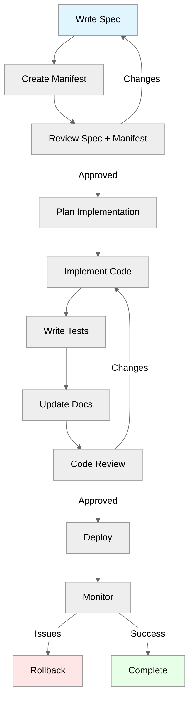

# Feature Unit Execution Instructions
## Feature Unit Lifecycle

## Implementation Order
1. **Load Documentation**
   - `docs/NEOTOMA_MANIFEST.md`
   - Relevant subsystem docs from context index
   - `docs/conventions/agent_test_execution_rules.mdc` (MANDATORY)
   - `docs/conventions/test_first_workflow_rules.mdc` (MANDATORY)
2. **Implement Domain Logic**
   - Write deterministic extraction/entity resolution
   - **Write unit tests FIRST or alongside** (see test-first workflow)
   - **Run unit tests immediately** after each function (`npm test`)
   - **Fix any failing tests** before proceeding
3. **Implement Application Logic**
   - Wire up domain services
   - Handle errors, emit events
   - **Write integration tests FIRST or alongside**
   - **Run integration tests immediately** (`npm run test:integration`)
   - **Fix any failing tests** before proceeding
4. **Implement UI (if applicable)**
   - Build components per spec
   - Add accessibility (keyboard, ARIA)
   - Add i18n strings
   - **Write Playwright E2E tests FIRST or alongside** (see UI test requirements)
   - **Run E2E tests immediately** (`npm run test:e2e`)
   - **Fix any failing tests** before proceeding
5. **Final Test Verification**
   - **Run full test suite:**
     - Type check: `npm run type-check`
     - Lint: `npm run lint`
     - Unit tests: `npm test`
     - Integration tests: `npm run test:integration`
     - E2E tests: `npm run test:e2e` (if UI changes)
   - **Verify all tests pass** before proceeding
   - **Check coverage** meets requirements (`npm run test:coverage`)
6. **Documentation**
   - Update subsystem docs if patterns changed
   - Add examples
7. **Review and Deploy**
   - Human review per checklist
   - Deploy with monitoring
   - Watch key metrics
## Safety Classification
| Risk Level | Approval Required       | Testing Required   | Monitoring       |
| ---------- | ----------------------- | ------------------ | ---------------- |
| **Low**    | 1 reviewer              | Unit + integration | Standard         |
| **Medium** | 2 reviewers             | + E2E tests        | Enhanced         |
| **High**   | Tech lead + 2 reviewers | + Load tests       | Real-time alerts |
See `docs/private/governance/risk_classification.md` for classification rules.
## Agent Instructions
Load when implementing a Feature Unit or understanding execution flow.
**For creating NEW Feature Units:** See `docs/feature_units/standards/creating_feature_units.md` for complete workflow with interactive checkpoints.
**For implementing existing Feature Units:** Use this document after spec and prototype are approved.
Required co-loaded:
- `docs/feature_units/standards/feature_unit_spec.md` (spec template)
- `docs/feature_units/standards/error_protocol.md` (error handling)
- `docs/feature_units/standards/creating_feature_units.md` (creation workflow, if creating new FU)
Constraints:
- MUST have complete spec before coding (see creation workflow)
- MUST have prototype approved (if UI changes) before implementation
- MUST follow implementation order (this document)
- **MANDATORY: MUST run tests after EVERY code change** (see `docs/conventions/agent_test_execution_rules.mdc`)
- **MANDATORY: MUST write tests FIRST or alongside implementation** (see `docs/conventions/test_first_workflow_rules.mdc`)
- **MANDATORY: MUST fix failing tests before proceeding** (do not mark complete with failing tests)
- **MANDATORY: MUST run full test suite before marking FU complete**
- MUST write tests (unit, integration, E2E as applicable)
- MUST update docs if patterns change
