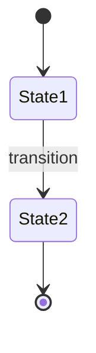

# Feature Unit Specification Standard

_(Atomic, Testable, Independently Reviewable Units of Change)_

---

## Purpose

Defines the **Feature Unit** concept and specification template for all Neotoma development. Feature Units are the atomic unit of change in Neotoma, ensuring every modification is:

- Fully specified before implementation
- Independently testable
- Reviewable as a complete unit
- Traceable from requirements to tests

---

## 1. What is a Feature Unit?

A **Feature Unit** is a complete, self-contained unit of functionality consisting of:

1. **Spec Document** (this file format)
2. **Manifest** (YAML, see `manifest_template.yaml`)
3. **Implementation** (code changes)
4. **Tests** (unit, integration, E2E as appropriate)
5. **Documentation Updates** (if introducing new patterns)

**Feature Units MUST be:**

- **Atomic:** Complete a single logical feature or fix
- **Testable:** Include comprehensive tests
- **Documented:** Fully specified before coding
- **Reviewable:** Complete context for human review
- **Deterministic:** Reproducible outcomes

---

## 2. Feature Unit Specification Template

### Feature Unit ID and Metadata

```markdown
# Feature Unit: [FU-YYYY-MM-NNN] [Feature Name]

**Status:** Draft | In Progress | Review | Completed
**Priority:** P0 (Critical) | P1 (High) | P2 (Medium) | P3 (Low)
**Risk Level:** Low | Medium | High (see docs/private/governance/risk_classification.md)
**Target Release:** vX.Y.Z
**Owner:** [Name]
**Reviewers:** [Names]
**Created:** YYYY-MM-DD
**Last Updated:** YYYY-MM-DD
```

### 2.1 Overview

**Brief Description:** One-paragraph summary of what this Feature Unit accomplishes.

**User Value:** Why this matters to users (connects to product context).

**Defensible Differentiation:** How this FU validates or enables defensible differentiators (privacy-first, deterministic, cross-platform). If not applicable, explicitly state why.

**Technical Approach:** High-level approach (which layers, subsystems affected).

### 2.2 Requirements

#### Functional Requirements

1. [Requirement 1]: Detailed description
2. [Requirement 2]: Detailed description

#### Non-Functional Requirements

1. **Performance:** Response time, throughput targets
2. **Determinism:** How deterministic behavior is ensured
3. **Consistency:** Consistency tier (strong, bounded eventual, etc.)
4. **Accessibility:** A11y requirements (keyboard nav, ARIA, etc.)
5. **Internationalization:** i18n requirements (locales, content language)

#### Invariants (MUST/MUST NOT)

**MUST:**

- [Invariant 1]
- [Invariant 2]

**MUST NOT:**

- [Anti-pattern 1]
- [Anti-pattern 2]

### 2.3 Affected Subsystems

**Primary Subsystems:**

- [Subsystem 1]: What changes
- [Subsystem 2]: What changes

**Dependencies:**

- Requires [Other Feature Unit ID or dependency]
- Blocks [Other Feature Unit ID]

**Documentation to Load:**

- `docs/subsystems/[relevant_subsystem].md`
- `docs/architecture/[relevant_architecture].md`

### 2.4 Schema Changes

**Tables Affected:**

- `table_name`: ADD COLUMN `column_name` TYPE
- `table_name`: CREATE INDEX `index_name` ON ...

**JSONB Schema Changes:**

- `records.properties`: Add key `new_field` (schema_version bump to X.Y)

**Migration Required:** Yes | No

If yes, include migration file path and description.

### 2.5 API/MCP Changes

**New MCP Actions:**

- `action_name(params)`: Description

**Modified MCP Actions:**

- `existing_action(params)`: What changed

**API Contract:**

```typescript
// Request
interface RequestType {
  field: type;
}

// Response
interface ResponseType {
  field: type;
}

// Errors
const POSSIBLE_ERRORS = ["ERROR_CODE_1", "ERROR_CODE_2"];
```

### 2.6 UI Changes

**Components Affected:**

- `ComponentName`: What changes

**New Components:**

- `NewComponent`: Purpose, props, behavior

**UI States:**

- Loading state: How displayed
- Error state: Error message format
- Empty state: What user sees

**Accessibility:**

- Keyboard navigation: Tab order, shortcuts
- ARIA: Labels, roles, live regions
- Focus management: Where focus goes

**Internationalization:**

- Locale formatting: Dates, numbers
- Content language: How preserved
- Translatable strings: List of UI strings

### 2.7 State Machines

If introducing new state machine:



**States:**
| State | Terminal | UI Display | Transitions |
|-------|----------|------------|-------------|
| State1 | No | "..." | → State2 on event |

### 2.8 Observability

**Metrics:**

- `metric_name_total`: Counter, incremented when...
- `metric_name_duration_ms`: Histogram, measures...

**Logs:**

- Level `info`: "Event description" (fields: field1, field2)
- Level `error`: "Error description" (fields: error_code, trace_id)

**Events:**

- `event.type`: Emitted when... (payload: {...})

**Traces:**

- Span name: `operation_name` (attributes: attr1, attr2)

### 2.9 Testing Strategy

**Unit Tests:**

- Test 1: Description
- Test 2: Description

**Integration Tests:**

- Test 1: Description (subsystems involved)

**E2E Tests:**

- Test 1: User flow description

**Property-Based Tests (if applicable):**

- Property 1: Invariant to verify

**Test Fixtures:**

- Fixture 1: Description, location

**Expected Coverage:**

- Lines: >80%
- Branches: >80%
- Critical paths: 100%

### 2.10 Error Scenarios

| Scenario   | Error Code     | Message   | Recovery            |
| ---------- | -------------- | --------- | ------------------- |
| Scenario 1 | `ERROR_CODE_1` | "Message" | Retry / User action |
| Scenario 2 | `ERROR_CODE_2` | "Message" | Manual intervention |

### 2.11 Rollout and Deployment

**Feature Flags:** Yes | No

- If yes: Flag name, default value

**Rollback Plan:**

- Rollback steps if feature causes issues

**Monitoring:**

- Key metrics to watch post-deployment

---

## 3. Complete Example Feature Unit Spec

````markdown
# Feature Unit: [FU-2024-01-001] Record Upload with Entity Extraction

**Status:** In Progress
**Priority:** P1 (High)
**Risk Level:** Medium
**Target Release:** v1.0.0
**Owner:** Engineering Team
**Reviewers:** Tech Lead, Product
**Created:** 2024-01-15
**Last Updated:** 2024-01-15

## Overview

**Brief Description:**
Implement file upload endpoint that ingests PDFs, extracts text, detects schema type, extracts fields, resolves entities, and inserts into memory graph.

**User Value:**
Users can upload invoices, receipts, and contracts, and Neotoma automatically structures them into searchable, AI-ready memory.

**Technical Approach:**

- API endpoint: POST /api/upload (Presentation layer)
- Ingestion service: Orchestrate pipeline (Application layer)
- Extraction, entity resolution, graph insertion (Domain layer)
- Store file to S3, insert record to PostgreSQL (Infrastructure layer)

## Requirements

### Functional Requirements

1. **Upload:** Accept PDF files up to 50MB
2. **Extract:** Extract raw text via pdf-parse or OCR (Tesseract)
3. **Schema Detection:** Detect FinancialRecord, IdentityDocument, or PDFDocument
4. **Field Extraction:** Extract invoice_number, amount, vendor_name, etc.
5. **Entity Resolution:** Generate canonical entity IDs for vendors, people
6. **Graph Insertion:** Insert record, entities, edges in single transaction
7. **Response:** Return record with extracted fields

### Non-Functional Requirements

1. **Performance:** Complete ingestion in <5s for 10MB PDF
2. **Determinism:** Same file → same record_id, entities, fields
3. **Consistency:** Strong consistency (record visible immediately)
4. **Accessibility:** Upload button keyboard accessible, progress ARIA live region
5. **Internationalization:** Detect document language, format amounts per locale

### Invariants

**MUST:**

- Extraction MUST be deterministic (rule-based)
- Entity IDs MUST be hash-based
- Graph insertion MUST be transactional
- File hash MUST prevent duplicates

**MUST NOT:**

- MUST NOT use LLM extraction (MVP constraint)
- MUST NOT store PII in logs
- MUST NOT allow files >50MB
- MUST NOT proceed if OCR fails (return error)

## Affected Subsystems

**Primary Subsystems:**

- Ingestion: Full pipeline implementation
- Schema: Uses existing `records` table
- Entity Resolution: New entity ID generation logic

**Dependencies:**

- None (foundational feature)

**Documentation to Load:**

- `docs/NEOTOMA_MANIFEST.md`
- `docs/subsystems/ingestion/ingestion.md`
- `docs/subsystems/schema.md`
- `docs/architecture/determinism.md`

## Schema Changes

**Tables Affected:**

- None (uses existing `records` table)

**JSONB Schema Changes:**

- `records.properties`: Define FinancialRecord schema v1.0

**Migration Required:** No

## API/MCP Changes

**New MCP Actions:**

- `upload_file(file: File)`: Upload and ingest file

**API Contract:**

```typescript
// Request (multipart/form-data)
{
  file: File; // PDF, max 50MB
}

// Response (201 Created)
{
  id: string;
  type: "FinancialRecord" | "IdentityDocument" | "PDFDocument";
  properties: Record<string, any>;
  created_at: string;
}

// Errors
[
  "FILE_TOO_LARGE",
  "UNSUPPORTED_FILE_TYPE",
  "EXTRACTION_FAILED",
  "DB_INSERT_FAILED",
];
```
````

## UI Changes

**Components Affected:**

- `UploadButton`: Add loading state, progress indicator
- `RecordDetail`: Display extracted fields

**UI States:**

- Loading: "Uploading... 45%" (progress bar)
- Error: "Upload failed: File too large" (error banner)
- Success: Navigate to /records/{id}

**Accessibility:**

- Upload button: `<button>` with aria-label="Upload file"
- Progress: `<div role="progressbar" aria-valuenow={45} aria-valuemax={100}>`
- Error: `<div role="alert">Error message</div>`

## Observability

**Metrics:**

- `record_upload_total`: Counter (labels: status=success|failed)
- `record_upload_duration_ms`: Histogram
- `extraction_errors_total`: Counter (labels: error_code)

**Logs:**

- `info`: "File uploaded" (fields: record_id, type, file_size_bytes)
- `error`: "Extraction failed" (fields: error_code, trace_id)

**Events:**

- `record.created`: Emitted after successful insert

## Testing Strategy

**Unit Tests:**

- `extractFieldsForFinancialRecord()`: Verify regex extraction
- `generateEntityId()`: Verify deterministic IDs
- `detectSchemaType()`: Verify schema detection rules

**Integration Tests:**

- Upload → extract → insert: Verify record in DB with entities

**E2E Tests:**

- User uploads invoice → sees record detail with extracted fields

**Expected Coverage:**

- Lines: 85%
- Branches: 85%
- Critical paths (ingestion, extraction): 100%

## Error Scenarios

| Scenario         | Error Code              | Message                        | Recovery            |
| ---------------- | ----------------------- | ------------------------------ | ------------------- |
| File > 50MB      | `FILE_TOO_LARGE`        | "File exceeds 50MB limit"      | Upload smaller file |
| Unsupported type | `UNSUPPORTED_FILE_TYPE` | "Only PDF, JPG, PNG supported" | Convert file        |
| OCR failure      | `OCR_FAILED`            | "Could not extract text"       | Retry               |

## Rollout and Deployment

**Feature Flags:** No

**Rollback Plan:**

- Revert API endpoint deployment
- No DB changes to rollback

**Monitoring:**

- Watch `record_upload_total` for success rate >95%
- Watch `record_upload_duration_ms` P95 <5s

```

---

## Agent Instructions

### When to Load This Document
Load when planning a new Feature Unit, reviewing a Feature Unit spec, or understanding the Feature Unit concept.

### Required Co-Loaded Documents
- `docs/NEOTOMA_MANIFEST.md` (invariants and product context)
- `docs/feature_units/standards/manifest_template.yaml` (manifest structure)
- `docs/feature_units/standards/execution_instructions.md` (implementation flow)

### Constraints Agents Must Enforce
1. All Feature Units MUST follow this template
2. All Feature Units MUST include manifest
3. All Feature Units MUST specify tests
4. All Feature Units MUST document observability
5. All Feature Units MUST respect Truth Layer boundaries
6. All Feature Units MUST be deterministic where applicable

### Forbidden Patterns
- Starting implementation without spec
- Incomplete spec (missing required sections)
- Feature Unit that violates invariants
- Feature Unit without tests
- Feature Unit without observability plan

### Validation Checklist
- [ ] All template sections completed
- [ ] Invariants documented (MUST/MUST NOT)
- [ ] Testing strategy defined
- [ ] Observability metrics/logs/events specified
- [ ] Schema changes documented with migrations
- [ ] API contracts fully specified
- [ ] UI accessibility requirements documented
- [ ] Error scenarios enumerated
- [ ] Rollout plan defined
- [ ] Foundational docs loaded and followed

```
