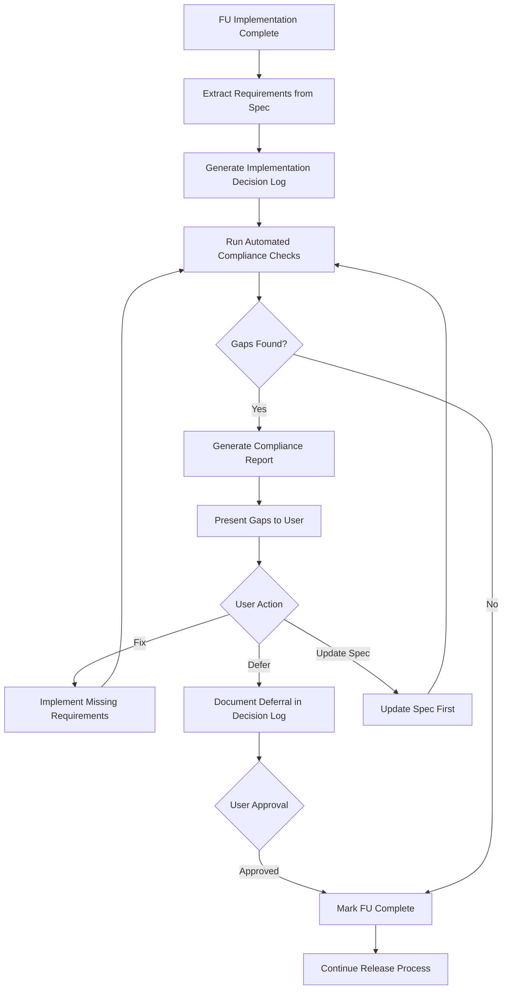

# Spec Compliance Validation Process

_(Automated Validation of Feature Unit Implementation Against Specifications)_

---

## Purpose

This document describes the automated spec compliance validation system that ensures Feature Unit implementations match their specification requirements. This prevents incomplete implementations like FU-100, where required schema validation was documented but not implemented.

---

## Overview

The spec compliance validation system:

1. Extracts requirements from FU specification files (MUST/MUST NOT/SHALL statements)
2. Logs implementation decisions made during build
3. Automatically checks code/schema against requirements
4. Generates compliance reports with gaps
5. Blocks FU completion until all requirements are met or explicitly deferred

---

## Process Flow



---

## Implementation

### Scripts

- `scripts/validate_spec_compliance.js` - Main validation script
- `scripts/spec_compliance_patterns.js` - Reusable check patterns

### Usage

```bash
# Validate a single FU
node scripts/validate_spec_compliance.js FU-100 v0.1.0

# Integrated into release orchestrator (automatic)
node scripts/release_orchestrator.js v0.1.0
```

---

## Requirement Extraction

The system extracts requirements from spec files by:

1. Parsing markdown for requirement statements:
   - MUST / MUST NOT
   - SHALL / SHALL NOT
   - REQUIRED
   - MUST IMPLEMENT

2. Tracking section context:
   - Maintains section hierarchy (nested headings)
   - Associates each requirement with its section

3. Categorizing requirements:
   - `implementation` - Functions, classes, modules
   - `database` - Tables, columns, indexes
   - `validation` - Validation logic
   - `testing` - Test requirements
   - `integration` - Service calls, imports

---

## Compliance Checks

### Check Types

1. **Code Existence Checks:**
   - Function existence: `checkFunctionExists(functionName, filePattern)`
   - Import existence: `checkImportExists(moduleName, filePattern)`
   - Pattern matching: `checkPatternExists(pattern, filePattern)`

2. **Database Schema Checks:**
   - Column existence: `checkDatabaseColumn(columnName, tableName)`
   - Table existence: `checkDatabaseTable(tableName)`

3. **Integration Checks:**
   - Service call verification: `checkServiceCall(serviceName, functionName, callerPattern)`

4. **Validation Logic Checks:**
   - Validation functions: `checkValidationLogic(validationType, location)`

### Automatic Detection

The system attempts to automatically determine what to check based on requirement text:

- Keywords like "table", "column" → database checks
- Keywords like "function", "implement" → function existence
- Keywords like "import", "use" → import checks
- Keywords like "validate", "check" → validation logic
- Keywords like "call", "invoke" → service calls

---

## Decision Logging

For each FU, an implementation decision log is generated at:

`docs/releases/vX.Y.Z/implementation_logs/FU-XXX_implementation_log.md`

The log documents:

- Requirement text and location
- Implementation approach taken
- Files changed
- Code references
- Verification method
- Status (Implemented/Partial/Not Implemented)

---

## Compliance Reports

For each FU, a compliance report is generated at:

`docs/releases/vX.Y.Z/compliance_reports/FU-XXX_compliance.md`

The report includes:

1. **Summary:** Total requirements, passed, failed, compliance rate
2. **Requirements Status Table:** Each requirement with status, evidence, gaps
3. **Implementation Gaps:** Detailed descriptions of missing requirements
4. **Recommendations:** Actions needed to achieve compliance

---

## Integration Points

### Release Orchestrator

The validation runs automatically in `scripts/release_orchestrator.js`:

- After batch integration tests pass
- Before marking FUs as complete
- Blocks batch completion if any FU fails compliance

### Final Review

The validation is required before final review approval:

- Executed automatically in `.cursor/commands/final_review.md`
- Must pass before FU can be marked complete
- Report must be reviewed by user

---

## Critical Rules

1. **NO FU can be marked "complete" without passing spec compliance validation**
2. **All implementation decisions MUST be logged before validation**
3. **All gaps MUST be resolved OR explicitly deferred with user approval**
4. **Deferred requirements MUST be tracked in decision log for future work**

---

## Handling Gaps

When gaps are found, the user must choose one of three actions:

1. **Fix gaps:** Implement missing requirements
2. **Update spec:** If requirement is incorrect/outdated, update spec first
3. **Defer requirement:** Document why requirement is deferred (requires explicit approval)

Deferred requirements are tracked in the decision log and marked for future implementation.

---

## Examples

### Example: FU-100 Compliance Check

**Requirement:** "Store unknown fields in `extraction_metadata.unknown_fields`"

**Check:** `checkDatabaseColumn("extraction_metadata", "records")`

**Result:** ❌ Fail - Column not found in schema

**Gap:** `extraction_metadata` column missing from `records` table

**Fix:** Add migration to create column, update `schema.sql`

---

## Testing

To test the validation system:

```bash
# Test with FU-100 (should catch known gaps)
node scripts/validate_spec_compliance.js FU-100 v0.1.0

# Test with compliant FU (should pass)
node scripts/validate_spec_compliance.js FU-101 v0.1.0
```

---

## Related Documentation

- `docs/feature_units/standards/release_workflow.md` - Step 3.6 process
- `docs/feature_units/standards/creating_feature_units.md` - Final review integration
- `.cursor/commands/final_review.md` - Final review command

---

## Agent Instructions

### When to Load This Document

Load when:
- Understanding spec compliance validation process
- Debugging compliance check failures
- Implementing new compliance check patterns
- Integrating validation into workflows

### Constraints Agents Must Enforce

1. All compliance checks must run before marking FU complete
2. Gaps must be resolved or explicitly deferred
3. Decision logs must be maintained for traceability
4. Compliance reports must be generated for all FUs

### Forbidden Patterns

- Marking FU complete without compliance validation
- Ignoring compliance gaps
- Skipping decision logging
- Proceeding with non-compliant implementations


