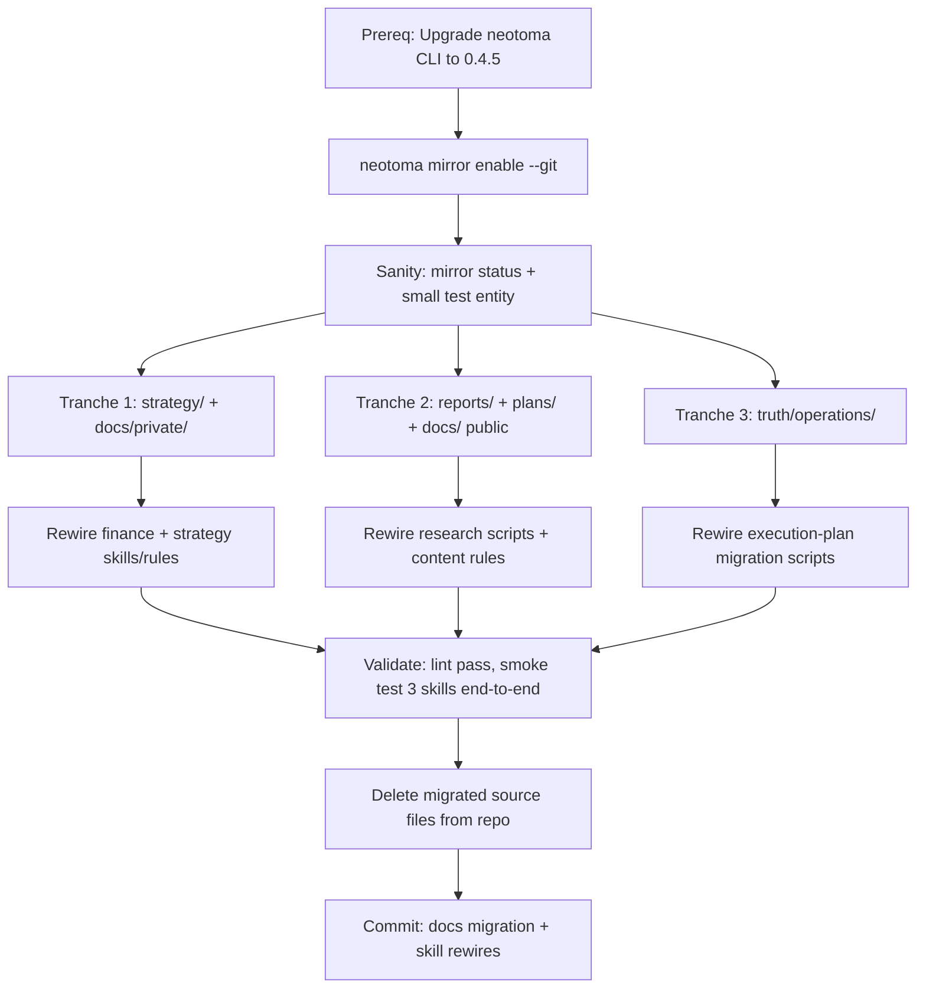

<!-- Do not edit this file directly. Corrections go through `neotoma corrections create`, `neotoma edit <id>`, or the Neotoma Inspector. This file is regenerated on every relevant write. -->

---
entity_id: ent_8ddef298013655e4af5f1e32
entity_type: plan
schema_version: 1.0
last_observation_at: 2026-05-14T14:20:29.340Z
observation_count: 1
computed_at: 2026-05-14T14:20:29.340Z
title: Neotoma markdown mirror migration
status: draft
---

# Neotoma Markdown Mirror Migration

## Prerequisites

- Installed `neotoma` CLI is **0.3.10** (missing `mirror` command); Neotoma repo at `~/repos/neotoma` is **0.4.5** with `src/cli/commands/mirror.ts` implemented. Must upgrade the installed CLI before anything else (publish/install the dev build, or point `neotoma` at the repo).
- Enable mirror with git-backed history + memory export:

```bash
neotoma mirror enable --git --kinds entities,relationships,sources,timeline,schemas
neotoma mirror rebuild
neotoma mirror status
```

- Confirmed paths: `data_dir=/Users/markmhendrickson/Documents/data`, so mirror root will be `/Users/markmhendrickson/Documents/data/mirror/`.
- Resolve the mirror root in rewired skills via `neotoma storage info --json | jq -r .data_dir` → append `/mirror/entities/<entity_type>/<slug>.md`. Avoid hard-coding absolute paths.

## Mirror wiring recipe (applies to every rewrite below)

- Replace repo-relative markdown paths (e.g. `strategy/reference/btc-liquidity-regime-scorecard.md`) with a dynamic lookup:
  1. `retrieve_entity_by_identifier` or `retrieve_entities(entity_type=X, ...)` to get `entity_id` + canonical slug.
  2. Read `${NEOTOMA_MIRROR_ROOT}/entities/<entity_type>/<slug>.md`.
- Any rule that writes a new report still writes structured data via `store_structured`; the mirror file is regenerated automatically. Do not write to mirror files directly (warning header in each mirror file).
- For content still needing pre-render (e.g. a linter checking "did we save today's quarterly review?"), check for a Neotoma entity via `retrieve_entities`, not a filesystem path.

---

## Part A — Markdown Audit (outline of migration candidates)

All paths repo-relative under `/Users/markmhendrickson/repos/ateles/`. Grouped by target `entity_type`. Entity types that don't already exist in Neotoma are created on first `store_structured` (schema-agnostic).

### `life_tenets` / `mission_statement`

- [strategy/strategy/tenets.md](strategy/strategy/tenets.md) or `strategy/tenets.md` (verify actual path)
- [strategy/mission-statement.md](strategy/mission-statement.md)

### `strategy`

- [strategy/startup-strategy.md](strategy/startup-strategy.md), [strategy/financial-strategy.md](strategy/financial-strategy.md), [strategy/tax-architecture.md](strategy/tax-architecture.md), [strategy/neotoma-strategy.md](strategy/neotoma-strategy.md), [strategy/strategy/neotoma_developer_release_gtm_strategies.md](strategy/strategy/neotoma_developer_release_gtm_strategies.md), [strategy/neotoma_revenue_goal_review.md](strategy/neotoma_revenue_goal_review.md), [strategy/self-publishing-strategy.md](strategy/self-publishing-strategy.md), [strategy/entity-structure-capacity-analysis.md](strategy/entity-structure-capacity-analysis.md)
- [strategy/operations/social-media-first-principles-and-constraints.md](strategy/operations/social-media-first-principles-and-constraints.md), [strategy/operations/blog-build-in-public-directives.md](strategy/operations/blog-build-in-public-directives.md), [strategy/operations/newsletter-launch-criteria.md](strategy/operations/newsletter-launch-criteria.md), [strategy/operations/ai-first-content-workflow-guide.md](strategy/operations/ai-first-content-workflow-guide.md), [strategy/operations/content-calendar-template.md](strategy/operations/content-calendar-template.md), [strategy/operations/content-quality-checklist-template.md](strategy/operations/content-quality-checklist-template.md), [strategy/operations/blog-format-structure.md](strategy/operations/blog-format-structure.md), [strategy/operations/blog-input-template.md](strategy/operations/blog-input-template.md), [strategy/operations/social-content-templates.md](strategy/operations/social-content-templates.md), [strategy/operations/social-posting-kpis.md](strategy/operations/social-posting-kpis.md)
- [docs/private/neotoma/neotoma_progressive_schema_directive.md](docs/private/neotoma/neotoma_progressive_schema_directive.md), [docs/private/insights/openserv_startup_strategy_analysis.md](docs/private/insights/openserv_startup_strategy_analysis.md)
- Reports flagged as strategy: `reports/content-strategy-platform-paid-tiers-assessment-2026-02-12.md`, `reports/content-diversification-for-icp-appeal-2026-02-11.md`, `reports/content-distribution-native-format-assessment-2026-02-11.md`, `reports/market-uniqueness-vs-specialization.md`, `reports/strategies-as-habits-evaluation-2026-01-26.md`, `reports/neotoma-developer-preview-criteria-assessment.md`, `plans/outcome-based-organization.md`

### `person`

- [strategy/psychological-profile.md](strategy/psychological-profile.md), [strategy/reference/personal-information.md](strategy/reference/personal-information.md)

### `note` (durable reference and habits)

- `strategy/reference/personal-habits.md`, `strategy/reference/professional-history-source-material.md`, `strategy/reference/work-experience-neotoma-alignment.md`, `strategy/reference/disk-space-quick-reference.md`, `strategy/reference/disk-cleanup-workflow-example.md`, `strategy/reference/aigues-de-barcelona-*.md` (3 files)
- `strategy/operations/vacation-schedule-2026.md`, `strategy/operations/meeting_transcription_any_platform.md`, `strategy/operations/audio-transcription-process.md`, `strategy/operations/self-publishing-implementation-summary.md`, `strategy/operations/blog-agent-instructions.md`
- `docs/transcript_peter_thiel_sxsw_2013_you_are_not_a_lottery_ticket.md`, `docs/health/facial_puffiness_mitigation_checklist.md`, `docs/health/lean_bulk_8_week_plan_2026.md`, `docs/homekit_*.md` (3 files), `docs/tunnel_processes_cleanup.md`, `docs/why_mdns_reflector_may_not_work.md`, `docs/docker_vs_native_homeassistant.md`, `docs/generic_pdf_form_filler_guide.md`
- `reports/priorities-organization-2025-01-15.md`, `reports/task-organization-analysis.md`, `reports/amazon-undelivered-package-escalation-2026-01-26.md`, `reports/mac-purchase-system-usage-baseline-2026-01-29.md`, `reports/twitter-takeaways-relevant-2025-01-23.md`

### `finance_registry` / finance playbooks + tax prep

- Strategy layer: `strategy/financial-goals.md`, `strategy/financial-background.md`, `strategy/tactics/financial-tactics.md`, `strategy/tactics/liquidity-centered-rebalancing-framework.md`, `strategy/tactics/stx-playbook.md`
- Ops layer: everything under `strategy/operations/finance/` (~17 files: quarterly review template, stx-unwind protocols, pension/insurance assessments, rebalancing process, transaction-import process, etc.)
- Reference: `strategy/reference/btc-liquidity-regime-scorecard.md`, `strategy/reference/altcoin-liquidity-regime-scorecard.md`, `strategy/reference/liquidity-regime-model.md`, `strategy/reference/discretionary-spending-analysis-rules.md`, `strategy/reference/scorecard-efficacy-assessment.md`, `strategy/reference/flagstar-mrcooper-tracking.md`, `strategy/reference/insurance-plans-research.md`
- Registries/checklists: `docs/private/finances/main_financial_accounts_registry.md`, `modelo_2025_prep_checklist.md`, `modelo_720_721_2025_updated_values.md`, `secod_filing_types_from_2025_email.md`, `neotoma_financial_entity_types_master_sheet.md`, `neotoma_data_collection_pipeline.md`, `finances_3_import_inventory.md`
- `plans/accounts-by-tier.md`

### `quarterly_review`

- `strategy/operations/finance/altcoin-liquidity-regime-report-2025-12-05.md`, `strategy/operations/finance/btc-liquidity-regime-report-2025-12-05.md`

### `competitive_analysis` / `partnership_analysis`

- `docs/private/competitive/openserv_competitive_analysis.md`, `reports/moltbot_competitive_analysis.md`
- `docs/private/partnerships/openserv_partnership_analysis.md`, `reports/moltbot_partnership_analysis.md`

### `market_research` (Barcelona rental + pricing tables)

- ~15 files under `reports/` with pattern `barcelona-*`, `tabla-*`, `calendario-*`, `festivales-*`, `pricing-table-*`, `analisis-propuesta-precios-*`, `tycho-rental-*`, `catalan-superrics-*`

### `legal_research`

- `reports/federico-dispute-legal-evaluation-2026-02-05.md`, `reports/federico-dispute-email-context-and-amounts-2026-02-06.md`

### `technical_research`

- `docs/private/insights/*_relevance_analysis.md` (5), `reports/video-frame-interpretation-apis-research-2026-02-05.md`, `reports/conquest-slavery-rus-etymology-research-2026-02-10.md`, `reports/mcp-integrations-assessment-2026-01-28.md`, `reports/youtube-ai-comments-accuracy-analysis-2026-01-27.md`, `reports/minted_mcp_order_totals_research.md`, `reports/crypto-vs-internet-adoption-analysis-2026-02.md`, `reports/hard-fork-episode-*.md` (2)

### `report` (Neotoma program audits/reports)

- `docs/private/neotoma/parquet_to_neotoma_wave_report.md`, `neotoma_evaluation_analysis.md`, `parquet_to_neotoma_migration_matrix.md`, `parquet_to_neotoma_rollback_playbook.md`, `production_ssr_audit_2026_03_30.md`, `neotoma_db_audit_2026_04_17.md`, `neotoma_positioning_vs_feedback.md`
- `reports/post-data-neotoma-migration-audit-2026-02-11.md`, `reports/neotoma-agentic-investigation-2026-02-23.md`
- `docs/private/neotoma/neotoma_action_plan_2026_03_29.md`, `neotoma_db_remediation_plan_2026_04_17.md`, `neotoma_developer_release_principles_goals_constraints.md`

### `product_feedback`

- `strategy/reference/neotoma-feedback-ed-mcmanus.md`, `strategy/reference/neotoma-feedback-dick-hardt-call.md`, `docs/neotoma_developer_release_tester_survey.md`

### `consulting_criteria` / `event_brief`

- `docs/private/consulting/consulting_engagement_criteria.md`
- `docs/private/neotoma/carl_franzen_nick_matt_call_brief_2026_04_21.md`

### `post` (drafts)

- Essay outlines: `strategy/operations/essay-outlines/*.md` (2)
- `reports/drafts/` (~18 files: neotoma announcements, tweet threads, LinkedIn series, email replies)

### `outreach_plan`

- `docs/outreach/LINKEDIN_ICP_PRIORITY_LIST.md`, `docs/neotoma_developer_release_tester_outreach_templates.md`, `reports/newsletter_recipients_report.md`

### `email_draft` / correspondence

- All of `truth/operations/admin/email*.md` (~15 files), plus `multa-response-draft.md`, `inss-response-draft.md`, `secod-*`, `reports/federico-dispute-email-draft-2026-02.md`

### `operational_guide` (personal ops)

- `truth/operations/admin/*.md` excluding email drafts: export monitoring, tunnel setup, Twilio SMS, Cloudflare, HomeKit/Legrand, Google Play Spain, domain evaluations, holiday cards, security incident, therapy/osteopath/centro-reformas/C32 payments, `regularizacion_autonomos_2024_payment_prep.md` (~25 files)
- `strategy/operations/domain-redirect-and-hosting-setup.md`, `strategy/operations/analytics-tracking-setup.md`

### `execution_guide` (personal how-tos — NOT foundation release tracking)

- All of `truth/operations/execution-plans/*.md` (~18 files: WhatsApp Business registration series, Aigues-de-Barcelona form filling series, vision API alignment, dionysiandesigns email, why-iterative-failed)

### `architectural_decision`

- `plans/neotoma-architecture-integration.md`, `plans/proactive-extraction-proposal.md`, `docs/agent_execution_architecture.md`

### `grant_application` / `security_assessment`

- `reports/stacks-endowment-getting-started-grant-application.md`
- `strategy/reference/minted-export-security-assessment.md`

### Merge into `note` (PDF automation)

- `strategy/reference/pdf-form-auto-fill-rule.md`, `pdf-iterative-alignment-system.md`, `pdf-automation-options.md`, `pdf-automation-complete.md`

### Explicitly OUT of scope (stay in repo)

- `.cursor/rules/`, `.cursor/skills/`, `.cursor/commands/`, `.claude/`, `foundation/`, agent configuration files (SKILL.md, CLAUDE.md, AGENTS.md, README.md)
- `docs/developer/`, `docs/testing/`, `docs/cursor_rules/`, `docs/feature_units/`, `docs/releases/`, `docs/foundation/`, `docs/specs/`
- `shared/docs/` (agent-policy mirror)
- Repo-mechanics root files: `IMPLEMENTATION_COMPLETE.md`, `REFACTORING_COMPLETE.md`, `SKILLS_AND_HOOKS_CHANGELOG.md`, `README.md`, `README_SUBMODULES.md`
- `mcp/**`, `execution/**` (except scripts we rewire), `websites/**`, `truth/mcp-servers/**`
- `memory/**` — loop-start BTC daemon state (out of scope per user)
- Transient / workflow-state markdown flagged by the audit: `plans/asana-projects-import-plan.md`, `strategy/operations/chatgpt-*`, `strategy/operations/finance/coinbase-support-*.md`, `strategy/operations/tasks.md`, status snapshots

### Flagged ambiguous (decide during execution; default → keep in repo)

- `reports/neotoma-*-bug-*.md`, `neotoma-mcp-interpretation-*`, `neotoma-import-debug-report-*`, `neotoma-reinterpret-*`, `neotoma-embeds-*`, `neotoma-csv-*`, `neotoma_pdf_*` bug/debug reports (product-diary vs ticket trail)
- `reports/asana-project-fields-analysis.md`, `reports/asana-api-coverage-analysis.md`
- `docs/data_publishing_privacy_guidelines.md`
- `reports/ga4-last-7-days-report-2026-02-09.md` (analytics snapshot)
- `strategy/operations/data-import-process.md` (overlaps finance equivalent)

---

## Part B — Skills / Rules / Scripts to rewire

For each, swap the repo path for a Neotoma retrieval → mirror path read.

### Cursor rules (`.cursor/rules/`)

- [.cursor/rules/workflow_requirements.mdc](.cursor/rules/workflow_requirements.mdc) — references scorecards, quarterly-review template/process, operating-manual, and save-to-`reports/` conventions. Rewrite to say: "look up entity by canonical title via `retrieve_entity_by_identifier`, read mirror path".
- [.cursor/rules/finance_source_material.mdc](.cursor/rules/finance_source_material.mdc) — points at `docs/private/finances/main_financial_accounts_registry.md` and `modelo_2025_prep_checklist.md`. Replace with mirror path resolver.
- [.cursor/rules/decision_framework.mdc](.cursor/rules/decision_framework.mdc) — refs `/strategy/strategy/`, `/strategy/tactics/`, `/strategy/operations/operating-manual.md`, `/strategy/tactics/stx-playbook.md`. Reframe decision hierarchy around Neotoma entity retrieval.
- [.cursor/rules/content_style_enforcement.mdc](.cursor/rules/content_style_enforcement.mdc) — refs `strategy/operations/ai-first-content-workflow-guide.md`, `blog-build-in-public-directives.md`. Swap to entity lookup.
- [.cursor/rules/blog_posts_draft_location.mdc](.cursor/rules/blog_posts_draft_location.mdc) — keep pointing at the website draft location (execution/website/... is out of scope), but for draft INPUTS that live under `reports/drafts/` pointing to Neotoma entities.
- [.cursor/rules/prompt_integration.mdc](.cursor/rules/prompt_integration.mdc) — cross-refs to rules paths; update wording.

### Cursor skills (`.cursor/skills/`)

- [.cursor/skills/analyze/SKILL.md](.cursor/skills/analyze/SKILL.md) (and `foundation/.cursor/skills/analyze/SKILL.md`) — currently "Read" foundation strategy templates AND write outputs under `docs/private/competitive|partnerships|insights/`. Split: outputs go via `store_structured` (research entity types); inputs resolved via mirror.
- [.cursor/skills/write/SKILL.md](.cursor/skills/write/SKILL.md) — reads recent posts under website repo AND `foundation/conventions/writing_style_guide.md`. Keep website read (out of scope), but rewire style-guide input through Neotoma if we move the style guide.
- [.cursor/skills/draft-comparative-neotoma-post/SKILL.md](.cursor/skills/draft-comparative-neotoma-post/SKILL.md) — reads `execution/website/.../posts/README.md` (out of scope); no change needed unless we also move series format docs.
- [.cursor/skills/commit/SKILL.md](.cursor/skills/commit/SKILL.md), [.cursor/skills/publish/SKILL.md](.cursor/skills/publish/SKILL.md) — read `docs/releases/$VERSION/status.md`. Release status is workflow state — **leave untouched**.
- [.cursor/skills/process-feedback/SKILL.md](.cursor/skills/process-feedback/SKILL.md) — uses remote Neotoma URL; no local path dependency.
- Neotoma-related skills (`learn-neotoma`, `neotoma-learn`, `learn`, `neotoma-qa-report`) — point at `~/repos/neotoma/docs/...`, cross-repo, **leave untouched** (not ateles content).
- Already-stub skills (`quarterly-portfolio-review`, `write-blog-post`) — already Neotoma-resolved; no change.

### Scripts (`execution/scripts/`, `scripts/`)

- [execution/scripts/add_amazon_escalation_task_to_parquet.py](execution/scripts/add_amazon_escalation_task_to_parquet.py) — hard-coded `reports/amazon-undelivered-package-escalation-2026-01-26.md`. Replace with mirror path lookup (retrieve by canonical title).
- [execution/scripts/add_report_to_parquet.py](execution/scripts/add_report_to_parquet.py) — default points to `strategy/operations/finance/yoga-payment-task-automation.md`. Replace default with entity lookup.
- [execution/scripts/migrate_feedback_to_parquet.py](execution/scripts/migrate_feedback_to_parquet.py) — references two feedback source files. Migrate source files first, then rewrite `source_file_path` to use entity_id/mirror path.
- [execution/scripts/migrate_processes_to_parquet.py](execution/scripts/migrate_processes_to_parquet.py) — iterates `strategy/operations/*.md`. After migration, rewrite to enumerate `operational_guide`/`strategy` entities via `retrieve_entities`.
- [execution/scripts/migrate_execution_plans_to_parquet.py](execution/scripts/migrate_execution_plans_to_parquet.py) — globs `truth/operations/execution-plans/*-execution-plan.md`. Convert to `retrieve_entities(entity_type=execution_guide)`.
- [execution/scripts/build_parquet_to_neotoma_wave_report.py](execution/scripts/build_parquet_to_neotoma_wave_report.py) and [build_parquet_to_neotoma_migration_matrix.py](execution/scripts/build_parquet_to_neotoma_migration_matrix.py) — output into `docs/private/neotoma/`. Rewrite to `store_structured` (report entity) instead of writing to disk; mirror renders the file.
- [execution/scripts/linkedin_icp_priority_list.py](execution/scripts/linkedin_icp_priority_list.py) — writes to `docs/outreach/LINKEDIN_ICP_PRIORITY_LIST.md`. Convert to `store_structured` (outreach_plan entity).
- [execution/scripts/finances/build_modelos_720_721_workbook_2025.py](execution/scripts/finances/build_modelos_720_721_workbook_2025.py) — comment references canonical values file. Rewrite comment/reference to entity_id.
- [execution/scripts/sync_repos_to_parquet.py](execution/scripts/sync_repos_to_parquet.py) — conditional reads of `docs/core_identity.md` etc. (foundation files). Since foundation/ stays in repo, **no change**.
- [scripts/linters/check_workflow_compliance.py](scripts/linters/check_workflow_compliance.py), [check_file_naming.py](scripts/linters/check_file_naming.py), [ast_parquet_linter.py](scripts/linters/ast_parquet_linter.py) — policy references in error text. Update error messages to reference `neotoma retrieve_entity_by_identifier` workflow instead of file paths.
- [scripts/lint.sh](scripts/lint.sh), [scripts/linters/check_documentation.py](scripts/linters/check_documentation.py) — `find ./docs/*.md ./strategy/*.md`. After migration, these dirs will be largely empty; update to exclude or remove the linter for migrated paths.
- [scripts/update_readme_release_status.py](scripts/update_readme_release_status.py) — globs `docs/releases/*/status.md`. Release status is workflow state — **no change**.

### Foundation rules

- [foundation/.cursor/rules/content_style_enforcement.mdc](foundation/.cursor/rules/content_style_enforcement.mdc) — loads `foundation/conventions/writing_style_guide.md`. Since foundation is a shared submodule across repos, leave style guide in repo unless the user wants foundation reshaped too (flag for decision).
- [foundation/.cursor/rules/post_build_testing.mdc](foundation/.cursor/rules/post_build_testing.mdc) — points at `docs/feature_units/standards/release_report_generation.md`; workflow state, **no change**.

---

## Part C — Execution sequence




1. **Prereq** — upgrade `neotoma` to 0.4.5+, run `neotoma mirror enable --git --kinds entities,relationships,sources,timeline,schemas`, then `neotoma mirror rebuild`, confirm `neotoma mirror status` shows expected counts.
2. **Tranche 1 (strategy + docs/private)** — store via `store_structured` in batches by entity_type (scripted). Preserve YAML frontmatter, dates, and authorship as fields. For each file, capture original path in `source_file` for provenance.
3. **Tranche 2 (reports + plans + qualifying docs/*)** — same pattern; bulk-categorize via entity_type map from Part A.
4. **Tranche 3 (truth/operations)** — email drafts and execution guides; link emails to `contact` entities and execution guides to related tasks.
5. **Rewire** — for each file in Part B, update to resolve entities via `retrieve_entity_by_identifier` (canonical title) and read `${NEOTOMA_MIRROR_ROOT}/entities/<entity_type>/<slug>.md`. Introduce a tiny shared helper (`scripts/neotoma_mirror_path.py` and a shell equivalent) to centralize the lookup.
6. **Validate** — run `scripts/lint.sh` (adjusted), execute at least one skill per rewritten rule (e.g. `quarterly-portfolio-review`, `analyze`, content-style enforcement) end-to-end against the mirror, and spot-check git-backed mirror commits recording each entity write.
7. **Cleanup** — once all skills read from mirror and validate, `git rm` the migrated source files with `git log --follow` preservation in the commit message. Commit the rewires and cleanup as one atomic change per tranche.

---

## Part D — Symlinked content and skills/rules as entities (addendum)

Several categories originally flagged "out of scope" are actually strong candidates if we use **symlinks into the mirror** to keep them operational at their existing paths. Additionally, authored skills and rules have the same cross-repo drift problem Neotoma is designed for.

### D.1 Symlink targets (durable content that must remain at a repo path)

- [docs/foundation/core_identity.md](docs/foundation/core_identity.md), [docs/foundation/product_positioning.md](docs/foundation/product_positioning.md), etc. — authored identity stack. Consumed by [execution/scripts/sync_repos_to_parquet.py](execution/scripts/sync_repos_to_parquet.py) and [.cursor/skills/analyze/SKILL.md](.cursor/skills/analyze/SKILL.md). **Migrate as `identity_fact` / `product_positioning` entities; symlink each path to `${MIRROR}/entities/<type>/<slug>.md`.** Zero consumer rewrites needed.
- [shared/docs/agent-workflow-requirements.md](shared/docs/agent-workflow-requirements.md), [shared/docs/agent-mcp-access-policy.md](shared/docs/agent-mcp-access-policy.md) — authored policy referenced in linter error text. **Optional** — lowest edit frequency, but consolidating with other rules in Neotoma is consistent. Symlink back.
- [foundation/conventions/writing_style_guide.md](foundation/conventions/writing_style_guide.md) — cross-repo submodule. **Defer** until we decide whether to also migrate foundation-owned content; otherwise the source stays in the submodule and we optionally mirror it as a read-only entity.

### D.2 Skills as Neotoma entities (cross-repo consolidation)

Authored skills currently drift across ateles (`.cursor/skills/`), foundation (`foundation/.cursor/skills/`), and any consumer repo. Migrating to `skill` entities + symlinks gives:

- Single source of truth with observation-history edit log and optional git-backed mirror
- Semantic search across all skills (`retrieve_entities(entity_type=skill, query=...)`)
- Cross-repo reuse: new repo setup runs a helper that symlinks the needed skill mirror paths into its `.cursor/skills/`
- Relationships: each skill can `REFERS_TO` the rules, research docs, and templates it consumes — fully-linked knowledge graph around agent behavior

**In scope for migration (authored content):**

- All `.cursor/skills/*/SKILL.md` in ateles (roughly 30 skills listed in available_skills)
- All `foundation/.cursor/skills/*/SKILL.md` (Phase 2, only if we want foundation consolidation)

**Out of scope:**

- `.claude/skills/loop-start/` (installed via `curl` from external source — third-party package)
- `~/.cursor/skills-cursor/` (Cursor-provided system skills)
- Skills inside `mcp/`, `neotoma/`, `websites/` submodules (each submodule's own concern)

**Pilot-first approach (de-risks the frontmatter question):**

1. Pick a low-risk skill with minimal frontmatter: e.g. [.cursor/skills/disk-cleanup/SKILL.md](.cursor/skills/disk-cleanup/SKILL.md) or [.cursor/skills/find-technician-slot/SKILL.md](.cursor/skills/find-technician-slot/SKILL.md).
2. Store it as `skill` entity via `store_structured` with fields `{name, description, user_invocable, body}`.
3. Verify mirror renders it with intact Cursor frontmatter (may need an `entity_type=skill` schema that emits Cursor-compatible frontmatter and suppresses or moves the "Do not edit" header to an HTML comment).
4. Replace the repo file with a symlink: `ln -s "${MIRROR}/entities/skill/disk-cleanup-<hash>.md" .cursor/skills/disk-cleanup/SKILL.md`.
5. Restart Cursor; invoke the skill; confirm behavior identical.

**If the pilot surfaces a frontmatter/header incompatibility**, two fallbacks:

- (a) Push a small Neotoma-side change: entity_type `skill` gets a custom renderer that emits Cursor frontmatter at the top and omits the mirror warning. Plan includes creating that schema/renderer in the Neotoma repo.
- (b) Keep skills in-repo; only apply the symlink pattern to content-type entities.

### D.3 Rules as Neotoma entities

`.cursor/rules/*.mdc` have the same cross-repo drift problem and lower edit frequency than skills — arguably a safer second target after the skills pilot.

**In scope:** all `.cursor/rules/*.mdc` in ateles (~40 rules), and `foundation/.cursor/rules/*.mdc` in Phase 2.

**Out of scope:** rules inside submodules.

Same pilot-first approach as skills. Rules use similar frontmatter (`description:`, `globs:`, `alwaysApply:`); renderer work is shared with the skills schema.

### D.4 Workflow change for editing skills/rules

- Before: edit `.cursor/skills/foo/SKILL.md` → commit.
- After: edit is routed through Neotoma — either `neotoma edit <entity_id>` (opens YAML snapshot in `$EDITOR`, diffs, saves as observations) or direct `store_structured` with the updated body via an agent.
- Rule-of-thumb: for high-frequency edits, the extra round-trip is cost. For low-frequency authored policy and skill definitions, it's a reasonable trade for single-source-of-truth.

### D.5 Symlink risks (consolidated)

- **Slug drift**: mirror slugs derive from `canonical_name` + short-id-hash on collision. Renaming an entity's `canonical_name` changes the slug and dangles the symlink. Mitigation: add a CI lint that resolves every symlink under `.cursor/skills/`, `.cursor/rules/`, and `docs/foundation/` before any commit. Optional: Neotoma-side slug stability pin (requires feature request).
- **"Do not edit" header** renders inside every mirror file — harmless for data reads, potentially confusing inside a SKILL.md body. Addressed by the custom `skill`/`rule` entity renderer (D.2 fallback a).
- **Cross-machine portability**: symlinks point at `/Users/markmhendrickson/Documents/data/mirror/...`. If ateles is cloned to another host (CI, second dev box), symlinks dangle. Mitigation: repo's setup script runs `neotoma mirror rebuild` on fresh checkout after `neotoma init` (bootstraps data_dir via the existing environment_variables_1password convention).
- **Git diff opacity**: symlinks commit as `mode 120000`. Content changes to migrated entities happen in Neotoma's observation log, visible via `neotoma list-observations <entity_id>` or the mirror's own git history if `--git` is enabled.

### D.6 memory_export (separate concern, complementary)

Neotoma's `memory_export` regenerates a curated top-N `MEMORY.md` at a fixed repo path after every mirror batch (per `docs/developer/cli_reference.md` lines 484). Orthogonal to symlinking individual entities — `memory_export` gives the repo a "dashboard" view of highest-importance entities. **Recommend enabling at the ateles repo root** regardless of skill/rule decisions; low risk, high information density.

---

## Risk / caveats

- **CLI upgrade gate**: if 0.4.5 isn't shipped as an npm release yet, we need to install from the local repo (`npm link` or `npm pack`). Plan includes this as a hard prerequisite.
- **Slug collisions**: mirror slugs derive from `canonical_name` + short-id hash on collision. Skill rewrites should resolve by `entity_id` via `retrieve_entity_by_identifier` (not guess slugs).
- **Git history loss**: migrated files lose in-repo git history; mirror's optional git history (phase 3) covers forward-only. Call out in the cleanup commit.
- **Provenance**: every migrated file stored with `source_file`, original commit author, and `migrated_from_ateles_repo: true` flag so we can audit later.
- **Foundation submodule**: `foundation/` is cross-repo. Leaving its rules that reference repo paths intact; this may partially limit the migration's benefit (some skills duplicate in ateles and foundation).
- **Tranche 3 volume**: `truth/operations/` is the largest batch (~45 files). Ambiguous items (status snapshots) get deferred to "ambiguous" bucket for user review.
- **loop-start / memory/**: explicitly out of scope per user decision.
- **Skills/rules frontmatter compatibility**: Part D.2 pilot is designed to de-risk this before bulk migration. If Cursor rejects mirror's frontmatter format, fallback plan ships a Neotoma-side entity_type renderer for `skill`/`rule`.


