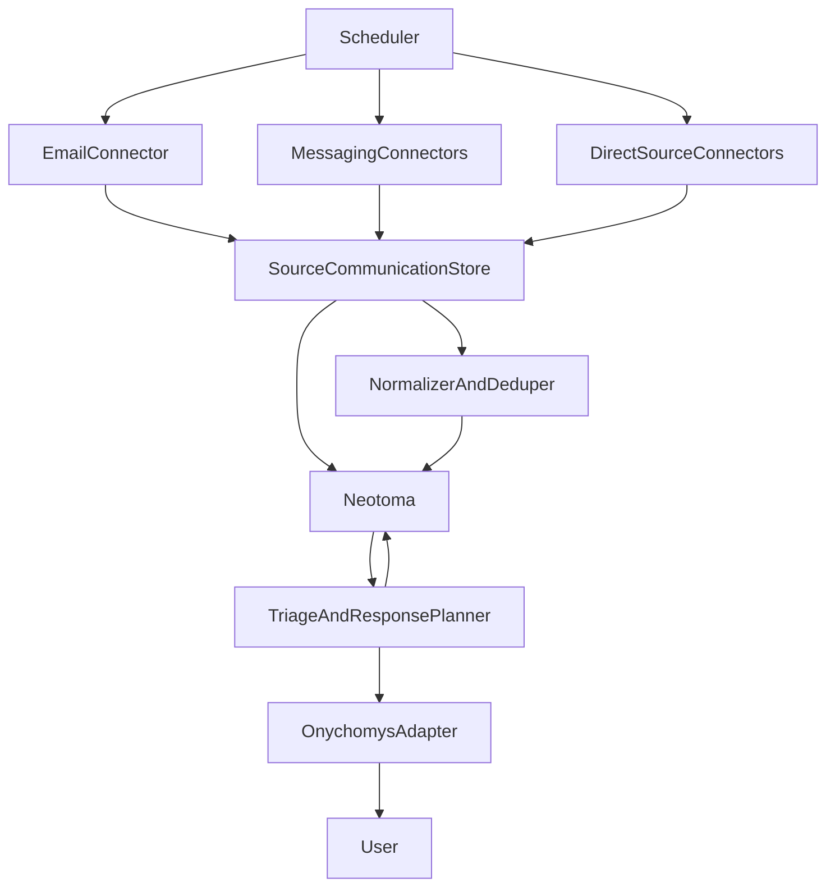

<!-- Do not edit this file directly. Corrections go through `neotoma corrections create`, `neotoma edit <id>`, or the Neotoma Inspector. This file is regenerated on every relevant write. -->

---
entity_id: ent_b82353178d7e01b15ef3f2ed
entity_type: plan
schema_version: 1.0
last_observation_at: 2026-05-14T14:26:30.325Z
observation_count: 3
computed_at: 2026-05-14T14:26:30.325Z
title: Notification ingestion and triage plan
---

# Notification ingestion and triage plan

## Goal

Build one local-first system with two stages:

- ingestion connectors that collect source communications from email, messaging apps (WhatsApp, Telegram, Signal where supported), and later other direct platform sources, storing the raw communication and extracted entities in Neotoma
- triage/notifier logic that reads derived Neotoma events, decides what matters, drafts a response recommendation, and sends an alert through Onychomys

The core enhancement is that notifications should be treated as derived views over richer source records, not as the only thing preserved.

## Repo anchors

Reuse the existing local-first worker model in [docs/agent_execution_architecture.md](docs/agent_execution_architecture.md), especially the control-plane / connector-plane split and the `launchd`-managed worker pattern under [execution/scripts/agent_execution/](execution/scripts/agent_execution/).

Use Gmail as the first production connector via [mcp/gmail/README.md](mcp/gmail/README.md), which already supports `search_emails`, `read_email`, `download_attachment`, label operations, and batch processing.

Use the email review semantics in [shared/docs/agent-email-triage-protocol.md](shared/docs/agent-email-triage-protocol.md) as the basis for provenance, attachment handling, and human-in-the-loop reply drafting, but adapt it from inbox-by-inbox manual triage into machine classification plus alert generation.

Messaging repo anchor: WhatsApp MCP lives under [mcp/whatsapp/README.md](mcp/whatsapp/README.md) and [mcp/whatsapp/whatsapp_mcp_server.py](mcp/whatsapp/whatsapp_mcp_server.py). Telegram and Signal are not present as MCPs in this repo today; treat them as optional connectors with explicit integration choices (see Phase 3b).

## Target architecture

## Phase 1: email-first MVP

Create a dedicated email-ingestion worker inside the existing agent execution stack rather than a separate standalone product.

Scope:

- Poll Gmail for notification-like messages from LinkedIn, Substack, Medium, X, Reddit, and other high-signal senders.
- Store the source message itself in Neotoma with enough raw structure to support later reprocessing.
- Extract entities and communication metadata from the message and link them to the stored source communication.
- Classify each message into one of: `social_notification`, `thread_update`, `contact_update`, `task_signal`, or `ignore`.
- Deduplicate repeated events using stable keys such as `source`, `thread_id`, `message_id`, `notification_type`, and normalized target URL.
- Feed only actionable or high-priority items into the notifier stage.

Implementation targets:

- add a new worker under [execution/scripts/agent_execution/](execution/scripts/agent_execution/)
- reuse Gmail MCP instead of direct Gmail API scripts unless a batch backfill tool is needed
- define a small config surface for sender rules, Gmail queries, polling interval, and alert thresholds

## Phase 2: triage and Onychomys alerts

Create a second worker that watches Neotoma for unresolved new notifications and enriches them before alerting.

Responsibilities:

- fetch related contacts, prior thread context, past replies, and relevant tasks from Neotoma
- score urgency and response-worthiness
- propose `recommended_action`, `recommended_response`, and `reasoning_summary`
- notify through an Onychomys adapter without auto-posting replies
- update Neotoma status fields such as `new`, `notified`, `dismissed`, `acted_on`, `archived`

Assumption:

- Onychomys is external to this repo, so this code should treat it as an outbound adapter interface rather than coupling to repo-local implementation details

## Phase 3: direct-source connectors

After the email-first path is stable, add direct-source connectors where the source quality justifies it.

Priority order:

1. LinkedIn if direct API or browser path gives materially better metadata than email
2. X if access and rate limits are acceptable
3. Reddit where API/web data is reliable
4. Substack and Medium only if email/RSS prove insufficient

These connectors should emit the same normalized event shape as the email worker so the downstream Neotoma and Onychomys stages remain unchanged.

## Phase 3b: messaging (Telegram, WhatsApp, Signal)

Goal: ingest **source** chat messages (and metadata) into Neotoma the same way as email, then let the shared normalizer derive `social_notification` or other event types when appropriate.

**WhatsApp (highest leverage in this repo)**

- Use the existing WhatsApp MCP under [mcp/whatsapp/](mcp/whatsapp/) as the primary read path when the assistant or a worker invokes MCP tools.
- For an always-on worker, either wrap the same transport the MCP uses or run a small polling process that writes to Neotoma via Neotoma CLI or HTTP, consistent with [docs/agent_execution_architecture.md](docs/agent_execution_architecture.md).
- Map WhatsApp threads to `thread_id` / `chat_id` equivalents in `source_communication` for dedupe and cross-channel linking.

**Telegram (if possible)**

- Typical options: **Bot API** (incoming updates to a webhook or long-poll) for bot-attributed traffic only, or **user client libraries** (e.g. MTProto) for full personal history, which has stronger ToS and operational risk.
- Plan must record the chosen mode, retention of raw payloads, and rate limits before implementation.
- No first-party Telegram MCP in this repo yet; add a connector worker or MCP only after the integration mode is fixed.

**Signal (if possible)**

- Practical local options are usually **signal-cli** (linked device or CLI bridge) or similar community tooling, not an official public "read all messages" API for consumers.
- Treat Signal as **optional** until a supported, maintainable read path is validated on your host (macOS) and you accept the operational and policy constraints.
- Same Neotoma schema as other chats once messages are normalized.

**Cross-cutting for all messaging**

- Prefer storing **per-message** source rows with `provider`, `chat_id`, `message_id`, `sender_id`, `sent_at`, `body`, `reply_to_id`, `media_refs`, `data_source`, and optional raw payload hash for dedupe.
- Respect **privacy and consent**: configurable per-chat or per-contact inclusion, redaction rules for group content, and no auto-send without human approval (aligned with existing email triage posture).
- Dedupe keys should include `provider + chat_id + provider_message_id` so the same message is not re-ingested on worker restarts.

## Data model in Neotoma

Start with a source-first model: communication records first, derived notification records second.

Primary source entities:

- `source_communication` as the generic envelope with `provider` in `{gmail, whatsapp, telegram, signal, ...}` and provider-specific optional fields, **or** split types (`email_message`, `chat_message`) that both normalize to the same downstream fields for triage
- For chat: `chat_id`, `thread_or_conversation_id`, `sender`, `recipients`, `sent_at`, `body`, `attachment_ids`, `reply_to_message_id`, `source_file`, `data_source`, raw payload subsets
- For email: `message_id`, `thread_id`, `subject`, `from`, `to`, `cc`, `received_at`, `body_text`, `body_html`, `labels`, `attachment_ids`, `source_file`, `data_source`, and raw payload subsets
- attachment or file entities when the source contains downloadable artifacts

Derived event entity:

- `social_notification` with fields like `source`, `remote_id`, `thread_id`, `message_id`, `actor_name`, `actor_handle`, `target_url`, `content_snippet`, `notification_type`, `published_at`, `observed_at`, `priority`, `status`, `action_required`, `dedupe_key`, `data_source`, and raw response subsets for provenance

Related entities:

- `contact` for sender/actor identity
- `post` or `thread` for the content being reacted to
- `task` when follow-up is required
- `recommended_response` or embedded response fields on the notification entity for MVP simplicity

File/provenance rules:

- for email-derived events, preserve the source message itself, not just the extracted notification
- store enough source content to re-run classification later without going back to Gmail unless the payload is too large or sensitive
- keep explicit links from derived notifications back to their source communication entities
- for direct-source events, include `data_source` and raw API payload subsets on stored entities

## Source communication policy

Treat emails, chat messages, and similar source communications as durable first-class records in Neotoma whenever they may later matter for recall, audit, response drafting, task extraction, or relationship reconstruction.

Store source communication even when no user-facing notification is emitted if it does any of the following:

- contains relationship context, conversation history, or reply-worthy substance
- changes task, deal, outreach, or collaborator state
- includes an attachment, linked document, or durable factual update
- could become useful for future search, timeline reconstruction, or reclassification

Allow the classifier to mark some source communications as `ignore_for_alerting` while still keeping them searchable in Neotoma.

## Neotoma turn persistence (conversation progress)

Yes: for **any turn where an assistant produces a user-visible reply** (including "plan only," triage-only, or connector-debug turns), Neotoma should still run the **full turn lifecycle** so conversation progress is durable, not only when storing business entities like emails or `social_notification`.

Align implementation and operator runbooks with the workspace Neotoma harness (see [.cursor/rules/neotoma_harness.mdc](.cursor/rules/neotoma_harness.mdc) and Neotoma MCP instructions):

- **Bounded retrieval** first when the user message implies existing Neotoma entities.
- **User-phase store:** one batch per user message with `conversation`, user `conversation_message` (or `agent_message` alias), `PART_OF`, and any extracted entities for that turn.
- **Closing store:** assistant `conversation_message` with distinct `turn_key` (e.g. `{conversation_id}:{turn_id}:assistant`), matching idempotency pattern, then **PART_OF** to the same conversation and **REFERS_TO** from the assistant message to entities the reply materially cites.

**Implication for this pipeline:** ingestion workers that run headless without chat do not need chat turns, but **any human-in-the-loop or Cursor-agent session** that designs connectors, classifiers, or Onychomys payloads must treat Neotoma persistence as **unconditional** for the chat transcript, not optional "when we saved something interesting."

## Dedupe and state transitions

Define dedupe before implementation to avoid spammy alerts.

Rules:

- one logical notification should alert once unless status changes materially
- email-derived and direct-source versions of the same event should merge by canonical target and actor when possible
- repeated digest emails should not create duplicate actionable alerts

State flow:

`observed` -> `classified` -> `stored` -> `notified` -> `reviewed` -> `acted_on` or `dismissed`

## Reliability and ops

Attach the new workers to the existing local-first service pattern instead of inventing a new supervisor.

Use existing architecture from [docs/agent_execution_architecture.md](docs/agent_execution_architecture.md):

- scheduler-driven polling
- isolated workers
- health checks and watchdog
- structured logs and retry policies

Operational additions:

- worker heartbeat and last-success timestamps
- backoff per source
- dead-letter bucket for parse/classification failures
- dry-run mode that stores to Neotoma but suppresses Onychomys alerts

## Validation plan

Validate in increasing order:

1. replay a small corpus of known email notifications into the classifier
2. verify Neotoma records, dedupe behavior, and state transitions
3. verify Onychomys payload generation in dry-run mode
4. run a limited live pilot on one or two sources before broadening coverage
5. add messaging pilot: WhatsApp first (repo MCP), then Telegram or Signal only after integration path and policy are explicit

## Key decisions

- one system, two workers, shared normalization contract
- email is the MVP input path, not a separate end-to-end product
- messaging uses the same source-first Neotoma model; WhatsApp is the first non-email channel with an in-repo integration; Telegram and Signal follow once a concrete read path is chosen
- store source communications in Neotoma even when they do not become alerts, unless they are clearly disposable low-value noise
- Onychomys is an outbound adapter, not the source of truth
- Neotoma is the system of record for source communications, derived events, enrichment, and triage state
- Neotoma also stores **every** agent-visible chat turn (conversation + user + assistant messages and required edges), not only extracted pipeline entities
- keep all response actions human-approved until the alert quality is proven

