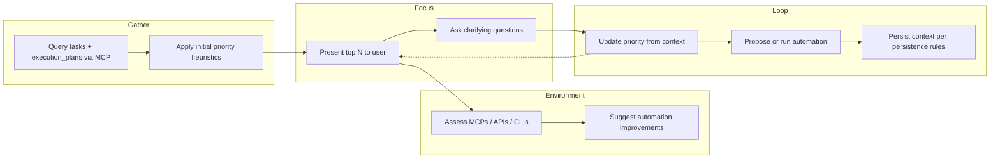

<!-- Do not edit this file directly. Corrections go through `neotoma corrections create`, `neotoma edit <id>`, or the Neotoma Inspector. This file is regenerated on every relevant write. -->

---
entity_id: ent_1183e9f7c5a6e0496cad0f9a
entity_type: plan
schema_version: 1.0
last_observation_at: 2026-05-14T14:30:05.383Z
observation_count: 2
computed_at: 2026-05-14T14:30:05.383Z
title: Task Organize & Automate Skill — implementation plan
---

---
name: Task Organize Automate Skill
overview: "Add a new Cursor skill that helps you organize tasks holistically: surface high-priority tasks, gather clarifying context to enable agent automation, assess and improve the repo’s automation environment (MCPs, APIs, CLIs), and reprioritize as context is collected."
todos: []
isProject: false
---

# Task Organize & Automate Skill

## Goal

Create a single skill that:

1. **Surfaces high-priority tasks** from your existing task sources (Parquet/Neotoma).
2. **Asks targeted clarifying questions** so the agent can automate execution once enough context exists.
3. **Evaluates the repo as an automation environment** (research APIs, MCPs, CLIs) and suggests improvements.
4. **Reprioritizes dynamically** as you provide context (e.g., bump or demote tasks based on urgency/clarity).

---

## Data and Automation Context (Already in Repo)

- **Tasks:** Stored in `$DATA_DIR/tasks/tasks.parquet`; access via Parquet MCP (`read_parquet` with `data_type="tasks"`). Filter by `status` (e.g. pending, in_progress, blocked), sort by `due_date` and priority-related fields. See [strategy/operations/tasks.md](strategy/operations/tasks.md).
- **Execution plans:** In Neotoma first, Parquet backup; query via Parquet MCP with `data_type="execution_plans"` and filters (e.g. `status`, `priority`, `domain`). See [.cursor/rules/execution_plans.mdc](.cursor/rules/execution_plans.mdc).
- **Persistence:** Neotoma first, then Parquet; task/plan updates must go through MCP (no direct parquet file edits). See [.cursor/rules/persistence.mdc](.cursor/rules/persistence.mdc).
- **Automation surface:** MCP servers (parquet, gmail, asana, google-calendar, dnsimple, etc.) and usage are documented in [mcp/README.md](mcp/README.md). Rule router and skills live under `.cursor/`. Skills can be Neotoma-backed (stub + `entity_id`) or self-contained in repo.

---

## Skill Design

### Name and placement

- **Name:** `task-organize-automate` (lowercase, hyphens, < 64 chars).
- **Location:** Ateles project skill at `.cursor/skills/task-organize-automate/`.
- **Content strategy:** Per [.cursor/rules/skills_neotoma_proactive_fetch.mdc](.cursor/rules/skills_neotoma_proactive_fetch.mdc), new skills are stored in **Neotoma** (full content); a **stub** in `.cursor/skills/task-organize-automate/SKILL.md` with `name`, `description`, `triggers`, `entity_id`, and “fetch from Neotoma” instruction. Alternative: keep the skill **self-contained** in the repo (like [.cursor/skills/fix-feature-bug/SKILL.md](.cursor/skills/fix-feature-bug/SKILL.md)) if you prefer to edit the workflow in the repo without Neotoma.

### Description (for discovery)

The description must state **what** the skill does and **when** to use it (triggers), in third person. Example:

```yaml
description: "Organize tasks holistically by surfacing highest-priority items, gathering clarifying context to enable agent automation, and assessing the repo's automation environment (MCPs, APIs, CLIs). Reprioritizes as context is collected. Use when the user asks to organize tasks, prioritize tasks, clarify tasks for automation, improve task automation, or assess automation environment."
```

### Trigger phrases (for rule router and skill index)

- Organize tasks, prioritize tasks, task triage, clarify my tasks, task automation, automate my tasks, automation environment, what can be automated, task context.

---

## Workflow (What the Skill Instructions Must Specify)

High-level flow the agent will follow when the skill is invoked:




1. **Load tasks and plans**
  - Query Parquet MCP: `tasks` (e.g. filter `status` in pending/in_progress/blocked; optionally by project/domain).
  - Query execution_plans (Neotoma/Parquet) by status/priority/domain as needed.
  - Optionally: Neotoma entities that represent tasks or commitments (if you store them there).
2. **Initial prioritization**
  - Heuristics: `due_date` (soonest first), `priority` field, `status`, `domain`, and any explicit user preference (e.g. “focus on finance”).
  - Produce a short ordered list (e.g. top 5–10) and show it to the user.
3. **Clarifying questions (per high-priority task)**
  - Goal: collect enough context so the agent can automate (or partially automate) the task.
  - Examples: What system/API is involved? What does “done” look like? Any constraints or credentials? Which steps can be scripted vs manual?
  - Store answers in conversation and, where appropriate, in task notes or execution plan `notes_updates` (via MCP) so future runs can reuse context.
4. **Automation environment assessment**
  - Use [mcp/README.md](mcp/README.md) and repo rules (e.g. MCP-related rules) to list existing MCPs and intended use.
  - For each high-priority task (or category), ask: Is there an MCP, API, or CLI that could automate it? If not, note gaps (e.g. “No MCP for X; consider adding one or using CLI Y”).
  - Output: short list of “automation improvements” (new MCPs, new tools, or better use of existing ones).
5. **Reprioritization**
  - As the user answers clarifying questions, the agent should re-evaluate: e.g. task is more urgent than thought, or less critical, or now automatable and can be scheduled.
  - Explicitly instruct the agent to adjust the ordered list and refocus (e.g. “Given what you said, I’m moving X up and Y down because…”).
6. **Execution and persistence**
  - When context is sufficient, propose concrete automation (e.g. run a script, use an MCP tool, create/update an execution plan).
  - All task/plan updates via MCP; follow [.cursor/rules/persistence.mdc](.cursor/rules/persistence.mdc) and [.cursor/rules/execution_plans.mdc](.cursor/rules/execution_plans.mdc).

---

## Deliverables


| Item                             | Action                                                                                                                                                                                                                                                                                                    |
| -------------------------------- | --------------------------------------------------------------------------------------------------------------------------------------------------------------------------------------------------------------------------------------------------------------------------------------------------------- |
| **Skill content**                | Write full workflow (steps above) in a SKILL.md body: clear phases, when to ask questions, when to reassess priority, when to suggest automation. Keep under ~500 lines; move long reference material to a separate file if needed.                                                                       |
| **Neotoma**                      | If using Neotoma: create skill entity with `entity_type: skill`, `name`, `description`, `triggers`, `content` (full markdown); idempotency key e.g. `skill-task-organize-automate`.                                                                                                                       |
| **Stub (if Neotoma)**            | Add `.cursor/skills/task-organize-automate/SKILL.md` with frontmatter (`name`, `description`, `triggers`, `entity_id`, `synced_at`) and body instructing the agent to fetch content via `retrieve_entity_snapshot`.                                                                                       |
| **Self-contained (alternative)** | If not using Neotoma: put the full workflow in `.cursor/skills/task-organize-automate/SKILL.md` with no `entity_id`.                                                                                                                                                                                      |
| **Rule router**                  | Add one row to [.cursor/rules/rule_router.mdc](.cursor/rules/rule_router.mdc) so triggers (e.g. “organize tasks”, “prioritize tasks”, “task automation”, “automation environment”) load this skill (and, if Neotoma-backed, follow skills_neotoma_proactive_fetch: load rule, then fetch by `entity_id`). |
| **Optional reference**           | A short `references/automation_sources.md` (or similar) linked from SKILL.md: list of MCPs, where to find APIs/CLIs in the repo, and how to propose new automation. This keeps SKILL.md lean and gives the agent a single place to look for “what can we use?”                                            |


---

## Files to Create or Edit

- **Create:** `.cursor/skills/task-organize-automate/SKILL.md` (stub or full content).
- **Create (optional):** `.cursor/skills/task-organize-automate/references/automation_sources.md` (MCP/API/CLI summary and improvement ideas).
- **Edit:** [.cursor/rules/rule_router.mdc](.cursor/rules/rule_router.mdc) — add trigger → skill mapping and note “Neotoma stub” if applicable.
- **Neotoma (if used):** One `store_structured` (or equivalent) call to create/update the skill entity; no full content in repo beyond stub.

---

## Out of Scope (For Later)

- Changing task or execution_plan schemas.
- Implementing new MCPs or scripts inside this skill (the skill only guides the agent to use existing tools and suggest improvements).
- Automatic scheduling of when to run the skill (invocation remains user- or trigger-based).

---

## Summary

You get one new skill, **task-organize-automate**, that (1) pulls tasks/plans from MCP, (2) prioritizes and shows top items, (3) asks clarifying questions to enable automation, (4) assesses the repo’s automation environment and suggests improvements, and (5) reprioritizes and proposes/executes automation as context is collected, with all persistence via existing rules and MCP.
