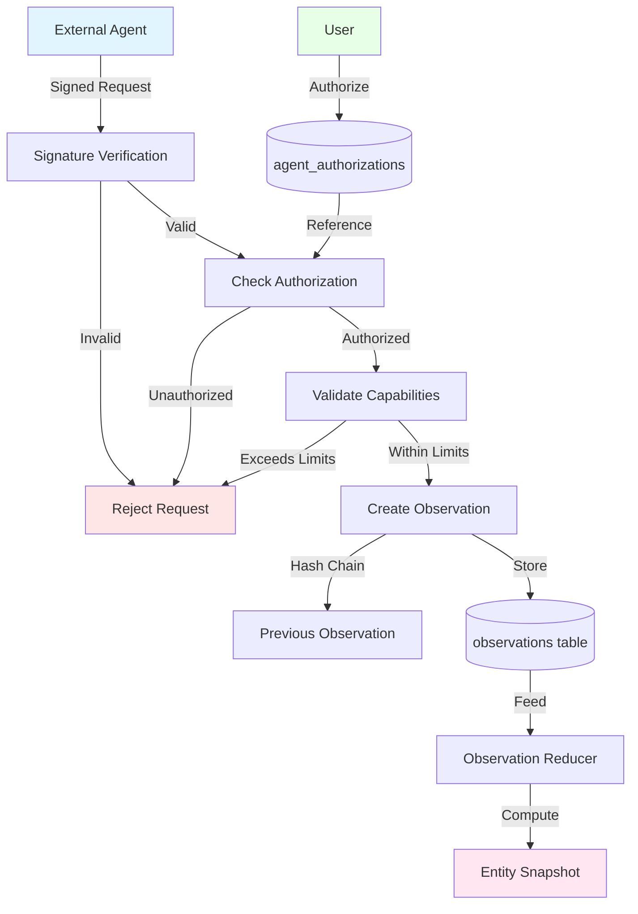

# Agent Trust Framework

## Proposal Context

This proposal was migrated from `.cursor/plans/agent_trust_framework_eb38ca7d.plan.md` on 2026-01-22.

**Original Status:** 0/11 todos completed (0%)
- Pending: 11
- In Progress: 0
- Completed: 0

**Relevance:** This proposal represents future work that has not been fully implemented.

**Architecture Alignment:** Requires verification against current architecture docs.

---

# Agent Trust Framework Implementation Plan

## Context

Neotoma already has blockchain-like design patterns (immutable observations, content-addressed storage, provenance chains, deterministic reducers). However, for multi-agent scenarios with varying trust levels, additional trust infrastructure is needed.

**Existing Foundation:**

- Ed25519 signature utilities in [`src/crypto/signature.ts`](src/crypto/signature.ts)
- Agent identity abstraction (stub) in [`src/crypto/agent_identity.ts`](src/crypto/agent_identity.ts)
- Content-addressed storage with SHA-256 hashing
- Immutable observation architecture

**Upcoming in v2.0.0 (per [`docs/releases/v2.0.0/release_plan.md`](docs/releases/v2.0.0/release_plan.md)):**

- FU-850: Crypto Library with Ed25519 key generation and signatures
- FU-857: Public Key Authentication (bearer token = Ed25519 public key)

## Architecture Overview



## Phase 1: Digital Signatures & Agent Identity (v2.1.0 or v2.2.0)

**Leverages v2.0.0 work (FU-850, FU-857).**

### 1.1 Extend Agent Identity System

**File:** [`src/crypto/agent_identity.ts`](src/crypto/agent_identity.ts)

Currently has stub implementation. Enhance to:

- Extract public key from authenticated request headers
- Validate Ed25519 public key format
- Link to agent authorization registry
```typescript
export interface AgentIdentity {
  agent_id: string;           // Derived from public key hash
  public_key: string;         // Ed25519 public key (hex or base64)
  algorithm: "ed25519";
  verified_at: string;        // Timestamp of verification
}

export function getAgentIdentityFromRequest(
  request: Request
): AgentIdentity | null {
  // Extract public key from Authorization header
  // Verify signature on request payload
  // Return verified identity
}
```


### 1.2 Create Agent Authorization Registry

**New table:** `agent_authorizations`

```sql
CREATE TABLE agent_authorizations (
  id UUID PRIMARY KEY DEFAULT gen_random_uuid(),
  user_id UUID NOT NULL REFERENCES auth.users(id),
  agent_public_key TEXT NOT NULL,
  agent_name TEXT,
  authorized_at TIMESTAMPTZ NOT NULL DEFAULT NOW(),
  expires_at TIMESTAMPTZ,
  revoked_at TIMESTAMPTZ,
  
  -- Capabilities
  max_priority INTEGER NOT NULL DEFAULT 100,
  allowed_entity_types TEXT[] DEFAULT ARRAY[]::TEXT[],
  allowed_operations TEXT[] DEFAULT ARRAY['read', 'create']::TEXT[],
  rate_limit_per_hour INTEGER DEFAULT 100,
  
  -- Metadata
  authorization_signature TEXT NOT NULL,  -- User's signature authorizing agent
  notes TEXT,
  
  CONSTRAINT unique_agent_per_user UNIQUE(user_id, agent_public_key)
);

CREATE INDEX idx_agent_auth_user ON agent_authorizations(user_id);
CREATE INDEX idx_agent_auth_pubkey ON agent_authorizations(agent_public_key);
CREATE INDEX idx_agent_auth_active ON agent_authorizations(user_id, agent_public_key) 
  WHERE revoked_at IS NULL AND (expires_at IS NULL OR expires_at > NOW());
```

**New service:** `src/services/agent_authorization.ts`

```typescript
export interface AgentAuthorization {
  agent_public_key: string;
  max_priority: number;
  allowed_entity_types: string[];
  allowed_operations: string[];
  rate_limit_per_hour: number;
  expires_at?: string;
}

export async function getAgentAuthorization(
  user_id: string,
  agent_public_key: string
): Promise<AgentAuthorization | null> {
  // Query agent_authorizations table
  // Check not revoked and not expired
}

export async function validateAgentOperation(
  authorization: AgentAuthorization,
  operation: {
    entity_type: string;
    operation: string;
    claimed_priority: number;
  }
): Promise<{ valid: boolean; error?: string }> {
  // Check entity type allowed
  // Check operation allowed
  // Check priority within limits
}
```

### 1.3 Signed Observations

**Extend observations table:**

```sql
ALTER TABLE observations ADD COLUMN agent_signature TEXT;
ALTER TABLE observations ADD COLUMN agent_public_key TEXT;
ALTER TABLE observations ADD COLUMN signature_algorithm TEXT DEFAULT 'ed25519';
```

**Update observation creation:**

```typescript
export interface SignedObservation {
  observation: Observation;
  signature: string;          // Ed25519 signature over observation hash
  agent_public_key: string;
  signature_algorithm: "ed25519";
}

export async function createSignedObservation(
  signed: SignedObservation,
  user_id: string
): Promise<void> {
  // 1. Verify signature
  const observationHash = computeObservationHash(signed.observation);
  const signatureValid = verifySignature(
    observationHash,
    signed.signature,
    signed.agent_public_key
  );
  
  if (!signatureValid) {
    throw new Error("Invalid agent signature");
  }
  
  // 2. Check authorization
  const auth = await getAgentAuthorization(user_id, signed.agent_public_key);
  if (!auth) {
    throw new Error("Agent not authorized");
  }
  
  // 3. Validate capabilities
  const validation = await validateAgentOperation(auth, {
    entity_type: signed.observation.entity_type,
    operation: "create",
    claimed_priority: signed.observation.source_priority
  });
  
  if (!validation.valid) {
    throw new Error(validation.error);
  }
  
  // 4. Store observation with signature metadata
  await insertObservation({
    ...signed.observation,
    agent_signature: signed.signature,
    agent_public_key: signed.agent_public_key,
    signature_algorithm: signed.signature_algorithm
  });
}
```

### 1.4 MCP Actions for Agent Management

**Add to [`src/server.ts`](src/server.ts):**

- `authorize_agent` - User authorizes an agent with public key and capabilities
- `revoke_agent` - User revokes agent authorization
- `list_authorized_agents` - List all authorized agents for user
- `get_agent_authorization` - Get specific agent's capabilities

**Upcoming Work Alignment:**

- **Leverages FU-850** (Crypto Library) for signature verification
- **Leverages FU-857** (Public Key Authentication) for agent identity extraction
- **Compatible with v2.0.0** E2EE architecture (works with encrypted or plaintext)

---

## Phase 2: Tamper Evidence (v2.2.0 or v2.3.0)

### 2.1 Hash Chains for Observations

**Extend observations table:**

```sql
ALTER TABLE observations ADD COLUMN observation_hash TEXT NOT NULL;
ALTER TABLE observations ADD COLUMN previous_observation_hash TEXT;

CREATE INDEX idx_observations_hash ON observations(observation_hash);
CREATE INDEX idx_observations_prev_hash ON observations(previous_observation_hash);
```

**Update observation creation:**

```typescript
export async function createObservationWithChain(
  observation: Observation,
  user_id: string
): Promise<void> {
  // 1. Get previous observation for this entity
  const previous = await getLastObservation(observation.entity_id, user_id);
  
  // 2. Compute observation hash
  const observationHash = computeObservationHash({
    ...observation,
    previous_observation_hash: previous?.observation_hash
  });
  
  // 3. Store with chain link
  await insertObservation({
    ...observation,
    observation_hash: observationHash,
    previous_observation_hash: previous?.observation_hash
  });
}

export async function verifyObservationChain(
  entity_id: string,
  user_id: string
): Promise<{ valid: boolean; broken_at?: string }> {
  // Load all observations for entity
  const observations = await getObservations(entity_id, user_id);
  
  // Verify chain integrity
  for (let i = 0; i < observations.length; i++) {
    const obs = observations[i];
    const computedHash = computeObservationHash(obs);
    
    if (obs.observation_hash !== computedHash) {
      return { valid: false, broken_at: obs.id };
    }
    
    // Verify link to previous
    if (i > 0) {
      const prev = observations[i - 1];
      if (obs.previous_observation_hash !== prev.observation_hash) {
        return { valid: false, broken_at: obs.id };
      }
    }
  }
  
  return { valid: true };
}
```

### 2.2 Merkle Tree Alternative (More Efficient)

**Optional:** For entities with many observations, Merkle trees provide efficient verification.

**New table:** `entity_observation_trees`

```sql
CREATE TABLE entity_observation_trees (
  entity_id TEXT PRIMARY KEY,
  user_id UUID NOT NULL,
  merkle_root TEXT NOT NULL,
  leaf_count INTEGER NOT NULL,
  computed_at TIMESTAMPTZ NOT NULL DEFAULT NOW(),
  updated_at TIMESTAMPTZ NOT NULL DEFAULT NOW()
);
```

**New service:** `src/services/merkle_tree.ts`

```typescript
export function computeMerkleRoot(
  observations: Observation[]
): string {
  // Build Merkle tree from observation hashes
  // Return root hash
}

export function generateMerkleProof(
  observations: Observation[],
  targetObservation: string
): string[] {
  // Generate Merkle proof path for target observation
}

export function verifyMerkleProof(
  observationHash: string,
  proof: string[],
  root: string
): boolean {
  // Verify observation is in tree without loading all observations
}
```

### 2.3 MCP Actions for Verification

**Add to [`src/server.ts`](src/server.ts):**

- `verify_observation_chain` - Verify entity's observation chain integrity
- `verify_observation_membership` - Verify specific observation is in chain (with Merkle proof)
- `get_chain_status` - Get chain health metrics for entity

---

## Phase 3: Conflict Resolution & Consensus (v2.3.0 or post-v2.0.0)

### 3.1 Conflict Detection

**New table:** `observation_conflicts`

```sql
CREATE TABLE observation_conflicts (
  id UUID PRIMARY KEY DEFAULT gen_random_uuid(),
  entity_id TEXT NOT NULL,
  field_name TEXT NOT NULL,
  observation_ids UUID[] NOT NULL,
  conflict_type TEXT NOT NULL,  -- 'priority_tie', 'timestamp_collision', 'value_disagreement'
  detected_at TIMESTAMPTZ NOT NULL DEFAULT NOW(),
  resolved_at TIMESTAMPTZ,
  resolution_method TEXT,  -- 'quorum', 'user_review', 'highest_trust'
  winning_observation_id UUID,
  user_id UUID NOT NULL
);

CREATE INDEX idx_conflicts_entity ON observation_conflicts(entity_id) WHERE resolved_at IS NULL;
CREATE INDEX idx_conflicts_user ON observation_conflicts(user_id) WHERE resolved_at IS NULL;
```

### 3.2 Consensus Strategies

**Extend schema registry with conflict resolution config:**

```typescript
export interface ConflictResolutionConfig {
  strategy: "quorum" | "weighted_vote" | "user_review" | "highest_trust";
  
  // Quorum settings
  quorum_threshold?: number;        // e.g., 2 out of 3
  quorum_window_hours?: number;     // Time window for agreement
  
  // Weighted vote settings
  agent_weights?: Record<string, number>;  // Agent public key → weight
  
  // User review settings
  auto_flag_conflicts?: boolean;
  notification_threshold?: number;  // Flag if > N conflicting observations
}

export async function detectConflict(
  entity_id: string,
  field: string,
  observations: Observation[]
): Promise<Conflict | null> {
  // Detect if multiple observations with same priority/timestamp disagree
  const values = observations.map(o => o.fields[field]);
  const uniqueValues = new Set(values);
  
  if (uniqueValues.size > 1) {
    // Check if agents agree (quorum)
    const agentVotes: Record<string, number> = {};
    for (const obs of observations) {
      const value = JSON.stringify(obs.fields[field]);
      agentVotes[value] = (agentVotes[value] || 0) + 1;
    }
    
    const maxVotes = Math.max(...Object.values(agentVotes));
    const threshold = Math.ceil(observations.length / 2); // Majority
    
    if (maxVotes >= threshold) {
      // Consensus reached
      return null;
    } else {
      // Conflict detected
      return {
        entity_id,
        field_name: field,
        observation_ids: observations.map(o => o.id),
        conflict_type: "value_disagreement"
      };
    }
  }
  
  return null;
}
```

### 3.3 User Review UI

**New MCP actions:**

- `list_conflicts` - Get unresolved conflicts for user
- `resolve_conflict` - User chooses winning observation
- `get_conflict_details` - Get full details of conflicting observations

---

## Phase 4: Cryptographic Timestamping (Post-v2.0.0, Optional)

### 4.1 Timestamp Integration

**Extend observations table:**

```sql
ALTER TABLE observations ADD COLUMN timestamp_proof TEXT;
ALTER TABLE observations ADD COLUMN timestamp_authority TEXT;
ALTER TABLE observations ADD COLUMN timestamp_verified_at TIMESTAMPTZ;
```

**New service:** `src/services/timestamp.ts`

```typescript
export interface TimestampProof {
  observation_hash: string;
  authority: "opentimestamps" | "bitcoin_mainnet" | "internal";
  proof: string;              // Merkle proof or block height
  timestamp: string;
  verified: boolean;
}

export async function requestTimestamp(
  observationHash: string
): Promise<TimestampProof> {
  // Submit to OpenTimestamps or internal authority
  // Return proof
}

export async function verifyTimestamp(
  proof: TimestampProof
): Promise<boolean> {
  // Verify timestamp proof
}
```

---

## Where Upcoming Releases Already Help

### v2.0.0 E2EE Release Provides:

✅ **FU-850: Crypto Library** - Ed25519 signatures already implemented

✅ **FU-857: Public Key Authentication** - Agent identity via bearer token

✅ **Crypto infrastructure** - Key generation, signature primitives

**Phase 1 can build directly on these FUs.**

### v2.1.0 GDPR Release Provides:

✅ **Audit logging** (FU-911) - Can log agent authorization changes

✅ **Identity verification** (FU-909) - Can verify agent identity claims

**Partial overlap:** Agent authorization could use similar identity verification patterns.

### What's Still Needed (New Work):

🔴 **Agent Authorization Registry** - New table and service

🔴 **Observation Signatures** - Extend observations table, verification logic

🔴 **Hash Chains / Merkle Trees** - Tamper evidence system

🔴 **Conflict Resolution** - Consensus mechanisms for multi-agent scenarios

🔴 **Cryptographic Timestamping** - Optional, external service integration

---

## Recommended Implementation Order

### Immediate (Build on v2.0.0):

1. **Phase 1.1-1.3** - Agent identity, authorization, signed observations

   - Leverages FU-850, FU-857 directly
   - Enables multi-agent trust model

### Near-term (After v2.0.0 stable):

2. **Phase 2.1** - Hash chains for tamper evidence

   - Simple, effective, low complexity
   - Provides cryptographic integrity guarantees

### Medium-term (Post-v2.1.0):

3. **Phase 3.1-3.2** - Conflict detection and resolution

   - Needed once multiple agents actively contribute
   - Can wait for user demand validation

### Long-term (Optional):

4. **Phase 2.2** - Merkle trees (optimization)
5. **Phase 4** - Cryptographic timestamping (regulatory compliance)

---

## Trade-offs & Considerations

### Performance Impact:

- **Signature verification**: ~1-2ms per observation (acceptable)
- **Hash chain computation**: ~0.1ms per observation (negligible)
- **Merkle tree**: O(log n) verification (efficient for large entity histories)

### Storage Overhead:

- **Signatures**: ~64 bytes per observation
- **Hash chains**: ~32 bytes per observation (previous hash)
- **Agent authorizations**: ~1KB per agent-user pair

### Complexity:

- Phase 1 adds moderate complexity (new table, verification logic)
- Phase 2 adds minimal complexity (hash computation)
- Phase 3 adds significant complexity (conflict resolution strategies)

### User Experience:

- Agent authorization flow must be simple (QR code, copy-paste public key)
- Conflict resolution should be rare with proper agent trust levels
- Most users won't interact with verification features directly

---

## Success Metrics

**Phase 1 Success Criteria:**

- ✅ Agents can be authorized with cryptographic public keys
- ✅ Observations include valid Ed25519 signatures
- ✅ Unauthorized agents are rejected
- ✅ Agent capabilities are enforced (priority limits, entity types)
- ✅ Users can revoke agent access

**Phase 2 Success Criteria:**

- ✅ Observation chains are maintained for all entities
- ✅ Chain integrity can be verified cryptographicallyproce
- ✅ Tampered observations are detected

**Phase 3 Success Criteria:**

- ✅ Conflicts are detected when agents disagree
- ✅ Users can review and resolve conflicts
- ✅ Quorum/weighted vote strategies work correctly

---

## Next Steps

1. **Confirm scope:** Which phases should be included in which releases?
2. **Review authorization model:** Are capability constraints comprehensive enough?
3. **Evaluate Merkle vs. hash chains:** Which tamper-evidence approach is preferred?
4. **Assess conflict resolution priority:** How urgent is multi-agent consensus?
5. **Plan v2.2.0:** Should agent trust be v2.2.0 or separate track?