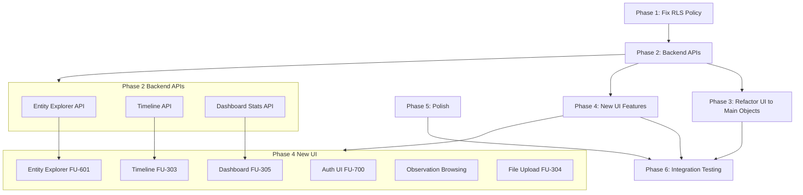

# Complete MVP Implementation

## Archived Proposal

This proposal was migrated from `.cursor/plans/complete_mvp_implementation_2ebb6b9d.plan.md` on 2026-01-22.

**Status:** Fully implemented - all 15 todos completed.

**Implementation Complete:** This work has been finished and is archived for reference.

---

# Complete MVP (v1.0.0) Implementation Plan

## Status of Pre-MVP Releases

All pre-MVP releases are **COMPLETE**:

- v0.1.0: ✅ ready_for_deployment (26 FUs, core Truth Layer)
- v0.2.0: ✅ in_testing (15+ FUs, sources-first architecture, AI interpretation)
- v0.2.1: ✅ complete (documentation generation system)
- v0.2.15: ✅ implemented (vocabulary alignment, unified `store` action)

**Foundation:** 41+ Feature Units providing solid base for MVP.

## Remaining Work for MVP

**Total Estimate:** 6.5-10.5 days

**Work Organization:** Dependency-based (architectural fixes → backend → UI)

---

## Phase 1: Critical Architectural Fixes (P0)

**Estimated:** 1-2 days

### 1.1 Fix RLS Policy (FU-701) - CRITICAL SECURITY GAP

**Priority:** P0 (blocks MVP launch)

**Issue:** `records` table RLS policy allows all authenticated users to read all records, violating privacy-first architecture.

**Files:**

- [`supabase/migrations/20260115130300_consolidate_records_policies.sql`](supabase/migrations/20260115130300_consolidate_records_policies.sql) - Update or create new migration
- Service layer code querying `records` table
- MCP actions accessing `records` table

**Tasks:**

1. Update `records` table policy from `USING (true)` to `USING (user_id = auth.uid())`
2. Verify all user-scoped tables have proper RLS (sources, interpretations, observations, entities)
3. Test cross-user isolation with multiple test users
4. Update service layer to ensure `user_id` is correctly set

**Tests:**

- Create 2 test users
- Upload files to each user
- Verify user A cannot see user B's records
- Verify MCP actions respect RLS

**Success Criteria:**

- All tables have user-scoped RLS policies
- Cross-user isolation verified
- No policy violations in logs

---

## Phase 2: Backend APIs for UI Features (P0)

**Estimated:** 2-3 days

These APIs are needed before building UI components.

### 2.1 Entity Explorer Backend (FU-601)

**Files to create:**

- `src/services/entity_queries.ts` - Entity list/detail queries (may already exist, verify)
- MCP action for entity retrieval (may exist as `retrieve_entities`)
- Entity relationship queries

**Tasks:**

1. Implement entity list query with filters (entity_type, search, pagination)
2. Implement entity detail query (snapshot + observations + relationships)
3. Add observation provenance queries (which source contributed which fields)
4. Add relationship traversal queries
5. Verify user-scoped queries respect RLS

**API Endpoints Needed:**

- `GET /api/entities?entity_type=&search=&limit=&offset=` - List entities
- `GET /api/entities/:id` - Entity detail with snapshot
- `GET /api/entities/:id/observations` - Observations for entity
- `GET /api/entities/:id/relationships` - Relationships for entity

**Tests:**

- Unit: Query construction, filtering
- Integration: Database queries with RLS
- E2E: MCP action flow

### 2.2 Timeline Backend (FU-303)

**Files to create/update:**

- Timeline event queries (may already exist in FU-102)
- `src/services/timeline_queries.ts` - Date filtering, event type filtering

**Tasks:**

1. Implement timeline query with date range filtering
2. Implement event type filtering
3. Add pagination
4. Link events to source

**API Endpoints Needed:**

- `GET /api/timeline?start_date=&end_date=&event_type=&limit=&offset=`

**Tests:**

- Unit: Date filtering logic
- Integration: Event queries with RLS
- E2E: Timeline display

### 2.3 Dashboard Stats Backend (FU-305)

**Files to create:**

- `src/services/dashboard_stats.ts` - Aggregate queries

**Tasks:**

1. Implement stat queries for main objects:

   - Total source count
   - Entities by type (company, person, invoice, etc.)
   - Total events count
   - Total observations count
   - Interpretations count

2. Ensure user-scoped queries

**API Endpoints Needed:**

- `GET /api/stats` - Dashboard statistics

**Tests:**

- Unit: Aggregate query construction
- Integration: Stats queries with RLS

---

## Phase 3: UI Refactoring to Main Objects (P0)

**Estimated:** 1.5-2.5 days

Refactor existing prototype UI from deprecated `records` table to main objects.

### 3.1 Refactor Source List (FU-301)

**Files to update:**

- [`frontend/src/components/RecordsTable.tsx`](frontend/src/components/RecordsTable.tsx) → Rename to `SourceTable.tsx`
- Frontend API client

**Tasks:**

1. Rename component file and all imports
2. Update DB queries from `records` to `sources` table
3. Update filters:

   - Replace `record_type` filter with `mime_type` and `source_type` filters
   - Update search to use `file_name` and `raw_text`

4. Update column headers ("Source" not "Records")
5. Update tests to query `sources` table

**Key Changes:**

```typescript
// Before
const { data } = await supabase.from('records').select('*')

// After  
const { data } = await supabase.from('sources').select('*')
```

**Tests:**

- Unit: Component rendering
- Integration: API queries to `sources` table
- E2E: List view displays source

### 3.2 Refactor Source Detail (FU-302)

**Files to update:**

- [`frontend/src/components/RecordDetailsPanel.tsx`](frontend/src/components/RecordDetailsPanel.tsx) → Rename to `SourceDetailsPanel.tsx`
- Frontend API client

**Tasks:**

1. Rename component file and all imports
2. Update to query `sources`, `interpretations`, `observations` tables
3. Add **Interpretation History** section:

   - Show all interpretations for this source
   - Display config: model, temperature, prompt_hash
   - Show created_at timestamp

4. Add **Observations** section:

   - Show observations with provenance
   - Display which source + interpretation contributed each field
   - Link observations to entities

5. Update entity/event linking (via observations)
6. Update labels ("Source" not "Record")
7. Update tests

**UI Structure:**

```
Source Detail
├─ Source Metadata (file_name, mime_type, size, uploaded_at)
├─ Raw Content Preview (first 1000 chars)
├─ Interpretations
│  └─ For each interpretation: model, config, timestamp
├─ Observations
│  └─ For each observation: field, value, provenance
├─ Linked Entities (via observations)
└─ Timeline Events (via observations)
```

**Tests:**

- Unit: Component rendering with four-layer data
- Integration: API queries to sources/interpretations/observations
- E2E: Detail view shows provenance

---

## Phase 4: New UI Features (P0 + P1)

**Estimated:** 3-4.5 days

### 4.1 Build Authentication UI (FU-700) - P0

**Estimated:** 0.5-1 day

**Files to create:**

- [`frontend/src/components/auth/SignupForm.tsx`](frontend/src/components/auth/SignupForm.tsx)
- [`frontend/src/components/auth/SigninForm.tsx`](frontend/src/components/auth/SigninForm.tsx)
- [`frontend/src/components/auth/PasswordReset.tsx`](frontend/src/components/auth/PasswordReset.tsx)
- [`frontend/src/components/auth/OAuthButtons.tsx`](frontend/src/components/auth/OAuthButtons.tsx)
- Frontend auth state management

**Tasks:**

1. Create signup form (email/password)
2. Create signin form (email/password)
3. Create password reset flow
4. Add OAuth buttons (Google, GitHub)
5. Integrate Supabase Auth client
6. Add auth state management (user session)
7. Add protected routes

**Tests:**

- Unit: Form validation
- Integration: Supabase Auth API calls
- E2E: Signup → signin → access protected routes

### 4.2 Build Entity Explorer UI (FU-601) - P0

**Estimated:** 2-3 days

**Files to create:**

- [`frontend/src/components/EntityList.tsx`](frontend/src/components/EntityList.tsx)
- [`frontend/src/components/EntityDetail.tsx`](frontend/src/components/EntityDetail.tsx)
- [`frontend/src/components/EntityExplorerView.tsx`](frontend/src/components/EntityExplorerView.tsx) - Enhance existing prototype

**Tasks:**

**Entity List:**

1. Browse entities by type (company, person, invoice, location, etc.)
2. Filter by entity type dropdown
3. Search by canonical name
4. Show entity count by type
5. Pagination

**Entity Detail:**

1. Display entity snapshot (current truth computed from observations)
2. Display observations with provenance:

   - Which source contributed each field
   - Which interpretation extracted the field
   - Timestamp of observation

3. Display relationships (PART_OF, REFERS_TO, SETTLES, etc.)
4. Link to source (click to open source detail)
5. Show merge history (if entity was merged)
6. Basic relationship graph visualization (simple node-link diagram)

**UI Structure:**

```
Entity Detail
├─ Entity Snapshot (canonical_name, entity_type, snapshot fields)
├─ Observations
│  └─ For each observation: field, value, source_id, interpretation_id
├─ Relationships  
│  └─ For each relationship: type, target_entity
├─ Source Links (via observations)
└─ Relationship Graph (simple visualization)
```

**Tests:**

- Unit: Component rendering
- Integration: Entity queries with RLS
- E2E: Browse entities → view detail → see provenance

### 4.3 Build Timeline View (FU-303) - P0

**Estimated:** 1-2 days

**Files to create:**

- [`frontend/src/components/TimelineView.tsx`](frontend/src/components/TimelineView.tsx)

**Tasks:**

1. Display chronological event list (sorted by event date)
2. Add date range filtering (start_date, end_date)
3. Add event type filtering (invoice_date, payment_date, contract_start, etc.)
4. Link events to source (click to open source detail)
5. Show event metadata (entity refs, extracted from which field)
6. Pagination

**UI Structure:**

```
Timeline View
├─ Date Range Filter (start, end)
├─ Event Type Filter (dropdown)
├─ Event List (chronological)
│  └─ For each event: date, type, entity_refs, source_link
└─ Pagination
```

**Tests:**

- Unit: Date filtering logic
- Integration: Timeline queries
- E2E: Filter events → view linked source

### 4.4 Update Dashboard (FU-305) - P1

**Estimated:** 0.5-1 day

**Files to update:**

- Existing `Dashboard` component in prototype

**Tasks:**

1. Update stats to show main objects:

   - Total source count
   - Entities by type (bar chart or list)
   - Total events count
   - Total observations count
   - Interpretations count

2. Remove references to deprecated `records` count
3. Add quick links to entity explorer, timeline, source list

**Tests:**

- Unit: Stat display
- Integration: Dashboard stats API
- E2E: Dashboard loads with correct counts

### 4.5 Add Observation Browsing (P1)

**Estimated:** 1-2 days

**Files to update:**

- [`frontend/src/components/EntityDetail.tsx`](frontend/src/components/EntityDetail.tsx) - Add Observations tab

**Tasks:**

1. Add "Observations" tab to Entity Detail view
2. Display all observations for this entity
3. Show provenance for each observation:

   - Source that contributed it
   - Interpretation that extracted it
   - Field name and value
   - Priority (for correction mechanism)
   - Timestamp

4. Link to source detail
5. Highlight corrections (priority-1000 observations)

**UI Enhancement:**

```
Entity Detail (with Observations tab)
├─ Snapshot Tab (entity snapshot)
├─ Observations Tab (NEW)
│  └─ For each observation:
│     ├─ Field: value
│     ├─ Source: [link to source]
│     ├─ Interpretation: model, config
│     ├─ Priority: 100 (or 1000 for corrections)
│     └─ Timestamp
├─ Relationships Tab
└─ Sources Tab
```

**Tests:**

- Unit: Observations tab rendering
- Integration: Observation queries with provenance
- E2E: View observations → click source link → verify navigation

### 4.6 Integrate File Upload UI (FU-304) - P0

**Estimated:** 0.5-1 day

**Files to update:**

- Existing file upload prototype component

**Tasks:**

1. Transition prototype to production
2. Integrate with real API endpoints (not mock)
3. Add bulk upload support (folder import)
4. Add progress tracking and resume on failure
5. Ensure OCR integration for images (Tesseract.js)

**Tests:**

- Unit: File validation
- Integration: Upload API calls
- E2E: Upload single file → verify in source list

---

## Phase 5: Polish and Integration (P1)

**Estimated:** 0.5 day

### 5.1 Design System Polish (FU-300)

**Tasks:**

1. Complete component library (ensure all shadcn/ui components integrated)
2. Verify Truth Layer boundaries in UI (no strategy/execution logic)
3. Ensure consistent styling across all views
4. Test accessibility (keyboard navigation, ARIA labels)

**Files to review:**

- All UI components for consistent styling
- Design system configuration

**Tests:**

- Accessibility audit (aXe, Lighthouse)
- Visual regression tests

---

## Phase 6: Integration Testing and Deployment

**Estimated:** 1-2 days

### 6.1 Run Integration Tests

**Files:**

- [`docs/releases/v1.0.0/integration_tests.md`](docs/releases/v1.0.0/integration_tests.md)

**Tests:**

1. End-to-end workflow:

   - User signup → signin
   - Upload file → verify source list
   - View source detail → verify four-layer truth
   - View entity list → view entity detail → verify provenance
   - View timeline → filter events
   - View dashboard → verify stats

2. Cross-user isolation:

   - Create 2 users
   - Verify user A cannot see user B's data

3. MCP integration:

   - Test all MCP actions with real data
   - Verify `store` action creates sources/interpretations/observations

4. Performance:

   - Upload 100 files
   - Verify ingestion completes within acceptable time

### 6.2 Deploy to Staging

**Tasks:**

1. Run all tests in staging environment
2. Verify RLS policies in production-like setup
3. Test with real user accounts
4. Performance testing with realistic data volume

### 6.3 Production Deployment

**Tasks:**

1. Final smoke tests
2. Deploy to production (Fly.io)
3. Monitor logs for errors
4. Verify all features operational

---

## Dependency Flow Diagram



---

## Success Criteria

**MVP is complete when:**

1. ✅ All P0 Feature Units deployed and operational
2. ✅ All P1 Feature Units deployed and operational
3. ✅ RLS policies enforce user data isolation
4. ✅ UI focuses on main objects (source, entities, observations, events)
5. ✅ Core workflows functional:

   - Upload → extraction → entity resolution → timeline → browsing

6. ✅ Authentication and multi-user support working
7. ✅ Integration tests passing (100% P0 critical path)
8. ✅ MCP server operational with unified `store` action
9. ✅ Deployed to production and accessible

**Post-MVP (Excluded):**

- Billing (FU-702)
- Gmail integration (non-compliant design, excluded)
- Onboarding flow (P2)

---

## Risk Mitigation

**High-Risk Items:**

1. **RLS Policy Fix** - Test thoroughly with multiple users before proceeding
2. **UI Refactoring** - May uncover additional dependencies on deprecated `records` table
3. **Entity Explorer** - Complex provenance queries may have performance issues

**Mitigation:**

- Test RLS in isolated environment first
- Keep prototype UI as reference during refactoring
- Add database indexes for entity/observation queries if performance issues arise
- Monitor query performance in staging before production

---

## Timeline Summary

| Phase | Tasks | Estimated Days |

|-------|-------|----------------|

| Phase 1: Architectural Fixes | Fix RLS policy (FU-701) | 1-2 |

| Phase 2: Backend APIs | Entity, Timeline, Dashboard APIs | 2-3 |

| Phase 3: UI Refactoring | FU-301, FU-302 to main objects | 1.5-2.5 |

| Phase 4: New UI Features | Auth (FU-700), Entity Explorer (FU-601), Timeline (FU-303), Dashboard (FU-305), Observation browsing, Upload (FU-304) | 3-4.5 |

| Phase 5: Polish | Design system (FU-300) | 0.5 |

| Phase 6: Integration & Deploy | Testing, staging, production | 1-2 |

| **TOTAL** | | **9.5-14.5 days** |

**Note:** Original estimate was 6.5-10.5 days. Updated estimate includes P1 features (Dashboard, Observation browsing) which add 1.5-3 days.

---

## Next Steps

1. Confirm this plan aligns with priorities
2. Begin Phase 1: Fix RLS policy (FU-701) - critical security gap
3. Proceed sequentially through phases based on dependencies
4. Track progress in [`docs/releases/v1.0.0/status.md`](docs/releases/v1.0.0/status.md)