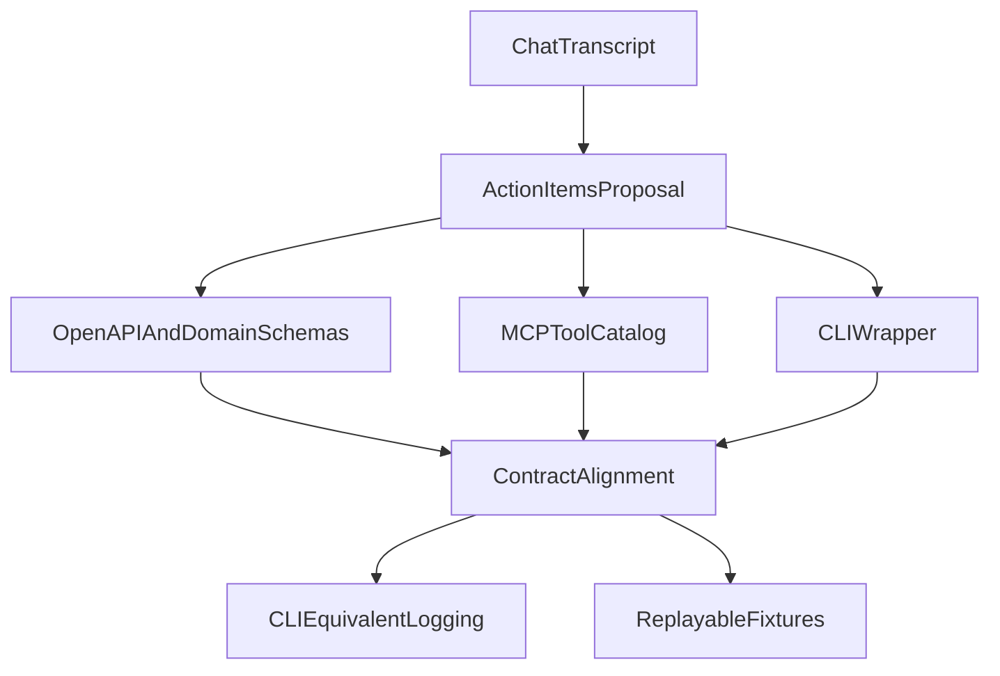

# MCP and CLI action items proposal
## Scope
This proposal captures key action items derived from the MCP vs CLI chat transcript. It documents required codebase changes and documentation updates. It does not implement changes or set release timelines.

## Purpose
Provide a single, actionable reference that links each action item to current codebase state and required changes. This ensures alignment between the contract surface, MCP tooling, and CLI behavior.

## Documentation doctrine
This proposal follows the Neotoma Documentation Doctrine in `docs/conventions/documentation_standards_rules.mdc`.

```
Neotoma is a Truth Layer - not an app, agent, or strategy or execution system.
Core invariants:
- Deterministic: Same input -> same output, always
- Immutable: Truth never changes after storage
- Provenance: Every output traces to source
- Schema-first: All extraction derives from schemas
- Explicit control: User approves all ingestion
- Privacy-maximal: No background data collection
- Graph integrity: No orphans, no cycles, no inferred edges
- Truth-Layer bounded: No strategy, execution, or agent logic
- Event-sourced: All state updates via Domain Events -> Reducers
- Pure Strategy: Strategy Layer has no side effects (State in -> Decisions out)
- Pure Execution: Execution Layer emits Domain Events (Commands in -> Events out)
Layered architecture (example: financial system):
┌───────────────────────────────────────────────┐
│ Execution Layer                               │
│ (Agentic Wallet + Domain Agents)              │
│ Commands -> Side Effects -> Domain Events     │
└────────────▲─────────────────────────────────┘
             │ Reads Only, Receives Commands
┌────────────▼─────────────────────────────────┐
│ Strategy Layer                                │
│ (Agentic Portfolio is example instance)       │
│ State -> Evaluates -> Decisions + Commands    │
└────────────▲─────────────────────────────────┘
             │ Reads Only
┌────────────▼─────────────────────────────────┐
│ Neotoma (Truth Layer)                         │
│ Event-sourced, Reducer-driven                 │
│ Domain Events -> Reducers -> State            │
└───────────────────────────────────────────────┘
Note: Agentic Portfolio is an example instance of Strategy Layer. Agentic Wallet is part of Execution Layer alongside domain agents. Many other agent-driven layers are possible.
This document enforces Truth Layer purity.
```

## Invariants
1. The contract surface remains the single source of truth for tool and CLI behavior.
2. MCP tools MUST be schema bound and deterministic, with no hidden side effects.
3. CLI behavior MUST remain auditable and machine stable when using `--json`.
4. Truth Layer boundaries MUST remain intact. No strategy or execution logic is introduced.
5. Documentation MUST avoid AI generated writing patterns and em dashes.

## Definitions
- **Contract surface**: OpenAPI specification and domain schemas that define operations, inputs, outputs, and error models.
- **MCP tool**: A typed action exposed via Model Context Protocol, defined in the MCP server tool catalog.
- **CLI**: A command line interface that executes contract operations and supports machine stable output.
- **Adapter**: A transport layer implementation that maps the contract surface to MCP or CLI.
- **Action item**: A required change derived from the chat transcript, documented with current state and needed updates.

## Data models and schemas
The proposal references current schema sources and contract definitions:
- **OpenAPI**: `openapi.yaml`
- **MCP tool catalog**: `src/server.ts`
- **MCP specification**: `docs/specs/MCP_SPEC.md`
- **REST schemas**: `src/actions.ts`
- **Domain schemas**: `docs/subsystems/schema_snapshots/`

## Flow and sequence
This proposal focuses on alignment between contract definitions, MCP tooling, and CLI behavior.



## Action items and codebase context

### Contract and architecture
1. Treat OpenAPI and domain schemas as the single core. MCP and CLI are generated or derived adapters.
   - Current state: OpenAPI exists in `openapi.yaml`. Contract mappings are tracked in `src/shared/contract_mappings.ts`. MCP tool definitions live in `src/server.ts` and `docs/specs/MCP_SPEC.md`.
   - Needed change: Define a single contract authority and align MCP and CLI surfaces to it. Use OpenAPI as the canonical source and ensure MCP tool schemas are derived or mirrored.

2. Enforce 1:1 mapping between OpenAPI operations and MCP tools or CLI commands. Allow only a small set of agent native composites.
   - Current state: Mapping registry exists in `src/shared/contract_mappings.ts`. Parity tests validate OpenAPI operation coverage in `tests/contract/contract_mapping.test.ts`.
   - Needed change: Add a mapping policy and a validation checklist to ensure every OpenAPI operation is represented by a tool and CLI command, except approved composites.

3. Log the CLI equivalent invocation for every MCP tool call.
   - Current state: MCP request handling logs CLI equivalents using `buildCliEquivalentInvocation()` in `src/server.ts`.
   - Needed change: Introduce a CLI wrapper or command registry and emit a redaction aware CLI equivalent log at the MCP handler layer.

4. Define a CLI output contract with `--json` and `--pretty`. MCP must never parse human output.
   - Current state: CLI supports `--json` and `--pretty` output modes in `src/cli/index.ts`.
   - Needed change: Ensure CLI only emits machine stable output in `--json` mode and keep `--pretty` for human usage.

5. Require idempotency keys for ingestion and corrections.
   - Current state: Ingestion flows are documented in `docs/subsystems/ingestion/ingestion.md`. MCP actions for ingest and correct are implemented in `src/server.ts`. The schemas in `src/actions.ts` do not show idempotency keys.
   - Needed change: Add idempotency key fields to ingest and correct schemas, then enforce them in service handlers.

6. Enforce a strict, machine checkable error taxonomy.
   - Current state: `handleApiError` in `src/actions.ts` returns `{"error": "message"}`. This is a string error model.
   - Needed change: Introduce structured error envelopes and align them with `docs/subsystems/errors.md`.

7. Maintain replayable fixtures with expected extracted graphs.
   - Current state: Fixtures are consolidated under `tests/fixtures/` with broad coverage documented in `tests/fixtures/README.md`.
   - Needed change: Add expected extracted graphs or snapshots alongside fixtures to support deterministic replay checks.

### CLI and MCP execution rules
1. Treat the CLI as the reference executor. If a change cannot be done via CLI, it is not a real operation.
   - Current state: Execution entrypoints are MCP stdio in `src/index.ts` and HTTP transport in `src/actions.ts`. No dedicated CLI exists.
   - Needed change: Define a CLI module that calls the same service layer as MCP and REST. Use it as the reference executor.

2. Keep MCP tools boring and atomic.
   - Current state: MCP tool definitions are in `src/server.ts`. Test failures in `docs/reports/FAILING_TESTS_SUMMARY.md` show mismatched method names, which indicates some MCP tooling instability.
   - Needed change: Stabilize method names and enforce atomic tool boundaries before adding composite actions.

### Replace web app effort
1. Publish a canonical walkthrough: ingest, normalize, extract, query, replay.
   - Current state: `docs/subsystems/ingestion/ingestion.md` documents the pipeline. `docs/releases/v0.2.0/integration_tests.md` includes step sequences.
   - Needed change: Add a focused walkthrough doc or section that links to ingestion and testing steps.

2. Maintain a fixtures repository with sample documents and expected outputs.
   - Current state: `tests/fixtures/` already provides a consolidated repository of JSON, CSV, and PDF fixtures.
   - Needed change: Document expected outputs in a single place to align with fixtures.

3. Build a failure gallery for determinism breaks and system responses.
   - Current state: Failure analyses are scattered under `docs/reports/`.
   - Needed change: Create a curated index or new report in `docs/reports/` that summarizes determinism failure cases.

## Examples
**CLI equivalent logging**
```
neotoma store --json --source-id src_abc123 --entity-type invoice
```

**Structured error envelope shape**
```
{
  "error_code": "INGESTION_INVALID_SOURCE",
  "message": "Source format is invalid.",
  "trace_id": "trace_abc123"
}
```

## Testing requirements
1. Add unit tests for idempotency key validation on ingest and correct actions.
2. Add MCP tool parity tests that validate 1:1 mapping between OpenAPI operations and MCP tools.
3. Add CLI output contract tests for `--json` and `--pretty`.
4. Add fixture replay tests that compare expected snapshots to actual reducer outputs.
5. Run documentation dependency validation after adding this proposal.

## Open issues and prerequisites
No open issues at this time.

## Agent Instructions
### When to Load This Document
Load this document when planning or evaluating changes to MCP tooling, CLI behavior, or contract alignment.

### Required Co-Loaded Documents
- `docs/NEOTOMA_MANIFEST.md` if present
- `docs/foundation/core_identity.md`
- `docs/architecture/determinism.md`
- `docs/specs/MCP_SPEC.md`
- `docs/subsystems/ingestion/ingestion.md`
- `docs/subsystems/errors.md`
- `docs/testing/fixtures_standard.md`
- `docs/conventions/documentation_standards_rules.mdc`
- `docs/conventions/writing_style_guide.md`

### Constraints Agents Must Enforce
1. Contract surface remains canonical and consistent across MCP and CLI.
2. MCP tools remain deterministic and schema bound.
3. CLI outputs are machine stable when using `--json`.
4. No Truth Layer boundary violations.
5. Documentation uses active voice, short sentences, and no em dashes.

### Forbidden Patterns
- Introducing strategy or execution logic into Truth Layer code.
- Parsing non JSON CLI output in MCP tools.
- Free form string error responses in MCP or REST.
- Adding composite MCP tools without explicit contract justification.
- Omitting provenance or idempotency validation for ingestion.

### Validation Checklist
- [ ] Proposal includes required sections and Agent Instructions.
- [ ] No em dashes or en dashes used.
- [ ] Contract and tool mapping references are accurate.
- [ ] OpenAPI and MCP tool definitions are linked to current code.
- [ ] Action items include current state and needed changes.
- [ ] Documentation dependencies are updated.
