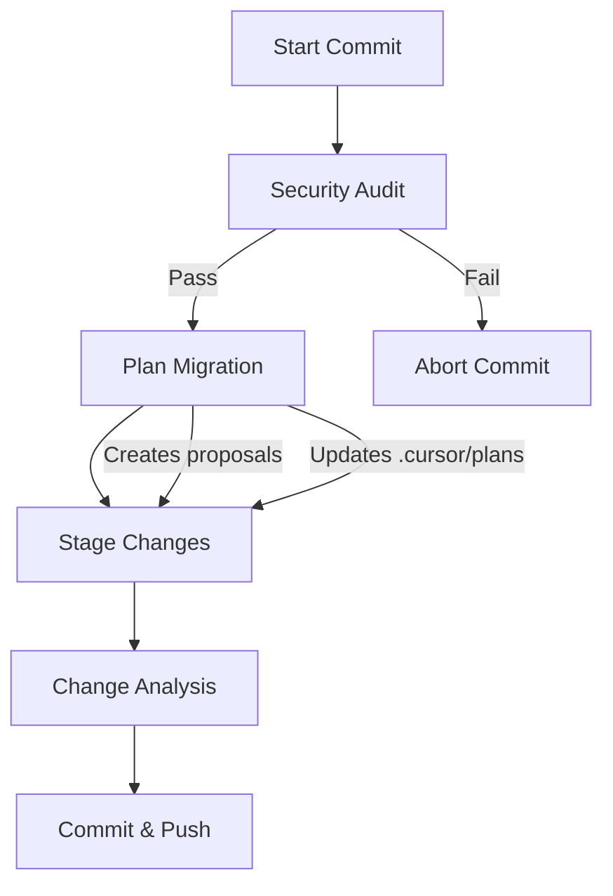

# Plan Migration Command (Integrated with Commit)

## Proposal Context

This proposal was migrated from `.cursor/plans/plan_migration_command_integrated.plan.md` on 2026-01-22.

**Original Status:** 0/9 todos completed (0%)
- Pending: 9
- In Progress: 0
- Completed: 0

**Relevance:** This proposal represents future work that has not been fully implemented.

**Architecture Alignment:** Requires verification against current architecture docs.

---

# Plan Migration Command (Integrated with Commit Workflow)

## Context

The `.cursor/plans/` directory contains many plan files from past work. Some are completed, some are obsolete, and some represent future work that should be preserved as proposals for later consideration. This command automates the review and migration process, and **runs automatically during the `/commit` workflow** so that migrated proposals are included in commits.

## Integration with Commit Workflow

**Location in Commit Workflow:**

The plan migration runs **after security audit passes** and **before staging changes**:



**Why this placement:**
- After security audit: Ensures clean state before creating new files
- Before staging: Migrated proposals are automatically included in the commit
- Non-blocking: If migration fails, commit can still proceed (with warning)

## Command Structure

**Standalone Command:** `.cursor/commands/migrate_plans.md` (for manual use)

**Integrated Workflow:** Added to `.cursor/commands/commit.md` after security audit section

## Purpose

1. **Review all plans** in `.cursor/plans/` directory
2. **Determine relevance** based on completion status and current architecture
3. **Migrate relevant plans** to `docs/proposals/` with modifications
4. **Archive or remove** obsolete plans
5. **Auto-include in commit** - Migrated proposals are staged automatically

## Relevance Criteria

A plan is considered **relevant** if:

1. **Has pending todos** - Not all work is completed
2. **Architecture still applicable** - Plan aligns with current architecture (check against `docs/NEOTOMA_MANIFEST.md` and `docs/architecture/`)
3. **Not superseded** - No newer plan or implementation covers the same work
4. **Future work** - Represents enhancements, optimizations, or features for later consideration

A plan is considered **obsolete** if:

1. **Fully completed** - All todos marked `completed`
2. **Architecture mismatch** - Conflicts with current architecture or has been superseded
3. **Duplicate** - Multiple versions of same plan (keep most recent)

## Implementation Steps

### Step 1: Integration into Commit Workflow

**File:** `.cursor/commands/commit.md`

**Location:** After security audit section (around line 301), before nested repo handling:

```markdown
After security audit passes, proceed with:

**PLAN MIGRATION** (Automatic, runs before staging):

**Configuration:** Enable/disable in `foundation-config.yaml`:
```yaml
development:
  commit:
    migrate_plans: true  # Enable automatic plan migration
```

**If enabled**, automatically review and migrate plans:

1. **Run plan migration:**
   ```bash
   # Execute plan migration logic
   # (See migrate_plans.md for full implementation)
   ```

2. **Stage migrated proposals:**
   ```bash
   # Auto-stage any new proposal files created
   if [ -d "docs/proposals" ]; then
     git add docs/proposals/*.md 2>/dev/null || true
   fi
   ```

3. **Log migration results:**
   - Display summary of plans migrated/archived/removed
   - Include in commit message if proposals were created

4. **Continue with commit workflow** (nested repos, staging, etc.)
```

### Step 2: Plan Migration Logic

**Core Implementation** (can be in script or inline):

```bash
PLANS_DIR=".cursor/plans"
PROPOSALS_DIR="docs/proposals"

# Create proposals directory if it doesn't exist
mkdir -p "$PROPOSALS_DIR"

# Get all plan files
PLAN_FILES=$(find "$PLANS_DIR" -name "*.plan.md" -type f | sort)

MIGRATED_COUNT=0
ARCHIVED_COUNT=0
REMOVED_COUNT=0

for PLAN_FILE in $PLAN_FILES; do
  # Parse plan and determine action
  # (See detailed logic below)
done

# Generate summary
echo "Plan migration complete: $MIGRATED_COUNT migrated, $ARCHIVED_COUNT archived, $REMOVED_COUNT removed"
```

### Step 3: Analyze Each Plan

For each plan file:

1. **Parse frontmatter** to extract:
   - `name` - Plan name
   - `overview` - Brief description
   - `todos` - List of todos with status

2. **Check completion status:**
   ```bash
   PENDING_COUNT=$(grep -c "status: pending" "$PLAN_FILE" || echo "0")
   COMPLETED_COUNT=$(grep -c "status: completed" "$PLAN_FILE" || echo "0")
   TOTAL_COUNT=$((PENDING_COUNT + COMPLETED_COUNT))
   
   if [ "$TOTAL_COUNT" -eq 0 ]; then
     # No todos - treat as unknown status
     STATUS="unknown"
   elif [ "$PENDING_COUNT" -eq 0 ]; then
     # All completed
     STATUS="completed"
   else
     # Has pending work
     STATUS="pending"
   fi
   ```

3. **Check architecture alignment:**
   - Read key sections of plan
   - Compare against current architecture docs
   - Flag if plan references obsolete patterns

4. **Check for duplicates:**
   - Compare plan names/overviews
   - If multiple versions exist, keep most recent

### Step 4: Determine Action

For each plan, classify as:

- **Migrate to proposals** - Relevant future work (has pending todos, architecture aligned)
- **Archive** - Completed but worth preserving (all todos completed, still relevant)
- **Remove** - Obsolete or duplicate (architecture mismatch, superseded, duplicate)

### Step 5: Convert Plan to Proposal Format

When migrating to proposals:

1. **Remove todos section** from frontmatter - Proposals don't need task tracking
2. **Add proposal metadata:**
   ```yaml
   ---
   title: "[Original Plan Name]"
   status: "proposal"
   source_plan: "[original-plan-filename]"
   migrated_date: "[ISO date]"
   priority: "p0|p1|p2|p3" # Extract from plan if present
   estimated_effort: "[if mentioned in plan]"
   ---
   ```

3. **Add proposal context section:**
   ```markdown
   ## Proposal Context
   
   This proposal was migrated from a plan created on [date]. 
   Original plan: `.cursor/plans/[filename]`
   
   **Status:** [Relevant/Partially Complete/Architectural Enhancement]
   **Rationale for Migration:** [Why this is still relevant]
   **Completion Status:** [X/Y todos completed]
   ```

4. **Preserve plan content** - Keep all technical details, architecture diagrams, implementation notes
5. **Update references** - Fix any broken links or update paths
6. **Add implementation notes** - If plan is partially complete, note what's already done

### Step 6: File Naming Convention

Proposal files should use descriptive names:

```
docs/proposals/[kebab-case-description].md
```

Examples:
- `schema-evolution-scaling.md`
- `gdpr-compliance-immutability.md`
- `agent-trust-framework.md`

### Step 7: Auto-Staging in Commit Workflow

After migration completes:

```bash
# Stage any new proposal files
if [ -d "docs/proposals" ]; then
  NEW_PROPOSALS=$(git status --porcelain docs/proposals/*.md 2>/dev/null | grep "^??" | cut -c4-)
  if [ -n "$NEW_PROPOSALS" ]; then
    echo "📝 Staging migrated proposals..."
    git add docs/proposals/*.md
    echo "  Staged: $(echo "$NEW_PROPOSALS" | wc -l) proposal(s)"
  fi
fi

# Stage any updates to .cursor/plans (if plans were archived/removed)
if git status --porcelain .cursor/plans/ | grep -q .; then
  echo "📝 Staging plan updates..."
  git add .cursor/plans/
fi
```

### Step 8: Include in Commit Message

Add to commit message if proposals were created:

```markdown
## Plan Migration

Migrated [N] plans to proposals:
- [plan-name] → docs/proposals/[proposal-name]
- ...

Archived [N] completed plans:
- [plan-name] → docs/proposals/archived/[plan-name]
- ...
```

## Standalone Command

**File:** `.cursor/commands/migrate_plans.md`

For manual execution (outside of commit workflow):

- Same logic as integrated version
- Can be run independently: `/migrate_plans`
- Useful for bulk migration or review without committing

## Proposal Format Template

```markdown
---
title: "[Plan Name]"
status: "proposal"
source_plan: "[original-filename]"
migrated_date: "2026-01-22"
priority: "p1"
estimated_effort: "[if available]"
---

# [Plan Name]

## Proposal Context

This proposal was migrated from `.cursor/plans/[original-filename]` on [date].

**Original Status:** [pending/completed/partial]
**Relevance:** [Why this is still relevant for future consideration]
**Architecture Alignment:** [Verified/Needs Review/Conflicts]
**Completion Status:** [X/Y todos completed at time of migration]

## Overview

[Original overview from plan]

## Technical Details

[Original plan content - architecture, implementation notes, diagrams]

## Implementation Considerations

[Any notes about what's already done, what conflicts exist, what needs updating]

## References

- Original plan: `.cursor/plans/[filename]`
- Related docs: [links to relevant architecture/spec docs]
```

## Edge Cases

1. **Malformed frontmatter** - Skip or attempt to parse manually, log warning
2. **Missing todos** - Treat as "unknown status", require manual review (don't auto-migrate)
3. **Conflicting architecture** - Flag for manual review, don't auto-migrate
4. **Very old plans** - Check modification date, may need special handling
5. **Plans referencing deleted files** - Update or remove broken references
6. **Migration fails during commit** - Log warning but don't block commit (non-critical)

## User Interaction

**During Commit Workflow:**
- **Automatic** - No user interaction required
- **Non-blocking** - If migration fails, commit proceeds with warning
- **Summary in commit message** - Shows what was migrated

**Standalone Command:**
- **Show preview** of what will be migrated before proceeding
- **Ask for confirmation** on ambiguous cases
- **Generate report** showing all actions taken

## Configuration

Add to `foundation-config.yaml`:

```yaml
development:
  commit:
    migrate_plans: true  # Enable automatic plan migration during commit
    migrate_plans_config:
      proposals_dir: "docs/proposals"
      archive_completed: true
      auto_remove_obsolete: false  # Require manual confirmation for removal
      relevance_check:
        check_architecture: true
        check_completion: true
        check_duplicates: true
```

## Testing Strategy

1. **Test integration** - Run `/commit` with plan migration enabled
2. **Verify staging** - Ensure proposals are automatically staged
3. **Verify commit message** - Check that migration summary is included
4. **Test edge cases** - Malformed plans, missing todos, architecture conflicts
5. **Test standalone** - Verify `/migrate_plans` works independently

## Rollback Strategy

- **Non-destructive** - Original plans remain in `.cursor/plans/` until explicitly removed
- **Proposals are additive** - Can be deleted if migration was incorrect
- **Git history** - All changes tracked in commit history