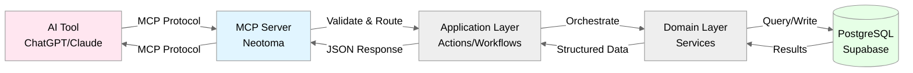

# Neotoma MCP Specification
## Scope
This document covers:
- Complete catalog of MCP actions (20 MVP actions + 4 post-MVP Plaid actions + 2 post-MVP Metrics actions + 3 deprecated actions = 29 total)
- Request/response schemas for each action
- Error envelopes and error codes
- Consistency guarantees per action
- Determinism requirements
- Versioning and backward compatibility
This document does NOT cover:
- MCP protocol details (see MCP SDK docs)
- Implementation internals (see `src/server.ts`)
- Database schema (see `docs/subsystems/schema.md`)
## 1. MCP Architecture in Neotoma

**Key Points:**
- AI tools never access database directly
- All requests validated at MCP layer
- All responses structured and typed
- All errors use ErrorEnvelope
## 2. Complete MCP Action Catalog
### 2.1 Core Ingestion Operations
| Action             | Purpose                                    | Consistency | Deterministic          |
| ------------------ | ------------------------------------------ | ----------- | ---------------------- |
| `ingest`           | Ingest raw file content with interpretation | Strong      | Yes (content-hash based) |
| `submit_payload`   | Submit payload envelope with capability   | Strong      | Yes (given same input) |
| `ingest_structured` | Ingest pre-structured entity data        | Strong      | Yes (given same input) |
**Note:** See section 2.6 for decision guidance on which ingestion action to use. `ingest` is for raw files, `submit_payload` is for structured data with capabilities, and `ingest_structured` is for structured data without capabilities.
### 2.1.1 Legacy Record Operations (Deprecated)
| Action             | Purpose                           | Consistency                                        | Deterministic |
| ------------------ | --------------------------------- | -------------------------------------------------- | ------------- |
| `update_record`    | Update record metadata/properties | Strong                                             | Yes           |
| `retrieve_records` | Query records with filters        | Strong (metadata), Bounded Eventual (search index) | Yes (ranking) |
| `delete_record`    | Remove record                     | Strong                                             | Yes           |
**🚫 FORBIDDEN - DO NOT USE:** These operations are deprecated and **will be removed entirely in v0.6.0**. **Agents MUST NOT use these actions under any circumstances.** They are maintained only for backward compatibility with legacy code. **Using these actions in new code is forbidden.** Use the replacement actions listed below instead.
### 2.2 File Operations
| Action         | Purpose                              | Consistency | Deterministic            |
| -------------- | ------------------------------------ | ----------- | ------------------------ |
| `upload_file`  | Upload file and create/attach record | Strong      | Yes (content-hash based) |
| `get_file_url` | Get signed URL for file access       | Strong      | N/A (URL signing)        |
### 2.3 Integration Operations
| Action                        | Purpose                             | Consistency      | Deterministic         | MVP Status  |
| ----------------------------- | ----------------------------------- | ---------------- | --------------------- | ----------- |
| `list_provider_catalog`       | List available external providers   | Strong           | Yes                   | ✅ MVP      |
| `sync_provider_imports`       | Trigger provider import sync        | Bounded Eventual | Yes (per record)      | ✅ MVP      |
| `plaid_create_link_token`     | Create Plaid OAuth link token       | Strong           | No (Plaid generates)  | ⏳ Post-MVP |
| `plaid_exchange_public_token` | Exchange token and store Plaid item | Strong           | Yes                   | ⏳ Post-MVP |
| `plaid_sync`                  | Sync Plaid transactions             | Bounded Eventual | Yes (per transaction) | ⏳ Post-MVP |
| `plaid_list_items`            | List connected Plaid accounts       | Strong           | Yes                   | ⏳ Post-MVP |
**Note:** Plaid actions (4 total) moved to post-MVP. Plaid serves Tier 3+ ICPs (Cross-Border Solopreneurs, Agentic Portfolio) who need live bank transaction sync, not Tier 1 MVP targets who primarily upload static documents (PDF invoices/receipts/statements).
### 2.4 Metrics and Analytics Operations
| Action                  | Purpose                                                             | Consistency                                   | Deterministic                         | MVP Status  |
| ----------------------- | ------------------------------------------------------------------- | --------------------------------------------- | ------------------------------------- | ----------- |
| `get_technical_metrics` | Query Prometheus technical metrics (latency, errors, system health) | Bounded Eventual (Prometheus scrape interval) | Yes (same query + time → same result) | ⏳ Post-MVP |
| `get_product_analytics` | Query product analytics (activation, retention, usage)              | Bounded Eventual (analytics platform sync)    | Yes (same query + time → same result) | ⏳ Post-MVP |
**Note:** Metrics actions are post-MVP. They enable AI-generated reports on system performance and user behavior. Requires Prometheus and PostHog/Mixpanel integration (Phase 8 observability).
### 2.5 Entity Operations
| Action                    | Purpose                                    | Consistency | Deterministic | MVP Status |
| ------------------------- | ------------------------------------------ | ----------- | ------------- | ---------- |
| `get_entity_snapshot`     | Get entity snapshot with provenance        | Strong      | Yes           | ✅ MVP     |
| `retrieve_entities`       | Query entities with filters                | Strong      | Yes           | ✅ MVP     |
| `get_entity_by_identifier`| Find entity by identifier (name, email)    | Strong      | Yes           | ✅ MVP     |
| `get_related_entities`     | Get entities via relationships (n-hop)    | Strong      | Yes           | ✅ MVP     |
| `get_graph_neighborhood`  | Get complete graph context around node     | Strong      | Yes           | ✅ MVP     |
| `merge_entities`          | Merge duplicate entities                   | Strong      | Yes           | ✅ MVP     |
### 2.6 Observation and Relationship Operations
| Action                 | Purpose                                    | Consistency | Deterministic | MVP Status |
| ---------------------- | ------------------------------------------ | ----------- | ------------- | ---------- |
| `list_observations`    | Query observations for entity              | Strong      | Yes           | ✅ MVP     |
| `get_field_provenance` | Trace field to source documents            | Strong      | Yes           | ✅ MVP     |
| `create_relationship`  | Create typed relationship between entities | Strong      | Yes           | ✅ MVP     |
| `list_relationships`   | Query entity relationships                 | Strong      | Yes           | ✅ MVP     |
| `list_timeline_events` | Query timeline events with filters         | Strong      | Yes           | ✅ MVP     |
**Note:** These actions enable AI agents to work with entities, observations, and snapshots — the core of Neotoma's three-layer truth model. See [`docs/architecture/architectural_decisions.md`](../architecture/architectural_decisions.md) for architectural rationale.
### 2.7 Correction and Reinterpretation Operations
| Action          | Purpose                                    | Consistency | Deterministic | MVP Status |
| --------------- | ------------------------------------------ | ----------- | ------------- | ---------- |
| `correct`       | Create high-priority correction observation | Strong      | Yes           | ✅ MVP     |
| `reinterpret`   | Re-run AI interpretation on existing source | Strong      | Yes           | ✅ MVP     |
**Note:** `correct` creates priority-1000 observations that override AI extraction. `reinterpret` creates new observations without modifying existing ones.
### 2.8 Choosing the Right Ingestion Action

**Use `ingest` when:**
- You have raw file content (PDFs, images, text files) that needs interpretation
- You want AI to extract structured data from unstructured files
- You need content-addressed storage with SHA-256 deduplication
- Files are uploaded as base64-encoded content

**Use `submit_payload` when:**
- You have structured data matching a registered capability (invoice, transaction, receipt, contract, note)
- You want capability-specific entity extraction rules
- You need deterministic deduplication via capability normalization
- Data is already structured and doesn't need AI interpretation

**Available capabilities:** Check via `list_provider_catalog` or see capability registry:
- `neotoma:store_invoice:v1`
- `neotoma:store_transaction:v1`
- `neotoma:store_receipt:v1`
- `neotoma:store_contract:v1`
- `neotoma:store_note:v1`
- Plus codebase capabilities (v0.2.3+): `neotoma:store_feature_unit:v1`, `neotoma:store_release:v1`, `neotoma:store_agent_decision:v1`, `neotoma:store_agent_session:v1`, `neotoma:store_validation_result:v1`, `neotoma:store_codebase_entity:v1`, `neotoma:store_architectural_decision:v1`

**Use `ingest_structured` when:**
- You have structured data but NO matching capability (e.g., contacts, people, companies, custom entities)
- You want to bypass capability-specific processing
- You have pre-extracted entity data ready to store
- Data doesn't need AI interpretation and doesn't match any capability

**Decision Workflow:**
1. **Is it raw file content?** → Use `ingest` (creates source → interpretation → observations)
2. **Is it structured data with a capability?** → Check capabilities via `list_provider_catalog`
3. **If capability exists** → Use `submit_payload` with `capability_id`
4. **If no capability** → Use `ingest_structured` with `entities` array
5. **Do not create new capability IDs** — use `ingest_structured` for unsupported data types

## 3. Action Specifications
### 3.1 `ingest`
**Purpose:** Ingest raw file content with optional AI interpretation. Content-addressed storage with SHA-256 deduplication per user. Creates sources → interpretation runs → observations → entities.

**Request Schema:**
```typescript
{
  user_id: string;                    // Required: User ID (UUID)
  file_content: string;               // Required: Base64-encoded file content
  mime_type: string;                  // Required: MIME type (e.g., "application/pdf", "image/jpeg")
  original_filename?: string;          // Optional: Original filename
  interpret?: boolean;                 // Optional: Run AI interpretation (default: true)
  interpretation_config?: {            // Optional: Interpretation configuration
    provider?: string;
    model_id?: string;
    temperature?: number;
    prompt_hash?: string;
    code_version?: string;
  };
}
```

**Response Schema:**
```typescript
{
  source_id: string;                   // UUID of created source
  content_hash: string;                // SHA-256 hash of content
  file_size: number;                    // File size in bytes
  deduplicated: boolean;                // Whether content was already stored
  interpretation?: {                    // Present if interpret=true and quota allows
    run_id: string;                    // UUID of interpretation run
    entities_created: number;          // Number of entities created
    observations_created: number;       // Number of observations created
  } | null;
}
```

**Errors:**
| Code | HTTP | Meaning | Retry? |
|------|------|---------|--------|
| `VALIDATION_ERROR` | 400 | Invalid file content or MIME type | No |
| `QUOTA_EXCEEDED` | 429 | Interpretation quota exceeded | No |
| `FILE_TOO_LARGE` | 400 | File exceeds size limit | No |
| `DB_INSERT_FAILED` | 500 | Database write failed | Yes |

**When to Use:**
- Uploading PDFs, images, or text files that need AI interpretation
- Storing raw content with content-addressed deduplication
- Files that need OCR, text extraction, or schema detection

**Consistency:** Strong (source immediately queryable, observations created synchronously if interpret=true)
**Determinism:** Yes (same file content → same content_hash → same source_id)

### 3.2 `submit_payload`
**Purpose:** Submit a payload envelope for compilation into payloads and observations. Agents submit `capability_id` + `body` + `provenance`; server handles schema reasoning, deduplication, and entity extraction.

**Before Using This Action:**
1. Check available capabilities via `list_provider_catalog` or review the capability list in section 2.8
2. If your data type matches a capability → use `submit_payload` with that `capability_id`
3. If no matching capability exists → use `ingest_structured` instead (do not create new capability IDs)

**Request Schema:**
```typescript
{
  capability_id: string;           // Required: Versioned capability (e.g., "neotoma:store_invoice:v1")
  body: Record<string, unknown>;   // Required: Payload data
  provenance: {
    source_refs: string[];         // Required: Immediate source payload IDs (not full chain)
    extracted_at: string;          // Required: ISO 8601 timestamp
    extractor_version: string;     // Required: Extractor version (e.g., "neotoma-mcp:v0.2.1")
    agent_id?: string;             // Optional: Agent identifier
  };
  client_request_id?: string;      // Optional: Retry correlation ID
}
```
**Response Schema:**
```typescript
{
  payload_id: string; // UUID of created/found payload
  payload_content_id: string; // Hash-based content ID (for deduplication)
  payload_submission_id: string; // UUIDv7 submission ID (time-ordered)
  created: boolean; // true if new payload, false if duplicate
  message: string; // Human-readable status message
}
```
**Errors:**
| Code | HTTP | Meaning | Retry? |
|------|------|---------|--------|
| `VALIDATION_ERROR` | 400 | Invalid payload envelope schema | No |
| `UNKNOWN_CAPABILITY` | 400 | Capability ID not found | No |
| `DB_INSERT_FAILED` | 500 | Database write failed | Yes |
**Error Resolution:**
- `UNKNOWN_CAPABILITY`: Check available capabilities via `list_provider_catalog`. If no matching capability exists, use `ingest_structured` instead of creating new capability IDs.
**Capability Validation:**
- `capability_id` MUST be a valid capability (e.g., `"neotoma:store_invoice:v1"`)
- Available capabilities: `neotoma:store_invoice:v1`, `neotoma:store_transaction:v1`, `neotoma:store_receipt:v1`, `neotoma:store_contract:v1`, `neotoma:store_note:v1`
- See [`docs/architecture/payload_model.md`](../architecture/payload_model.md) for capability details
**Example:**
```json
// Request
{
  "capability_id": "neotoma:store_invoice:v1",
  "body": {
    "invoice_number": "INV-001",
    "amount": 1500.00,
    "vendor_name": "Acme Corp",
    "customer_name": "Test Customer",
    "date": "2025-01-15"
  },
  "provenance": {
    "source_refs": [],
    "extracted_at": "2025-01-15T10:30:00Z",
    "extractor_version": "neotoma-mcp:v0.2.1",
    "agent_id": "claude-3-opus"
  }
}
// Response
{
  "payload_id": "550e8400-e29b-41d4-a716-446655440000",
  "payload_content_id": "payload_a1b2c3d4e5f6g7h8i9j0k1l2",
  "payload_submission_id": "sub_01234567-89ab-cdef-0123-456789abcdef",
  "created": true,
  "message": "Payload created and observations extracted"
}
```
**Deduplication:**
- Same payload content (after normalization) → same `payload_content_id`
- Duplicate submissions return existing payload with `created: false`
- Normalization includes: field selection, string normalization, array sorting
**Entity Extraction:**
- All payloads extract at least one entity (the payload itself)
- Additional entities extracted per capability rules (field_value, array_items)
- Observations created automatically with `source_payload_id` reference
**Consistency:** Strong (payload immediately queryable, observations created synchronously)
**Determinism:** Yes (same payload content → same `payload_content_id`; deterministic entity extraction)
### 3.3 `ingest_structured`
**Purpose:** Ingest pre-structured entity data with schema validation. Use this for data types that don't have a registered capability (e.g., contacts, people, companies, custom entities). For data with capabilities (invoices, transactions, receipts, contracts, notes), use `submit_payload` instead.

**Request Schema:**
```typescript
{
  user_id: string;                    // Required: User ID (UUID)
  entities: Array<Record<string, unknown>>; // Required: Array of entity data objects
  source_priority?: number;           // Optional: Source priority (default: 100)
}
```

**Response Schema:**
```typescript
{
  source_id: string;                   // UUID of created source
  interpretation: {
    run_id: string;                    // UUID of interpretation run
    entities_created: number;          // Number of entities created
    observations_created: number;       // Number of observations created
  };
}
```

**Errors:**
| Code | HTTP | Meaning | Retry? |
|------|------|---------|--------|
| `VALIDATION_ERROR` | 400 | Invalid entity schema or missing required fields | No |
| `DB_INSERT_FAILED` | 500 | Database write failed | Yes |

**Entity Data Format:**
Each entity in the `entities` array should include:
- `entity_type`: string (e.g., "person", "company", "contact")
- Entity properties as key-value pairs
- Optional metadata fields

**Example:**
```json
// Request
{
  "user_id": "550e8400-e29b-41d4-a716-446655440000",
  "entities": [
    {
      "entity_type": "person",
      "name": "John Doe",
      "email": "john@example.com",
      "phone": "+1-555-0123"
    },
    {
      "entity_type": "company",
      "name": "Acme Corp",
      "domain": "acme.com"
    }
  ],
  "source_priority": 100
}
// Response
{
  "source_id": "660e8400-e29b-41d4-a716-446655440001",
  "interpretation": {
    "run_id": "770e8400-e29b-41d4-a716-446655440002",
    "entities_created": 2,
    "observations_created": 2
  }
}
```

**When to Use:**
- Storing contacts, people, companies, or other entities without registered capabilities
- Importing structured data from external sources (e.g., Parquet, CSV, APIs)
- Agent-created structured data that doesn't match existing capability schemas

**Consistency:** Strong (entities immediately queryable, observations created synchronously)
**Determinism:** Yes (same entity data → same entity IDs via entity resolution)
### 3.4 `update_record` (FORBIDDEN - Will Be Removed in v0.6.0)
**🚫 FORBIDDEN - DO NOT USE:** This action is deprecated and **will be removed entirely in v0.6.0**. **Agents MUST NOT use this action.** It is maintained only for backward compatibility with legacy code. **Using this action in new code is strictly forbidden.**

**Replacement:** Use `submit_payload` with updated data instead, or use `correct` action for corrections.
**Purpose:** Update existing record's properties or metadata.
**Purpose:** Update existing record's properties or metadata.
**Request Schema:**
```typescript
{
  id: string;                      // Required: Record UUID
  type?: string;                   // Optional: Update type
  properties?: Record<string, any>; // Optional: Properties to merge
  file_urls?: string[];            // Optional: Update file URLs
  embedding?: number[];            // Optional: Update embedding
}
```
**Response Schema:**
```typescript
{
  id: string;
  type: string;
  properties: Record<string, any>; // Merged with existing
  file_urls: string[];
  created_at: string;
  updated_at: string;              // Updated timestamp
}
```
**Errors:**
| Code | HTTP | Meaning | Retry? |
|------|------|---------|--------|
| `RECORD_NOT_FOUND` | 404 | Record ID doesn't exist | No |
| `VALIDATION_ERROR` | 400 | Invalid update data | No |
| `DB_UPDATE_FAILED` | 500 | Database write failed | Yes |
**Consistency:** Strong
**Determinism:** Yes (same update → same result)
### 3.5 `retrieve_records` (FORBIDDEN - Will Be Removed in v0.6.0)
**🚫 FORBIDDEN - DO NOT USE:** This action is deprecated and **will be removed entirely in v0.6.0**. **Agents MUST NOT use this action.** It is maintained only for backward compatibility with legacy code. **Using this action in new code is strictly forbidden.**

**Replacement:** Use entity-based operations (`retrieve_entities`, `get_entity_snapshot`, `list_observations`) instead.
**Purpose:** Query records with filters, search, and semantic matching.
**Purpose:** Query records with filters, search, and semantic matching.
**Request Schema:**
```typescript
{
  type?: string;                   // Optional: Filter by record type
  properties?: Record<string, any>; // Optional: Filter by property values
  limit?: number;                  // Optional: Max results (default: 10)
  search?: string[];               // Optional: Search terms
  search_mode?: 'semantic' | 'keyword' | 'both'; // Default: 'both'
  similarity_threshold?: number;   // Optional: Min similarity (0-1, default: 0.7)
  query_embedding?: number[];      // Optional: Pre-computed query embedding
}
```
**Response Schema:**
```typescript
{
  records: Array<{
    id: string;
    type: string;
    properties: Record<string, any>;
    file_urls: string[];
    similarity?: number; // If semantic search used
    created_at: string;
    updated_at: string;
  }>;
  total: number; // Total matching records (before limit)
}
```
**Errors:**
| Code | HTTP | Meaning | Retry? |
|------|------|---------|--------|
| `VALIDATION_ERROR` | 400 | Invalid query | No |
| `SEARCH_FAILED` | 500 | Search execution failed | Yes |
**Consistency:**
- Metadata: Strong
- Search index: Bounded Eventual (max 5s delay)
- Embeddings: Bounded Eventual (max 10s delay)
**Determinism:** Yes (same query + same DB state → same order)
### 3.6 `delete_record` (FORBIDDEN - Will Be Removed in v0.6.0)
**🚫 FORBIDDEN - DO NOT USE:** This action is deprecated and **will be removed entirely in v0.6.0**. **Agents MUST NOT use this action.** It is maintained only for backward compatibility with legacy code. **Using this action in new code is strictly forbidden.**

**Replacement:** Payloads are immutable in the new architecture; use entity-based operations for data management. There is no direct equivalent for deletion - use entity merge or correction patterns instead.
**Purpose:** Delete a record and its associated files.
**Purpose:** Delete a record and its associated files.
**Request Schema:**
```typescript
{
  id: string; // Required: Record UUID to delete
}
```
**Response Schema:**
```typescript
{
  success: boolean;
  deleted_id: string;
}
```
**Errors:**
| Code | HTTP | Meaning | Retry? |
|------|------|---------|--------|
| `RECORD_NOT_FOUND` | 404 | Record doesn't exist | No |
| `DB_DELETE_FAILED` | 500 | Deletion failed | Yes |
**Consistency:** Strong (record immediately gone)
**Determinism:** Yes
### 3.7 `upload_file`
**Purpose:** Upload file from local path, optionally create analyzed record.
**Request Schema:**
```typescript
{
  file_path: string;               // Required: Local file path
  record_id?: string;              // Optional: Attach to existing record
  bucket?: string;                 // Optional: Storage bucket (default: 'files')
  properties?: string;             // Optional: JSON properties (skips analysis)
}
```
**Response Schema:**
```typescript
{
  record?: {                       // Present if new record created
    id: string;
    type: string;
    properties: Record<string, any>;
    file_urls: string[];
    created_at: string;
  };
  file_url: string;                // Storage URL
  file_size: number;               // Bytes
  content_type: string;
}
```
**Errors:**
| Code | HTTP | Meaning | Retry? |
|------|------|---------|--------|
| `FILE_NOT_FOUND` | 404 | Local file doesn't exist | No |
| `FILE_TOO_LARGE` | 400 | File exceeds 50MB | No |
| `UNSUPPORTED_FILE_TYPE` | 400 | File type not supported | No |
| `UPLOAD_FAILED` | 500 | Storage upload failed | Yes |
| `ANALYSIS_FAILED` | 500 | File analysis failed | Partial (file uploaded, analysis failed) |
**Consistency:** Strong (file + record)
**Determinism:** Yes (content-hash prevents duplicates)
### 3.8 `get_file_url`
**Purpose:** Get signed URL for accessing stored file.
**Request Schema:**
```typescript
{
  file_path: string;               // Required: File path in storage
  expires_in?: number;             // Optional: URL expiry seconds (default: 3600)
}
```
**Response Schema:**
```typescript
{
  signed_url: string; // Time-limited access URL
  expires_at: string; // ISO 8601 expiration timestamp
}
```
**Errors:**
| Code | HTTP | Meaning | Retry? |
|------|------|---------|--------|
| `FILE_NOT_FOUND` | 404 | File doesn't exist in storage | No |
| `SIGNING_FAILED` | 500 | URL signing failed | Yes |
**Consistency:** Strong
**Determinism:** No (signed URL contains timestamp)
### 3.9 `get_entity_snapshot`
**Purpose:** Get entity snapshot with provenance. Returns current truth for entity computed by reducer from observations.
**Three-Layer Model Context:** This action returns the **Snapshot** layer — the deterministic output of the reducer engine that merges multiple **Observations** (extracted from **Payloads**) about an **Entity**. The snapshot represents the current truth, with every field traceable to its source observation and payload.
**Use Cases:**
- Get current state of an entity (company, person, invoice)
- **Historical state (primary):** Get entity state at any point in time by filtering observations up to a timestamp and recomputing snapshot—enables understanding how entities evolved as new observations arrived
- Trace which documents contributed to current truth
- Understand how multiple sources were merged over time
- See how entity properties changed across multiple documents (e.g., company address updates, person role changes)
**Request Schema:**
```typescript
{
  entity_id: string; // Required: Entity ID (hash-based)
  at?: string; // Optional: ISO 8601 timestamp to get historical snapshot state
}
```
**Historical State (Primary Use Case):**
Entity historical state inspection is more important than record historical state because:
- **Entities are the primary unit of truth** — agents query and reason about entities, not individual records
- **Entities evolve over time** — they merge information from multiple documents as new observations arrive
- **Understanding entity evolution is core to reasoning** — seeing how a company's address changed or a person's role evolved across time
To get historical entity state:
1. Filter observations up to a timestamp using `list_observations` with `observed_at <= timestamp`
2. Recompute the snapshot from those observations using the reducer
3. This shows what the entity truth was at that point in time
**Future Enhancement:** Add optional `at` parameter to `get_entity_snapshot` to directly return historical entity state, mirroring `getRecordAtTimestamp` but prioritizing entities as the primary historical inspection target.
**Response Schema:**
```typescript
{
  entity_id: string;
  entity_type: string;
  schema_version: string;
  snapshot: Record<string, any>; // Current truth
  provenance: Record<string, string>; // Maps field → observation_id
  computed_at: string; // ISO 8601
  observation_count: number;
  last_observation_at: string; // ISO 8601
}
```
**Errors:**
| Code               | HTTP | Meaning                  | Retry? |
| ------------------ | ---- | ------------------------ | ------ |
| `ENTITY_NOT_FOUND` | 404  | Entity ID doesn't exist  | No     |
| `VALIDATION_ERROR` | 400  | Invalid entity_id format | No     |
**Example:**
```json
// Request
{
  "entity_id": "ent_abc123def456"
}
// Response
{
  "entity_id": "ent_abc123def456",
  "entity_type": "company",
  "schema_version": "1.0",
  "snapshot": {
    "name": "Acme Corp",
    "address": "123 Main St",
    "tax_id": "12-3456789"
  },
  "provenance": {
    "name": "obs_xyz789",
    "address": "obs_xyz789",
    "tax_id": "obs_xyz789"
  },
  "computed_at": "2024-01-15T10:35:00Z",
  "observation_count": 2,
  "last_observation_at": "2024-01-15T10:30:00Z"
}
```
**Consistency:** Strong
**Determinism:** Yes (same entity_id → same snapshot)
**Related Documents:**
- [`docs/architecture/architectural_decisions.md`](../architecture/architectural_decisions.md) — Four-layer truth model
- [`docs/subsystems/observation_architecture.md`](../subsystems/observation_architecture.md) — Observation architecture
- [`docs/subsystems/reducer.md`](../subsystems/reducer.md) — Reducer patterns and merge strategies
- [`docs/subsystems/schema_registry.md`](../subsystems/schema_registry.md) — Schema registry merge policies
### 3.10 `list_observations`
**Purpose:** Query observations for entity. Returns all observations that contributed to entity snapshot.
**Four-Layer Model Context:** This action returns the **Observation** layer — granular, source-specific facts extracted from **Documents** about an **Entity**. Each observation represents what one document said about the entity at a specific point in time. The reducer merges these observations into a snapshot using merge policies from schema registry.
**Use Cases:**
- See all facts extracted about an entity from different documents
- Understand how entity truth evolved over time
- Debug conflicts between multiple sources
- Audit which documents contributed specific facts
**Request Schema:**
```typescript
{
  entity_id: string; // Required: Entity ID
  limit?: number; // Optional: Max results (default: 100)
  offset?: number; // Optional: Pagination offset (default: 0)
}
```
**Response Schema:**
```typescript
{
  observations: Array<{
    id: string;
    entity_id: string;
    entity_type: string;
    schema_version: string;
    source_record_id: string;
    observed_at: string; // ISO 8601
    specificity_score: number;
    source_priority: number;
    fields: Record<string, any>;
    created_at: string; // ISO 8601
  }>;
  total: number;
  limit: number;
  offset: number;
}
```
**Errors:**
| Code               | HTTP | Meaning                  | Retry? |
| ------------------ | ---- | ------------------------ | ------ |
| `ENTITY_NOT_FOUND` | 404  | Entity ID doesn't exist  | No     |
| `VALIDATION_ERROR` | 400  | Invalid entity_id format | No     |
**Consistency:** Strong
**Determinism:** Yes (same entity_id → same observations, sorted by observed_at DESC)
### 3.11 `get_field_provenance`
**Purpose:** Trace field to source documents. Returns full provenance chain: snapshot field → observation → document → file.
**Four-Layer Model Context:** This action traverses the complete four-layer truth model:
1. **Snapshot** field (current truth) →
2. **Observation** (which observation contributed this value) →
3. **Document** (which record/document contained the observation) →
4. **File** (original source file)
This enables full explainability: for any fact in the system, you can trace it back to the exact source document and understand why it was selected (via specificity_score and source_priority).
**Use Cases:**
- Answer "where did this value come from?"
- Audit trail for compliance
- Debug incorrect entity data
- Understand reducer merge decisions
**Request Schema:**
```typescript
{
  entity_id: string; // Required: Entity ID
  field: string; // Required: Field name
}
```
**Response Schema:**
```typescript
{
  field: string;
  value: any; // Current field value from snapshot
  source_observation: {
    id: string;
    source_record_id: string;
    observed_at: string; // ISO 8601
    specificity_score: number;
    source_priority: number;
  };
  source_record: {
    id: string;
    type: string;
    file_urls: string[];
    created_at: string; // ISO 8601
  };
  observed_at: string; // ISO 8601
}
```
**Errors:**
| Code               | HTTP | Meaning                    | Retry? |
| ------------------ | ---- | -------------------------- | ------ |
| `ENTITY_NOT_FOUND` | 404  | Entity ID doesn't exist    | No     |
| `FIELD_NOT_FOUND`  | 404  | Field not in snapshot      | No     |
| `VALIDATION_ERROR` | 400  | Invalid entity_id or field | No     |
**Consistency:** Strong
**Determinism:** Yes (same entity_id + field → same provenance)
### 3.12 `retrieve_entities`
**Purpose:** Query entities with filters (type, pagination). Returns entities with their snapshots. This is the replacement for `retrieve_records` in the new architecture.

**Request Schema:**
```typescript
{
  entity_type?: string;              // Optional: Filter by entity type (e.g., 'company', 'person')
  user_id?: string;                   // Optional: Filter by user ID (UUID)
  limit?: number;                     // Optional: Max results (default: 100)
  offset?: number;                    // Optional: Pagination offset (default: 0)
  include_snapshots?: boolean;        // Optional: Include entity snapshots (default: true)
  include_merged?: boolean;           // Optional: Include merged entities (default: false)
}
```

**Response Schema:**
```typescript
{
  entities: Array<{
    id: string;
    entity_type: string;
    canonical_name: string;
    snapshot?: Record<string, any>;   // Present if include_snapshots=true
    observation_count: number;
    last_observation_at: string;
  }>;
  total: number;
  excluded_merged: boolean;
}
```

**Errors:**
| Code | HTTP | Meaning | Retry? |
|------|------|---------|--------|
| `VALIDATION_ERROR` | 400 | Invalid query parameters | No |
| `DB_QUERY_FAILED` | 500 | Database query failed | Yes |

**Consistency:** Strong
**Determinism:** Yes (same query + DB state → same results)
### 3.13 `get_entity_by_identifier`
**Purpose:** Find entity by identifier (name, email, tax_id, etc.) across entity types or specific type. Identifier is normalized before search.

**Request Schema:**
```typescript
{
  identifier: string;                 // Required: Identifier to search for (name, email, tax_id, etc.)
  entity_type?: string;               // Optional: Limit search to specific entity type
}
```

**Response Schema:**
```typescript
{
  entities: Array<{
    id: string;
    entity_type: string;
    canonical_name: string;
    snapshot?: Record<string, any>;
  }>;
  total: number;
}
```

**Errors:**
| Code | HTTP | Meaning | Retry? |
|------|------|---------|--------|
| `VALIDATION_ERROR` | 400 | Invalid identifier | No |
| `DB_QUERY_FAILED` | 500 | Database query failed | Yes |

**Consistency:** Strong
**Determinism:** Yes (same identifier → same results after normalization)
### 3.14 `get_related_entities`
**Purpose:** Get entities connected to a given entity via relationships. Supports n-hop traversal to find entities multiple relationship hops away.

**Request Schema:**
```typescript
{
  entity_id: string;                  // Required: Starting entity ID
  relationship_types?: string[];      // Optional: Filter by relationship types
  direction?: 'inbound' | 'outbound' | 'both'; // Optional: Direction (default: 'both')
  max_hops?: number;                   // Optional: Maximum hops (default: 1)
  include_entities?: boolean;         // Optional: Include full entity snapshots (default: true)
}
```

**Response Schema:**
```typescript
{
  entities: Array<{
    id: string;
    entity_type: string;
    canonical_name: string;
    snapshot?: Record<string, any>;
  }>;
  relationships: Array<{
    id: string;
    relationship_type: string;
    source_entity_id: string;
    target_entity_id: string;
  }>;
  total_entities: number;
  total_relationships: number;
  hops_traversed: number;
}
```

**Errors:**
| Code | HTTP | Meaning | Retry? |
|------|------|---------|--------|
| `ENTITY_NOT_FOUND` | 404 | Starting entity doesn't exist | No |
| `VALIDATION_ERROR` | 400 | Invalid entity_id or parameters | No |

**Consistency:** Strong
**Determinism:** Yes (same entity_id + parameters → same results)
### 3.15 `get_graph_neighborhood`
**Purpose:** Get complete graph neighborhood around a node (entity or record): related entities, relationships, records, and events. Provides full context for a given node.

**Request Schema:**
```typescript
{
  node_id: string;                     // Required: Node ID (entity_id or record_id)
  node_type?: 'entity' | 'record';    // Optional: Type of node (default: 'entity')
  include_relationships?: boolean;      // Optional: Include relationships (default: true)
  include_records?: boolean;           // Optional: Include related records (default: true)
  include_events?: boolean;           // Optional: Include timeline events (default: true)
  include_observations?: boolean;     // Optional: Include observations (default: false)
}
```

**Response Schema:**
```typescript
{
  node_id: string;
  node_type: 'entity' | 'record';
  entity?: Entity;                    // Present if node_type='entity'
  entity_snapshot?: Record<string, any>; // Present if node_type='entity'
  record?: Record;                    // Present if node_type='record'
  relationships?: Array<Relationship>;
  related_entities?: Array<Entity>;
  related_records?: Array<Record>;
  timeline_events?: Array<TimelineEvent>;
  observations?: Array<Observation>;
}
```

**Errors:**
| Code | HTTP | Meaning | Retry? |
|------|------|---------|--------|
| `ENTITY_NOT_FOUND` | 404 | Entity doesn't exist | No |
| `RECORD_NOT_FOUND` | 404 | Record doesn't exist | No |
| `VALIDATION_ERROR` | 400 | Invalid node_id or node_type | No |

**Consistency:** Strong
**Determinism:** Yes (same node_id + parameters → same neighborhood)
### 3.16 `list_timeline_events`
**Purpose:** Query timeline events with filters (type, date range, source record). Returns chronological events.

**Request Schema:**
```typescript
{
  event_type?: string;                 // Optional: Filter by event type (e.g., 'InvoiceIssued')
  after_date?: string;                 // Optional: Filter events after this date (ISO 8601)
  before_date?: string;                 // Optional: Filter events before this date (ISO 8601)
  source_record_id?: string;           // Optional: Filter by source record ID
  limit?: number;                       // Optional: Max results (default: 100)
  offset?: number;                     // Optional: Pagination offset (default: 0)
}
```

**Response Schema:**
```typescript
{
  events: Array<{
    id: string;
    event_type: string;
    event_timestamp: string;          // ISO 8601
    source_record_id: string;
    entity_ids: string[];
    properties: Record<string, any>;
  }>;
  total: number;
}
```

**Errors:**
| Code | HTTP | Meaning | Retry? |
|------|------|---------|--------|
| `VALIDATION_ERROR` | 400 | Invalid query parameters | No |
| `DB_QUERY_FAILED` | 500 | Database query failed | Yes |

**Consistency:** Strong
**Determinism:** Yes (same query + DB state → same events, sorted by timestamp DESC)
### 3.17 `correct`
**Purpose:** Create high-priority correction observation to override AI-extracted fields. Corrections always win in snapshot computation (priority 1000).

**Request Schema:**
```typescript
{
  user_id: string;                     // Required: User ID (UUID)
  entity_id: string;                  // Required: Entity ID to correct
  entity_type: string;                 // Required: Entity type
  field: string;                       // Required: Field name to correct
  value: unknown;                       // Required: Corrected value
}
```

**Response Schema:**
```typescript
{
  observation_id: string;
  entity_id: string;
  field: string;
  value: unknown;
  message: string;
}
```

**Errors:**
| Code | HTTP | Meaning | Retry? |
|------|------|---------|--------|
| `ENTITY_NOT_FOUND` | 404 | Entity doesn't exist or not owned by user | No |
| `VALIDATION_ERROR` | 400 | Invalid field or value | No |
| `DB_INSERT_FAILED` | 500 | Failed to create correction | Yes |

**Consistency:** Strong (correction immediately affects snapshot)
**Determinism:** Yes (same correction → same observation)
### 3.18 `reinterpret`
**Purpose:** Re-run AI interpretation on an existing source with new config. Creates new observations without modifying existing ones.

**Request Schema:**
```typescript
{
  source_id: string;                   // Required: Source ID (UUID) to reinterpret
  interpretation_config: {            // Required: Interpretation configuration
    provider?: string;
    model_id?: string;
    temperature?: number;
    prompt_hash?: string;
    code_version?: string;
    feature_flags?: Record<string, boolean>;
  };
}
```

**Response Schema:**
```typescript
{
  run_id: string;                      // UUID of new interpretation run
  entities_created: number;
  observations_created: number;
  source_id: string;
}
```

**Errors:**
| Code | HTTP | Meaning | Retry? |
|------|------|---------|--------|
| `SOURCE_NOT_FOUND` | 404 | Source doesn't exist | No |
| `QUOTA_EXCEEDED` | 429 | Interpretation quota exceeded | No |
| `DB_INSERT_FAILED` | 500 | Failed to create interpretation | Yes |

**Consistency:** Strong (new observations immediately queryable)
**Determinism:** Yes (same source + config → same interpretation result)
### 3.19 `merge_entities`
**Purpose:** Merge duplicate entities. Rewrites observations from source entity to target entity and marks source as merged.

**Request Schema:**
```typescript
{
  user_id: string;                     // Required: User ID (UUID)
  from_entity_id: string;             // Required: Source entity ID to merge from
  to_entity_id: string;               // Required: Target entity ID to merge into
  merge_reason?: string;               // Optional: Reason for merge
}
```

**Response Schema:**
```typescript
{
  from_entity_id: string;
  to_entity_id: string;
  observations_moved: number;
  merged_at: string;                   // ISO 8601
  merge_reason?: string;
}
```

**Errors:**
| Code | HTTP | Meaning | Retry? |
|------|------|---------|--------|
| `ENTITY_NOT_FOUND` | 404 | One or both entities don't exist or not owned by user | No |
| `ENTITY_ALREADY_MERGED` | 400 | Source entity is already merged | No |
| `DB_UPDATE_FAILED` | 500 | Failed to merge entities | Yes |

**Consistency:** Strong (merge immediately visible)
**Determinism:** Yes (same merge → same result)
### 3.20 `create_relationship`
**Purpose:** Create typed relationship between entities.
**Request Schema:**
```typescript
{
  relationship_type: 'PART_OF' | 'CORRECTS' | 'REFERS_TO' | 'SETTLES' | 'DUPLICATE_OF' | 'DEPENDS_ON' | 'SUPERSEDES'; // Required
  source_entity_id: string; // Required: Source entity ID
  target_entity_id: string; // Required: Target entity ID
  metadata?: Record<string, any>; // Optional: Relationship-specific metadata
}
```
**Response Schema:**
```typescript
{
  id: string; // UUID
  relationship_type: string;
  source_entity_id: string;
  target_entity_id: string;
  metadata?: Record<string, any>;
  created_at: string; // ISO 8601
}
```
**Errors:**
| Code                        | HTTP | Meaning                               | Retry? |
| --------------------------- | ---- | ------------------------------------- | ------ |
| `ENTITY_NOT_FOUND`          | 404  | Source or target entity doesn't exist | No     |
| `INVALID_RELATIONSHIP_TYPE` | 400  | Invalid relationship type             | No     |
| `CYCLE_DETECTED`            | 400  | Relationship would create cycle       | No     |
| `VALIDATION_ERROR`          | 400  | Invalid entity IDs                    | No     |
**Consistency:** Strong
**Determinism:** Yes (same inputs → same relationship ID)
**Related Documents:**
- [`docs/subsystems/relationships.md`](../subsystems/relationships.md) — Relationship patterns
### 3.21 `list_relationships`
**Purpose:** Query entity relationships. Returns all relationships for entity (inbound, outbound, or both).
**Request Schema:**
```typescript
{
  entity_id: string; // Required: Entity ID
  direction?: 'inbound' | 'outbound' | 'both'; // Optional: Default 'both'
  relationship_type?: string; // Optional: Filter by type
  limit?: number; // Optional: Max results (default: 100)
  offset?: number; // Optional: Pagination offset (default: 0)
}
```
**Response Schema:**
```typescript
{
  relationships: Array<{
    id: string;
    relationship_type: string;
    source_entity_id: string;
    target_entity_id: string;
    metadata?: Record<string, any>;
    created_at: string; // ISO 8601
  }>;
  total: number;
  limit: number;
  offset: number;
}
```
**Errors:**
| Code               | HTTP | Meaning                        | Retry? |
| ------------------ | ---- | ------------------------------ | ------ |
| `ENTITY_NOT_FOUND` | 404  | Entity ID doesn't exist        | No     |
| `VALIDATION_ERROR` | 400  | Invalid entity_id or direction | No     |
**Consistency:** Strong
**Determinism:** Yes (same entity_id + filters → same relationships, sorted by created_at DESC)
### 3.22 `plaid_create_link_token`
**Purpose:** Create Plaid Link token for OAuth flow.
**Request Schema:**
```typescript
{
  user_id?: string;                // Optional: User identifier
  client_name?: string;            // Optional: Display name
  access_token?: string;           // Optional: For update mode
  products?: string[];             // Optional: Override products
  redirect_uri?: string;           // Optional: OAuth redirect
}
```
**Response Schema:**
```typescript
{
  link_token: string; // Plaid Link token (short-lived)
  expiration: string; // ISO 8601
}
```
**Errors:**
| Code | HTTP | Meaning | Retry? |
|------|------|---------|--------|
| `PLAID_NOT_CONFIGURED` | 503 | Plaid credentials missing | No |
| `PLAID_API_ERROR` | 500 | Plaid API call failed | Yes |
**Consistency:** Strong
**Determinism:** No (Plaid generates token)
### 3.23 `plaid_exchange_public_token`
**Purpose:** Exchange Plaid public token for permanent access token, store item.
**Request Schema:**
```typescript
{
  public_token: string;            // Required: From Plaid Link
  trigger_initial_sync?: boolean;  // Optional: Run sync immediately (default: false)
}
```
**Response Schema:**
```typescript
{
  plaid_item: {
    id: string;                    // Internal UUID
    item_id: string;               // Plaid item_id
    institution_name: string;
    accounts: Array<{
      id: string;
      name: string;
      type: string;
      subtype: string;
    }>;
  };
  sync_summary?: {                 // Present if trigger_initial_sync=true
    added: number;
    modified: number;
    removed: number;
  };
}
```
**Errors:**
| Code | HTTP | Meaning | Retry? |
|------|------|---------|--------|
| `PLAID_INVALID_TOKEN` | 400 | Public token invalid/expired | No |
| `PLAID_API_ERROR` | 500 | Plaid API error | Yes |
| `DB_INSERT_FAILED` | 500 | Failed to store item | Yes |
**Consistency:** Strong
**Determinism:** Yes (same public_token → same item_id)
### 3.24 `plaid_sync`
**Purpose:** Sync transactions from Plaid for stored item(s).
**Request Schema:**
```typescript
{
  plaid_item_id?: string;          // Optional: Internal UUID
  item_id?: string;                // Optional: Plaid item_id
  sync_all?: boolean;              // Optional: Sync all items (default: false)
  force_full_sync?: boolean;       // Optional: Ignore cursor (default: false)
}
```
**Response Schema:**
```typescript
{
  syncs: Array<{
    plaid_item_id: string;
    item_id: string;
    status: "success" | "failed";
    summary: {
      added: number; // New transactions
      modified: number; // Updated transactions
      removed: number; // Deleted transactions
    };
    next_cursor: string; // For incremental sync
    error?: string;
  }>;
  total_synced_items: number;
}
```
**Errors:**
| Code | HTTP | Meaning | Retry? |
|------|------|---------|--------|
| `PLAID_ITEM_NOT_FOUND` | 404 | Item not in database | No |
| `PLAID_API_ERROR` | 500 | Plaid API error | Yes |
| `SYNC_FAILED` | 500 | Sync operation failed | Yes |
**Consistency:** Bounded Eventual (transactions indexed asynchronously)
**Determinism:** Yes (same transaction data → same record)
### 3.25 `plaid_list_items`
**Purpose:** List connected Plaid items (without access tokens).
**Request Schema:**
```typescript
{
  plaid_item_id?: string;          // Optional: Filter by internal UUID
  item_id?: string;                // Optional: Filter by Plaid item_id
}
```
**Response Schema:**
```typescript
{
  items: Array<{
    id: string; // Internal UUID
    item_id: string; // Plaid item_id
    institution_id: string;
    institution_name: string;
    products: string[]; // ['transactions', 'auth', ...]
    last_successful_sync: string; // ISO 8601 or null
    status: string; // 'active', 'error', 'revoked'
  }>;
}
```
**Errors:**
| Code | HTTP | Meaning | Retry? |
|------|------|---------|--------|
| `DB_QUERY_FAILED` | 500 | Database query failed | Yes |
**Consistency:** Strong
**Determinism:** Yes
### 3.26 `list_provider_catalog`
**Purpose:** List available external data providers (X, Instagram, Gmail, etc.).
**Request Schema:**
```typescript
{
  // No parameters
}
```
**Response Schema:**
```typescript
{
  providers: Array<{
    id: string; // Provider identifier (e.g., 'x', 'instagram')
    name: string; // Display name
    description: string;
    capabilities: string[]; // ['posts', 'likes', 'bookmarks', ...]
    auth_type: "oauth" | "api_key" | "credentials";
    oauth_scopes?: string[]; // If OAuth
    popularity_score: number; // 0-100
    status: "available" | "beta" | "coming_soon";
  }>;
}
```
**Errors:**
None (static catalog)
**Consistency:** Strong
**Determinism:** Yes
### 3.27 `sync_provider_imports`
**Purpose:** Trigger import sync for external provider.
**Request Schema:**
```typescript
{
  provider: string;                // Required: Provider ID (e.g., 'x', 'instagram')
  connector_id?: string;           // Optional: Specific connector UUID
  sync_type?: 'initial' | 'incremental'; // Optional: Sync strategy
  limit?: number;                  // Optional: Max records per page
  max_pages?: number;              // Optional: Max pages to fetch
}
```
**Response Schema:**
```typescript
{
  sync_run_id: string;             // UUID of sync operation
  provider: string;
  status: 'pending' | 'running' | 'completed' | 'failed';
  stats: {
    records_added: number;
    records_updated: number;
    errors: number;
  };
  started_at: string;
  completed_at?: string;
}
```
**Errors:**
| Code | HTTP | Meaning | Retry? |
|------|------|---------|--------|
| `PROVIDER_NOT_FOUND` | 404 | Provider ID invalid | No |
### 3.28 `get_technical_metrics`
**Purpose:** Query technical/operational metrics from Prometheus for AI-generated performance reports.
**Request Schema:**
```typescript
{
  metric_name: string;                // Required: Metric name (e.g., 'neotoma_record_upload_duration_ms')
  time_range?: {                      // Optional: Time window (default: last 1 hour)
    start: string;                    // ISO 8601 timestamp
    end: string;                      // ISO 8601 timestamp
  };
  aggregation?: 'avg' | 'p50' | 'p95' | 'p99' | 'sum' | 'count' | 'max' | 'min'; // Default: 'avg'
  labels?: Record<string, string>;   // Optional: Filter by metric labels (e.g., {status: 'success'})
  step?: string;                      // Optional: Query resolution step (e.g., '1m', '5m', '1h')
}
```
**Response Schema:**
```typescript
{
  metric_name: string;
  values: Array<{
    timestamp: string;                // ISO 8601
    value: number;                   // Aggregated metric value
  }>;
  aggregation: string;
  time_range: {
    start: string;
    end: string;
  };
  metadata?: {
    unit?: string;                    // e.g., 'ms', 'bytes', 'count'
    description?: string;             // Metric description
  };
}
```
**Errors:**
| Code | HTTP | Meaning | Retry? |
|------|------|---------|--------|
| `VALIDATION_ERROR` | 400 | Invalid metric name or time range | No |
| `METRIC_NOT_FOUND` | 404 | Metric name doesn't exist | No |
| `PROMETHEUS_QUERY_FAILED` | 500 | Prometheus query execution failed | Yes |
| `METRICS_SERVICE_UNAVAILABLE` | 503 | Prometheus unavailable | Yes |
**Example:**
```json
// Request
{
  "metric_name": "neotoma_record_upload_duration_ms",
  "time_range": {
    "start": "2024-01-15T00:00:00Z",
    "end": "2024-01-15T23:59:59Z"
  },
  "aggregation": "p95",
  "step": "1h"
}
// Response
{
  "metric_name": "neotoma_record_upload_duration_ms",
  "values": [
    {"timestamp": "2024-01-15T00:00:00Z", "value": 3200},
    {"timestamp": "2024-01-15T01:00:00Z", "value": 3100},
    {"timestamp": "2024-01-15T02:00:00Z", "value": 2900}
  ],
  "aggregation": "p95",
  "time_range": {
    "start": "2024-01-15T00:00:00Z",
    "end": "2024-01-15T23:59:59Z"
  },
  "metadata": {
    "unit": "ms",
    "description": "Record upload duration in milliseconds"
  }
}
```
**Consistency:** Bounded Eventual (Prometheus scrape interval, typically 15-30 seconds)
**Determinism:** Yes (same metric name + time range + aggregation → same result)
**Available Metrics:**
- `neotoma_record_upload_duration_ms` (histogram)
- `neotoma_record_upload_total` (counter, labels: status)
- `neotoma_search_duration_ms` (histogram)
- `neotoma_extraction_errors_total` (counter, labels: error_code)
- `neotoma_mcp_error_rate` (gauge)
- `neotoma_graph_orphan_nodes_total` (gauge)
- `neotoma_db_connection_pool_usage` (gauge)
- See `docs/specs/METRICS_REQUIREMENTS.md` for complete list
### 3.29 `get_product_analytics`
**Purpose:** Query product analytics from PostHog/Mixpanel for AI-generated user behavior reports.
**Request Schema:**
```typescript
{
  metric_type: 'activation' | 'retention' | 'usage' | 'funnel' | 'cohort'; // Required
  metric_name?: string;              // Optional: Specific metric (e.g., 'activation_first_upload_rate')
  time_range?: {                     // Optional: Time window (default: last 30 days)
    start: string;                   // ISO 8601 timestamp
    end: string;                     // ISO 8601 timestamp
  };
  cohort?: string;                   // Optional: User cohort identifier
  filters?: Record<string, any>;     // Optional: Additional filters (platform-specific)
}
```
**Response Schema:**
```typescript
{
  metric_type: string;
  metric_name?: string;
  value: number | Array<{          // Single value or time series
    date: string;                   // ISO 8601 date
    value: number;
  }>;
  time_range: {
    start: string;
    end: string;
  };
  metadata?: {
    description?: string;
    threshold?: {                   // Target threshold from METRICS_REQUIREMENTS.md
      required?: number;
      target?: number;
    };
  };
}
```
**Errors:**
| Code | HTTP | Meaning | Retry? |
|------|------|---------|--------|
| `VALIDATION_ERROR` | 400 | Invalid metric type or time range | No |
| `METRIC_NOT_FOUND` | 404 | Metric name doesn't exist | No |
| `ANALYTICS_QUERY_FAILED` | 500 | Analytics platform query failed | Yes |
| `ANALYTICS_SERVICE_UNAVAILABLE` | 503 | PostHog/Mixpanel unavailable | Yes |
**Example:**
```json
// Request - Activation rate
{
  "metric_type": "activation",
  "metric_name": "activation_first_upload_rate",
  "time_range": {
    "start": "2024-01-01T00:00:00Z",
    "end": "2024-01-31T23:59:59Z"
  }
}
// Response
{
  "metric_type": "activation",
  "metric_name": "activation_first_upload_rate",
  "value": 0.65,
  "time_range": {
    "start": "2024-01-01T00:00:00Z",
    "end": "2024-01-31T23:59:59Z"
  },
  "metadata": {
    "description": "Percentage of users who upload ≥1 file in first session",
    "threshold": {
      "required": 0.60,
      "target": 0.80
    }
  }
}
// Request - Retention time series
{
  "metric_type": "retention",
  "metric_name": "day_1_retention",
  "time_range": {
    "start": "2024-01-01T00:00:00Z",
    "end": "2024-01-31T23:59:59Z"
  }
}
// Response
{
  "metric_type": "retention",
  "metric_name": "day_1_retention",
  "value": [
    {"date": "2024-01-01", "value": 0.42},
    {"date": "2024-01-08", "value": 0.45},
    {"date": "2024-01-15", "value": 0.48}
  ],
  "time_range": {
    "start": "2024-01-01T00:00:00Z",
    "end": "2024-01-31T23:59:59Z"
  },
  "metadata": {
    "description": "Percentage of users returning on day 2",
    "threshold": {
      "required": 0.40,
      "target": 0.60
    }
  }
}
```
**Consistency:** Bounded Eventual (analytics platform sync interval, typically 1-5 minutes)
**Determinism:** Yes (same metric + time range → same result)
**Available Metrics:**
- **Activation:** `activation_first_upload_rate`, `activation_first_extraction_rate`, `activation_first_entity_rate`, `activation_first_event_rate`, `activation_first_search_rate`, `activation_first_ai_query_rate`
- **Retention:** `day_1_retention`, `week_1_retention`, `month_1_retention`
- **Usage:** `daily_active_users`, `weekly_active_users`, `avg_uploads_per_user_per_week`, `avg_searches_per_user_per_week`
- **Funnels:** signup → upload → extraction → entity → timeline
- See `docs/specs/METRICS_REQUIREMENTS.md` for complete list
| `CONNECTOR_NOT_FOUND` | 404 | Connector not connected | No |
| `SYNC_FAILED` | 500 | Sync operation failed | Yes |
**Consistency:** Bounded Eventual (records indexed asynchronously)
**Determinism:** Yes (per imported record)
## 4. Error Envelope Standard
All MCP actions return errors using this structure:
```typescript
interface MCPErrorEnvelope {
  error: {
    code: string; // Error code (see section 5)
    message: string; // Human-readable description
    details?: Record<string, any>; // Additional context (no PII)
    trace_id?: string; // Distributed tracing ID
  };
}
```
**Example:**
```json
{
  "error": {
    "code": "FILE_TOO_LARGE",
    "message": "File exceeds 50MB limit",
    "details": {
      "file_size_bytes": 52428800,
      "max_size_bytes": 52428800
    },
    "trace_id": "trace_abc123"
  }
}
```
## 5. Canonical Error Codes
### 5.1 Validation Errors (4xx)
| Code                    | HTTP | Meaning                   |
| ----------------------- | ---- | ------------------------- |
| `VALIDATION_ERROR`      | 400  | Invalid input schema      |
| `RECORD_NOT_FOUND`      | 404  | Record ID doesn't exist   |
| `FILE_NOT_FOUND`        | 404  | File doesn't exist        |
| `FILE_TOO_LARGE`        | 400  | File exceeds size limit   |
| `UNSUPPORTED_FILE_TYPE` | 400  | File type not supported   |
| `PLAID_INVALID_TOKEN`   | 400  | Plaid token invalid       |
| `PROVIDER_NOT_FOUND`    | 404  | Provider ID invalid       |
| `METRIC_NOT_FOUND`      | 404  | Metric name doesn't exist |
### 5.2 Server Errors (5xx)
| Code                      | HTTP | Meaning                           |
| ------------------------- | ---- | --------------------------------- |
| `DB_INSERT_FAILED`        | 500  | Database insert failed            |
| `DB_UPDATE_FAILED`        | 500  | Database update failed            |
| `DB_DELETE_FAILED`        | 500  | Database delete failed            |
| `DB_QUERY_FAILED`         | 500  | Database query failed             |
| `UPLOAD_FAILED`           | 500  | File upload failed                |
| `ANALYSIS_FAILED`         | 500  | File analysis failed              |
| `PLAID_API_ERROR`         | 500  | Plaid API error                   |
| `SYNC_FAILED`             | 500  | Import sync failed                |
| `PROMETHEUS_QUERY_FAILED` | 500  | Prometheus query execution failed |
| `ANALYTICS_QUERY_FAILED`  | 500  | Analytics platform query failed   |
| `PROMETHEUS_QUERY_FAILED` | 500  | Prometheus query execution failed |
| `ANALYTICS_QUERY_FAILED`  | 500  | Analytics platform query failed   |
### 5.3 Service Unavailable (503)
| Code                            | HTTP | Meaning                      |
| ------------------------------- | ---- | ---------------------------- |
| `PLAID_NOT_CONFIGURED`          | 503  | Plaid credentials missing    |
| `METRICS_SERVICE_UNAVAILABLE`   | 503  | Prometheus unavailable       |
| `ANALYTICS_SERVICE_UNAVAILABLE` | 503  | PostHog/Mixpanel unavailable |
| `SERVICE_UNAVAILABLE`           | 503  | Temporary service outage     |
## 6. Consistency Guarantees
### 6.1 Strong Consistency Actions
**Immediate read-after-write:**
- `store_record` → record queryable immediately
- `update_record` → changes visible immediately
- `delete_record` → record gone immediately
- `plaid_exchange_public_token` → item queryable immediately
**Guarantee:** After action returns success, subsequent queries reflect the change.
### 6.2 Bounded Eventual Actions
**Delayed visibility (max delay documented):**
- `retrieve_records` with search: Max 5s index delay
- `upload_file` with analysis: Max 5s for search index
- `plaid_sync`: Max 5s for transaction search
- `sync_provider_imports`: Max 5s for record search
- `get_technical_metrics`: Max 30s (Prometheus scrape interval)
- `get_product_analytics`: Max 5min (analytics platform sync)
**Guarantee:** After max delay, all changes visible.
**Client Behavior:** AI should wait or inform user of potential staleness.
## 7. Determinism Guarantees
### 7.1 Deterministic Actions
**Same input → same output (modulo timestamps/IDs):**
- `store_record` — Same properties → same structure
- `retrieve_records` — Same query + DB state → same order
- `plaid_sync` — Same transaction data → same records
- `sync_provider_imports` — Same source data → same records
- `get_technical_metrics` — Same metric + time range → same values
- `get_product_analytics` — Same metric + time range → same values
**Testing:**
```typescript
test("retrieve_records returns deterministic order", async () => {
  const results1 = await mcpClient.call("retrieve_records", {
    type: "transaction",
  });
  const results2 = await mcpClient.call("retrieve_records", {
    type: "transaction",
  });
  expect(results1.records.map((r) => r.id)).toEqual(
    results2.records.map((r) => r.id)
  );
});
```
### 7.2 Non-Deterministic Actions (Documented)
**Acceptable nondeterminism:**
- `plaid_create_link_token` — Plaid generates token (different each time)
- `get_file_url` — Signed URL contains timestamp
**Reason:** External service generates values.
## 8. Versioning and Backward Compatibility
### 8.1 Action Versioning
**Current Version:** `1.0.0`
**Versioning Strategy:**
- Major version bump: Breaking changes (required param added, response schema changed)
- Minor version bump: Additive changes (optional param added)
- Patch version bump: Bug fixes, error code additions
### 8.2 Backward Compatibility Rules
**MUST:**
- New optional parameters only
- Response schema additive (new fields OK, removing fields forbidden)
- Error codes additive (new codes OK, removing codes forbidden)
**MUST NOT:**
- Remove required parameters
- Change parameter types
- Remove response fields
- Change response field types
## 9. Rate Limiting and Quotas
### 9.1 Rate Limits (MVP)
| Action                  | Limit   | Window   | Notes          |
| ----------------------- | ------- | -------- | -------------- |
| `store_record`          | 100/min | Per user | Create records |
| `retrieve_records`      | 300/min | Per user | Query records  |
| `upload_file`           | 10/min  | Per user | File upload    |
| `plaid_sync`            | 5/min   | Per user | Plaid sync     |
| `sync_provider_imports` | 5/min   | Per user | Provider sync  |
**Exceeding Limit:**
```json
{
  "error": {
    "code": "RATE_LIMIT_EXCEEDED",
    "message": "Rate limit exceeded. Retry after 60 seconds.",
    "details": {
      "retry_after_seconds": 60
    }
  }
}
```
## 10. Testing MCP Actions
### 10.1 Unit Tests (Action Logic)
```typescript
describe("MCP Actions", () => {
  test("store_record validates input", async () => {
    await expect(
      mcpServer.storeRecord({ type: "", properties: {} })
    ).rejects.toThrow("VALIDATION_ERROR");
  });
  test("retrieve_records returns deterministic order", async () => {
    // Insert test records
    await insertTestRecords();
    const result1 = await mcpServer.retrieveRecords({ type: "transaction" });
    const result2 = await mcpServer.retrieveRecords({ type: "transaction" });
    expect(result1.records).toEqual(result2.records);
  });
});
```
### 10.2 Integration Tests (with Real DB)
```typescript
test("store and retrieve record", async () => {
  const stored = await mcpClient.call("store_record", {
    type: "transaction",
    properties: { amount: 100 },
  });
  const retrieved = await mcpClient.call("retrieve_records", {
    type: "transaction",
  });
  expect(retrieved.records).toContainEqual(
    expect.objectContaining({ id: stored.id })
  );
});
```
### 10.3 E2E Tests (via MCP Client)
```typescript
test("upload_file creates analyzed record", async () => {
  const result = await mcpClient.call("upload_file", {
    file_path: "fixtures/sample_invoice.pdf",
  });
  expect(result.record).toBeDefined();
  expect(result.record.type).toBe("FinancialRecord");
  expect(result.record.properties.invoice_number).toBeDefined();
});
```
## Detailed Documentation References
For implementation details, see:
- [`src/server.ts`](../../src/server.ts) — MCP action implementations
- [`docs/NEOTOMA_MANIFEST.md`](../NEOTOMA_MANIFEST.md) — Section 17: MCP rules
- [`docs/subsystems/errors.md`](../subsystems/errors.md) — Error codes and envelopes
- [`docs/architecture/consistency.md`](../architecture/consistency.md) — Consistency tiers
- [`docs/architecture/determinism.md`](../architecture/determinism.md) — Determinism requirements
## Agent Instructions
### When to Load This Document
Load when:
- Implementing new MCP actions
- Modifying existing MCP action signatures
- Understanding MCP contracts for AI tool integration
- Debugging MCP call failures
- Planning MCP-based features
### Required Co-Loaded Documents
- `docs/NEOTOMA_MANIFEST.md` (MCP rules and boundaries)
- `docs/subsystems/errors.md` (error codes)
- `docs/architecture/consistency.md` (consistency guarantees)
- `docs/architecture/determinism.md` (deterministic requirements)
### Constraints Agents Must Enforce
1. **🚫 FORBIDDEN: Agents MUST NOT use deprecated actions (`update_record`, `retrieve_records`, `delete_record`) - These will be removed in v0.6.0 and using them is strictly prohibited**
2. All actions MUST validate inputs (Zod schemas)
3. All responses MUST use structured types (no free-form text)
4. All errors MUST use ErrorEnvelope
5. All actions MUST document consistency tier
6. All deterministic actions MUST be testable for determinism
7. Backward compatibility MUST be maintained
8. No PII in error messages or logs
### Forbidden Patterns
- Returning unvalidated data
- Bypassing error envelope
- Breaking backward compatibility
- Nondeterministic ranking without documentation
- PII in error details
- Unbounded queries (no limit parameter)
- **🚫 FORBIDDEN: Using deprecated actions (`update_record`, `retrieve_records`, `delete_record`) - These actions are strictly prohibited and will be removed in v0.6.0** (see Deprecated Actions section below)

### Deprecated Actions (FORBIDDEN - DO NOT USE)

**🚫 FORBIDDEN - STRICTLY PROHIBITED:** The following actions are deprecated and **will be removed entirely in v0.6.0**. **Agents MUST NOT use these actions under any circumstances.** They are maintained only for backward compatibility with legacy code. **Using these actions in new code is strictly forbidden and will cause code to break in v0.6.0.**

**Deprecated Actions:**
- `update_record` → Use `submit_payload` with updated data, or `correct` for corrections
- `retrieve_records` → Use `retrieve_entities`, `get_entity_snapshot`, or `list_observations`
- `delete_record` → No direct equivalent (observations are immutable in new architecture)

**Migration Guide:**
- **Storing data:** Use `submit_payload` (for capability-based data) or `ingest_structured` (for non-capability data)
- **Querying data:** Use `retrieve_entities` or `get_entity_snapshot` instead of `retrieve_records`
- **Updating data:** Use `correct` action for corrections, or create new observations with higher priority
- **Deleting data:** Observations are immutable; use entity merge or correction patterns instead

**Why These Are Deprecated:**
- Neotoma is migrating to a sources-first architecture (sources → interpretation → observations → entities)
- The legacy `records` table and record-based APIs are being removed in v0.6.0
- New architecture provides better provenance, multi-user support, and deterministic entity resolution

**See:** [`docs/releases/v0.6.0/release_plan.md`](../releases/v0.6.0/release_plan.md) for complete migration details.

### Validation Checklist
- [ ] All 29 actions documented with complete schemas (20 MVP + 4 Plaid + 2 Metrics + 3 deprecated)
- [ ] All error codes enumerated (including METRIC_NOT_FOUND, PROMETHEUS_QUERY_FAILED, ANALYTICS_QUERY_FAILED)
- [ ] Consistency tier specified per action
- [ ] Determinism documented per action
- [ ] Backward compatibility rules followed
- [ ] Rate limits specified
- [ ] Testing strategy defined
- [ ] No PII in examples or error messages
