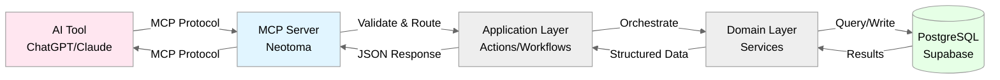

# Neotoma MCP Specification

**Authoritative Vocabulary:** [`docs/vocabulary/canonical_terms.md`](../vocabulary/canonical_terms.md)

## Purpose

This document defines the complete specification for Neotoma's Model Context Protocol (MCP) actions. It provides authoritative schemas, error handling, consistency guarantees, and determinism requirements for all MCP actions that AI agents use to interact with Neotoma's Truth Layer.

## Scope

This document covers:
- Complete catalog of MCP actions (18 MVP actions)
- Request/response schemas for each action
- Error envelopes and error codes
- Consistency guarantees per action
- Determinism requirements
- Versioning and backward compatibility

This document does NOT cover:
- MCP protocol details (see MCP SDK docs)
- Implementation internals (see `src/server.ts`)
- Database schema (see `docs/subsystems/schema.md`)

## 1. MCP Architecture in Neotoma



**Key Points:**
- AI tools never access database directly
- All requests validated at MCP layer
- All responses structured and typed
- All errors use ErrorEnvelope

## 2. Complete MCP Action Catalog

### 2.1 Core [Storing](../vocabulary/canonical_terms.md#storing) Operations

| Action             | Purpose                                    | Consistency | Deterministic          |
| ------------------ | ------------------------------------------ | ----------- | ---------------------- |
| `ingest`           | **Unified** [storing](../vocabulary/canonical_terms.md#storing) for all [source material](../vocabulary/canonical_terms.md#source-material) (unstructured and structured) | Strong      | Yes (content-hash based) |

**Note:** `ingest` is the single unified action for all [source material](../vocabulary/canonical_terms.md#source-material). It accepts either:
- Unstructured: `{file_content, mime_type}` for files that need [interpretation](../vocabulary/canonical_terms.md#interpretation)
- Structured: `{entities: [{entity_type, ...}]}` for pre-structured data

### 2.2 File Operations

| Action         | Purpose                              | Consistency | Deterministic            |
| -------------- | ------------------------------------ | ----------- | ------------------------ |
| `upload_file`  | Upload file and create [source material](../vocabulary/canonical_terms.md#source-material) | Strong      | Yes (content-hash based) |
| `get_file_url` | Get signed URL for file access       | Strong      | N/A (URL signing)        |

### 2.3 [Entity](../vocabulary/canonical_terms.md#entity) Operations ([Retrieving](../vocabulary/canonical_terms.md#retrieving))

| Action                    | Purpose                                    | Consistency | Deterministic | MVP Status |
| ------------------------- | ------------------------------------------ | ----------- | ------------- | ---------- |
| `get_entity_snapshot`     | [Retrieve](../vocabulary/canonical_terms.md#retrieving) [entity](../vocabulary/canonical_terms.md#entity) [entity snapshot](../vocabulary/canonical_terms.md#entity-snapshot) with [provenance](../vocabulary/canonical_terms.md#provenance)        | Strong      | Yes           | MVP     |
| `retrieve_entities`       | [Retrieve](../vocabulary/canonical_terms.md#retrieving) [entities](../vocabulary/canonical_terms.md#entity) with filters                | Strong      | Yes           | MVP     |
| `get_entity_by_identifier`| [Retrieve](../vocabulary/canonical_terms.md#retrieving) [entity](../vocabulary/canonical_terms.md#entity) by identifier (name, email)    | Strong      | Yes           | MVP     |
| `get_related_entities`     | [Retrieve](../vocabulary/canonical_terms.md#retrieving) [entities](../vocabulary/canonical_terms.md#entity) via [relationships](../vocabulary/canonical_terms.md#relationship) (n-hop)    | Strong      | Yes           | MVP     |
| `get_graph_neighborhood`  | [Retrieve](../vocabulary/canonical_terms.md#retrieving) complete graph context around node     | Strong      | Yes           | MVP     |
| `merge_entities`          | Merge duplicate [entities](../vocabulary/canonical_terms.md#entity)                   | Strong      | Yes           | MVP     |

### 2.4 [Observation](../vocabulary/canonical_terms.md#observation) and [Relationship](../vocabulary/canonical_terms.md#relationship) Operations ([Retrieving](../vocabulary/canonical_terms.md#retrieving))

| Action                 | Purpose                                    | Consistency | Deterministic | MVP Status |
| ---------------------- | ------------------------------------------ | ----------- | ------------- | ---------- |
| `list_observations`    | [Retrieve](../vocabulary/canonical_terms.md#retrieving) [observations](../vocabulary/canonical_terms.md#observation) for [entity](../vocabulary/canonical_terms.md#entity)              | Strong      | Yes           | MVP     |
| `get_field_provenance` | [Retrieve](../vocabulary/canonical_terms.md#retrieving) field [provenance](../vocabulary/canonical_terms.md#provenance) chain to [source material](../vocabulary/canonical_terms.md#source-material)            | Strong      | Yes           | MVP     |
| `create_relationship`  | Create typed [relationship](../vocabulary/canonical_terms.md#relationship) between [entities](../vocabulary/canonical_terms.md#entity) | Strong      | Yes           | MVP     |
| `list_relationships`   | [Retrieve](../vocabulary/canonical_terms.md#retrieving) [entity](../vocabulary/canonical_terms.md#entity) [relationships](../vocabulary/canonical_terms.md#relationship)                 | Strong      | Yes           | MVP     |
| `list_timeline_events` | [Retrieve](../vocabulary/canonical_terms.md#retrieving) timeline [events](../vocabulary/canonical_terms.md#event) with filters         | Strong      | Yes           | MVP     |

**Note:** These actions enable AI agents to work with [entities](../vocabulary/canonical_terms.md#entity), [observations](../vocabulary/canonical_terms.md#observation), and [entity snapshots](../vocabulary/canonical_terms.md#entity-snapshot), the core of Neotoma's three-layer truth model. See [`docs/architecture/architectural_decisions.md`](../architecture/architectural_decisions.md) for architectural rationale.

### 2.5 Correction and Re-[interpretation](../vocabulary/canonical_terms.md#interpretation) Operations

| Action          | Purpose                                    | Consistency | Deterministic | MVP Status |
| --------------- | ------------------------------------------ | ----------- | ------------- | ---------- |
| `correct`       | Create high-priority correction [observation](../vocabulary/canonical_terms.md#observation) | Strong      | Yes           | MVP     |
| `reinterpret`   | Re-run AI [interpretation](../vocabulary/canonical_terms.md#interpretation) on existing [source material](../vocabulary/canonical_terms.md#source-material) | Strong      | Yes           | MVP     |

**Note:** `correct` creates priority-1000 [observations](../vocabulary/canonical_terms.md#observation) that override AI [extraction](../vocabulary/canonical_terms.md#extraction). `reinterpret` creates new [observations](../vocabulary/canonical_terms.md#observation) without modifying existing ones.

### 2.6 Using the Unified `ingest` Action

The unified `ingest` action handles all [source material](../vocabulary/canonical_terms.md#source-material) types:

**For Unstructured [Source Material](../vocabulary/canonical_terms.md#source-material) (Files):**
```typescript
{
  user_id: string;                    // Required: User ID (UUID)
  file_content: string;               // Required: Base64-encoded file content
  mime_type: string;                  // Required: MIME type (e.g., "application/pdf")
  original_filename?: string;         // Optional: Original filename
  interpret?: boolean;                // Optional: Run interpretation (default: true)
  interpretation_config?: { ... };    // Optional: Interpretation configuration
}
```
Flow: [Store](../vocabulary/canonical_terms.md#storing) [source material](../vocabulary/canonical_terms.md#source-material) → [Interpretation](../vocabulary/canonical_terms.md#interpretation) → Structured [source material](../vocabulary/canonical_terms.md#source-material) → [Entity schema](../vocabulary/canonical_terms.md#entity-schema) processing → [Observations](../vocabulary/canonical_terms.md#observation)

**For Structured [Source Material](../vocabulary/canonical_terms.md#source-material) (Agent Data):**
```typescript
{
  user_id: string;                    // Required: User ID (UUID)
  entities: Array<{                   // Required: Array of entity data
    entity_type: string;              // Required: Entity type (e.g., "invoice", "note")
    // ... entity-specific fields
  }>;
  provenance?: { ... };               // Optional: Provenance metadata
}
```
Flow: [Store](../vocabulary/canonical_terms.md#storing) [source material](../vocabulary/canonical_terms.md#source-material) → [Entity schema](../vocabulary/canonical_terms.md#entity-schema) processing → [Observations](../vocabulary/canonical_terms.md#observation)

**Decision Logic:**
1. **Raw file content?** → Use `ingest` with `file_content` and `mime_type`
2. **Structured data?** → Use `ingest` with `entities` array containing `entity_type`

**[Entity Types](../vocabulary/canonical_terms.md#entity-type) Available:**
- `invoice`, `transaction`, `receipt`, `contract`, `note`
- `person`, `company`, `contact`, `task`
- Plus codebase types (v0.2.3+): `feature_unit`, `release`, `agent_decision`, `agent_session`, `validation_result`, `codebase_entity`, `architectural_decision`

## 3. Action Specifications

### 3.1 `ingest` (Unified)

**Purpose:** Unified [storing](../vocabulary/canonical_terms.md#storing) for all [source material](../vocabulary/canonical_terms.md#source-material). Accepts unstructured (files) or structured (JSON with [entity types](../vocabulary/canonical_terms.md#entity-type)). Content-addressed storage with SHA-256 deduplication per user.

**Request Schema (Unstructured):**
```typescript
{
  user_id: string;                    // Required: User ID (UUID)
  file_content: string;               // Required: Base64-encoded file content
  mime_type: string;                  // Required: MIME type (e.g., "application/pdf", "image/jpeg")
  original_filename?: string;          // Optional: Original filename
  interpret?: boolean;                 // Optional: Run AI interpretation (default: true)
  interpretation_config?: {            // Optional: Interpretation configuration
    provider?: string;
    model_id?: string;
    temperature?: number;
    prompt_hash?: string;
    code_version?: string;
  };
}
```

**Request Schema (Structured):**
```typescript
{
  user_id: string;                    // Required: User ID (UUID)
  entities: Array<{                   // Required: Array of entity data
    entity_type: string;              // Required: Entity type (e.g., "invoice", "note")
    // ... entity-specific fields per entity schema
  }>;
  source_priority?: number;           // Optional: Source priority (default: 100)
  provenance?: {
    source_refs?: string[];           // Optional: Immediate source IDs
    extracted_at: string;             // Required: ISO 8601 timestamp
    extractor_version: string;        // Required: Version string
    agent_id?: string;                // Optional: Agent identifier
  };
}
```

**Response Schema:**
```typescript
{
  source_id: string;                   // UUID of created source
  content_hash: string;                // SHA-256 hash of content
  file_size?: number;                  // File size in bytes (if unstructured)
  deduplicated: boolean;               // Whether content was already [stored](../vocabulary/canonical_terms.md#storing)
  interpretation?: {                   // Present if interpret=true (unstructured) or always (structured)
    run_id: string;                    // UUID of interpretation
    entities_created: number;          // Number of entities created
    observations_created: number;       // Number of observations created
  } | null;
}
```

**Errors:**
| Code | HTTP | Meaning | Retry? |
|------|------|---------|--------|
| `VALIDATION_ERROR` | 400 | Invalid file content, MIME type, or entity schema | No |
| `QUOTA_EXCEEDED` | 429 | Interpretation quota exceeded | No |
| `FILE_TOO_LARGE` | 400 | File exceeds size limit | No |
| `DB_INSERT_FAILED` | 500 | Database write failed | Yes |

**When to Use:**
- Uploading PDFs, images, or text files that need AI [interpretation](../vocabulary/canonical_terms.md#interpretation)
- [Storing](../vocabulary/canonical_terms.md#storing) structured [entity](../vocabulary/canonical_terms.md#entity) data (invoices, transactions, notes, etc.)
- All [source material](../vocabulary/canonical_terms.md#source-material) [storing](../vocabulary/canonical_terms.md#storing). This is the single unified action.

**Consistency:** Strong ([source material](../vocabulary/canonical_terms.md#source-material) immediately queryable, [observations](../vocabulary/canonical_terms.md#observation) created synchronously)
**Determinism:** Yes (same content → same content_hash → same source_id)

### 3.2 `upload_file`

**Purpose:** Upload file from local path, create [source material](../vocabulary/canonical_terms.md#source-material).

**Request Schema:**
```typescript
{
  file_path: string;               // Required: Local file path
  source_material_id?: string;     // Optional: Attach to existing [source material](../vocabulary/canonical_terms.md#source-material)
  bucket?: string;                 // Optional: Storage bucket (default: 'files')
  properties?: string;             // Optional: JSON properties (skips [interpretation](../vocabulary/canonical_terms.md#interpretation))
}
```

**Response Schema:**
```typescript
{
  source_id: string;                 // UUID of created source
  entity_snapshots?: Array<{         // Present if [interpretation](../vocabulary/canonical_terms.md#interpretation) ran
    entity_id: string;
    entity_type: string;
    snapshot: Record<string, any>;
  }>;
  file_url: string;                // Storage URL
  file_size: number;               // Bytes
  content_type: string;
}
```

**Errors:**
| Code | HTTP | Meaning | Retry? |
|------|------|---------|--------|
| `FILE_NOT_FOUND` | 404 | Local file doesn't exist | No |
| `FILE_TOO_LARGE` | 400 | File exceeds 50MB | No |
| `UNSUPPORTED_FILE_TYPE` | 400 | File type not supported | No |
| `UPLOAD_FAILED` | 500 | Storage upload failed | Yes |
| `ANALYSIS_FAILED` | 500 | [Interpretation](../vocabulary/canonical_terms.md#interpretation) failed | Partial (file uploaded, [interpretation](../vocabulary/canonical_terms.md#interpretation) failed) |

**Consistency:** Strong (file + [source material](../vocabulary/canonical_terms.md#source-material))
**Determinism:** Yes (content-hash prevents duplicates)

### 3.3 `get_file_url`

**Purpose:** Get signed URL for accessing [stored](../vocabulary/canonical_terms.md#storing) file.

**Request Schema:**
```typescript
{
  file_path: string;               // Required: File path in storage
  expires_in?: number;             // Optional: URL expiry seconds (default: 3600)
}
```

**Response Schema:**
```typescript
{
  signed_url: string; // Time-limited access URL
  expires_at: string; // ISO 8601 expiration timestamp
}
```

**Errors:**
| Code | HTTP | Meaning | Retry? |
|------|------|---------|--------|
| `FILE_NOT_FOUND` | 404 | File doesn't exist in storage | No |
| `SIGNING_FAILED` | 500 | URL signing failed | Yes |

**Consistency:** Strong
**Determinism:** No (signed URL contains timestamp)

### 3.4 `get_entity_snapshot`

**Purpose:** Get [entity](../vocabulary/canonical_terms.md#entity) [entity snapshot](../vocabulary/canonical_terms.md#entity-snapshot) with [provenance](../vocabulary/canonical_terms.md#provenance). Returns current truth for [entity](../vocabulary/canonical_terms.md#entity) computed by [reducer](../vocabulary/canonical_terms.md#reducer) from [observations](../vocabulary/canonical_terms.md#observation).

**Three-Layer Model Context:** This action returns the **[Entity Snapshot](../vocabulary/canonical_terms.md#entity-snapshot)** layer, the deterministic output of the [reducer](../vocabulary/canonical_terms.md#reducer) engine that merges multiple **[Observations](../vocabulary/canonical_terms.md#observation)** ([extracted](../vocabulary/canonical_terms.md#extraction) from **[Source Material](../vocabulary/canonical_terms.md#source-material)**) about an **[Entity](../vocabulary/canonical_terms.md#entity)**. The [entity snapshot](../vocabulary/canonical_terms.md#entity-snapshot) represents the current truth, with every field traceable to its source [observation](../vocabulary/canonical_terms.md#observation) and [source material](../vocabulary/canonical_terms.md#source-material).

**Use Cases:**
- Get current state of an [entity](../vocabulary/canonical_terms.md#entity) (company, person, invoice)
- **Historical state (primary):** Get [entity](../vocabulary/canonical_terms.md#entity) state at any point in time by filtering [observations](../vocabulary/canonical_terms.md#observation) up to a timestamp and recomputing [entity snapshot](../vocabulary/canonical_terms.md#entity-snapshot). This enables tracking how [entities](../vocabulary/canonical_terms.md#entity) evolved as new [observations](../vocabulary/canonical_terms.md#observation) arrived.
- Trace which [source material](../vocabulary/canonical_terms.md#source-material) contributed to current truth
- Track how multiple sources were merged over time

**Request Schema:**
```typescript
{
  entity_id: string; // Required: Entity ID (hash-based)
  at?: string; // Optional: ISO 8601 timestamp to get historical snapshot state
}
```

**Response Schema:**
```typescript
{
  entity_id: string;
  entity_type: string;
  schema_version: string;
  snapshot: Record<string, any>; // Current truth
  provenance: Record<string, string>; // Maps field → observation_id
  computed_at: string; // ISO 8601
  observation_count: number;
  last_observation_at: string; // ISO 8601
}
```

**Errors:**
| Code               | HTTP | Meaning                  | Retry? |
| ------------------ | ---- | ------------------------ | ------ |
| `ENTITY_NOT_FOUND` | 404  | Entity ID doesn't exist  | No     |
| `VALIDATION_ERROR` | 400  | Invalid entity_id format | No     |

**Consistency:** Strong
**Determinism:** Yes (same entity_id → same [entity snapshot](../vocabulary/canonical_terms.md#entity-snapshot))

**Related Documents:**
- [`docs/architecture/architectural_decisions.md`](../architecture/architectural_decisions.md): Three-layer truth model
- [`docs/subsystems/observation_architecture.md`](../subsystems/observation_architecture.md): [Observation](../vocabulary/canonical_terms.md#observation) architecture
- [`docs/subsystems/reducer.md`](../subsystems/reducer.md): [Reducer](../vocabulary/canonical_terms.md#reducer) patterns and merge strategies

### 3.5 `list_observations`

**Purpose:** Query [observations](../vocabulary/canonical_terms.md#observation) for [entity](../vocabulary/canonical_terms.md#entity). Returns all [observations](../vocabulary/canonical_terms.md#observation) that contributed to [entity](../vocabulary/canonical_terms.md#entity) [entity snapshot](../vocabulary/canonical_terms.md#entity-snapshot).

**Three-Layer Model Context:** This action returns the **[Observation](../vocabulary/canonical_terms.md#observation)** layer, granular source-specific facts [extracted](../vocabulary/canonical_terms.md#extraction) from **[Source Material](../vocabulary/canonical_terms.md#source-material)** about an **[Entity](../vocabulary/canonical_terms.md#entity)**. Each [observation](../vocabulary/canonical_terms.md#observation) represents what one [source material](../vocabulary/canonical_terms.md#source-material) said about the [entity](../vocabulary/canonical_terms.md#entity) at a specific point in time. The [reducer](../vocabulary/canonical_terms.md#reducer) merges these [observations](../vocabulary/canonical_terms.md#observation) into a [entity snapshot](../vocabulary/canonical_terms.md#entity-snapshot) using merge policies from [entity schema](../vocabulary/canonical_terms.md#entity-schema).

**Request Schema:**
```typescript
{
  entity_id: string; // Required: Entity ID
  limit?: number; // Optional: Max results (default: 100)
  offset?: number; // Optional: Pagination offset (default: 0)
}
```

**Response Schema:**
```typescript
{
  observations: Array<{
    id: string;
    entity_id: string;
    entity_type: string;
    schema_version: string;
    source_id: string;
    observed_at: string; // ISO 8601
    specificity_score: number;
    source_priority: number;
    fields: Record<string, any>;
    created_at: string; // ISO 8601
  }>;
  total: number;
  limit: number;
  offset: number;
}
```

**Errors:**
| Code               | HTTP | Meaning                  | Retry? |
| ------------------ | ---- | ------------------------ | ------ |
| `ENTITY_NOT_FOUND` | 404  | Entity ID doesn't exist  | No     |
| `VALIDATION_ERROR` | 400  | Invalid entity_id format | No     |

**Consistency:** Strong
**Determinism:** Yes (same entity_id → same [observations](../vocabulary/canonical_terms.md#observation), sorted by observed_at DESC)

### 3.6 `get_field_provenance`

**Purpose:** Trace field to [source material](../vocabulary/canonical_terms.md#source-material). Returns full [provenance](../vocabulary/canonical_terms.md#provenance) chain: [entity snapshot](../vocabulary/canonical_terms.md#entity-snapshot) field → [observation](../vocabulary/canonical_terms.md#observation) → [source material](../vocabulary/canonical_terms.md#source-material) → file.

**Three-Layer Model Context:** This action traverses the complete three-layer truth model:
1. **[Entity Snapshot](../vocabulary/canonical_terms.md#entity-snapshot)** field (current truth) →
2. **[Observation](../vocabulary/canonical_terms.md#observation)** (which [observation](../vocabulary/canonical_terms.md#observation) contributed this value) →
3. **[Source Material](../vocabulary/canonical_terms.md#source-material)** (which [source material](../vocabulary/canonical_terms.md#source-material) contained the [observation](../vocabulary/canonical_terms.md#observation)) →
4. **File** (original source file)

This enables full explainability: for any fact in the system, you can trace it back to the exact [source material](../vocabulary/canonical_terms.md#source-material) and see why it was selected (via specificity_score and source_priority).

**Request Schema:**
```typescript
{
  entity_id: string; // Required: Entity ID
  field: string; // Required: Field name
}
```

**Response Schema:**
```typescript
{
  field: string;
  value: any; // Current field value from snapshot
  source_observation: {
    id: string;
    source_id: string;
    observed_at: string; // ISO 8601
    specificity_score: number;
    source_priority: number;
  };
  source_material: {
    id: string;
    mime_type?: string;
    file_urls?: string[];
    created_at: string; // ISO 8601
  };
  observed_at: string; // ISO 8601
}
```

**Errors:**
| Code               | HTTP | Meaning                    | Retry? |
| ------------------ | ---- | -------------------------- | ------ |
| `ENTITY_NOT_FOUND` | 404  | Entity ID doesn't exist    | No     |
| `FIELD_NOT_FOUND`  | 404  | Field not in snapshot      | No     |
| `VALIDATION_ERROR` | 400  | Invalid entity_id or field | No     |

**Consistency:** Strong
**Determinism:** Yes (same entity_id + field → same [provenance](../vocabulary/canonical_terms.md#provenance))

### 3.7 `retrieve_entities`

**Purpose:** Query [entities](../vocabulary/canonical_terms.md#entity) with filters (type, pagination). Returns [entities](../vocabulary/canonical_terms.md#entity) with their [entity snapshots](../vocabulary/canonical_terms.md#entity-snapshot).

**Request Schema:**
```typescript
{
  entity_type?: string;              // Optional: Filter by entity type (e.g., 'company', 'person')
  user_id?: string;                  // Optional: Filter by user ID (UUID)
  limit?: number;                    // Optional: Max results (default: 100)
  offset?: number;                   // Optional: Pagination offset (default: 0)
  include_snapshots?: boolean;       // Optional: Include entity snapshots (default: true)
  include_merged?: boolean;          // Optional: Include merged entities (default: false)
}
```

**Response Schema:**
```typescript
{
  entities: Array<{
    id: string;
    entity_type: string;
    canonical_name: string;
    snapshot?: Record<string, any>;   // Present if include_snapshots=true
    observation_count: number;
    last_observation_at: string;
  }>;
  total: number;
  excluded_merged: boolean;
}
```

**Errors:**
| Code | HTTP | Meaning | Retry? |
|------|------|---------|--------|
| `VALIDATION_ERROR` | 400 | Invalid query parameters | No |
| `DB_QUERY_FAILED` | 500 | Database query failed | Yes |

**Consistency:** Strong
**Determinism:** Yes (same query + DB state → same results)

### 3.8 `get_entity_by_identifier`

**Purpose:** Find [entity](../vocabulary/canonical_terms.md#entity) by identifier (name, email, tax_id, etc.) across [entity types](../vocabulary/canonical_terms.md#entity-type) or specific type. Identifier is normalized before search.

**Request Schema:**
```typescript
{
  identifier: string;                 // Required: Identifier to search for (name, email, tax_id, etc.)
  entity_type?: string;               // Optional: Limit search to specific entity type
}
```

**Response Schema:**
```typescript
{
  entities: Array<{
    id: string;
    entity_type: string;
    canonical_name: string;
    snapshot?: Record<string, any>;
  }>;
  total: number;
}
```

**Errors:**
| Code | HTTP | Meaning | Retry? |
|------|------|---------|--------|
| `VALIDATION_ERROR` | 400 | Invalid identifier | No |
| `DB_QUERY_FAILED` | 500 | Database query failed | Yes |

**Consistency:** Strong
**Determinism:** Yes (same identifier → same results after normalization)

### 3.9 `get_related_entities`

**Purpose:** Get [entities](../vocabulary/canonical_terms.md#entity) connected to a given [entity](../vocabulary/canonical_terms.md#entity) via [relationships](../vocabulary/canonical_terms.md#relationship). Supports n-hop traversal to find [entities](../vocabulary/canonical_terms.md#entity) multiple [relationship](../vocabulary/canonical_terms.md#relationship) hops away.

**Request Schema:**
```typescript
{
  entity_id: string;                  // Required: Starting entity ID
  relationship_types?: string[];      // Optional: Filter by relationship types
  direction?: 'inbound' | 'outbound' | 'both'; // Optional: Direction (default: 'both')
  max_hops?: number;                  // Optional: Maximum hops (default: 1)
  include_entities?: boolean;         // Optional: Include full entity snapshots (default: true)
}
```

**Response Schema:**
```typescript
{
  entities: Array<{
    id: string;
    entity_type: string;
    canonical_name: string;
    snapshot?: Record<string, any>;
  }>;
  relationships: Array<{
    id: string;
    relationship_type: string;
    source_entity_id: string;
    target_entity_id: string;
  }>;
  total_entities: number;
  total_relationships: number;
  hops_traversed: number;
}
```

**Errors:**
| Code | HTTP | Meaning | Retry? |
|------|------|---------|--------|
| `ENTITY_NOT_FOUND` | 404 | Starting entity doesn't exist | No |
| `VALIDATION_ERROR` | 400 | Invalid entity_id or parameters | No |

**Consistency:** Strong
**Determinism:** Yes (same entity_id + parameters → same results)

### 3.10 `get_graph_neighborhood`

**Purpose:** Get complete graph neighborhood around a node ([entity](../vocabulary/canonical_terms.md#entity) or [source material](../vocabulary/canonical_terms.md#source-material)): related [entities](../vocabulary/canonical_terms.md#entity), [relationships](../vocabulary/canonical_terms.md#relationship), [source material](../vocabulary/canonical_terms.md#source-material), and [events](../vocabulary/canonical_terms.md#event). Provides full context for a given node.

**Request Schema:**
```typescript
{
  node_id: string;                     // Required: Node ID (entity_id or source_id)
  node_type?: 'entity' | 'source';     // Optional: Type of node (default: 'entity')
  include_relationships?: boolean;      // Optional: Include relationships (default: true)
  include_sources?: boolean;           // Optional: Include related [source material](../vocabulary/canonical_terms.md#source-material) (default: true)
  include_events?: boolean;            // Optional: Include timeline events (default: true)
  include_observations?: boolean;      // Optional: Include observations (default: false)
}
```

**Response Schema:**
```typescript
{
  node_id: string;
  node_type: 'entity' | 'source';
  entity?: Entity;                    // Present if node_type='entity'
  entity_snapshot?: Record<string, any>; // Present if node_type='entity'
  source_material?: SourceMaterial;   // Present if node_type='source'
  relationships?: Array<Relationship>;
  related_entities?: Array<Entity>;
  related_sources?: Array<SourceMaterial>;
  timeline_events?: Array<TimelineEvent>;
  observations?: Array<Observation>;
}
```

**Errors:**
| Code | HTTP | Meaning | Retry? |
|------|------|---------|--------|
| `ENTITY_NOT_FOUND` | 404 | Entity doesn't exist | No |
| `SOURCE_NOT_FOUND` | 404 | [Source material](../vocabulary/canonical_terms.md#source-material) doesn't exist | No |
| `VALIDATION_ERROR` | 400 | Invalid node_id or node_type | No |

**Consistency:** Strong
**Determinism:** Yes (same node_id + parameters → same neighborhood)

### 3.11 `list_timeline_events`

**Purpose:** Query timeline [events](../vocabulary/canonical_terms.md#event) with filters (type, date range, [source material](../vocabulary/canonical_terms.md#source-material)). Returns chronological [events](../vocabulary/canonical_terms.md#event).

**Request Schema:**
```typescript
{
  event_type?: string;                 // Optional: Filter by event type (e.g., 'InvoiceIssued')
  after_date?: string;                 // Optional: Filter events after this date (ISO 8601)
  before_date?: string;                // Optional: Filter events before this date (ISO 8601)
  source_id?: string;                  // Optional: Filter by [source material](../vocabulary/canonical_terms.md#source-material) ID
  limit?: number;                      // Optional: Max results (default: 100)
  offset?: number;                     // Optional: Pagination offset (default: 0)
}
```

**Response Schema:**
```typescript
{
  events: Array<{
    id: string;
    event_type: string;
    event_timestamp: string;          // ISO 8601
    source_id: string;
    entity_ids: string[];
    properties: Record<string, any>;
  }>;
  total: number;
}
```

**Errors:**
| Code | HTTP | Meaning | Retry? |
|------|------|---------|--------|
| `VALIDATION_ERROR` | 400 | Invalid query parameters | No |
| `DB_QUERY_FAILED` | 500 | Database query failed | Yes |

**Consistency:** Strong
**Determinism:** Yes (same query + DB state → same [events](../vocabulary/canonical_terms.md#event), sorted by timestamp DESC)

### 3.12 `correct`

**Purpose:** Create high-priority correction [observation](../vocabulary/canonical_terms.md#observation) to override AI-[extracted](../vocabulary/canonical_terms.md#extraction) fields. Corrections always win in [entity snapshot](../vocabulary/canonical_terms.md#entity-snapshot) computation (priority 1000).

**Request Schema:**
```typescript
{
  user_id: string;                     // Required: User ID (UUID)
  entity_id: string;                   // Required: Entity ID to correct
  entity_type: string;                 // Required: Entity type
  field: string;                       // Required: Field name to correct
  value: unknown;                      // Required: Corrected value
}
```

**Response Schema:**
```typescript
{
  observation_id: string;
  entity_id: string;
  field: string;
  value: unknown;
  message: string;
}
```

**Errors:**
| Code | HTTP | Meaning | Retry? |
|------|------|---------|--------|
| `ENTITY_NOT_FOUND` | 404 | Entity doesn't exist or not owned by user | No |
| `VALIDATION_ERROR` | 400 | Invalid field or value | No |
| `DB_INSERT_FAILED` | 500 | Failed to create correction | Yes |

**Consistency:** Strong (correction immediately affects [entity snapshot](../vocabulary/canonical_terms.md#entity-snapshot))
**Determinism:** Yes (same correction → same [observation](../vocabulary/canonical_terms.md#observation))

### 3.13 `reinterpret`

**Purpose:** Re-run AI [interpretation](../vocabulary/canonical_terms.md#interpretation) on existing [source material](../vocabulary/canonical_terms.md#source-material) with new config. Creates new [observations](../vocabulary/canonical_terms.md#observation) without modifying existing ones.

**Request Schema:**
```typescript
{
  source_id: string;                   // Required: Source ID (UUID) to reinterpret
  interpretation_config: {             // Required: Interpretation configuration
    provider?: string;
    model_id?: string;
    temperature?: number;
    prompt_hash?: string;
    code_version?: string;
    feature_flags?: Record<string, boolean>;
  };
}
```

**Response Schema:**
```typescript
{
  run_id: string;                      // UUID of new interpretation
  entities_created: number;
  observations_created: number;
  source_id: string;
}
```

**Errors:**
| Code | HTTP | Meaning | Retry? |
|------|------|---------|--------|
| `SOURCE_NOT_FOUND` | 404 | [Source material](../vocabulary/canonical_terms.md#source-material) doesn't exist | No |
| `QUOTA_EXCEEDED` | 429 | [Interpretation](../vocabulary/canonical_terms.md#interpretation) quota exceeded | No |
| `DB_INSERT_FAILED` | 500 | Failed to create [interpretation](../vocabulary/canonical_terms.md#interpretation) | Yes |

**Consistency:** Strong (new [observations](../vocabulary/canonical_terms.md#observation) immediately queryable)
**Determinism:** Yes (same [source material](../vocabulary/canonical_terms.md#source-material) + config → same [interpretation](../vocabulary/canonical_terms.md#interpretation) result)

### 3.14 `merge_entities`

**Purpose:** Merge duplicate [entities](../vocabulary/canonical_terms.md#entity). Rewrites [observations](../vocabulary/canonical_terms.md#observation) from source [entity](../vocabulary/canonical_terms.md#entity) to target [entity](../vocabulary/canonical_terms.md#entity) and marks source as merged.

**Request Schema:**
```typescript
{
  user_id: string;                     // Required: User ID (UUID)
  from_entity_id: string;              // Required: Source entity ID to merge from
  to_entity_id: string;                // Required: Target entity ID to merge into
  merge_reason?: string;               // Optional: Reason for merge
}
```

**Response Schema:**
```typescript
{
  from_entity_id: string;
  to_entity_id: string;
  observations_moved: number;
  merged_at: string;                   // ISO 8601
  merge_reason?: string;
}
```

**Errors:**
| Code | HTTP | Meaning | Retry? |
|------|------|---------|--------|
| `ENTITY_NOT_FOUND` | 404 | One or both entities don't exist or not owned by user | No |
| `ENTITY_ALREADY_MERGED` | 400 | Source entity is already merged | No |
| `DB_UPDATE_FAILED` | 500 | Failed to merge entities | Yes |

**Consistency:** Strong (merge immediately visible)
**Determinism:** Yes (same merge → same result)

### 3.15 `create_relationship`

**Purpose:** Create typed [relationship](../vocabulary/canonical_terms.md#relationship) between [entities](../vocabulary/canonical_terms.md#entity).

**Request Schema:**
```typescript
{
  relationship_type: 'PART_OF' | 'CORRECTS' | 'REFERS_TO' | 'SETTLES' | 'DUPLICATE_OF' | 'DEPENDS_ON' | 'SUPERSEDES'; // Required
  source_entity_id: string; // Required: Source entity ID
  target_entity_id: string; // Required: Target entity ID
  metadata?: Record<string, any>; // Optional: Relationship-specific metadata
}
```

**Response Schema:**
```typescript
{
  id: string; // UUID
  relationship_type: string;
  source_entity_id: string;
  target_entity_id: string;
  metadata?: Record<string, any>;
  created_at: string; // ISO 8601
}
```

**Errors:**
| Code                        | HTTP | Meaning                               | Retry? |
| --------------------------- | ---- | ------------------------------------- | ------ |
| `ENTITY_NOT_FOUND`          | 404  | Source or target entity doesn't exist | No     |
| `INVALID_RELATIONSHIP_TYPE` | 400  | Invalid relationship type             | No     |
| `CYCLE_DETECTED`            | 400  | Relationship would create cycle       | No     |
| `VALIDATION_ERROR`          | 400  | Invalid entity IDs                    | No     |

**Consistency:** Strong
**Determinism:** Yes (same inputs → same [relationship](../vocabulary/canonical_terms.md#relationship) ID)

**Related Documents:**
- [`docs/subsystems/relationships.md`](../subsystems/relationships.md): [Relationship](../vocabulary/canonical_terms.md#relationship) patterns

### 3.16 `list_relationships`

**Purpose:** Query [entity](../vocabulary/canonical_terms.md#entity) [relationships](../vocabulary/canonical_terms.md#relationship). Returns all [relationships](../vocabulary/canonical_terms.md#relationship) for [entity](../vocabulary/canonical_terms.md#entity) (inbound, outbound, or both).

**Request Schema:**
```typescript
{
  entity_id: string; // Required: Entity ID
  direction?: 'inbound' | 'outbound' | 'both'; // Optional: Default 'both'
  relationship_type?: string; // Optional: Filter by type
  limit?: number; // Optional: Max results (default: 100)
  offset?: number; // Optional: Pagination offset (default: 0)
}
```

**Response Schema:**
```typescript
{
  relationships: Array<{
    id: string;
    relationship_type: string;
    source_entity_id: string;
    target_entity_id: string;
    metadata?: Record<string, any>;
    created_at: string; // ISO 8601
  }>;
  total: number;
  limit: number;
  offset: number;
}
```

**Errors:**
| Code               | HTTP | Meaning                        | Retry? |
| ------------------ | ---- | ------------------------------ | ------ |
| `ENTITY_NOT_FOUND` | 404  | Entity ID doesn't exist        | No     |
| `VALIDATION_ERROR` | 400  | Invalid entity_id or direction | No     |

**Consistency:** Strong
**Determinism:** Yes (same entity_id + filters → same [relationships](../vocabulary/canonical_terms.md#relationship), sorted by created_at DESC)

## 4. Error Envelope Standard

All MCP actions return errors using this structure:

```typescript
interface MCPErrorEnvelope {
  error: {
    code: string; // Error code (see section 5)
    message: string; // Human-readable description
    details?: Record<string, any>; // Additional context (no PII)
    trace_id?: string; // Distributed tracing ID
  };
}
```

**Example:**
```json
{
  "error": {
    "code": "FILE_TOO_LARGE",
    "message": "File exceeds 50MB limit",
    "details": {
      "file_size_bytes": 52428800,
      "max_size_bytes": 52428800
    },
    "trace_id": "trace_abc123"
  }
}
```

## 5. Canonical Error Codes

### 5.1 Validation Errors (4xx)

| Code                    | HTTP | Meaning                   |
| ----------------------- | ---- | ------------------------- |
| `VALIDATION_ERROR`      | 400  | Invalid input schema      |
| `ENTITY_NOT_FOUND`      | 404  | Entity ID doesn't exist   |
| `SOURCE_NOT_FOUND`      | 404  | [Source material](../vocabulary/canonical_terms.md#source-material) doesn't exist |
| `FILE_NOT_FOUND`        | 404  | File doesn't exist        |
| `FILE_TOO_LARGE`        | 400  | File exceeds size limit   |
| `UNSUPPORTED_FILE_TYPE` | 400  | File type not supported   |

### 5.2 Server Errors (5xx)

| Code                      | HTTP | Meaning                           |
| ------------------------- | ---- | --------------------------------- |
| `DB_INSERT_FAILED`        | 500  | Database insert failed            |
| `DB_UPDATE_FAILED`        | 500  | Database update failed            |
| `DB_DELETE_FAILED`        | 500  | Database delete failed            |
| `DB_QUERY_FAILED`         | 500  | Database query failed             |
| `UPLOAD_FAILED`           | 500  | File upload failed                |
| `ANALYSIS_FAILED`         | 500  | [Interpretation](../vocabulary/canonical_terms.md#interpretation) failed              |

### 5.3 Service Unavailable (503)

| Code                  | HTTP | Meaning                  |
| --------------------- | ---- | ------------------------ |
| `SERVICE_UNAVAILABLE` | 503  | Temporary service outage |

## 6. Consistency Guarantees

### 6.1 Strong Consistency Actions

**Immediate read-after-write:**
- `ingest` → [source material](../vocabulary/canonical_terms.md#source-material) and [observations](../vocabulary/canonical_terms.md#observation) queryable immediately
- `correct` → correction [observation](../vocabulary/canonical_terms.md#observation) affects [entity snapshot](../vocabulary/canonical_terms.md#entity-snapshot) immediately
- `merge_entities` → merge visible immediately

**Guarantee:** After action returns success, subsequent queries reflect the change.

### 6.2 Bounded Eventual Actions

**No bounded eventual actions in MVP.**

## 7. Determinism Guarantees

### 7.1 Deterministic Actions

**Same input → same output (modulo timestamps/IDs):**
- `ingest`: Same [source material](../vocabulary/canonical_terms.md#source-material) → same content_hash
- `retrieve_entities`: Same query + DB state → same order

### 7.2 Non-Deterministic Actions (Documented)

**Acceptable nondeterminism:**
- `get_file_url`: Signed URL contains timestamp

**Reason:** URL signing includes timestamp for security.

## 8. Versioning and Backward Compatibility

### 8.1 Action Versioning

**Current Version:** `1.0.0`

**Versioning Strategy:**
- Major version bump: Breaking changes (required param added, response schema changed)
- Minor version bump: Additive changes (optional param added)
- Patch version bump: Bug fixes, error code additions

### 8.2 Backward Compatibility Rules

**MUST:**
- New optional parameters only
- Response schema additive (new fields OK, removing fields forbidden)
- Error codes additive (new codes OK, removing codes forbidden)

**MUST NOT:**
- Remove required parameters
- Change parameter types
- Remove response fields
- Change response field types

## 9. Rate Limiting and Quotas

### 9.1 Rate Limits (MVP)

| Action                  | Limit   | Window   | Notes          |
| ----------------------- | ------- | -------- | -------------- |
| `ingest`                | 100/min | Per user | [Source material](../vocabulary/canonical_terms.md#source-material) [storing](../vocabulary/canonical_terms.md#storing) |
| `retrieve_entities`     | 300/min | Per user | Query [entities](../vocabulary/canonical_terms.md#entity)  |
| `upload_file`           | 10/min  | Per user | File upload    |

**Exceeding Limit:**
```json
{
  "error": {
    "code": "RATE_LIMIT_EXCEEDED",
    "message": "Rate limit exceeded. Retry after 60 seconds.",
    "details": {
      "retry_after_seconds": 60
    }
  }
}
```

## 10. Testing MCP Actions

### 10.1 Unit Tests (Action Logic)

```typescript
describe("MCP Actions", () => {
  test("ingest validates input", async () => {
    await expect(
      mcpServer.ingest({ user_id: "", entities: [] })
    ).rejects.toThrow("VALIDATION_ERROR");
  });

  test("retrieve_entities returns deterministic order", async () => {
    // Insert test entities
    await insertTestEntities();
    const result1 = await mcpServer.retrieveEntities({ entity_type: "company" });
    const result2 = await mcpServer.retrieveEntities({ entity_type: "company" });
    expect(result1.entities).toEqual(result2.entities);
  });
});
```

### 10.2 Integration Tests (with Real DB)

```typescript
test("ingest and retrieve entity", async () => {
  const ingested = await mcpClient.call("ingest", {
    user_id: testUserId,
    entities: [{
      entity_type: "invoice",
      invoice_number: "INV-001",
      amount: 100
    }]
  });

  const retrieved = await mcpClient.call("retrieve_entities", {
    entity_type: "invoice",
  });

  expect(retrieved.entities).toContainEqual(
    expect.objectContaining({ snapshot: expect.objectContaining({ invoice_number: "INV-001" }) })
  );
});
```

### 10.3 E2E Tests (via MCP Client)

```typescript
test("upload_file creates [source material](../vocabulary/canonical_terms.md#source-material) with [interpretation](../vocabulary/canonical_terms.md#interpretation)", async () => {
  const result = await mcpClient.call("upload_file", {
    file_path: "fixtures/sample_invoice.pdf",
  });

  expect(result.source_id).toBeDefined();
  expect(result.entity_snapshots).toBeDefined();
  expect(result.entity_snapshots[0].entity_type).toBe("invoice");
});
```

## Detailed Documentation References

For implementation details, see:
- [`src/server.ts`](../../src/server.ts): MCP action implementations
- [`docs/vocabulary/canonical_terms.md`](../vocabulary/canonical_terms.md): Authoritative terminology
- [`docs/subsystems/errors.md`](../subsystems/errors.md): Error codes and envelopes
- [`docs/architecture/consistency.md`](../architecture/consistency.md): Consistency tiers
- [`docs/architecture/determinism.md`](../architecture/determinism.md): Determinism requirements

## Agent Instructions

### When to Load This Document

Load when:
- Implementing new MCP actions
- Modifying existing MCP action signatures
- Understanding MCP contracts for AI tool integration
- Debugging MCP call failures
- Planning MCP-based features

### Required Co-Loaded Documents

- `docs/vocabulary/canonical_terms.md` (authoritative terminology)
- `docs/subsystems/errors.md` (error codes)
- `docs/architecture/consistency.md` (consistency guarantees)
- `docs/architecture/determinism.md` (deterministic requirements)

### Constraints Agents Must Enforce

1. All actions MUST use canonical vocabulary from [`docs/vocabulary/canonical_terms.md`](../vocabulary/canonical_terms.md)
2. All actions MUST validate inputs (Zod schemas)
3. All responses MUST use structured types (no free-form text)
4. All errors MUST use ErrorEnvelope
5. All actions MUST document consistency tier
6. All deterministic actions MUST be testable for determinism
7. Backward compatibility MUST be maintained
8. No PII in error messages or logs

### Forbidden Patterns

- Returning unvalidated data
- Bypassing error envelope
- Breaking backward compatibility
- Nondeterministic ranking without documentation
- PII in error details
- Unbounded queries (no limit parameter)

### Validation Checklist

- [ ] All actions documented with complete schemas
- [ ] All error codes enumerated
- [ ] Consistency tier specified per action
- [ ] Determinism documented per action
- [ ] Backward compatibility rules followed
- [ ] Rate limits specified
- [ ] Testing strategy defined
- [ ] No PII in examples or error messages
- [ ] Terminology conforms to [`docs/vocabulary/canonical_terms.md`](../vocabulary/canonical_terms.md)
